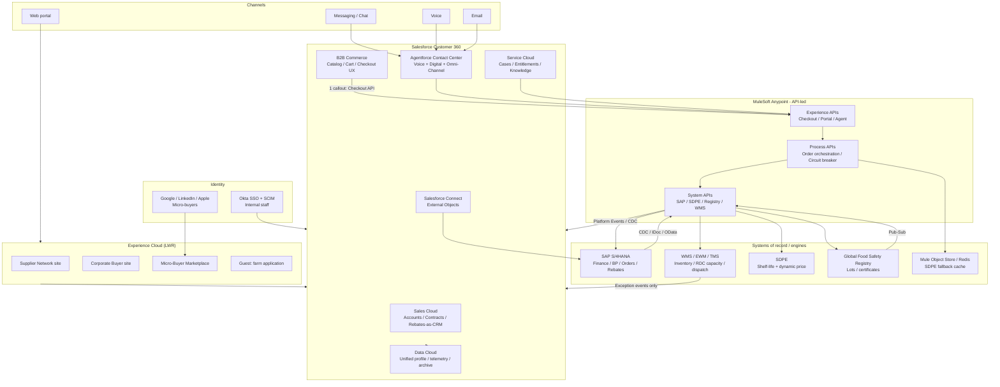
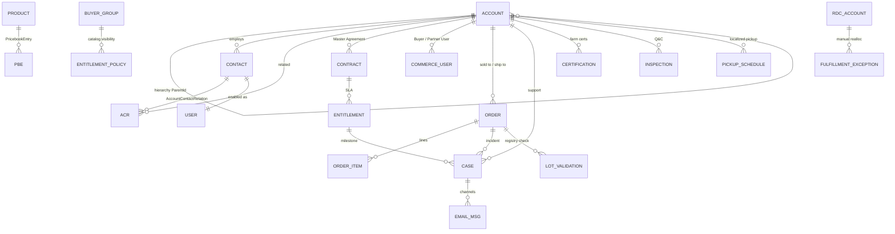
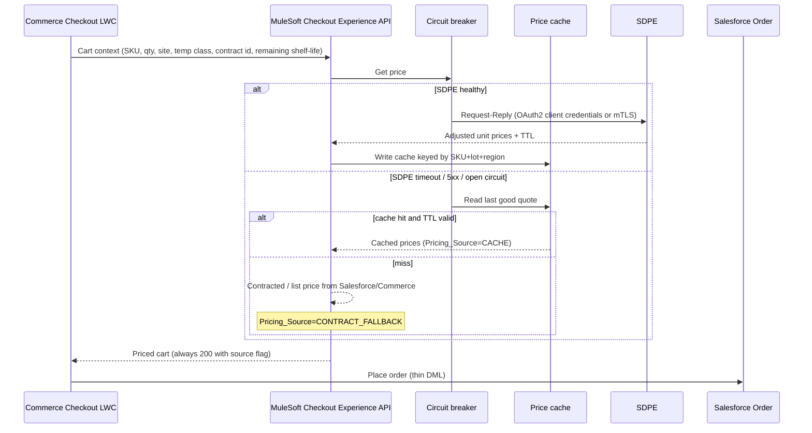
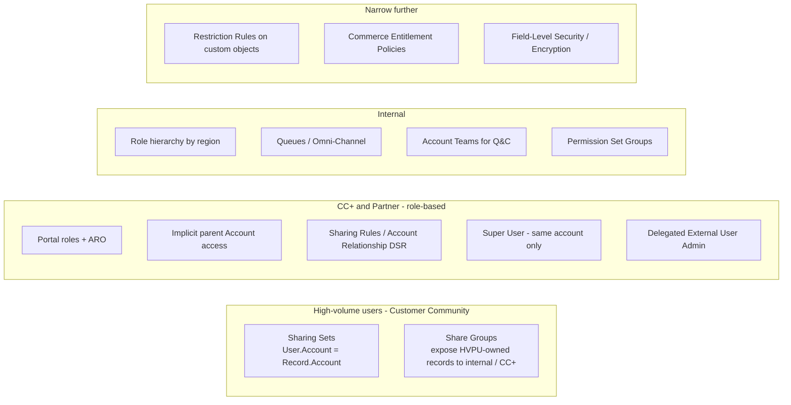
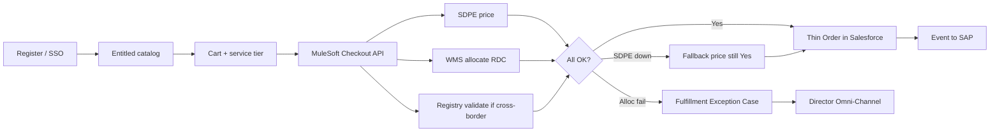

# FreshSource Global (FSG)

## Salesforce Enterprise Architecture Design

**Use Case:** Global Food Distribution Network  
**Platform stance:** Salesforce as the customer-engagement, partner, and service system of engagement; SAP S/4HANA as the financial and inventory system of record; MuleSoft as the integration and resilience fabric.  
**Guiding principle:** Prefer out-of-the-box (OOTB) Salesforce products and declarative sharing. Customize only where volume, perishability, or multi-tenant isolation cannot be met safely on-platform.

| Audience | Purpose |
| --- | --- |
| Enterprise / Salesforce Architects | Target architecture, limits, and trade-offs |
| Security / IAM | Sharing, identity, and license decisions |
| Integration | Patterns, authn/z, and fallback design |
| Delivery leadership | Phasing, SKUs, and what not to build in Salesforce |

**Salesforce references used throughout:** [Experience Cloud User Licenses](https://help.salesforce.com/s/articleView?id=users_license_types_communities.htm), [Platform Sharing Architecture](https://architect.salesforce.com/docs/architect/fundamentals/guide/platform-sharing-architecture), [Large Data Volumes](https://trailhead.salesforce.com/content/learn/modules/large-data-volumes/design-your-data-model), [Named Credentials](https://developer.salesforce.com/docs/platform/named-credentials/guide/get-started.html), [Omni-Channel routing](https://help.salesforce.com/s/articleView?id=service.omnichannel_routing_targets.htm), [MuleSoft Accelerator for SAP](https://anypoint.mulesoft.com/exchange/org.mule.examples/mulesoft-accelerator-for-sap/).

---

## 1. Executive recommendation

FSG is a **high-volume, multi-persona, multi-region B2B** business. Treating Salesforce as the transactional order engine for 50,000 orders/day would violate Large Data Volume (LDV) and governor-limit guidance. The recommended to-be architecture is:

1. **Salesforce Customer 360** (Sales Cloud + Service Cloud + Experience Cloud + Data Cloud + Agentforce Contact Center) owns accounts, contracts, catalogs-for-experience, cases, knowledge, identity, and *hot* operational visibility.
2. **Salesforce B2B Commerce (Lightning Experience / composable storefront)** owns buyer catalog, cart, and checkout *experience*. Checkout does **one** call to a MuleSoft Experience API; it does not run allocation, spoilage pricing, or ERP posting inside Apex loops.
3. **SAP S/4HANA** (with EWM/TM or equivalent WMS/TMS) owns inventory, cold-storage capacity, financial orders, invoices, vendor payouts, and rebate ledgers.
4. **MuleSoft Anypoint** owns API-led connectivity, circuit breakers, and the Spoilage & Dynamic Pricing Engine (SDPE) fallback.
5. **Okta** remains the internal identity source of truth, with SCIM lifecycle into Salesforce.

This split is the primary trade-off of the entire design: Salesforce stays within platform limits and Well-Architected “Trusted / Easy / Adaptable” guidance, at the cost of not being a single-system order ledger. Portal users still see orders, invoices, and payouts — via hot CRM records plus Salesforce Connect virtualization for financial history.

---

## 2. Scale facts and derived volumes

| Fact | Value | Architectural implication |
| --- | --- | --- |
| Orders | 50,000 / day | ~18.25M Order headers / year; line items likely 100M–200M / year |
| Geography | NA, LATAM, EMEA; 14 time zones | Multi-currency, Translation Workbench, regional Business Hours, Hyperforce residency |
| Suppliers | 8,000 farms | Partner-style Experience Cloud; one Account per facility |
| Enterprise parents | 1,200 | Contracted catalogs, rebates, 2-hour SLA |
| Branch buyers / chefs | 150,000 | License mix + sharing model, not a single Community license |
| Largest hierarchy | 15,000 locations under one Master Agreement | **Account data skew** if modeled as one parent with 15,000 children |
| IoT cold-chain pings | Not quantified; assume high-frequency | Must **not** land on standard Salesforce objects |

**Hot vs cold data policy (required for LDV):**

| Data | Retention in standard Salesforce objects | After that |
| --- | --- | --- |
| Open / in-transit orders | Until delivered + 14 days | Order Summary / archive |
| Delivered orders (portal history) | 90 days | Big Object, Data Cloud, or Salesforce Connect to SAP |
| Invoices, payouts, rebate journals | Not copied as SoR | External Objects (`__x`) from SAP |
| Cold-chain telemetry | Never as `CustomObject__c` | Data Cloud / event lake; Salesforce gets **alerts only** |
| SDPE quote audit | 7–30 days operational log | Data Cloud or external store |

Salesforce LDV guidance treats **>10,000 child records on one parent** as skew risk and **>50,000** as critical. The 15,000-location client exceeds that threshold on day one if `Account.ParentId` is used naively.

---

## 3. Assumptions (explicit)

| ID | Assumption | If wrong, what changes |
| --- | --- | --- |
| A1 | SAP S/4HANA is already (or will be) financial SoR, including inventory and rebate calculation. | If no SAP order object exists, introduce Salesforce Order Management as a thicker OMS and accept higher LDV spend. |
| A2 | Average ~8–12 line items per order. | Line-item volume drives whether OrderItem stays in Salesforce at all. |
| A3 | “2-hour SLA for resolution” is **time-to-engagement / containment** (first response + replacement order created), not physical re-delivery worldwide. | If literal physical resolution in 2 hours is required, SLA is a logistics KPI in TMS, not a Salesforce Milestone. |
| A4 | Branch admins manage users **only on their branch Account**, not across the whole enterprise. | Enterprise-wide user admin would need an internal FSG identity team or a custom LWC on CC+ with Apex — not OOTB delegated admin. |
| A5 | Micro-buyers are businesses (EIN / VAT), not consumers. Person Accounts are optional. | Person Accounts simplify social login B2C-style identity but complicate Partner mixing. |
| A6 | One production Salesforce org on Hyperforce, with EU data residency for EMEA personal data if required. | True split-org by region multiplies integration and license cost; avoid unless legal mandates it. |
| A7 | Quality & Compliance officers are employees (Okta), not Experience Cloud users. | If they are contractors, use Partner or Customer Community Plus instead of internal licenses. |
| A8 | Peak order rate is ~5× average (~3 orders/sec sustained, short spikes higher). | If peaks are two orders of magnitude higher, checkout must be fully headless and decoupled from Salesforce synchronous DML. |
| A9 | FSG will fund MuleSoft (or equivalent iPaaS). | Without middleware, Salesforce becomes the orchestration hub and will hit callout, CPU, and row-lock limits. |
| A10 | Catalog master is PIM or SAP Material Master; Salesforce holds the sellable projection. | If Salesforce is product master, Product2 / PricebookEntry becomes its own LDV program. |

---

## 4. To-be system landscape

### 4.1 Landscape diagram



### 4.2 System of record matrix

| Domain | System of record | Salesforce role | Why |
| --- | --- | --- | --- |
| Party (customer, supplier, RDC) | Salesforce Account (CRM) + SAP Business Partner | Bidirectional sync; Salesforce UX master for relationship | OOTB Account Hierarchy, Experience Cloud users hang off Contact |
| Master Agreement / contracted catalog | Salesforce Contract + Commerce Buyer Groups | Salesforce | CPQ-grade contracts belong in CRM; financial rebate posting belongs in SAP |
| List / contracted base price | Commerce Entitlement + Pricebook | Salesforce (experience) | Avoid 1,200 cloned catalogs |
| Perishable dynamic price | SDPE | Quote captured on Order at checkout | Real-time engine is proprietary and latency-sensitive |
| Inventory, RDC capacity, assets | WMS / SAP EWM | Exception Case only | 50k allocations/day cannot be Flow/Apex |
| Financial order, invoice, payout, rebate journal | SAP S/4HANA | Hot header copy + Connect | Daily reconciliation requirement is an ERP job |
| Food-safety lot / certificate | Registry | Validation status + external Id | Bi-directional, but binaries stay out of Salesforce |
| Support interaction | Salesforce | SoR | Agentforce + Omni-Channel + Case |
| Employee identity | Okta | Provisioned User | SCIM, not JIT-only |
| External identity | Salesforce Identity / Experience Cloud | SoR for portal users | Social login + delegated admin |

---

## 5. Pillar 1 — Data architecture and scalability (LDV)

### 5.1 Canonical data model (OOTB first)

Use **standard objects** wherever the platform already models the business. Introduce custom objects only for FSG-specific perishable operations that have no standard equivalent.



#### Standard objects and record types

| Object | Record types / usage | OOTB rationale |
| --- | --- | --- |
| **Account** | `Corporate_Parent`, `Corporate_Region`, `Branch_Location`, `Micro_Buyer`, `Supplier_Farm`, `RDC` | Party model, Experience Cloud membership, implicit parent sharing |
| **Contact** | Buyer, Chef, Farm Manager, Farm Staff, Q&C (internal) | Portal users require a Contact; **Contacts to Multiple Accounts** for chefs covering two branches |
| **AccountContactRelation** | Secondary branch assignments | Avoid duplicate Contacts (skew + identity drift) |
| **User** | Internal (Okta) + Experience Cloud | License-specific profiles / permission set groups |
| **Contract** | Master Agreement | Multi-year enterprise terms, contracted pricing pointer, rebate program id |
| **Opportunity** (optional) | New logo / agreement renewal | Sales Cloud OOTB; not on the 50k/day path |
| **Product2** | SKU with temperature class, catch-weight, country of origin | Standard catalog; **do not** explode variants per farm × per contract |
| **Pricebook2 / PricebookEntry** | Global list + regional list books only | Not one price book per customer |
| **Order / OrderItem** | Hot operational orders only | Standard B2B objects; Commerce maps into these or into OMS Order Summary |
| **Case** | `Spoilage_Incident`, `Delay`, `Fulfillment_Exception`, `Onboarding` | Service Cloud SoR |
| **Entitlement + Milestone** | Enterprise 2-hour clock; Micro-Buyer standard clock | OOTB SLA; Business Hours per region |
| **Knowledge** | Cold-chain, ordering, certification FAQs | Grounding for Agentforce |
| **BuyerGroup / Commerce Entitlement Policy** | Contracted catalog + service-tier visibility | OOTB B2B Commerce replacement for custom catalog junction objects |
| **Location** (optional) | RDC geo | Useful if Field Service or maps are in scope later |

Enable **Person Accounts** only for micro-buyers if product wants a single-party model. **Trade-off:** Person Accounts work with Customer Community / CC+; they **cannot** be used with Partner Community. Keep suppliers and enterprise branches as Business Accounts regardless.

#### Custom objects (sparse, on-platform)

| Object | Relationship | Why custom | Volume class |
| --- | --- | --- | --- |
| `Certification__c` | Lookup → Supplier Account | Food-safety certs, expiry, issuing body | Low (8k farms × few certs) |
| `Inspection__c` | Lookup → Supplier or RDC | Q&C site inspections | Low/medium |
| `Pickup_Schedule__c` | Lookup → Supplier | Localized pickup windows | Low |
| `Lot_Validation__c` | Lookup → Order / OrderItem | Registry result cache (status, registry id, timestamp) | Medium; archive at 90 days |
| `Fulfillment_Exception__c` | Lookup → Order, RDC Account | Manual re-allocation / split-ship approval payload | Low (exceptions only) |
| `Rebate_Accrual__c` | Lookup → Contract / Account | CRM-visible **summary** only; SAP calculates | Low (periodic) |
| `Service_Tier__c` | Catalog attribute or Product | Standard / Express Cold-Chain / Priority Ultra-Fresh | Reference data |

Prefer **Lookup over Master-Detail** on anything that will sit under a large Account. Master-Detail increases parent locking and sharing recalculation — the opposite of LDV guidance.

#### Objects that must stay off standard Salesforce

| Dataset | Store | Salesforce sees |
| --- | --- | --- |
| Cold-chain IoT pings | Data Cloud streaming / event lake | `Case` when threshold breached |
| Full invoice / payout / GL | SAP | External Object `Invoice__x`, `Payout__x` |
| Historical orders > 90 days | SAP or Big Object `Order_History__b` | Portal “order history” LWC via Connect or Data Cloud |
| SDPE raw demand signals | SDPE | Quoted unit price + `Pricing_Source__c` |

### 5.2 Account hierarchy (anti-skew)

**Do not** parent 15,000 branch Accounts directly under one Corporate Parent.

Salesforce LDV guidance: keep children per parent **below 10,000** (design target: **below 8,000** with monitoring).

```text
Corporate Parent  (Master Agreement lives here)
  └── Corporate Region  (geographic or operating-company node)
        └── Branch Location  (ship-to / buy-from; Experience users live here)
```

For the 15,000-location client: **~15–20 regional nodes × ~750–1,000 branches**. That preserves Account Hierarchy reporting while staying under the skew line.

**Forbidden patterns on the Corporate Parent:**

- Roll-up summary fields counting orders, cases, or contacts
- Workflow/Flow that updates the parent on every child Order insert
- A single “integration” owner owning all 15,000 branches (ownership skew)
- All Contacts parked on the parent (“Unassigned” / HQ dump)

HQ visibility is a **sharing and analytics** problem, not a “put every child on one parent” problem. Corporate analysts use CRM Analytics / Data Cloud; they do not get implicit access to 15,000 operational Accounts via one Super User.

### 5.3 High-volume scenarios and mitigations

| Scenario | Risk | Mitigation |
| --- | --- | --- |
| Order Item LDV (~150M+/year) | Query timeout, sharing explode, storage cost | Hot window 90 days; archive; no triggers on OrderItem that touch Account; skinny table if HQ reports in Salesforce |
| 15k-location hierarchy | Account skew, `UNABLE_TO_LOCK_ROW` | Intermediate region Accounts; serialise integration by `AccountId`; no parent updates in the order path |
| Lookup skew on `Order.Pricebook2Id`, `Order.RDC__c`, service tier | Lock hot lookups | Avoid a single “Default RDC” lookup on millions of orders; store RDC as text/external id on the order header copy; real allocation lives in WMS |
| Ownership skew | Sharing recalc, lock | Separate integration users per domain (Commerce, SAP, Registry, Support); queue-owned Cases; **never** assign all portal-created records to one API user |
| 150k Contacts on a few enterprises | Contact skew | Contacts live on **branch** Accounts; ACR for extras; archive inactive portal users |
| Portal roles explosion (CC+ / Partner) | 50,000 role default cap; performance | **Account Role Optimization (ARO)**; one role layer where possible; Person Account owner power users only if micro-buyers become CC+ at huge scale |
| IoT updates | DML storm | Exception-based Cases; Data Cloud for raw stream |
| Concurrent checkout against same branch Account | Parent lock | Checkout writes Order to **branch** Account; MuleSoft owns allocation; Salesforce DML is insert-only on Order, no Account update |
| Search / list views | Non-selective SOQL | Custom indexes on `OrderNumber`, `LotNumber__c`, `BranchAccount__c`, `Status`; skinny tables for Order; filter every portal query by AccountId (sharing already does this — keep it selective) |

### 5.4 Indexing, skinny tables, virtualization, archive

| Technique | Use for FSG |
| --- | --- |
| **Custom indexes** | External ids (`SAP_BP__c`, `SAP_Order__c`, `Registry_Lot__c`), email domain, contract number |
| **Skinny tables** | Order and Case if HQ operational reports stay in Salesforce |
| **Divisions** | Not recommended as a security mechanism; sharing + restriction rules are clearer |
| **Salesforce Connect (OData)** | Invoices, payouts, aged order history from SAP — **no copy, no skew** |
| **Data Cloud** | Unified buyer/supplier profile, cold-chain events, Agentforce grounding, 360 reporting |
| **Big Objects** | If legal hold requires Salesforce-resident order history without Connect |
| **Defer Sharing Calculations** | Mass user/role loads (e.g., onboarding a 15k-location client) |
| **Granular locking** | Enable in LDV orgs to reduce lock scope during sharing |
| **Data virtualization vs copy** | Default to virtualize financials; copy only fields needed for SLA routing, Agentforce context, and 90-day self-service |

**Trade-off — virtualize vs persist invoices:**

| | Persist in Salesforce | Salesforce Connect |
| --- | --- | --- |
| Portal latency | Fast, native | Depends on SAP; cache via MuleSoft if needed |
| Reports / list views | Native | Limited; use Data Cloud or CRM Analytics |
| LDV / storage / sync | High | Low |
| Reconciliation | Dual-write risk | Single SoR (SAP) |
| **Choice** | No | **Yes** for invoices/payouts |

---

## 6. Pillar 2 — Experience, commerce, and process design

### 6.1 Experience Cloud site strategy

Licenses attach to **users**, not sites ([Experience Cloud licenses](https://help.salesforce.com/s/articleView?id=users_license_types_communities.htm)). Users can belong to multiple sites. Recommendation: **three LWR sites** plus guest pages, using **Audiences** for residual variation.

| Site | Template | Personas | Auth |
| --- | --- | --- | --- |
| Supplier Network | Partner-style LWR | Farm managers / staff, FSG Q&C (internal) | Okta for internal; username-password or supplier IdP |
| Corporate Buyer | B2B Commerce + LWR | Branch chefs, branch delegated admins, limited HQ buyers | Email domain registration; optional future corporate SAML |
| Micro-Buyer Marketplace | B2B Commerce + LWR | Independent cafes, trucks, caterers | Google, LinkedIn, Apple Auth Providers |

**Why three sites instead of one mega-site:** clearer guest-user attack surface, separate branded catalogs, and simpler sharing-set/profile mapping. **Trade-off:** three Experience Builder codebases to maintain. Mitigate with an unlocked package of LWCs and a shared design system.

**Guest user:** public supplier *application* only (Lead or custom `Supplier_Application__c`). Guest OWD remains locked down; no query of Orders, Accounts, or Payouts. Enterprise Edition guest page-view limits (500k/month baseline) must be monitored and uplifted.

### 6.2 Process 1.1 — Supplier onboarding

| Step | OOTB | Notes |
| --- | --- | --- |
| Public apply | Guest Experience + Lead or Case (`Onboarding`) | Avoid custom “application portal” app |
| Q&C vetting | Case or `Inspection__c` + `Certification__c` | Entitlement optional; Knowledge for procedures |
| Convert to Account (`Supplier_Farm`) | Lead convert / Flow | One Account per facility (requirement 3.1) |
| Enable Partner / CC+ user | Flow + permission set group | Delegated admin later for additional farm staff |
| Localized catalog | Commerce Entitlement Policy bound to that Account’s Buyer Group | Pickup schedule as related list |
| Optional field visits | **Salesforce Field Service** | Only if scheduling/optimization is in scope; otherwise Service Cloud + custom Inspection is enough |

**Trade-off:** Field Service is OOTB for inspection routing but is another SKU. Start without it; add if Q&C dispatch complexity grows.

### 6.3 Process 1.2 — Corporate ordering

1. FSG account team closes **Contract** (Master Agreement) on Corporate Parent.
2. Flow creates Buyer Groups, entitlement policies, and regional nodes as locations are onboarded (batched; defer sharing).
3. Branch user registers with **corporate email domain** allow-list on the Contract (`Allowed_Domains__c`).
4. Auto-link Contact to the matching `Branch_Location` Account (provisioning table supplied by the enterprise, not free-text).
5. **One Delegated External User Administrator per branch** (CC+) manages other users **on that Account only** — this is OOTB and maps 1:1 to “manage other users only in their branch.”
6. Checkout uses contracted catalog + SDPE overlay (section 8.1).

The 15,000-location client is an **implementation program** (data load, ARO, regional nodes, integration user strategy), not a different product.

### 6.4 Process 1.3 — Micro-buyer registration

- Self-register Experience Cloud user → Business Account + Contact (or Person Account).
- Auth Providers: Google, LinkedIn, Apple. Apple requires hiding/email relay handling.
- Sharing Sets: user sees only their Account’s orders, invoices (Connect), and Cases.
- Login-based **Customer Community** licenses (daily unique login) — best cost fit for infrequent wholesale buyers.

### 6.5 Process 1.4 — Pricing and service tiers

| Layer | Mechanism | OOTB? |
| --- | --- | --- |
| Service tier (Ground / Express Cold-Chain / Ultra-Fresh) | Products or Product options; cart attribute that drives shipping method | Yes (Commerce shipping) |
| Weight / temperature class | Product attributes; shipping rate tables or MuleSoft rate call to TMS | Hybrid |
| Corporate contract discount | Commerce Entitlement / contracted price on Buyer Group — **not** 1,200 Price Books | Yes |
| Volume rebate | Accrual **display** in Salesforce; **calculation and AP** in SAP (requirement 2.3) | Split SoR |
| Perishable dynamic discount | SDPE at checkout | External |

**Do not buy Revenue Cloud / CPQ** solely for this. CPQ shines for quote-to-cash configuration of complex manufactured products. FSG’s complexity is **perishability + contracted B2B catalog + ERP rebates**, which Commerce Entitlements + SDPE + SAP already cover.

**Trade-off:** Revenue Cloud would unify quote/contract price waterfalls but adds SKU cost and still cannot replace SDPE or SAP rebates.

### 6.6 Process 1.5 — Dispatch and capacity allocation

**Decision: allocation does not run in Salesforce.**

50k automatic allocations/day against live cold-storage and refrigerated assets is a WMS/TMS problem. Implementing it as Salesforce Flow, Apex, or Omni-Channel would contend with governor limits, row locks, and stale inventory.

| Path | System |
| --- | --- |
| Happy path | MuleSoft Process API → WMS: nearest RDC with inventory + cold capacity + assets |
| Split shipment | WMS proposes split; if policy allows auto-split, proceed; else exception |
| Exception | Platform Event → Salesforce `Case` (`Fulfillment_Exception`) or `Fulfillment_Exception__c` |
| Human | Omni-Channel → Regional Fulfillment Director (skills = region + language) |
| Approval | OOTB Approval Process for split-ship / divert |

Directors work a **queue**, not a custom allocation UI, unless a single LWC is needed to call MuleSoft “reallocate” Experience API (thin UI, fat API).

**Trade-off:** FSG fulfillment logic is not visible as Salesforce debug logs. Gain: checkout stays fast; Salesforce stays within limits; WMS remains SoR for stock.

### 6.7 Processes 1.6–1.7 — Support, SLA, and automated CX

This is the strongest OOTB fit in the brief.

| Requirement | Product | Configuration |
| --- | --- | --- |
| Portal ticket for spoilage/delay | Experience Cloud Case + Commerce order context | Pre-filled Order, lot, photos as Files |
| Enterprise 2-hour SLA | Entitlements + Milestones + regional Business Hours | Separate Entitlement Process: Enterprise vs Micro-Buyer |
| Language + workload routing | Omni-Channel **skills-based** routing + capacity | Skills: `Lang_ES`, `Lang_PT`, `Lang_FR`, `Lang_EN`, `Spoilages`, `Billing`; routing model Least Active |
| Agents on disconnected voice/email/messaging | **Agentforce Contact Center** (Service Cloud Voice + Digital Engagement) in one console | Retires the swivel-chair |
| Automated voice + digital without extra headcount | **Agentforce Service Agent** as first routing target | Omni-Channel Flow: Route Work → Agentforce; fallback queue; escalation Flow to human skills |
| Seasonal spikes | AI deflection + Knowledge + Data Cloud grounding | Scale conversations, not FTEs |
| Seamless escalation | Omni-Channel escalation Flow preserves Messaging Session / Voice Call | Agent sees transcript + Order + Account |

**Milestone design (assumption A3):**

- Enterprise: First Response 30 minutes, **Containment / replacement-order created** 2 hours, Warning 60 minutes, Violation 2 hours → escalate to supervisor queue.
- Micro-Buyer: First Response 8 business hours (regional).

**Trade-off — Agentforce vs legacy Einstein Bots:**

| | Agentforce Service Agent | Einstein Bots (legacy) |
| --- | --- | --- |
| Voice + digital autonomous | Designed for this | Bots were digital-first; voice was bolted on |
| Grounding on CRM / Knowledge / Data Cloud | Native | Weaker |
| Consumption pricing | Conversation / Flex credits — can spike in season | Often included / predictable |
| Budget narrative | Aligns with “cannot scale live agents” | Cheaper if leadership rejects consumption SKUs |

**Recommendation:** Agentforce Service Agent first. If commercial approval slips, ship Enhanced Bots on digital plus IVR deflection, with the same Omni-Channel escalation contract so the architecture does not fork.

Do **not** custom-build a chatbot on Heroku/AWS. It recreates the disconnected-channel problem the brief already has.

---

## 7. Pillar 2 continued — Integration design

All Salesforce callouts use **Named Credentials + External Credentials** (not legacy Named Credentials). Secrets never live in custom metadata or Apex.

### 7.1 Pattern per interface

#### 2.1 SDPE — request/reply + resilient fallback



| Design choice | Detail |
| --- | --- |
| Pattern | **Request-Reply** from checkout; **not** Salesforce-to-SDPE per line item |
| Timeout budget | End-user < 2s; MuleSoft timeout ~800ms; Salesforce Apex callout is a last resort (120s max is useless for UX) |
| Auth | OAuth 2.0 Client Credentials or **mTLS** if SDPE is a private farm-network service |
| Fallback | Closed-loop cache (shelf-life-aware TTL) → contracted price. Checkout **never** blocks. |
| Commercial policy | **Honor checkout price** (`Price_Guaranteed__c`). Do not silently reprice after SDPE recovery — that creates invoice disputes. |
| Idempotency | `Idempotency-Key` = cart id; safe retries |

**Trade-off:** Fallback prices can be stale versus true spoilage risk (FSG may over-discount or under-discount during an SDPE outage). Mitigate with short TTLs, max-discount caps on fallback, and an ops dashboard on circuit state. A hard checkout stop would violate the brief.

#### 2.2 Global Food Safety Registry — secure bi-directional sync

| Direction | Pattern | When |
| --- | --- | --- |
| FSG → Registry | **Guaranteed async** (queue + retry) Pub/Sub or REST with outbox | Lot registration, export docs on dispatch |
| Registry → FSG | **Event-driven** (webhooks → MuleSoft → Platform Events) | Certificate revocation, farm status |
| Pre-border / pre-ship gate | **Request-Reply** (blocking for *shipment*, not for cart) | Validate lot + origin cert before WMS ships |

Auth: **mTLS + OAuth 2.0**. Regulatory APIs rarely accept only a named user/password.

Salesforce stores `Lot_Validation__c` (status, registry key, validated-at, document URL). PDFs stay in the Registry or an ECM; Files in Salesforce would explode storage and duplicate controlled documents.

**Trade-off:** Async sync can lag a revocation. Mitigate by a **synchronous validate-on-ship** call even if the cache says “valid,” plus a Platform Event that opens a Case if a lot is revoked in-flight.

#### 2.3 SAP S/4HANA — daily ledger + operational events

Requirement text is **batch at end of business day** for orders, invoices, payouts, rebates. That is necessary but **not sufficient** for a 50k-order portal.

| Object | Pattern | Timing | Notes |
| --- | --- | --- | --- |
| Business Partner / Account | CDC both ways (MuleSoft Accelerator for SAP) | Near real time | Match on `SAP_BP__c` |
| Product / material projection | Bulk + CDC | Nightly + changes | PIM/SAP master |
| Finalized order | **Event** Salesforce/Commerce → MuleSoft → SAP Sales Order | On submit (not T+1) | Otherwise same-day fulfillment has no ERP document |
| Invoice, vendor payout, rebate journals | **Batch ETL** (IDoc / OData / SLT → MuleSoft) | End of regional business day (14 time zones ⇒ **per-company-code close**, not one global midnight) | Salesforce Connect for portal read |
| Rebate **calculation** | SAP | SAP | CRM shows accrued vs paid summaries only |

**14 time zones:** “End of every business day” must be **company-code / regional close**, not a single org-wide midnight UTC job. MuleSoft uses timezone-aware schedulers.

Auth Salesforce ↔ MuleSoft: **OAuth 2.0 JWT Bearer** (server-to-server) or Client Credentials on External Credentials; dedicated Connected App per integration. Auth MuleSoft ↔ S/4HANA Cloud: OAuth 2.0 Client Credentials + CSRF as required; on-prem: **mTLS / X.509** via Cloud Connector if used.

**Trade-off — event now vs batch only:** Pure nightly order push is simpler and matches the letter of 2.3, but leaves WMS/finance blind on the same day. Recommendation: **events for orders**, **batch for financials**, which still satisfies reconciliation.

### 7.2 Integration and security matrix

| Interface | Direction | Pattern | Protocol | Authn | Authz | Resilience | Data class | Salesforce feature |
| --- | --- | --- | --- | --- | --- | --- | --- | --- |
| Checkout → SDPE | Out | Request-Reply | HTTPS JSON | OAuth2 CC or mTLS | Named principal; cart scope | Circuit breaker, cache, contract fallback | Pricing | Named Credential via MuleSoft; `Pricing_Source__c` |
| SDPE cache | Internal | Cache-aside | Redis / Object Store | Network IAM | Service identity | TTL = min(shelf-life, 15 min) | Pricing | N/A |
| Registry validate | Out | Request-Reply | HTTPS / SOAP as mandated | mTLS + OAuth2 | Least-privilege API | Timeout + fail-closed **on ship** | Compliance | `Lot_Validation__c` |
| Registry sync | Bi | Pub/Sub + Outbox | Events / REST | mTLS + OAuth2 | System API | Durable queue, replay | Compliance | Platform Events / CDC |
| SAP BP / material | Bi | CDC / Bulk | OData / IDoc | OAuth2 / X.509 | Per-object API user | Replay, DLQ | Master data | Bulk API 2.0 inbound; Platform Events outbound |
| SAP order create | Out | Event | OData / IDoc | OAuth2 / X.509 | Order-create role | Idempotent order external id | Financial | Order status CDC |
| SAP invoice/payout/rebate | In | Batch ETL | OData / IDoc | OAuth2 / X.509 | Read GL extract | Regional scheduler, restartable | Financial | Salesforce Connect `__x` |
| WMS allocation | Out | Request-Reply | HTTPS | mTLS or OAuth2 | Fulfillment API | Timeout → Fulfillment Exception Case | Operational | Thin Case insert |
| WMS telemetry alerts | In | Pub/Sub | Event | mTLS | Alert topic | Filter in MuleSoft; **no raw IoT to SF** | Operational | Case |
| Okta | In | SCIM 2.0 + SAML | HTTPS | OIDC/SAML + SCIM token | Group → PSG | Deprovision = freeze User | Identity | Salesforce Okta connector / SCIM |
| Social IdPs | In | OAuth/OIDC | HTTPS | Auth Provider | Micro-buyer profile only | IdP outage → local login backup | Identity | Experience Auth Providers |
| Agentforce tools | Out | Named Credential callouts | HTTPS | Per External Credential principal | Permission Set on agent user | Fallback Knowledge-only answers | Mixed | Agent Actions → MuleSoft XP API |

### 7.3 Platform events and API volume

Prefer **MuleSoft as the only system that fans out**. Salesforce publishes/consumes coarse events (`Order_Finalized__e`, `Allocation_Failed__e`, `Lot_Revoked__e`).

| Limit / concern | Approach |
| --- | --- |
| Daily API requests | Commerce checkout should hit MuleSoft, not loop Salesforce REST per line. Size Unlimited / Performance or add API add-on; monitor with Event Monitoring |
| High-volume Platform Events | Use HVPE for IoT-derived alerts if volume is large; standard PE for coarse business events |
| Pub/Sub API | MuleSoft Salesforce connector / Pub/Sub for CDC (Order, Account) |
| Connected App proliferation | One app per *trust boundary* (SAP, SDPE, Registry, Okta) — not one god app |
| Named Credentials | New External Credentials model; permission-set-mapped principals (no org-wide secrets) |

---

## 8. Pillar 3 — Security, sharing, and access control

### 8.1 Organization-wide defaults

Least privilege ([Platform Sharing Architecture](https://architect.salesforce.com/docs/architect/fundamentals/guide/platform-sharing-architecture)):

| Object | Internal OWD | External OWD | Grant Access Using Hierarchies |
| --- | --- | --- | --- |
| Account | Private | Private | Yes (internal); controlled for external via roles |
| Contact | Controlled by Parent | Controlled by Parent | — |
| Order / OrderItem | Private | Private | No on Order if it would leak up to HQ unexpectedly — test this; prefer explicit sharing |
| Case | Private | Private | Yes for internal support management |
| Contract | Private | Private | Yes internal only |
| Product2 | Public Read Only | Public Read Only | Catalog is not secret; **price and entitlement** are |
| Pricebook | Restricted via Use / Buyer Group | Hidden except entitled | — |
| `Certification__c`, `Inspection__c`, `Pickup_Schedule__c` | Private | Private | No |
| `Rebate_Accrual__c` | Private | Private | No |
| External Objects | Private | Private | N/A |

Products can be org-visible; **which SKUs a buyer may purchase** is Commerce Entitlement, not OWD.

### 8.2 Persona → license → sharing mechanism

This is the core license/security trade-off. **Do not put 150,000 chefs on Partner Community.** **Do not put branch delegated admins on Customer Community** (no delegated admin, no roles).

| Persona | Count (order of mag.) | License | Why this license | Sharing mechanism | Data boundary |
| --- | --- | --- | --- | --- | --- |
| Micro-buyer | Tens of thousands+ | **Customer Community Login** (HVPU) | 100M+ user class; cheap; social login; Person Account capable | **Sharing Sets**: User.Account = Order.Account / Case.Account | Own Account only |
| Branch chef / store manager (no user-admin) | Majority of 150k | **Customer Community Login** | Same-branch visibility is an Account match, not a role hierarchy | Sharing Sets on Order, Case, Contract (read) | Designated branch Account |
| Branch delegated admin (“manage users only in their branch”) | ~1 per branch that self-administers | **Customer Community Plus** (member) | OOTB **Delegated External User Administrator**; clone profile; restrict which profiles they may assign | CC+ role on the **branch Account**; implicit Account access; Sharing Sets still used for HVPU peers’ records via Share Groups where needed | Users and data of that branch Account only |
| Corporate HQ buyer (parent-node visibility) | Small (dozens per enterprise, not 15k) | **Customer Community Plus** | Reports/dashboards; **Account Relationship Data Sharing Rules** to *regional* children — **not** 15k super-user fan-out | Criteria-based sharing / account relationship rules to `Corporate_Region`; CRM Analytics for org-wide spend | Parent + selected regions; not every branch row in CRM |
| Farm manager | ~8k | **Partner Community Login** (or Channel Account if many users per farm) | B2B partner template; roles; reports on their POs/scores; delegated admin for farm staff | Partner role on Supplier Account; Super User optional for multi-user farms | That farm facility only (3.1) |
| Farm staff | Optional | Customer Community Login | If they only view POs/schedules | Sharing Set to Supplier Account | Same facility |
| FSG support agent | Workforce | **Service Cloud** | Case, Omni-Channel, Voice, Knowledge | Role by region; Queues; Entitlements | Need-to-know via queues + Account Teams; Restriction Rules on sensitive custom objects |
| Regional Fulfillment Director | Small | **Salesforce** (Sales or Service) | Approvals + Omni-Channel | Role = region; queue | Exception Cases for their RDCs |
| Q&C officer | Medium | Service Cloud or Salesforce Platform | Inspections, Certifications | Role / Permission Set Group; Account Teams on farms they cover | Assigned farms / RDCs |
| FSG account executive | Medium | **Sales Cloud** | Contracts, pipeline | Role hierarchy | Book of business via role + sharing rules |
| Integration | Few | Dedicated Salesforce API users | Avoid ownership skew | No interactive access | Least-privilege Connected App |
| Agentforce Service Agent | 1+ agent users | Agentforce / Einstein add-on | Automated channels | Runs as agent user with **tight** object CRUD + Named Credential principals | Same CRUD a junior agent would have; no Setup |

**Delegated External User Administration** is available to Partner Community and Customer Community Plus (not HVPU Customer Community). Admins must **clone** the standard profile, enable the permission, and list which external profiles they may manage. That list should contain **only the branch chef HVPU profile**, so a Miami chef-admin cannot create a Corporate HQ CC+ user.

**Account Role Optimization (ARO)** is mandatory before enabling tens of thousands of CC+ / Partner users. Default portal **role cap is 50,000** across the org; exceeding it blocks user creation.

**Channel Account** SKU (pooled ~40 users per partner Account) is a commercial option for large farms. Most of the 8,000 independents will be 1–3 users → **Partner Login** is usually cheaper.

### 8.3 Sharing architecture by boundary



#### Requirement 3.1 — Supplier isolation

- Each farm is its **own Account**.
- Partner users inherit access to that Account and related POs/schedules/payouts (payouts via Connect filtered by vendor id).
- **No sharing rules** from Supplier to Buyer objects.
- Super User only inside a multi-user farm, never across farms.
- Restriction Rule on `Certification__c` / `Inspection__c`: `Record.AccountId = $User.AccountId` for partner profiles (custom objects are the Restriction Rule sweet spot).

#### Requirement 3.2 — Corporate and buyer isolation

- Chefs: Sharing Set `User.Contact.AccountId → Order.AccountId` (branch).
- Parent-node users: CC+ on Corporate Parent or Region + **Account Relationship Data Sharing Rules** down **one** level (Parent → Region, or Region → Branch), never Parent → 15k Branches in one rule.
- **Apex managed sharing is the last resort.** It does not scale at 18M orders/year (share rows, recalculation, mixed DML). If a one-off exception is needed (e.g., a chef covering two branches), use **AccountContactRelation** + Sharing Set indirect lookup, not Apex.

#### Share Groups

HVPU-owned Cases/Orders are invisible to sharing rules. Configure **Share Groups** on the Micro-Buyer and Branch-chef Sharing Sets so Service Cloud agents can see tickets those users file.

#### Restriction Rules — use and limits

Restriction Rules **subtract** from already-granted access. In Enterprise they are limited (historically **2 active rules per object**; higher in Unlimited/Performance) and apply to **custom objects, contracts, tasks/events, external objects** (expanded over releases — verify target objects in the subscriber org).

Use them to:

- Stop internal roles with broad Account access from seeing `Certification__c` they are not assigned to
- Filter External Object invoices if the OData filter is insufficient

Do **not** rely on Restriction Rules as the primary Order/Account isolation model.

### 8.4 Identity and user lifecycle (3.3–3.4)

| Population | IdP | Protocol | Lifecycle |
| --- | --- | --- | --- |
| FSG employees | **Okta** | SAML 2.0 or OIDC SSO | **SCIM 2.0** from Okta groups → Profile / Permission Set Group / license. Disable in Okta ⇒ freeze/deactivate in Salesforce the same day. |
| Micro-buyers | Google, LinkedIn, Apple | OAuth 2.0 / OIDC Auth Providers | JIT user + Contact; deactivation after inactivity job |
| Corporate buyers | Salesforce Identity (password + MFA) initially | Email domain verification | Delegated admin; optional later **corporate SAML** per enterprise (Named Auth Provider) — do not block go-live on 1,200 IdPs |
| Suppliers | Salesforce Identity or farm SSO later | Username/password + MFA | Partner user enablement from Account |

**SCIM, not JIT-only, for employees.** JIT cannot reliably de-provision when an Okta group is removed; the brief makes de-provisioning mandatory.

My Domain, MFA (Salesforce or Okta), session timeout, login IP ranges for internal users, and **Guest User security** (Secure Guest User Record Access) are non-negotiable.

**Shield Platform Encryption** for national id / tax numbers, certificate identifiers, and any health-adjacent inspection notes. Field Audit Trail for Certification and Lot Validation. Event Monitoring for portal scraping and integration anomalies.

---

## 9. Pillar 4 — Licensing roll-up, limits, and governance

### 9.1 Suggested SKU stack (confirm commercially)

| Capability | SKU / license family |
| --- | --- |
| CRM core | Sales Cloud Enterprise or Unlimited (Unlimited preferred for API, sharing, Restriction Rule limits) |
| Service | Service Cloud + Digital Engagement + Service Cloud Voice / Agentforce Contact Center |
| AI deflection | Agentforce Service Agent (consumption) |
| Portals | Experience Cloud: Customer Community Login, Customer Community Plus, Partner Community Login |
| Storefront | B2B Commerce |
| Analytics / telemetry / archive | Data Cloud |
| Integration | MuleSoft Anypoint (API-led); Salesforce Connect (OData) |
| Identity | Included Experience Identity + Okta (existing) |
| Compliance | Shield (encryption, event monitoring, field audit trail) |
| Optional later | Field Service (Q&C dispatch), CRM Analytics, Order Management, Revenue Cloud |

**Login vs member (Experience Cloud):** login licenses consume **one daily unique login** even if the user signs in ten times that day, and logins **pool annually**. Use login-based for micro-buyers and most chefs; member-based for delegated admins and heavy HQ users.

### 9.2 Platform limits that actually bind this design

| Limit | Why it binds | Control |
| --- | --- | --- |
| 10k children / parent (skew) | 15k-location client | Regional nodes |
| Portal roles ~50k default | CC+ and Partner roles | ARO; minimize CC+ population |
| Sharing recalc on Account owner change | Mass onboarding | Defer sharing; never change HQ owner casually |
| Apex CPU / SOQL / DML per tx | Checkout and allocation | No allocation in Apex; one MuleSoft call |
| API requests / 24h | 50k checkouts + sync | MuleSoft-centric; Performance/Unlimited; monitoring |
| Callout timeout / 100 callouts per tx | SDPE per line would fail | Single cart-level call |
| Storage | OrderItem + Files | Connect + 90-day hot window + no PDF dumps |
| Guest page views | Public apply portal | Uplift; cache static pages |
| Restriction Rules per object | Cannot encode all isolation here | Sharing first |
| Concurrent UI / Experience | Seasonal spikes | CDN, LWR, Agentforce deflection, autoscaled Mule workers |
| Platform Event delivery | IoT temptation | Do not publish raw telemetry |

### 9.3 Technical governance

| Practice | Standard |
| --- | --- |
| Automation | Record-triggered Flow only on low-volume objects (Account, Contract, Case). **No** OrderItem trigger that updates Account. |
| Code | Apex limited to: Connect adapters, Agent Actions, thin checkout adapter, any Sharing Set gap. 75% tests; no SOQL in loops. |
| Integration | API-led (System / Process / Experience). No point-to-point Apex to SAP. |
| Naming | Permission Set Groups per job (Q&C, Director, Agent, Integration_SAP). No profile permission sprawl. |
| Environments | Dev → Int (scratch/dev) → QA → UAT → Perf (LDV volume test) → Prod. A 15k-account load test is a **release gate**. |
| Perf testing | 50k-order-day soak against MuleSoft + WMS; Salesforce only needs the thin write + Case spike test. |
| Data governance | Golden keys: `SAP_BP__c`, `SAP_Order__c`, `Registry_Lot__c`. Duplicate rules on Account name+geo for farms. |
| Center of Excellence | Sharing changes, new CC+ roles, and new Order automation require architect review. |

---

## 10. Decision log — trade-offs (summary)

| Decision | Chose | Rejected | Why chosen | Cost of the choice |
| --- | --- | --- | --- | --- |
| Order SoR | SAP (+ WMS) | Salesforce Order as financial ledger | 18M+/year orders, sharing, governors | Dual-write of a **thin** header; eventual consistency |
| Allocation engine | WMS via MuleSoft | Flow/Apex/Omni for happy path | Real inventory and assets are not in CRM | Fulfillment logic not native-debug in Salesforce |
| Checkout integration | One Experience API | Apex per SDPE/WMS/Registry | Latency and callout limits | MuleSoft is a hard dependency for revenue path |
| SDPE outage | Cache then contract price; honor quote | Fail checkout | Requirement 2.1 | Possible margin leakage during outage |
| Invoice display | Salesforce Connect | Copy invoices into custom objects | LDV + reconciliation | Reporting in CRM is weaker; use Data Cloud |
| 15k locations | Region intermediate Accounts | Single parent with 15k children | LDV skew guidance | Extra hierarchy admin; HQ does not “see everything” via Super User |
| HQ visibility | Analytics + regional CC+ sharing | Super User over 15k children | Share-row explosion | HQ cannot edit every branch Order in CRM — they should not |
| Branch user admin | CC+ Delegated External User Admin | Custom LWC user manager on HVPU | OOTB, account-scoped | CC+ is more expensive — **buy it only for admins** |
| Mass chefs | Customer Community Login + Sharing Sets | CC+ or Partner for all 150k | Scale + cost; isolation is Account-based | No per-user reports; no role hierarchy among chefs |
| Suppliers | Partner Community Login | Customer Community for all farms | Partner template, reports, delegated admin | Higher cost than HVPU; still login-based |
| Catalog | Commerce Buyer Groups / Entitlements | Price Book per contract or CPQ | 1,200 contracts × SKUs would LDV PricebookEntry | Commerce SKU required |
| Dynamic price | External SDPE | Rebuild in Salesforce | Proprietary engine already exists | Checkout coupling to MuleSoft |
| Rebates | Calculate in SAP | Custom Salesforce rebate engine | Requirement 2.3 + money in ERP | CRM shows summaries only |
| Support channels | Agentforce Contact Center | Keep email silos + custom bot | Brief 1.7; OOTB voice+digital+escalation | Consumption pricing; change management |
| IoT | Data Cloud + exception Cases | Custom object per ping | LDV | Ops must accept Salesforce is not a historian |
| Employee IAM | Okta SCIM + SSO | JIT only or Salesforce-owned passwords | Mandatory de-provision | SCIM mapping work |
| Micro-buyer auth | Social Auth Providers | Portal passwords only | Requirement 3.3 | Apple relay emails; duplicate Account risk — match on email + tax id |
| Single org | One Hyperforce org | Org-per-region | License, sharing, and integration cost | Must implement residency (Shield, Hyperforce EU) if legally required |
| Apex sharing | Avoid | Default for isolation | Does not scale | Some edge access (multi-branch chef) uses ACR instead |
| Field Service | Phase 2 optional | Day-1 FSL | Q&C volume unknown | Inspection scheduling stays manual initially |
| Revenue Cloud | Out of day-1 scope | CPQ/Revenue as price waterfall | Overfit | If quoting becomes heavily negotiated later, revisit |
| Order Management SKU | Optional if Commerce needs it | Always-on OMS | Only if FSG wants Salesforce-visible fulfillments | Extra object model to govern |
| Split shipment approval | Case + Approval Process | Full custom allocation app | OOTB | Complex splits may need a thin LWC over WMS API |

---

## 11. Target business-process sequence (happy path)



Incident path: portal/voice/messaging → Agentforce → resolve with Knowledge/Order tools → else Omni-Channel skill route → Entitlement milestone → replacement order via same Checkout API.

---

## 12. Phased delivery (architecture, not a calendar)

| Phase | Outcome | Risk reduced |
| --- | --- | --- |
| **0 — Foundations** | Org, Shield, My Domain, Okta SCIM, OWD Private, ARO, integration users, Named Credentials, DevOps | Identity and sharing debt |
| **1 — Party + portals** | Account model with regional nodes, three LWR sites, Sharing Sets, CC+ delegated admin pilot, social login | Security 3.1–3.4 |
| **2 — Service** | Cases, Entitlements (2-hour), Omni-Channel skills, Knowledge, Agentforce digital | 1.6–1.7 |
| **3 — Commerce thin slice** | Catalog entitlements, checkout → MuleSoft → SAP/WMS, SDPE fallback, Connect invoices | 1.2–1.5, 2.1, 2.3 |
| **4 — Supplier + registry** | Partner site, certifications, bi-directional Registry, payouts via Connect | 1.1, 2.2, 3.1 |
| **5 — Scale program** | 15k-location onboarding, Data Cloud archive, Voice, seasonal Agentforce capacity, perf test at 50k/day | LDV and CX spikes |

Do not start with a custom allocation engine in Apex. That work is the highest-cost, lowest-alignment item in the brief.

---

## 13. Risks and open points to confirm with FSG

1. Is 2-hour **resolution** or **response**? Milestone design depends on it.
2. SAP company-code map to the 14 time zones (regional financial close).
3. WMS/TMS system actually behind “RDC capacity” (EWM, third-party, custom).
4. Whether any enterprise customer will require **their** SAML IdP at go-live.
5. Data residency / GDPR: single org vs EU Hyperforce instance.
6. Average line-items and SKU count (catalog LDV).
7. Appetite for Agentforce consumption vs Enhanced Bots.
8. Whether farm payout statements may legally sit only in SAP (Connect) or must be Salesforce Files.
9. Cold-chain IoT vendor and event rates.
10. True count of branch locations vs 150k users (drives CC+ delegated-admin quantity).

---

## 14. What “good” looks like versus a failing design

| Failing (common candidate trap) | This design |
| --- | --- |
| Custom objects for everything (Farm__c, Buyer__c, Ticket__c) | Account, Contact, Case, Contract, Commerce, Order (hot) |
| One Parent Account with 15,000 children and roll-ups | Regional anti-skew hierarchy |
| Apex sharing for all portal isolation | Sharing Sets + CC+/Partner roles + ACR |
| Partner licenses for 150k chefs | HVPU for the many; CC+ for admins and HQ |
| Flow that allocates inventory | WMS + exception Cases |
| Per-line Apex callout to SDPE | One MuleSoft cart call + cache fallback |
| Copy SAP invoices nightly into `Invoice__c` | Salesforce Connect |
| IoT on `ColdChain__c` | Data Cloud + alert Cases |
| JIT-only Okta | SCIM lifecycle |
| Homegrown chatbot | Agentforce Contact Center |
| CPQ because “pricing is complex” | Entitlements + SDPE + SAP rebates |

---

## 15. Appendix — Object usage cheat sheet

| Business thing | Object | License that must see it |
| --- | --- | --- |
| Enterprise / branch / farm / RDC | Account (record type) | Matching Experience or internal |
| Chef at a branch | Contact + User | CC Login or CC+ |
| Chef at two branches | AccountContactRelation | Prefer CC+ if sharing sets cannot follow ACR in org edition — verify; else two Contacts (worse) |
| Master Agreement | Contract | Internal + HQ CC+ (read) |
| 2-hour SLA | Entitlement, Milestone | Service Cloud |
| Spoilage ticket | Case | HVPU create; agents CRUD |
| SKU | Product2 | Entitled via Commerce |
| Contracted catalog | Buyer Group, Entitlement Policy | Commerce |
| Hot order | Order, OrderItem | Portal read via sharing |
| Old order / invoice | External Object | Portal via Connect + named credential |
| Farm cert | `Certification__c` | Partner + Q&C |
| Lot check | `Lot_Validation__c` | Internal; portal read on own order |
| Manual realloc | Case or `Fulfillment_Exception__c` | Directors |
| Rebate display | `Rebate_Accrual__c` | HQ CC+ read; SAP writes via MuleSoft |
| Conversation | Messaging Session / Voice Call / EmailMessage | Service Cloud / Agentforce |

---

*End of design. Product names and limits should be re-validated against the subscriber org’s edition, Hyperforce instance, and the Salesforce release in force at implementation time.*
