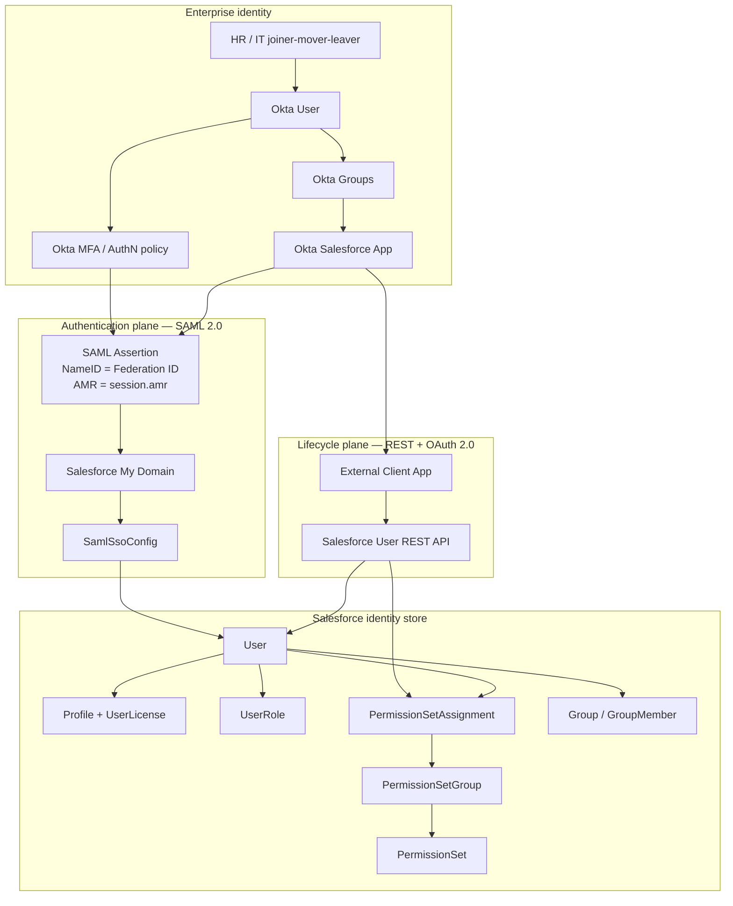
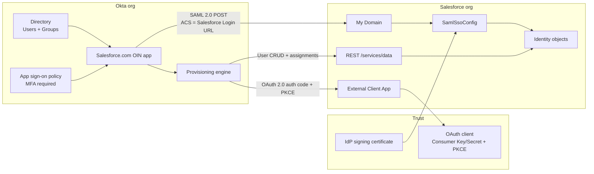
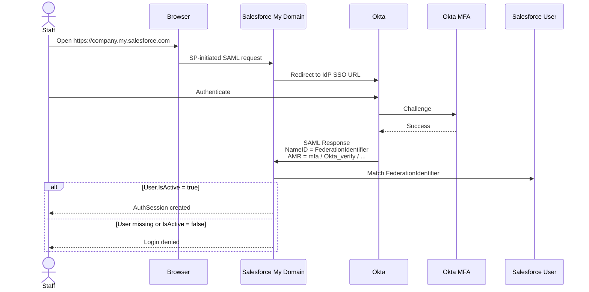
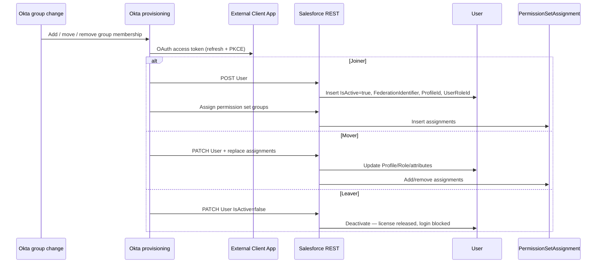
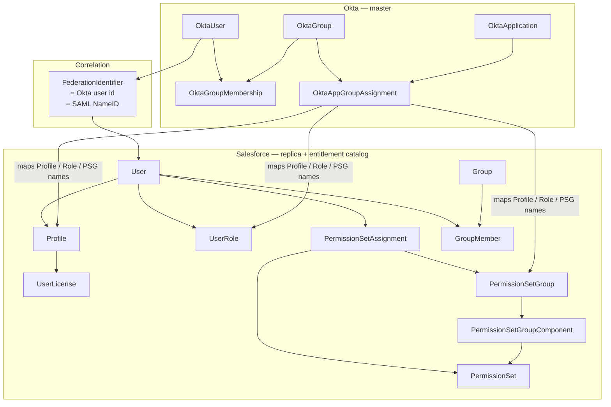
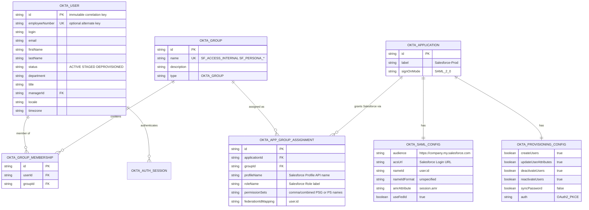
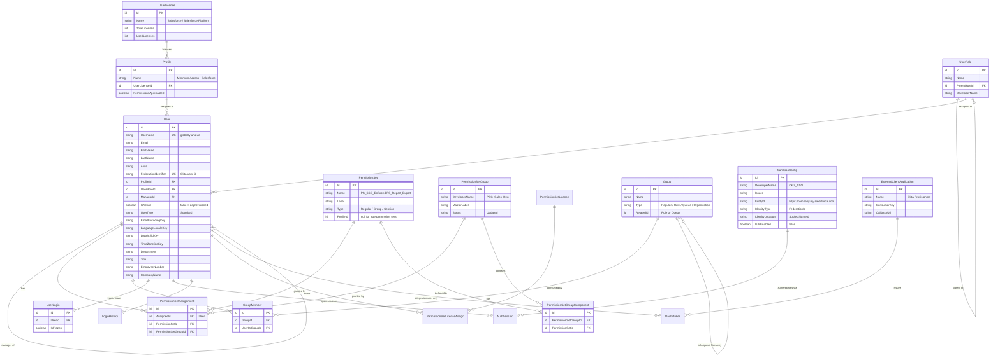
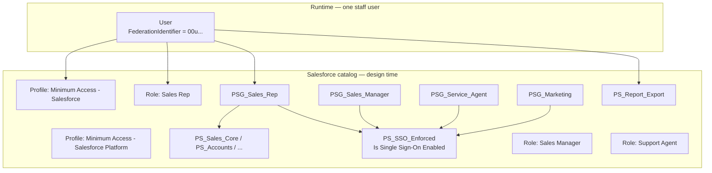

# Architecture and Object Data Model

**Identity & User Lifecycle Management — Okta (IdP) + Salesforce (SP)**

This document is the architecture and canonical data model for the requirements in `identity-user-lifecycle-okta-salesforce.md`.

| Requirement | Architecture response | Data-model response |
| --- | --- | --- |
| Staff details mastered in Okta | Okta is the system of record; Salesforce is a downstream replica of identity | `Okta User` masters attributes; Salesforce `User` stores a projected copy |
| Single Sign-On | SAML 2.0, Salesforce as SP, Okta as IdP, My Domain | `SamlSsoConfig` + `User.FederationIdentifier` = SAML NameID |
| Automated provisioning from Okta groups | Okta group assignment to the Salesforce app triggers REST create/update | Group → Profile / Role / Permission Set Group mappings |
| Automated de-provisioning from group removal | Okta unassignment or user deactivate pushes `IsActive = false` | Salesforce `User` is deactivated, never deleted |
| Entitlements aligned to job | Thin profile + permission set groups | `Profile`, `PermissionSetGroup`, `PermissionSetAssignment`, `UserRole` |

No custom Salesforce objects are required for the core design. Identity, access, and lifecycle all use standard Salesforce identity objects plus Okta directory objects. Optional custom objects are listed only for audit mirroring.

---

## 1. Logical architecture

Four layers. Data ownership is strict: identity and group membership live only in Okta; Salesforce stores the projected user and the entitlement catalog.



### 1.1 Control vs data vs session

| Plane | What it moves | Protocol | Source object | Target object |
| --- | --- | --- | --- | --- |
| Control | Who should have Salesforce | Okta group assignment | `Okta Group` | Okta app assignment |
| Data / lifecycle | Create, update, deactivate User | REST + OAuth 2.0 + PKCE | Okta user + group entitlements | `User`, `PermissionSetAssignment`, `GroupMember` |
| Session | Prove identity and start a Salesforce session | SAML 2.0 | Okta session + MFA | `AuthSession` matched via `User.FederationIdentifier` |
| Entitlement catalog | What a persona is allowed to do | Manual design, versioned in Salesforce | Architect-defined | `Profile`, `PermissionSet`, `PermissionSetGroup`, `UserRole` |

Salesforce does not invent staff identity. It only:

1. Holds a `User` row keyed by Federation ID.
2. Holds the entitlement catalog (profiles, permission set groups, roles).
3. Issues a session after a valid SAML assertion.

---

## 2. Physical / integration architecture



Separate Okta app instances (and therefore separate SAML configs and External Client Apps) exist for Production and each persistent sandbox.

### 2.1 Runtime flows

**SSO (staff login)**



**Provision / de-provision (no login required)**



---

## 3. Object data model — systems of record

Two bounded contexts. Correlation is a single key: **Okta User ID (or immutable employee number) = Salesforce `User.FederationIdentifier` = SAML NameID**.



---

## 4. Okta directory model

These are Okta entities, not Salesforce objects. They are the masters.



### 4.1 Group catalog as data

| `OktaGroup.name` | Cardinality vs user | Writes to Salesforce |
| --- | --- | --- |
| `SF_ACCESS_INTERNAL` | 0..1 (required for access) | App assignment present → User exists and is active |
| `SF_LIC_SALESFORCE` | 0..1 exclusive with Platform | `User.ProfileId` → Minimum Access - Salesforce |
| `SF_LIC_PLATFORM` | 0..1 exclusive with Salesforce | `User.ProfileId` → Minimum Access - Salesforce Platform |
| `SF_PERSONA_SALES_REP` | 0..1 persona (priority if multiple) | `User.UserRoleId` + PSG assignment `PSG_Sales_Rep` |
| `SF_PERSONA_SALES_MGR` | 0..1 | Role + `PSG_Sales_Manager` |
| `SF_PERSONA_SERVICE` | 0..1 | Role + `PSG_Service_Agent` |
| `SF_PERSONA_MARKETING` | 0..1 | `PSG_Marketing` |
| `SF_CAP_REPORT_EXPORT` | 0..1 additive | Extra `PermissionSetAssignment` for `PS_Report_Export` |
| `SF_BREAKGLASS_ADMIN` | 0..n named people | **No** staff SSO enforcement; not provisioned as SSO-only |

License groups are mutually exclusive. Persona groups should be mutually exclusive. Capability groups may stack.

---

## 5. Salesforce identity object model

Standard objects only. This is the org’s identity schema for staff.



### 5.1 Object responsibility

| Salesforce object | Requirement it serves | Mastered in | Notes |
| --- | --- | --- | --- |
| `User` | Staff record in Salesforce | Okta (attributes and active flag) | Projection only |
| `User.FederationIdentifier` | SSO match + correlation | Okta user id | Must equal SAML NameID |
| `User.IsActive` | De-provisioning | Okta assignment + status | `false` = leaver; never delete |
| `Profile` | License + login defaults | Salesforce catalog | Thin; one per user |
| `UserLicense` | Commercial license consumption | Salesforce | Released when `IsActive = false` |
| `UserRole` | Sharing hierarchy | Salesforce catalog; assignment from Okta | One per user |
| `PermissionSetGroup` | Persona bundle | Salesforce catalog | One primary PSG per persona |
| `PermissionSet` | Atomic capability | Salesforce catalog | SSO enforce, export, etc. |
| `PermissionSetGroupComponent` | PSG membership | Salesforce | Design-time |
| `PermissionSetAssignment` | Runtime grant | Okta group assignment | Combined across groups |
| `PermissionSetLicense` / `PermissionSetLicenseAssign` | Add-on licenses | Salesforce / Okta if mapped | Remove on leaver |
| `Group` / `GroupMember` | Public groups / queues | Optional Okta mapping | Combine across groups |
| `SamlSsoConfig` | SSO | Salesforce + Okta cert | JIT off |
| `Domain` / My Domain | SP-initiated SSO | Salesforce | Entity ID |
| `ExternalClientApplication` | Provisioning trust | Salesforce | Dedicated provisioning user |
| `OauthToken` | Provisioning API session | Salesforce | Belongs to integration user |
| `UserLogin` | Freeze when deactivate is blocked | Salesforce ops | Temporary |
| `AuthSession` | Live SSO session | Salesforce | Ends on deactivate |
| `LoginHistory` | Audit of SSO vs local | Salesforce | Break-glass monitoring |
| `UserAccessPolicy` | Optional Salesforce-side safety net | Salesforce | Complement, not SoT |

### 5.2 Cardinality rules (enforced by platform + mapping)

| Relationship | Cardinality | Enforced by |
| --- | --- | --- |
| User → Profile | N : 1, required | Salesforce |
| Profile → UserLicense | N : 1, required | Salesforce |
| User → UserRole | N : 0..1 | Salesforce |
| User → PermissionSetAssignment | 1 : 0..N | Salesforce |
| PermissionSetGroup → PermissionSet | 1 : 1..N via Component | Salesforce |
| User → FederationIdentifier | 1 : 1 unique | Salesforce unique field + Okta mapping |
| Okta User → Salesforce User | 1 : 0..1 | Provisioning match on Federation ID / username |
| Okta Group (license) → Profile | N : 1 | Okta assignment attribute, group priority |
| Okta Group (persona) → PSG | N : 1 | Okta assignment, combine values for extras |
| Staff User → Salesforce password login | 1 : 0 | `Is Single Sign-On Enabled` on `PS_SSO_Enforced` |

---

## 6. Canonical attribute map (field-level data contract)

Master column is the only writer. Salesforce values for staff must not be edited in Setup except break-glass and integration users.

| Salesforce field / related record | Datatype | Okta source | Master | Create | Update | Deactivate |
| --- | --- | --- | --- | --- | --- | --- |
| `User.FederationIdentifier` | Text(512), unique | `user.id` | Okta | Set once | Never | Keep |
| `User.Username` | Email, globally unique | `email` or `email + ".sfdc"` | Okta | Set | Rare | Keep |
| `User.Email` | Email | `email` | Okta | Set | Yes | Keep |
| `User.FirstName` | Text | `firstName` | Okta | Set | Yes | Keep |
| `User.LastName` | Text | `lastName` | Okta | Set | Yes | Keep |
| `User.Alias` | Text(8) | derived from name | Okta | Set | Yes | Keep |
| `User.EmployeeNumber` | Text | `employeeNumber` | Okta | Set | Yes | Keep |
| `User.Department` | Text | `department` | Okta | Set | Yes | Keep |
| `User.Title` | Text | `title` | Okta | Set | Yes | Keep |
| `User.ManagerId` | Lookup(User) | manager’s Federation ID | Okta | Set if manager exists | Yes | Keep |
| `User.ProfileId` | Lookup(Profile) | license group | Okta | Set | Yes (priority) | Keep |
| `User.UserRoleId` | Lookup(UserRole) | persona group | Okta | Set | Yes (priority) | Keep |
| `User.LocaleSidKey` | Picklist | locale / default `en_US` | Okta | Set | Yes | Keep |
| `User.LanguageLocaleKey` | Picklist | locale / default `en_US` | Okta | Set | Yes | Keep |
| `User.TimeZoneSidKey` | Picklist | timezone / default | Okta | Set | Yes | Keep |
| `User.EmailEncodingKey` | Picklist | default `UTF-8` | Okta | Set | Yes | Keep |
| `User.IsActive` | Checkbox | status + app assignment | Okta | `true` | `true/false` | `false` |
| `PermissionSetAssignment` (PSG) | Junction | persona groups | Okta | Insert | Replace set | Remove or leave; user inactive |
| `PermissionSetAssignment` (`PS_SSO_Enforced`) | Junction | all staff personas | Okta or User Access Policy | Insert | Keep | Inactive user |
| `PermissionSetAssignment` (`PS_Report_Export`) | Junction | capability group | Okta combine | Insert | Add/remove | Inactive user |
| `GroupMember` | Junction | public-group mapping | Okta combine | Insert | Add/remove | Inactive user |
| `UserLogin.IsFrozen` | Checkbox | ops exception | Salesforce | — | Manual if deactivate blocked | Unfreeze after deactivate |

### 6.1 Records that are not staff-mastered in Okta

| Record | Owner | Why excluded from the staff connector |
| --- | --- | --- |
| Integration `User` (API Only) | Salesforce platform team | Unique user per integration |
| Default Workflow / Case owner users | Salesforce admins | Deactivation blockers |
| Break-glass admin `User` | Security | Local password + Salesforce MFA |
| `Profile`, `PermissionSet`, `PermissionSetGroup`, `UserRole` definitions | Salesforce Architect | Entitlement catalog, not identity |
| `SamlSsoConfig`, `ExternalClientApplication` | IAM + Salesforce Admin | Trust configuration |

---

## 7. Entitlement catalog model (Salesforce-designed, Okta-assigned)

Persona access is a designed catalog in Salesforce. Okta only stores **names** of those catalog rows on group assignments.



### 7.1 Instance example

Okta user `00u1abc` is in groups `SF_ACCESS_INTERNAL`, `SF_LIC_SALESFORCE`, `SF_PERSONA_SALES_REP`, `SF_CAP_REPORT_EXPORT`.

| Salesforce row | Value |
| --- | --- |
| `User.Id` | `005...` |
| `User.FederationIdentifier` | `00u1abc` |
| `User.Username` | `alex.reese@company.com` |
| `User.IsActive` | `true` |
| `User.ProfileId` | Minimum Access - Salesforce |
| `User.UserRoleId` | Sales Rep |
| `PermissionSetAssignment` | `PSG_Sales_Rep` (includes `PS_SSO_Enforced`) |
| `PermissionSetAssignment` | `PS_Report_Export` |

If the same user is later removed from all Salesforce groups:

| Salesforce row | Value |
| --- | --- |
| Same `User.Id` / `FederationIdentifier` | Unchanged (row retained) |
| `User.IsActive` | `false` |
| User license | Released |
| SSO | Denied (inactive + no Okta assignment) |

---

## 8. Trust and session objects

These objects complete SSO and provisioning but are not staff identity.

```mermaid
erDiagram
  Domain ||--|| SamlSsoConfig : "EntityId uses My Domain"
  SamlSsoConfig ||--o{ AuthSession : "SSO login"
  User ||--o{ AuthSession : "owns"
  User ||--o{ LoginHistory : "audited by"
  ExternalClientApplication ||--o{ OauthToken : "refresh token"
  ProvisioningUser["User okta.provisioning"] ||--o{ OauthToken : "authorized"
  ProvisioningUser ||--o{ User : "API creates/updates"

  Domain {
    string Domain "company.my.salesforce.com"
    boolean LoginFormVisible "false after go-live"
    boolean OktaAuthService "true"
  }

  AuthSession {
    id Id PK
    id UsersId FK
    string SessionType "Oauth2 / UI"
    string LoginType "SAML S"
    datetime CreatedDate
  }

  LoginHistory {
    id Id PK
    id UserId FK
    string Status "Success / Failed"
    string LoginType "SAML S / Application"
    string SsoType
    string TlsProtocol
  }

  OauthToken {
    id Id PK
    id AppId FK
    id UserId FK
    datetime LastUsedDate
  }
```

---

## 9. Optional custom objects (not required)

Use only if Compliance needs a Salesforce-visible mapping or provisioning audit that is not satisfied by Okta System Log + Setup Audit Trail.

| Custom object | Purpose | Master |
| --- | --- | --- |
| `Identity_Group_Map__c` | Documents Okta group → Profile / PSG / Role | Architect (reference data) |
| `Identity_Provisioning_Event__c` | Stores failed/success pushes if middleware is added | Integration |

Recommended: **do not create them** for the baseline. They become a second mapping source and drift from Okta.

If `Identity_Group_Map__c` is added:

| Field | Type | Example |
| --- | --- | --- |
| `Okta_Group_Name__c` | Text(80), unique | `SF_PERSONA_SALES_REP` |
| `Salesforce_Profile_Name__c` | Text | `Minimum Access - Salesforce` |
| `Permission_Set_Group__c` | Text | `PSG_Sales_Rep` |
| `User_Role_Name__c` | Text | `Sales Rep` |
| `Is_License_Group__c` | Checkbox | false |
| `Is_Additive__c` | Checkbox | false |

This table is documentation in the org, not a provisioning engine.

---

## 10. Data-ownership matrix

| Data class | Create | Read | Update | Deactivate/Delete |
| --- | --- | --- | --- | --- |
| Legal identity (name, email, employee id) | Okta | Both | Okta | Okta |
| Salesforce access flag | Okta groups | Both | Okta groups | Okta groups |
| Federation ID | Okta, written once | Both | None | Never delete |
| Persona entitlements | Salesforce catalog + Okta assignment | Both | Okta assignment | Okta assignment |
| Sharing role tree | Salesforce | Both | Salesforce structure / Okta assignment | Salesforce |
| Passwords / MFA for staff | Okta | Okta | Okta | Okta |
| Break-glass password / MFA | Salesforce | Salesforce | Salesforce | Salesforce |
| SAML certificate | Okta issues, Salesforce stores | Both | IAM rotation | IAM |
| OAuth client for provisioning | Salesforce issues, Okta stores | Both | IAM rotation | IAM |
| Login audit | Salesforce `LoginHistory`, Okta System Log | Security | Append-only | Retention policy |

---

## 11. What the model explicitly excludes

| Object / pattern | Reason |
| --- | --- |
| SAML JIT-created `User` | No deactivation path; conflicts with REST mastering |
| Custom `Staff__c` identity object | Duplicates `User`; Salesforce login requires `User` |
| Fat profiles as persona store | Violates Well-Architected; one profile per license only |
| Deleting `User` | Not supported; audit and ownership require the row |
| One Okta app for prod + sandbox | Different My Domain, usernames, OAuth clients |
| Experience Cloud / `NetworkMember` | Different identity domain (customers/partners) |

---

## 12. Architecture outcomes (brief)

- Two systems, one correlation key: Okta user id = `User.FederationIdentifier` = SAML NameID.
- Two planes: SAML for session, REST/OAuth for lifecycle. They share the `User` row and must not both master it.
- Okta objects (`User`, `Group`, `AppGroupAssignment`) are the source of truth for who exists and who has Salesforce.
- Salesforce objects (`User`, `Profile`, `UserLicense`, `UserRole`, `PermissionSet`, `PermissionSetGroup`, `PermissionSetAssignment`, `GroupMember`) are the entitlement and session store.
- Trust objects (`SamlSsoConfig`, `Domain`, `ExternalClientApplication`, `OauthToken`) enable SSO and provisioning; they are not staff records.
- Group assignment is the only create/deactivate trigger; `User.IsActive` is the de-provision flag.
- No custom Salesforce objects are required for the requirement set.
- Catalog (what a persona can do) is designed in Salesforce; assignment (who gets it) is designed in Okta.
