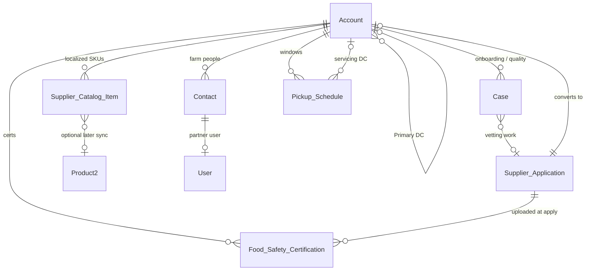

# 1.1 Supplier Onboarding & Management

## Salesforce Architecture Design — FreshSource Global (FSG)

**Clouds in scope:** Salesforce Sales Cloud + Service Cloud (Core) + Experience Cloud only  
**Platform guidance:** Salesforce Well-Architected (Trusted, Easy, Adaptable), Experience Cloud identity/sharing model, and current guest-user security recommendations.

---

## 1. Designed problem statement

Independent farms and artisan producers must join the FSG supplier network through a **public Experience Cloud site**, without receiving a Salesforce login until they are trusted.

Quality & Compliance (Q&C) Officers must **vet food-safety certifications**, inspect perishable-goods readiness, and approve or reject the applicant. Vetting work must be **automatically assigned** to the right regional officer across **14 time zones** (NA, LATAM, EMEA).

Once approved, the farm becomes an **official supplier Account**. Authenticated supplier users may maintain:

- a **localized product catalog** (SKU, language, unit of measure, seasonality, cold-chain class)
- **pickup schedules** bound to the farm’s time zone and regional distribution center

Security requirements that the design must satisfy:

| Requirement | Design implication |
| --- | --- |
| Unauthenticated public apply | Guest user may **create** an application only; must **not** read FSG CRM data |
| Least privilege after approval | A supplier sees **only their farm’s** account, users, catalog, schedules, certifications, and cases |
| Farm-level user admin | One supplier manager may manage users **only on their own Account** |
| Regional Q&C isolation | NA officers do not see LATAM/EMEA supplier PII or certifications by default |
| Partner-account roll-up | Internal owner of the supplier Account sees partner-owned records via the role hierarchy |
| Scale | ~8,000 supplier Accounts; sharing model must stay shallow and performant |
| Compliance | Certification documents, tax IDs, and inspection notes are sensitive; guest and API exposure must be locked down |

**Out of this workstream:** buyer ordering, contracted pricing, volume rebates, and branch-buyer administration (those are separate account models). This design only **reserves** Account record types and the role hierarchy so those workstreams can land later without a remodel.

---

## 2. Architecture decisions (locked)

| Decision | Choice | Why (Salesforce recommendation) |
| --- | --- | --- |
| Identity anchor | **Business Account** → Contact → User | Salesforce: start with Account for Experience Cloud identity, access, and onboarding. Partner licenses **cannot** use Person Accounts. |
| Public apply | **No self-registration.** Guest submits an application only. Users are provisioned **after** Q&C approval. | Salesforce guest-security guidance: disable self-registration unless required; harvested guest data must not escalate into an authenticated session. |
| Guest data access | **Custom access-control model**: guest profile has **no object CRUD**. Screen Flow + Apex `without sharing` with procedural checks. | Developer Guide: if guests should not read records, remove CRUD/FLS and run create logic in a `without sharing` controller. Do not return Salesforce record IDs. |
| Authenticated supplier license | **Partner Community** (or Partner Community Login) | Independent B2B farms; Cases; Account roles; Delegated External User Administration; future supply Opportunities/Orders. |
| Partner roles per Account | **One role** per supplier Account | Salesforce: keep the default one account role. 8,000 × 3 roles would explode the role hierarchy and hurt sharing performance. |
| Catalog & pickup data | **Custom objects, Master-Detail to Account** | Standard `Product2` has no owner and is not safely isolatable per partner. MD children inherit Account sharing (least privilege at 8k farms). |
| Internal Q&C work | **Case** (Service Cloud) + Omni-Channel Flow | Standard case management, entitlements-ready, skills-based routing across regions/languages. |
| Site | **One Enhanced LWR** Experience Cloud site (`FSG Supplier Network`) | Salesforce recommended site architecture; public pages + authenticated pages; localization/CMS. |
| External OWD | **Private** on all business objects; **Secure guest user record access = ON** | Salesforce: guests cannot see any record unless an explicit guest sharing rule exists. Prefer **no** guest sharing rules. |
| Internal OWD | **Private** on Account, Case, and custom objects | Least privilege; grant via role hierarchy, sharing rules, Account Teams, and restriction rules. |

**License alternative:** Customer Community Plus can replace Partner Community if FSG will **never** expose Leads, Opportunities, Campaigns, or Orders to farms. Sharing would still use one external role per Account. Partner Community is the recommended default because FSG is a B2B supply network on Sales Cloud.

---

## 3. Personas, licenses, and identity

### 3.1 Personas

| Persona | Type | License | What they do |
| --- | --- | --- | --- |
| Farm applicant | Unauthenticated | Experience Cloud **Guest** | Submit application + certification files |
| Supplier user | External | **Partner Community** | Maintain catalog items and pickup windows for their farm |
| Supplier manager | External | **Partner Community** + Partner Super User + Delegated External User Admin | Same as user, plus manage **only this Account’s** contacts/users |
| Q&C Officer | Internal | Salesforce (Service Cloud) | Vet certifications, inspect, approve/reject |
| Q&C Manager | Internal | Salesforce | Approve high-risk commodities; overflow / coaching |
| Supplier Manager (Channel Account Manager) | Internal | Salesforce (Sales Cloud) | Owns the partner Account; commercial relationship |
| Integration / automation user | Internal | Salesforce | Owns guest-created records immediately after insert |

### 3.2 Identity model (Salesforce standard)

```
User (Partner Community)
  └── Contact (person at the farm)
        └── Account (the farm / artisan producer)   ← stable org anchor
```

- Every external user is created **from a Contact** on the supplier Account (`Enable Partner User`).
- Company-level policy lives on Account: region, time zone, language, primary DC, onboarding status, identity method.
- Login: **Login Discovery** by email → standard Salesforce login + **MFA** (Salesforce MFA requirement). Optional later: Account-level SSO routing if a co-op or large producer has an IdP.

### 3.3 Why not guest self-registration

Self-registration would create an Experience Cloud user **before** food-safety vetting. That violates the business rule (“once vetted… they are onboarded as official suppliers”) and Salesforce’s guest-hardening guidance. The approved path is: **apply as guest → Q&C decision → Enable as Partner → Enable Partner User → welcome email**.

---

## 4. Experience Cloud site

**Site name:** FSG Supplier Network  
**Template:** Enhanced LWR (Build Your Own / Partner-capable LWR)  
**Languages:** English, Spanish, Portuguese, French (extend via Experience languages + Translation Workbench)  
**Time zones:** User timezone for authenticated users; farm timezone on Account for pickup windows

| Page / area | Audience | Capability |
| --- | --- | --- |
| Home / “Join the network” | Guest | Marketing content only. No CRM record lists. |
| Apply | Guest | Screen Flow: farm profile, contacts, certifications, file upload, reCAPTCHA |
| Application received | Guest | Confirmation + **encrypted** tracking token (not a Salesforce Id) |
| Login | Authenticated | Login Discovery + MFA |
| My farm | Partner | Account highlights, status, primary DC, time zone |
| Certifications | Partner | View / renew `Food_Safety_Certification__c` + Files |
| Product catalog | Partner | CRUD on **their** `Supplier_Catalog_Item__c` |
| Pickup schedules | Partner | CRUD on **their** `Pickup_Schedule__c` |
| Support | Partner | View farm onboarding **status on Account**; create/view **support Cases they own** (quality questions, schedule changes). Internal Q&C Cases stay internal. |
| Knowledge | Partner | Published food-safety / packing articles only |

**Guest profile lockdown (mandatory):**

1. Guest User Profile: **no** object permissions on Account, Contact, Case, Catalog, Schedule, Certification, User.
2. Uncheck **API Enabled** and site setting **Allow guest users to access public APIs**.
3. Sharing Settings: **Secure guest user record access** enabled; Default External Access **Private**; uncheck **Portal User Visibility** and **Site User Visibility**.
4. User Management Settings: enable **Profile Filtering** and **Enhanced Personal Information Masking**.
5. Experience Preferences: **Show nicknames**; hide first/last name in SOAP API for site users.
6. Administration → Login & Registration: **no self-registration page**.
7. CSP / Trusted Sites: only FSG domains + reCAPTCHA.
8. Guest may invoke **one** Apex class and **one** Screen Flow (application). Nothing else.

---

## 5. Data model

Use standard objects where they are the Salesforce system of record. Use custom objects where standard sharing cannot isolate 8,000 partner catalogs.



### 5.1 Standard objects

**Account** (record types)

| Record type | Purpose |
| --- | --- |
| `Supplier_Applicant` | Created in system context at apply time; **not** enabled as partner |
| `Official_Supplier` | After Q&C approval; **Enable as Partner** |
| `Distribution_Center` | Regional DC master data (pickup destination) |
| `Corporate_Buyer` / `Micro_Buyer` | Reserved for later buyer workstreams |

Key Account fields:

- `Onboarding_Status__c`: Submitted → In Review → Certification Review → Approved / Rejected / Suspended
- `Region__c`: NA | LATAM | EMEA
- `Country__c`, `Time_Zone__c` (IANA, e.g. `America/Mexico_City`)
- `Primary_Language__c`
- `Commodity_Focus__c` (multi-select: Produce, Dairy, Meat, Seafood, Dry Goods, Artisan)
- `Primary_DC__c` (lookup to DC Account)
- `Tax_Id__c` (encrypted)
- `Pickup_Address__*` (or standard Billing/Shipping + `Farm_Geo__c`)
- `Requires_Cold_Chain__c`
- `Partner_Enabled_Date__c`

**Contact:** applicant, quality contact, dispatch contact. `Is_Primary_Supplier_Manager__c` drives who gets Delegated External User Administration.

**Case** record types:

- `Supplier_Onboarding` — one parent case per application
- `Certification_Review` — child or related when a cert is expiring/invalid
- `Quality_Inspection` — reserved for ongoing perishable inspections

Case fields: `Region__c`, `Commodity__c`, `Language__c`, `Application__c`, `Risk_Level__c` (derived: Meat/Dairy/Seafood = High).

**Content / Files:** certification PDFs attached via `ContentDocumentLink` to the certification record (not left on the guest user).

**Optional later (not required for 1.1 go-live):** `Product2` + regional `Pricebook2` synced from approved catalog items for buyer-side ordering.

### 5.2 Custom objects

| Object | Relationship | Owner / sharing | Used by |
| --- | --- | --- | --- |
| `Supplier_Application__c` | Lookup → Account, Contact | Automation user, then Q&C queue | Guest (insert only via Apex), Q&C |
| `Food_Safety_Certification__c` | **Master-Detail → Account** | Inherits Account | Q&C (edit), Supplier (read / renew) |
| `Supplier_Catalog_Item__c` | **Master-Detail → Account** | Inherits Account | Supplier CRUD after Approved |
| `Pickup_Schedule__c` | **Master-Detail → Account** | Inherits Account | Supplier CRUD after Approved |

**Application** fields (guest-captured snapshot): farm name, country, region, address, tax id, commodities, languages, proposed pickup days, contact name/email/phone, encrypted tracking token.

**Certification** fields: `Type__c` (GFSI, HACCP, GAP, Organic, Regional equivalent), `Certificate_Number__c`, `Issuer__c`, `Valid_From__c`, `Valid_To__c`, `Status__c` (Valid / Expiring / Expired / Rejected), `Verified_By__c`.

**Catalog item** fields: `SKU__c`, `Product_Name__c`, `Locale__c`, `Category__c`, `UOM__c`, `Season_Start__c` / `Season_End__c`, `Temperature_Class__c` (Ambient / Chilled / Frozen), `Active__c`, `Country_Of_Origin__c`. Duplicate rule: Account + SKU.

**Pickup schedule** fields: `Day_Of_Week__c`, `Window_Start__c`, `Window_End__c`, `Time_Zone__c` (formula from Account), `Distribution_Center__c`, `Max_Pallets__c`, `Active__c`. Validation: window interpreted in `Account.Time_Zone__c`, not the running user’s timezone.

### 5.3 Why custom catalog instead of Product2 + Price Book

Salesforce price books localize **price**, not **ownership**. `Product2` is not role-shared like Accounts. Partner users with Product Read typically see active products they can reach through any usable price book. That cannot guarantee Farm A never sees Farm B’s SKUs.

Master-Detail to Account gives implicit sharing: if the partner can see only their Account, they can see only their catalog and pickup rows. That is the correct least-privilege model at 8,000 farms.

Buyer-facing assortment can still be a later sync: approved `Supplier_Catalog_Item__c` → `Product2` + DC/region price books used internally or by buyer portals.

---

## 6. End-to-end process (step by step)

### Phase A — Public application (Experience Cloud guest)

1. Farm opens `Join the FSG network` (public LWR page).
2. Guest runs Screen Flow **Apply_to_FSG_Supplier_Network**.
3. Flow collects farm, contact, commodity, region, language, and certification metadata; file upload to a **content version** via Apex.
4. **Google reCAPTCHA** + server-side field validation (length, file type PDF/JPG, max size, no script content).
5. Flow calls invocable Apex `SupplierApplicationService` (`without sharing`):
   - Duplicate matching (see §8.4). If likely duplicate, create application with `Possible_Duplicate__c = true` rather than silently merging.
   - Insert `Supplier_Application__c` **owned by** the `FSG Supplier Onboarding` automation user (guests must not own records).
   - Insert `Account` (record type `Supplier_Applicant`, status `Submitted`) owned by the **regional Supplier Manager** queue/user (see §9).
   - Insert primary `Contact`.
   - Insert `Food_Safety_Certification__c` children + `ContentDocumentLink` to the certification (file owner = automation user).
   - Insert Case (`Supplier_Onboarding`, status New) linked to Account + Application.
   - Generate encrypted tracking token (`recordId + CreatedDate + nonce`, platform encryption / Apex Crypto). Return **only** the token and a case/application reference number — **never** the Salesforce Id.
6. Auto-response email (org-wide email address): “We received application FSG-ONB-#####.” No deep links that contain Ids.
7. Guest session ends. Guest **cannot** query the application again except by submitting the token to a second, tightly scoped Apex action (status only: Received / In Review / Decision Made — no PII).

### Phase B — Assignment to Q&C (Service Cloud)

8. Record-triggered Flow **Onboarding_Case_After_Insert** (after save, async path for callouts if any) invokes **Omni-Channel Flow** `Route_Supplier_Onboarding_Case`.
9. Omni-Channel Flow sets required skills from Case fields: `Region__c`, `Country__c`, `Language__c`, `Commodity__c`, `Risk_Level__c`.
10. Work is routed to the regional Q&C queue **with routing configuration**, then pushed to an available officer who has **all** required skills and capacity.
11. If no skilled officer is available within the SLA, overflow to the regional Q&C Manager queue **without** a routing configuration (Salesforce overflow-assignee pattern).
12. Officer accepts work in the Omni-Channel widget; Case owner becomes the officer. Account Team: officer added as **Quality** role (Read/Write).

### Phase C — Vetting

13. Lightning record page (Q&C app): Path on `Onboarding_Status__c`, Files, certification related list, duplicate alert, Knowledge.
14. Officer verifies certifications (dates, issuer, commodity coverage, cold-chain). Optional: child Case `Certification_Review`.
15. **Approval Process** `Supplier_Onboarding_Approval`:
    - Low/Medium risk: Q&C Officer is sufficient (submit for approval to self-complete or manager skip).
    - High risk (Meat, Dairy, Seafood, infant/special foods): second step = Q&C Manager.
16. Rejection: status `Rejected`; Case closed; email with reason; Account remains Applicant and is **not** partner-enabled. Files retained per retention policy.
17. Approval: status `Approved`; record type changes to `Official_Supplier`.

### Phase D — Official supplier provisioning

18. After-save Flow **Supplier_Onboarding_Approved** (async):
    1. `Enable as Partner` on the Account (`IsPartner = true`) if not already set.
    2. Assign Account owner = regional **Supplier Manager** (channel account manager). Partner roles roll up under this owner — required for internal visibility of partner-owned records.
    3. Set `Primary_DC__c` from country → DC mapping (Custom Metadata).
    4. Seed a default inactive `Pickup_Schedule__c` template for that DC (optional, officer can skip).
    5. **Enable Partner User** on the primary Contact: Partner Community license, profile `FSG Supplier User`, permission set group `PSG_Supplier_Manager` if `Is_Primary_Supplier_Manager__c`.
    6. Set timezone, locale, language from Account.
    7. Add user to the Experience Cloud site.
    8. Send branded welcome email with login URL (Experience Cloud). MFA enrollment on first login.
19. Supplier logs in and maintains catalog + pickup schedules.
20. Ongoing: certification `Valid_To__c` approaching 30/14/0 days → Flow creates `Certification_Review` Case and notifies supplier + original Q&C officer (or current regional queue). Expired cert → Account `Suspended`, catalog items deactivated, portal write access removed via permission set revocation or login freeze.

---

## 7. Sharing model

### 7.1 Organization-wide defaults

| Object | Internal | External | Notes |
| --- | --- | --- | --- |
| Account | Private | Private | Foundation for all partner data |
| Contact | Controlled by Parent | Controlled by Parent | |
| Case | Private | Private | |
| `Supplier_Application__c` | Private | Private | Internal only |
| `Food_Safety_Certification__c` | Controlled by Parent | Controlled by Parent | MD → Account |
| `Supplier_Catalog_Item__c` | Controlled by Parent | Controlled by Parent | MD → Account |
| `Pickup_Schedule__c` | Controlled by Parent | Controlled by Parent | MD → Account |
| Price Book (if used later) | View Only | View Only | Share **Use** only to internal merchandising |
| User | Private | Private | EPIM on; no site/portal user visibility |

**Grant Access Using Hierarchies:** ON for internal roles. Partner’s single account role sits **under the Account owner’s internal role**, so Supplier Managers and their management chain see partner-owned records.

### 7.2 Internal role hierarchy (keep shallow)

```
FSG Leadership
 ├── NA Operations
 │    ├── NA Q&C Manager
 │    │    └── NA Q&C Officer
 │    └── NA Supplier Manager     ← owns NA partner Accounts
 ├── LATAM Operations
 │    ├── LATAM Q&C Manager
 │    │    └── LATAM Q&C Officer
 │    └── LATAM Supplier Manager
 └── EMEA Operations
      ├── EMEA Q&C Manager
      │    └── EMEA Q&C Officer
      └── EMEA Supplier Manager
```

Do **not** create a role per country or per DC. Country/DC routing belongs in Omni-Channel skills and queues, not in the role tree. Salesforce sharing performance degrades as roles and groups explode; 8,000 partner Accounts already add 8,000 external roles.

### 7.3 Internal sharing (who sees which suppliers)

| Mechanism | Rule | Access |
| --- | --- | --- |
| Role hierarchy | Account owner = regional Supplier Manager | Owner + superiors: Full access to that Account and MD children |
| Criteria-based sharing | `RecordType = Official_Supplier OR Supplier_Applicant` AND `Region__c = NA` → Public Group **NA_QC** | Read/Write |
| Same pattern | LATAM / EMEA groups | Read/Write |
| Account Team | Q&C Officer who accepted the Case = Team role **Quality** | Read/Write on that Account (covers Applicant stage before sharing-rule criteria, and cross-skill exceptions) |
| Case sharing | Owner (officer) + queue members; criteria Case.Region → regional Q&C group | Read/Write |
| Manual / Apex managed sharing | Rare exceptions (global commodity specialist) | Time-bound |

**Applicant-stage gap:** criteria sharing can include `Supplier_Applicant` by region so Q&C can see the Account before it is partner-enabled. Account Team on Case accept is the belt-and-suspenders.

### 7.4 Restriction rules (defense in depth)

Salesforce Restriction Rules **subtract** access. Apply to Q&C Officer and Supplier Manager custom permissions:

- User with `Region__c = NA` can access Account only when `Account.Region__c = NA` (same for LATAM/EMEA).
- Repeat for Case, Application, and (if ever not MD) certification.

This prevents a misconfigured sharing rule or public group from leaking another region’s farm tax IDs and certificates (GDPR / regional food-safety).

### 7.5 External (partner) sharing

| Need | Mechanism |
| --- | --- |
| See own Account, Contacts, MD catalog/schedules/certs | Implicit: partner user in the Account’s **single** partner role; MD children follow Account |
| See onboarding progress | **Do not share internal Q&C Cases with partners.** Status is stored on `Account.Onboarding_Status__c` (and application number). Partners already have Read on their Account. This avoids CaseShare explosion and keeps inspector notes internal. |
| Open a support Case after go-live | Partner **owns** the Case they create in the site (`ContactId` + `AccountId` set by Flow). Owner-based Private OWD is enough. Super User lets the farm manager see Cases owned by other users on the same Account. Internal Q&C sees those Cases via regional sharing rules. |
| Farm manager sees records owned by other farm users | **Partner Super User Access** on the Supplier Manager profile |
| Farm manager creates users only for this farm | **Delegated External User Administration** + “Manage External Users”; Delegated Admin on their Account only |
| Farm A never sees Farm B | External OWD Private + no partner-to-partner sharing rules + one role per Account |
| Guest sees nothing | No guest sharing rules at all |

**Catalog/schedule write access:** object CRUD on the partner profile (Create/Read/Edit). Record access comes from MD to Account. Delete: optional; prefer `Active__c = false`.

**Partner Super User:** lets the farm owner see catalog rows **owned by** other users on the same Account (each partner user owns the SKUs they create). Enable only on `FSG Supplier Manager` profile.

### 7.6 Guest sharing

**Do not create guest user sharing rules.** Guest insert happens in system Apex; ownership is transferred in the same transaction to the automation user. Guest cannot read Account, Case, or Files.

If a status-check page is required, it must call Apex that: (1) requires the encrypted token, (2) returns a DTO with status only, (3) is `without sharing` with explicit field allow-list, (4) rate-limited.

---

## 8. Security model (layered)

Salesforce evaluates **object → record → FLS → masking**. Configure each layer.

### 8.1 Object & tab (profiles / permission set groups)

Use **Permission Set Groups** (Salesforce recommended over proliferating profiles). Thin profiles + PSGs.

| PSG | Key object access |
| --- | --- |
| `PSG_QC_Officer` | Account/Contact R/W (via sharing); Case CRUD for onboarding types; Certification R/W; Application R/W; Catalog/Schedule Read; Files |
| `PSG_QC_Manager` | Same + Approve High Risk + Reports |
| `PSG_Supplier_Manager_Internal` | Account R/W owned/region; Catalog/Schedule Read; no cert edit unless also Q&C |
| `PSG_Supplier_User` (external) | Catalog C/R/E; Schedule C/R/E; Certification Read (+ create renewal); Case C/R (own account); Account Read |
| `PSG_Supplier_Manager_External` | Above + Contacts C/R/E; Delegated user admin; Super User |
| Guest | **None** |

Profiles exist only as: `FSG QC Officer`, `FSG Supplier User`, `FSG Supplier Manager`, Minimum Access-equivalent baseline.

### 8.2 Field-level security

Hide from partners: `Tax_Id__c`, internal risk score, Q&C private comments, assignment skills.

Hide from guest (N/A if no FLS because no object access).

Encrypt with **Shield Platform Encryption** (or Classic encryption if Shield is not licensed): `Tax_Id__c`, certificate number, guest contact email/phone on Application.

### 8.3 Guest Apex contract

Follow the Experience Cloud Developer Guide:

- Class that **touches records**: `without sharing`.
- Do **not** grant guest CRUD; force all access through this class.
- CRUD/FLS enforced in code (`StripInaccessible` / `WITH USER_MODE` where applicable — note `without sharing` + `USER_MODE` still applies FLS; for guest with no FLS, system mode insert is intentional and must be allow-listed).
- Never return record Ids; return encrypted token.
- Validate file MIME type and strip metadata.
- Perform data validation so guest input cannot poison assignment (restricted picklists, Custom Metadata for country→region).
- CRUD in a named automation user with a dedicated permission set (audit trail).

### 8.4 Duplicate and abuse controls

- Matching rules: Account Name + Country + fuzzy; Tax Id exact; Contact Email exact.
- Duplicate rule on Application insert: allow save, raise alert for Q&C (do not block a farm that shares a name).
- Rate limit applications per IP in Apex (custom object `Guest_Request_Log__c` or Platform Cache).
- reCAPTCHA v3.

### 8.5 Session, MFA, login

- MFA required for all internal and partner users.
- Session timeout appropriate for farm office use (e.g. 2 hours).
- Login IP ranges: **do not** restrict partners globally (farms on cellular); restrict **internal** Q&C if policy requires VPN.
- Password policies + Have I Been Pwned / Salesforce standard.
- Event Monitoring (if licensed): Aura/LWR guest API anomalies — Salesforce’s 2026 guest-user threat guidance.

### 8.6 Files

- Guest cannot query `ContentDocument`. Apex inserts File owned by automation user, linked only to `Food_Safety_Certification__c`.
- Partner profile: Files related to records they can see (`Salesforce Files` on objects they own/can access).
- No public library. No guest library.

---

## 9. Assignment of records

### 9.1 What gets assigned

| Record | Initial owner | Then |
| --- | --- | --- |
| `Supplier_Application__c` | Automation user | Remains; Q&C access via sharing |
| Applicant Account | Round-robin **regional Supplier Manager** (Flow + Custom Metadata / Omni on Account is not native; use Case as the work item and set Account Owner in the same Omni Flow) | After approval, confirmed as that CAM |
| Case | Regional Q&C Omni queue | Officer who accepts |
| Partner User | N/A | Created for primary Contact |
| Catalog / Schedule | Creating partner user | Visible to Super User manager + internal via Account |

### 9.2 Omni-Channel design (Salesforce recommended for multi-country)

**Why skills-based + regional queues:** Salesforce positions queue-based routing for small, single-skill teams and **skills-based routing** for many countries, languages, and products. FSG has 14 time zones, 3 regions, multiple commodities, and perishable risk — skills-based is the fit.

**Queues (work buckets, also absorb timezone):**

- `QC_Onboarding_NA`
- `QC_Onboarding_LATAM`
- `QC_Onboarding_EMEA`
- Overflow: `QC_Manager_NA` / `_LATAM` / `_EMEA` (no routing configuration)

**Skills:** Region, Language (EN/ES/PT/FR), Commodity family, High-Risk Food.

**Presence / capacity:** Q&C Officers work in their local business hours. Omni-Channel only pushes to **Available** officers, so a LATAM case is not forced onto an NA officer at 02:00. Secondary: regional queues so the work sits in-region until a local officer is present.

**Routing configuration:** priority 1 for High Risk; standard for others; overflow assignee = regional manager queue.

**Do not rely on classic Case Assignment Rules as the primary engine** when Omni-Channel Flow is in use. Pattern:

1. Insert Case.
2. Omni-Channel Flow routes to queue/skills.
3. Agent accept changes owner.
4. Flow on accept: add Account Team member.

Classic assignment rules may still **park** a Case on a queue if not using Omni Flow; FSG should standardize on **Omni-Channel Flow** (current Salesforce recommendation).

### 9.3 Account owner assignment

Partner visibility **rolls up to the Account owner**. Therefore:

- Account Owner **must** be an internal user in the correct regional Supplier Manager role — never a queue long-term (queues as Account owners break partner role roll-up).
- Omni Flow or subflow: `Country__c` → Custom Metadata `Country_Routing__mdt` → `Supplier_Manager_User_Id__c` (primary) with round-robin helper (custom object `Round_Robin_Cursor__c` per region) if multiple CAMs exist.
- Changing owner later: transfer Account (and thus partner role parent) to the new CAM.

### 9.4 SLA and 14 time zones

- Entitlements + Milestones on `Supplier_Onboarding` (e.g. first response 1 **business** day, decision 5 business days) using **regional Business Hours**.
- Milestone clocks follow the Case’s Business Hours (set from `Region__c`), not GMT, so EMEA farms are not measured on California time.

---

## 10. Localized catalogs and pickup schedules

After `Onboarding_Status__c = Approved` and partner login:

1. Supplier opens **Product catalog**. List view filtered by sharing (their Account only).
2. Create SKU: locale defaults to `Account.Primary_Language__c` + country; temperature class required if `Requires_Cold_Chain__c`.
3. Validation rules: frozen SKU cannot be scheduled on an Ambient-only DC (DC Account checkbox).
4. Pickup schedule: day/window stored as time-of-day; display uses `Account.Time_Zone__c`. Experience Cloud UI should show the farm timezone explicitly (“Windows are in America/Bogotá”).
5. Internal logistics (read via Account sharing) uses the same rows to plan DC inbound docks.
6. Optional: Flow to Knowledge or email DC operations when a new Frozen window is created.

**Translation:** Translation Workbench for picklists; catalog **data** is supplier-authored per `Locale__c` (they may add ES and EN rows for the same SKU).

---

## 11. Automation catalog (keep it declarative-first)

| Automation | Type | When |
| --- | --- | --- |
| Apply_to_FSG_Supplier_Network | Screen Flow (site) | Guest apply |
| SupplierApplicationService | Invocable Apex `without sharing` | Insert application graph |
| Route_Supplier_Onboarding_Case | Omni-Channel Flow | Case created |
| Onboarding_Case_Accepted | Record-triggered Flow | Owner changes from queue → user: Account Team |
| Supplier_Onboarding_Approval | Approval Process | Officer submits |
| Supplier_Onboarding_Approved | Record-triggered Flow (async) | Status = Approved: partner enable + user |
| Certification_Expiry_Warn | Scheduled Flow | Valid_To windows |
| Suspend_On_Expired_Cert | Record-triggered Flow | Cert Expired → freeze writes |
| Duplicate / Path / Email | Duplicate rules, Path, Email Alerts | Throughout |

Apex is limited to: guest insert/status token, encrypted token, round-robin CAM, Enable Partner User (Connect API / `Site.createExternalUser` / `User` insert in system context). Prefer Flow for everything else. Do **not** Apex-share internal onboarding Cases to partners.

---

## 12. Apps, UX, and ops

- **Internal Lightning app `FSG Quality & Compliance`:** Case console, Omni widget, Account, Certifications, Knowledge, Reports.
- **Internal Lightning app `FSG Supplier Management`:** Accounts (Official Supplier), catalog/schedule related lists, partner user management.
- List views scoped by `Region__c` (restriction rules still apply).
- Reports/dashboards: onboarding funnel, SLA breaches, certs expiring 30 days — **Q&C Manager** and internal CAMs only (folder sharing). Partners get a simple dashboard if Partner Community reporting is enabled; otherwise list views only.
- Audit: Field History on status, cert dates, tax id; Setup Audit Trail; optional Field Audit Trail for certifications.

---

## 13. Implementation sequence

1. Org hygiene: External OWD Private, Secure guest user record access, guest API off, EPIM, Profile Filtering.
2. Data model: record types, custom objects MD to Account, encryption, duplicate rules, Custom Metadata routing.
3. Internal roles, public groups, PSGs, restriction rules, Account Teams, queues, skills, business hours.
4. Omni-Channel Flow + approval process + Path.
5. Enhanced LWR site, languages, guest lockdown, application Flow + Apex.
6. Partner enablement automation, welcome email, MFA.
7. Catalog & pickup UX (LWR list + record pages / Flow).
8. UAT: guest cannot SOQL/Aura-inspect any object; Farm A user cannot open Farm B Account by Id; NA officer cannot load LATAM Account; manager can add a user only on own Account; Omni routes ES+Produce+LATAM to a matching officer; pickup window displays in farm TZ.
9. Go-live: activate site, activate Omni, knowledge articles.

---

## 14. What this explicitly does not do (yet)

- Buyer portals, contracted price books, volume rebates, branch-level buyer user admin.
- Commerce Cloud / Revenue Cloud.
- Full cold-chain IoT. Temperature class on SKU + certs only.
- Automatic government certificate API verification (can be added as an integration user later).

Those can attach to the same Account without changing the sharing backbone.

---

## 15. Salesforce documentation mapped to this design

| Topic | Guidance used |
| --- | --- |
| Account as identity/access/onboarding anchor | Salesforce Architects / Experience Cloud: “Start with Accounts” |
| Least privilege, Private OWD | Well-Architected — Trusted |
| Guest: no extra CRUD, `without sharing` create, no record Ids | Experience Cloud Developer Guide — guest create/update, custom access-control model |
| Guest hardening (API off, no self-reg, EPIM, Private external OWD) | Salesforce Security blog: guest user access (2026) |
| Partner licenses, Enable as Partner, Enable Partner User | Salesforce Help: Enable Partner Functionality |
| One role per partner Account | Trailhead: Communities share CRM data — account roles |
| Skills-based Omni-Channel for many countries/languages | Trailhead: Omni-Channel / skills-based routing |
| Overflow assignee | Salesforce Help: Routing Configuration Settings |
| Sharing sets vs roles | Sharing sets for high-volume (Customer Community). Partner Community uses roles + sharing/Apex share |
| Enhanced LWR | Salesforce recommended Experience Cloud site platform |

---

## 16. Final outcome (brief)

- Public **Enhanced LWR** site lets farms apply as **guests** with **zero CRM read access** and **no self-registration**.
- Apex creates Application + Applicant Account + Contact + Certs/Files + Onboarding Case; **automation user owns** guest-created records; applicant receives an **encrypted token**, not a Salesforce Id.
- **Omni-Channel Flow** assigns the Case by **region queue + skills** (language, commodity, risk) and **regional business hours**, with manager overflow — fit for 14 time zones.
- Q&C vets certifications in Service Cloud; **Approval Process** gates high-risk commodities; Account Team stamps the officer on the farm Account.
- On approval, Account becomes **Official Supplier**, **Enable as Partner**, primary Contact becomes a **Partner Community** user (MFA), owned by the **regional Supplier Manager** so sharing rolls up correctly.
- **One partner role per farm** (performance at ~8,000 Accounts). Farm manager gets **Super User** + **Delegated External User Admin** **only for that Account**.
- Localized **catalog** and **pickup schedule** are **Master-Detail custom objects** on Account — Farm A cannot see Farm B; times stored/displayed in the **farm time zone**; DC lookup localizes logistics.
- **OWD Private** (internal + external), regional **criteria sharing** + **restriction rules** isolate NA/LATAM/EMEA Q&C data, Shield/FLS protect tax ids and certificates, guest APIs and portal user visibility stay off.
- Expired certifications **suspend** the supplier and take catalog items out of the network until Q&C re-approves.
