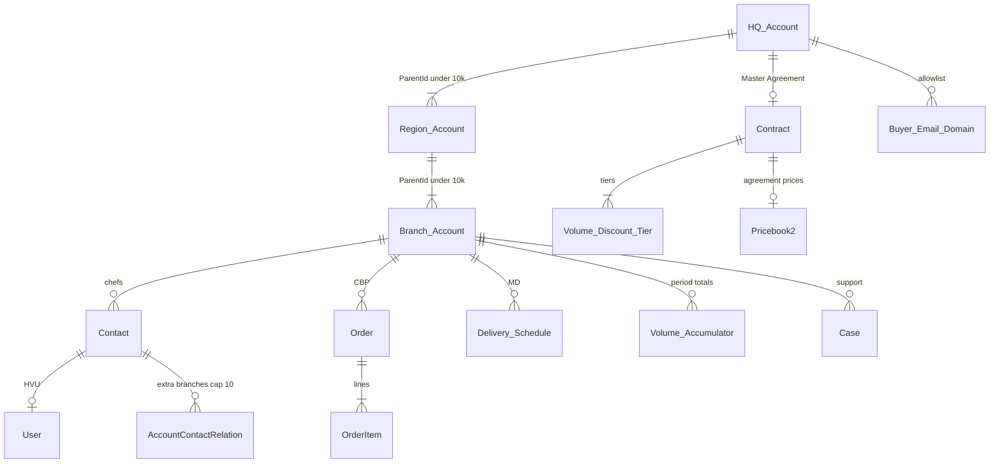

# 1.2 Corporate Ordering

## Salesforce Architecture Design — FreshSource Global (FSG)

**Clouds in scope:** Salesforce Sales Cloud + Service Cloud (Core) + Experience Cloud only  
**Depends on:** 1.1 Supplier Onboarding (same org, **separate** Experience Cloud site and license mix)  
**Platform guidance:** Salesforce Well-Architected; *Designing Record Access for Enterprise Scale* (data skew); Experience Cloud Sharing Sets / Share Groups; External Identity self-registration; Order activation rules.

---

## 1. Designed problem statement

Corporate enterprises (restaurant chains, hotel groups, university dining) sign **multi-year Master Agreements** with FSG. After FSG onboard the enterprise, **store managers and head chefs register themselves** with a **corporate email** and a **branch / store code**. They must land in the correct branch and see **only**:

- that branch’s identity and users
- the **enterprise contracted catalog** (not another chain’s prices)
- **tiered volume discounts / rebates** from the Master Agreement
- **delivery schedules** for that branch

Hard constraints from the FSG operating model:

| Constraint | Design implication |
| --- | --- |
| 1,200 enterprises, ~150,000 branch buyers | **High-volume Customer Community** licenses. Partner/CC+ **roles per branch Account do not scale** (Salesforce role hierarchy ~50,000 roles; 15,000 branches × 1 role = 30% of the org limit for **one** client). |
| One client has **15,000 branches under a single Master Agreement** | **Do not** parent 15,000 Branch Accounts directly to one HQ Account. Salesforce parent-child / lookup skew threshold is **~10,000 children per parent**. |
| “One user in the branch manages other users **only in their branch**” | Access and user-admin scope = **Branch Account**, not HQ. Native Delegated External User Admin requires **CC+/Partner** and still creates a role per Account — not viable at 15k branches. |
| Pre-negotiated catalog + volume tiers | Sales Cloud **Contract + custom Price Book** per agreement. Volume tiers are **not** CPQ (out of scope). |
| 50k+ orders / day org-wide | Large Data Volume design: no roll-up summaries to HQ, async accumulators, Order archive strategy. |
| Same org as suppliers (1.1) | Separate buyer site, profiles, and sharing. Branch buyers must **never** see supplier partner data. |

**Out of this workstream:** supplier onboarding (1.1), Commerce Cloud / B2B Commerce, Revenue Cloud / CPQ, Marketing Cloud.

---

## 2. Architecture decisions (locked)

| Decision | Choice | Why (Salesforce recommendation) |
| --- | --- | --- |
| Identity anchor | **Branch Business Account** → Contact → User | Experience Cloud: start with Account. User.Account is the Sharing Set key. |
| Hierarchy | HQ → **Region** → Branch. Target **fewer than 10,000 children per parent** | *Designing Record Access for Enterprise Scale* / Help: parent-child skew and lookup skew. 15,000 branches → e.g. ~20 Region Accounts × ~750 branches. |
| Master Agreement | Standard **Contract** on the **HQ Account** only | Sales Cloud native multi-year agreement. Branches **do not** look up to that Contract (avoids 15k lookup skew). They store an indexed **Agreement Number** (text/external id) copied at insert. |
| Buyer license | **Customer Community (high volume)** for chefs and branch managers | HVU have **no roles**; Sharing Sets match Account/Contact. Correct model for tens/hundreds of thousands of users. |
| HQ commercial users | Internal Salesforce users (Strategic AM / CS). Optional handful of **CC+** on HQ only if a true HQ portal is required later | Do not put 15k HQ ACR rows on one Account. Regional chefs who cover 2–3 stores use **Contacts to Multiple Accounts** with a hard cap. |
| Branch user admin | **Apex / Flow “Manage Branch Users”** scoped to `User.Contact.AccountId` | Native Delegated External User Administration is **CC+/Partner only** and would create ~15,000 roles for one client. |
| Record access (external) | Sharing Sets on Account, Contact, Case, custom objects. **Order = Controlled by Parent** | Sharing Sets still do **not** include Order. Controlled-by-parent is the documented pattern so Order follows Branch Account access. |
| Contracted catalog / price book | **Apex Catalog Service** (`without sharing` + procedural auth). HVU profile has **no** Product/Price Book CRUD | Sharing Sets cannot walk HQ → Branch. 15k lookups to one Price Book is lookup skew. Procedural control is the Experience Cloud custom access-control model. |
| Volume discounts | Custom `Volume_Discount_Tier__c` on Contract + async `Volume_Accumulator__c` per branch/period | No CPQ. No roll-up summary to HQ (LDV). |
| Delivery schedules | `Delivery_Schedule__c` **Master-Detail to Branch Account** | Branch-scoped; Sharing Set / CBP implicit access. |
| Site | Separate Enhanced LWR site **FSG Corporate Buyer Portal** | Different licenses, self-reg, and guest profile from the Supplier Network (1.1). |
| Self-registration | **Enabled**, Configurable Self-Reg, **email OTP before user create**, domain + store-code handler | Salesforce: if self-reg is required, verify identity first and use the most restrictive profile. 1.1 remains **no** self-reg. |
| OWD | Account/Case **Private** internal + external. Order **Controlled by Parent**. Secure guest user record access **ON** | Least privilege. Guests still have **no** CRM read. |
| Order activation | Internal user or **headless internal automation user** with Activate Orders | Experience Cloud licenses cannot be granted **Activate Orders**. Chefs **Submit**; FSG **Activates**. |

---

## 3. Personas, licenses, and identity

| Persona | Type | License | Scope |
| --- | --- | --- | --- |
| Store chef / buyer | External | Customer Community (HVU) | Own Branch Account: catalog, orders, delivery windows, own-branch Cases |
| Branch manager | External | Customer Community (HVU) + `PSG_Branch_Manager` | Same + **manage users on this Branch Account only** |
| District/regional chef (few) | External | HVU + Contacts to Multiple Accounts (max ~10 branches) | Sharing Set via `Contact.RelatedAccount` |
| Corporate HQ merchandiser | Internal (default) | Salesforce | HQ Contract, price book, 15k branches via internal sharing — **not** the chef portal |
| Strategic Account Manager | Internal | Salesforce | Owns **HQ Account** + Contract |
| Customer Success / Order Ops | Internal | Salesforce (Service) | Regional queues; Omni-Channel on order-issue Cases |
| Guest (register / login pages) | Unauthenticated | Guest | Self-reg form only; no Account list, no catalog, no API |

Identity path (Salesforce standard):

```
User (Customer Community HVU)
  └── Contact (chef / manager at a store)
        └── Account (Corporate_Branch)     ← sharing key
              └── Parent: Corporate_Region
                    └── Parent: Corporate_HQ  (+ Contract / Price Book)
```

Login: **Login Discovery** by corporate email + **MFA**. Optional later: Account-level SSO on HQ (Login Discovery routes by email domain → HQ IdP) for enterprises that bring Okta/Entra.

---

## 4. Experience Cloud site

**Site:** FSG Corporate Buyer Portal (Enhanced LWR)  
**Languages:** EN / ES / PT / FR  
**Do not** reuse the Supplier Network guest profile or self-reg settings.

| Area | Audience | Behavior |
| --- | --- | --- |
| Login / Register | Guest | Configurable Self-Reg; email verification **before** `createUser` |
| Shop / catalog | HVU | LWC → Catalog Apex; prices from the agreement Price Book + volume tier |
| Cart → Order | HVU | Draft Order on **Branch** Account; submit for FSG activation |
| Delivery schedules | HVU | Read (chef) / Read-Write (manager) MD children of Branch |
| Order history | HVU | Orders on this Branch (and RelatedAccount branches if ACR) |
| Manage users | Branch manager PSG | Create/freeze users **only** where Contact.AccountId = manager’s Account |
| Support | HVU | Create Case on Branch Account |
| Knowledge | HVU | Ordering / delivery articles only |

**Guest lockdown** (same bar as 1.1, even with self-reg on):

- No object CRUD on Account, Contact, Order, Product, Price Book, Contract, User
- API Enabled off; public APIs off; Secure guest user record access on
- Portal/Site User Visibility off; Profile Filtering; EPIM
- Self-reg is the **only** extra vs 1.1: most restrictive HVU profile, email OTP, handler enforces domain + store code
- Guest must **not** query 15,000 branches. Store lookup is Apex after domain check, returns **one** match or an error — never a dump

---

## 5. Data model



### 5.1 Account record types (extends 1.1)

| Record type | Purpose | Owner pattern |
| --- | --- | --- |
| `Corporate_HQ` | Legal entity; Master Agreement holder | Strategic AM (one HQ ≪ 10k records) |
| `Corporate_Region` | Skew breaker (~20–50 per mega-client) | Regional CS user |
| `Corporate_Branch` | Store / hotel / campus kitchen — **portal Account** | **Pooled regional “Branch Data Owner” users with no role** (or a single top-level role not used in sharing rules) so 15k branches do not create **ownership skew** on the SAM |
| `Corporate_Buyer` from 1.1 | Retired/merged into HQ | — |

Branch fields (no lookup to HQ Contract or Price Book):

- `Store_Number__c` (unique with Agreement Number)
- `Agreement_Number__c` (text, **External Id**, indexed; copied from HQ Contract.ContractNumber)
- `Price_Book_Key__c` (18-char Id stored as **text**, copied at insert — not a Lookup)
- `Region__c`, `Time_Zone__c`, `Primary_DC__c`, `Ordering_Status__c` (Active / Credit Hold / Closed)
- `ParentId` → Region Account only

HQ fields: `Authorized` domains via child `Buyer_Email_Domain__c` (`Domain__c` unique, e.g. `hotelgroup.com`).

### 5.2 Master Agreement (Contract)

Standard Contract on HQ: Start/End, multi-year, Status Draft → In Approval → Activated, Payment terms, `Price_Book__c` (lookup **here is fine**: one Contract → one Price Book).

Approval Process: discount floor / rebate schedule → Sales leadership.

When Contract activates, Flow:

1. Writes `Agreement_Number__c` + `Price_Book_Key__c` onto all Region + Branch descendants **in chunks, off-peak** (Bulk API / Batch) — Salesforce guidance for skewed-tree updates
2. Opens Corporate Enablement Case for CS
3. Enables self-reg for those email domains (`Buyer_Email_Domain__c.Is_Active__c`)

### 5.3 Catalog, volume, delivery, orders

| Object | Relationship | Why this shape |
| --- | --- | --- |
| `Pricebook2` + `PricebookEntry` | Linked from **Contract only** | One price book per Master Agreement (~1,200), not per branch |
| `Volume_Discount_Tier__c` | Lookup → Contract | Min/Max qty or revenue, `%` or amount, period (per order / MTD / YTD), commodity optional |
| `Volume_Accumulator__c` | Lookup → Branch Account + period | Batch-updated; **not** roll-up summaries |
| `Delivery_Schedule__c` | **MD → Branch** | Day, window, TZ from Branch, DC, dock, min lead hours |
| `Order` + `OrderItem` | Account = Branch; ContractId set in Apex from Agreement Number query | Standard Sales Cloud order capture |
| `Buyer_Email_Domain__c` | Lookup → HQ | Registration allowlist (dozens of rows per HQ, not 15k) |

**Why not Product2 list views for chefs:** Product Read on an HVU profile plus any usable price book tends to leak assortment. HVU get **no** Product/Price Book object permissions; the shop LWC only shows DTOs from Catalog Apex.

**Why not MD catalog rows per branch:** 15,000 × ~2,000 SKUs ≈ 30M rows. Unnecessary when the catalog is enterprise-scoped.

### 5.4 Contacts to Multiple Accounts

A chef covering two kitchens: Contact stays on **home** Branch; `AccountContactRelation` to the second Branch (`IsActive`). Sharing Set mapping **Contact.RelatedAccount** grants Order/Case/Delivery access on related branches (Salesforce Sharing Set capability).

Validation: max 10 ACR per Contact; both Accounts must share `Agreement_Number__c` (no cross-enterprise).

---

## 6. End-to-end process (step by step)

### Phase A — Internal: sell and activate the Master Agreement

1. Strategic AM creates Opportunity (record type Corporate Agreement) on **HQ Account**.
2. Assignment: Opportunity assignment rule or Omni-Channel Flow → regional Strategic AM (existing owner if already named).
3. Negotiate; build **custom Price Book** (contracted SKUs/prices) internally. Products are FSG sellable items (later mappable from 1.1 supplier SKUs).
4. Create **Contract** (Master Agreement) on HQ; attach tiers (`Volume_Discount_Tier__c`); submit **Approval Process**.
5. On Activated: Batch stamps Agreement Number + Price Book key onto the Region/Branch tree; activate email domains; CS Enablement Case (Omni-Channel, skill = enterprise onboarding).

### Phase B — Internal: load 15,000 branches without skew

6. Integration (ERP / store master) upserts Branch Accounts:
   - `ParentId` = correct **Region** (round-robin regions so none approach 10k children)
   - Owner = regional Branch Data Owner **without a role** (Help: if a user must own more than 10k records, they should have **no role**, or a **top-level role not used in sharing rules**, and never be moved)
   - For 15k branches, prefer **~20 owners × ~750 accounts** (under the 10k ownership-skew line)
7. Seed default `Delivery_Schedule__c` per Branch from DC templates (batch).
8. Do **not** create 15,000 Contacts “for every possible chef” in advance. Contacts are created at registration (avoids Contact skew under a branch and unused licenses).

### Phase C — External: corporate-email self-registration

9. Chef opens Register. Salesforce sends **email OTP** (Configurable Self-Reg). User is **not** created until verification succeeds.
10. Form fields: name, corporate email, **store number**, optional employee id, password.
11. `Auth.ConfigurableSelfRegHandler.createUser`:
    1. Reject consumer domains (gmail, etc.) unless HQ explicitly allowlisted (none should be).
    2. Match `Buyer_Email_Domain__c` where Domain = email domain and `Is_Active__c` and HQ Contract Status = Activated.
    3. Match Branch: `Store_Number__c` + `Agreement_Number__c` of that HQ (indexed). **Exactly one** row.
    4. If mismatch: do **not** create a dummy Account. Insert a **Registration_Reject__c** (or Case) for CS; return a generic error (“We could not match that store. Contact your manager.”).
    5. Duplicate: existing Contact with that email on that Branch → enable Customer User if inactive; never attach to another enterprise.
    6. Insert Contact on **Branch Account**; `Site.createExternalUser` / User with Customer Community license, profile `FSG Branch Buyer`, locale/TZ from Branch.
    7. If Branch has zero users with `PSG_Branch_Manager`, assign manager PSG to the first verified user **or** require a registration code from CS for manager vs chef (safer: CS flags `Next_User_Is_Manager__c` on Branch, or manager is invited by CS). **Recommended default:** first user = manager only when `Branch.Allow_First_User_Manager__c` is set by CS during enablement; otherwise all self-reg users get chef PSG and the named manager is **invited** by CS (prevents a random chef becoming the branch admin).
12. Login Flow: MFA, terms, confirm delivery address.

### Phase D — Order against contracted catalog

13. Shop LWC calls `BuyerCatalogService` (`without sharing`):
    - Resolve running User → Contact → Branch
    - Require `Ordering_Status__c = Active`
    - Load PricebookEntry for `Price_Book_Key__c` (bind variable, selective query)
    - Load applicable `Volume_Discount_Tier__c` for the Contract Number + current `Volume_Accumulator__c`
    - Return DTO (SKU, name, UOM, unit price, estimated tier %). Never return other agreements’ price books
14. Cart → insert **Draft** Order: `AccountId = Branch`, `BillTo/ShipTo` from Branch, `Pricebook2Id` set in system mode, `ContractId` queried by Agreement Number (not stored as a Branch lookup).
15. OrderItems from DTO; unit prices **must** match PricebookEntry (validation in Apex; chefs cannot type arbitrary prices).
16. Chef **Submits** (`Submitted_For_Activation__c`). Flow:
    - Recalculate tier using current accumulator + this order qty
    - Owner → regional **Order Ops queue** (internal)
    - Sharing Set / CBP still lets the Branch HVUs see the Order
17. Internal user (or automation running as Salesforce license) sets Status to an **Activated** category value. Warehouse fulfills. Chefs cannot activate (no permission on the license).
18. Nightly batch: sum Activated OrderItems → `Volume_Accumulator__c`; if rebate is period-end, create `Rebate_Accrual__c` and a CS Case — **not** a roll-up on HQ.

### Phase E — Branch user administration

19. Branch manager opens Manage Users (custom LWR page).
20. Apex `with sharing` + **procedural** check: target Contact.AccountId == manager AccountId (and same Agreement Number). Create/freeze/reset password for `FSG Branch Buyer` profile only. Cannot assign internal profiles, cannot touch other branches, cannot change Agreement fields.
21. This replaces native Delegated External User Admin at this volume (Salesforce: that permission is for **Partner / Customer Community Plus**).

### Phase F — Support and assignment

22. Order/delivery Case: `AccountId = Branch`, Omni-Channel Flow skills = Region + Language + Order Ops. Same 14-timezone pattern as 1.1 (regional queues + presence).
23. Credit hold: CS sets Branch `Ordering_Status__c = Credit Hold`; Catalog Apex refuses new carts.

---

## 7. Sharing model

### 7.1 Organization-wide defaults

| Object | Internal | External | Notes |
| --- | --- | --- | --- |
| Account | Private | Private | HQ / Region / Branch / Supplier all Private |
| Contact | Controlled by Parent | Controlled by Parent | |
| Contract | Private | Private | External users **no** object access; Apex reads in system mode after Branch auth |
| Price Book | View Only | View Only | HVU profile still **no** object permission |
| Product2 | Public Read Only internal typical | Private / no HVU FLS | Catalog Apex only |
| Order | **Controlled by Parent** | **Controlled by Parent** | Follows Branch Account; Sharing Sets omit Order |
| OrderItem | Controlled by Parent | Controlled by Parent | |
| Case | Private | Private | Sharing Set: Case.Account = User.Account |
| `Delivery_Schedule__c` | CBP | CBP | MD → Branch |
| `Volume_Accumulator__c` | Private | Private | Sharing Set by Branch Account |
| `Volume_Discount_Tier__c` | Private | Private | No HVU CRUD; Apex only |
| User | Private | Private | EPIM; no site user visibility |

### 7.2 Sharing Sets (HVU — primary external model)

One Sharing Set on profiles `FSG Branch Buyer` and `FSG Branch Manager`:

| Object | User mapping | Target mapping | Access |
| --- | --- | --- | --- |
| Account | User.Account | Account.Id | Read (Manager: Read/Write on limited fields via FLS, not via sharing) |
| Contact | User.Account | Contact.Account | Read; Manager Read/Write |
| Case | User.Account | Case.Account | Read/Write |
| `Delivery_Schedule__c` | User.Account | Account (parent) | Chef Read; Manager Read/Write |
| `Volume_Accumulator__c` | User.Account | Account | Read |
| Account (related) | Contact.RelatedAccount | Account.Id | Read (multi-location chefs) |
| Case / Delivery on related | Contact.RelatedAccount | Account | Read/Write or Read as above |

Sharing Sets **do not** grant HQ, other enterprises, or supplier Accounts.

**Share Group** on this Sharing Set: Public Group `FSG_Order_Ops_Internal` + `FSG_CS_Internal` so HVU-owned Draft Cases/Orders are visible internally **before** owner is moved to a queue. After submit, Order owner is the queue; queue membership + CBP is enough.

### 7.3 Internal sharing (do not explode rules)

Salesforce caps criteria-based sharing rules (~50 default / ~300 max per object). **Do not** create one rule per enterprise.

| Mechanism | Rule |
| --- | --- |
| Role hierarchy | SAM owns **HQ only**. Sees HQ + implicit children **only where Salesforce implicit parent sharing applies** — do **not** rely on implicit sharing across 15k branches (that **is** the skew problem). |
| Criteria sharing (few rules) | `RecordType = Corporate_Branch` AND `Region__c = NA` → `NA_Customer_Success` Read/Write. Repeat LATAM/EMEA. Same pattern as 1.1 Q&C. |
| Account Teams | SAM on HQ; named CS on strategic Regions |
| Restriction rules | CS `User.Region__c` must equal `Account.Region__c` |
| Contract | Owner = SAM; criteria: Contract.Region / HQ Region → CS Read |

Supplier criteria rules from 1.1 already key off **supplier record types**. Buyer rules key off **corporate record types**. The two populations never share via the same rule.

### 7.4 Why Partner roles are rejected here

Enabling CC+ or Partner on each Branch Account creates an **external role per Account**. One 15,000-location client would add 15,000 roles; ~150,000 branches org-wide would exceed the **50,000 role** limit and destroy sharing performance (Help: *Best Practices for Optimizing Sharing Performance* — reduce partner/customer roles to **one** when possible, and avoid role explosion). HVU + Sharing Sets is the Well-Architected choice.

### 7.5 Guest

**No guest sharing rules.** Registration handler is the only write path. Catalog is not public.

---

## 8. Security

1. **Object:** HVU = Orders C/R/E (not Delete, not Activate), Cases C/R/E, Account Read, Delivery C/R/E for manager. No Contract, no Product, no Price Book, no Setup.
2. **Record:** Sharing Sets + CBP Orders + Agreement Number check inside Apex (defense in depth: even if a chef passes another branch’s Id, Apex compares `Agreement_Number__c` **and** AccountId membership / ACR).
3. **FLS:** Hide cost, rebate internals, credit notes on Account; chefs see unit price and estimated discount only.
4. **Registration:** Email OTP; domain allowlist; store-code match; generic errors (no account enumeration); rate limit; reCAPTCHA; most restrictive profile.
5. **User admin Apex:** CRUD on User only for Customer Community profiles; `with sharing` plus explicit AccountId equality; log to `Branch_User_Audit__c`.
6. **MFA** for all HVU and internal.
7. **SOQL injection:** bind variables on store number, domain, price book id.
8. **Credit / PII:** encrypt payment fields if stored; prefer tokenized payment off-platform. Tax/VAT on Branch encrypted as in 1.1.
9. **Cross-site:** Buyer profile is **not** a member of the Supplier site (and vice versa).

---

## 9. Assignment of records

| Record | Assigned to | How |
| --- | --- | --- |
| Opportunity / HQ Account | Strategic AM | Assignment rules or Omni Flow by Region |
| Contract | SAM (owner) | Same as HQ |
| Enablement Case | CS Omni queue | Skills: Corporate Onboarding + Language |
| Branch Account | Regional Branch Data Owner (no role / pooled) | Integration mapping by Region; **never** all 15k on the SAM |
| Draft Order | Creating HVU | Until submit |
| Submitted Order | Regional **Order Ops queue** | Record-triggered Flow; optional Omni on Order if used as a work item |
| Activated Order | Ops / remains queue or warehouse user | Internal **Activate Orders** permission |
| Order issue Case | CS Omni | Region + Language; 14-timezone presence / regional business hours (same as 1.1) |
| Failed self-reg | CS queue | Case/reject log; no orphan Accounts |

---

## 10. Scale (15,000 branches and 50k orders/day)

Follow Trailhead *Large Data Volumes* and Help *Sharing Performance*:

- Keep **fewer than 10,000** child records per parent Account and per owner.
- **No** roll-up summaries from Order → Branch → HQ.
- Volume totals = **Batch Apex** into skinny `Volume_Accumulator__c`.
- Selective queries: `Store_Number__c` + `Agreement_Number__c` composite unique index; Order list views filtered by AccountId (Sharing Set/CBP already scopes HVU queries).
- Archive Activated Orders to **Big Object** or external warehouse after the rebate retention window (e.g. 24 months).
- Price book updates: change **Contract/HQ** price book off-peak; Branch stores only a text key so 15k Branch rows are **not** locked when a PBE changes.
- Account hierarchy UI displays a limited number of nodes — ops use **list views / reports**, not the hierarchy component, for mega-clients.

---

## 11. Automation catalog (declarative first)

| Automation | Type | Purpose |
| --- | --- | --- |
| Configurable Self-Reg Handler | Apex | Domain + store match; create HVU |
| BuyerCatalogService / SubmitOrder | Apex | Contracted prices, anti-IDOR, set Pricebook2Id/ContractId |
| ManageBranchUsers | Apex + LWC | Branch-scoped user admin |
| Contract_Activated | Record-triggered + Batch | Stamp keys, enable domains |
| Order_Submitted | Record-triggered Flow | Queue assignment, accumulator increment (async) |
| Volume_Accumulator_Nightly | Scheduled Batch | Tiers / rebates |
| Order_Issue_Omni | Omni-Channel Flow | CS routing |
| Agreement_Approval | Approval Process | Commercial governance |
| Login Flow | Login Flow | MFA, terms, TZ |

---

## 12. Coexistence with 1.1

| Topic | 1.1 Suppliers | 1.2 Corporate buyers |
| --- | --- | --- |
| Site | FSG Supplier Network | FSG Corporate Buyer Portal |
| External license | Partner Community (~8k Accounts, **one role each**) | Customer Community HVU (~150k users, **zero extra roles**) |
| Self-registration | **Off** | **On** (OTP + domain + store) |
| Catalog | Supplier-owned MD SKUs | Agreement Price Book via Apex |
| Isolation | Farm A ≠ Farm B via partner role | Branch A ≠ Branch B via Sharing Set; Enterprise A ≠ B via Agreement Number + domain |

Internal role tree stays shallow: add **Strategic AM** and **Customer Success / Order Ops** under each regional Operations node from 1.1. Do not hang 15k buyer roles under those nodes.

---

## 13. Implementation sequence

1. Record types, Contract fields, Agreement Number external id, email-domain object, delivery + volume objects, indexes.
2. OWD / CBP Orders / Sharing Set + Share Group / regional criteria rules / restriction rules / pooled Branch owners.
3. Price Book + Contract approval + batch stamp job.
4. Buyer LWR site, guest lockdown, Configurable Self-Reg + handler, Login Flow, MFA.
5. Catalog/Order Apex, submit Flow, activate-order ops permission on internal PSG.
6. Branch manager user-admin LWC; ACR cap; credit-hold gate.
7. Omni-Channel for enablement and order-issue Cases; nightly accumulator.
8. UAT: (a) `@competitor.com` cannot register; (b) `@hotel.com` + wrong store fails with no user; (c) chef on Branch 1 cannot open Branch 2 Order by Id unless ACR; (d) chef cannot load another chain’s price book Id; (e) manager can freeze only same-branch users; (f) SAM does not own 15k branches; (g) guest Aura/API cannot list Accounts; (h) HVU cannot activate Order.

---

## 14. Salesforce documentation mapped to this design

| Topic | Guidance used |
| --- | --- |
| Account as portal anchor | Experience Cloud: Start with Accounts |
| HVU + Sharing Sets / Share Groups | Help / Trailhead: Experience Cloud sharing; Platform Sharing Architecture |
| No Order in Sharing Sets | Use **Controlled by Parent** so Order follows Account access |
| Parent-child and ownership skew (~10k) | *Designing Record Access for Enterprise Scale*; Help: Sharing performance |
| Role explosion | Help: reduce Experience Cloud roles to one; 50k role ceiling |
| Delegated External User Admin licenses | Partner / CC+ only — not HVU |
| Self-reg + email verification | ConfigurableSelfRegHandler; External Identity guide |
| Guest hardening | Same 1.1 / Salesforce Security guest-user actions |
| Activate Orders | Internal Salesforce license permission; chefs submit only |
| LDV / no skewed RSF | Trailhead: Large Data Volumes |

---

## 15. Final outcome (brief)

- Enterprises are **HQ Accounts** with a Sales Cloud **Contract** (Master Agreement) and **one contracted Price Book**; self-reg domains turn on only after Contract activation.
- **15,000 branches never hang off one parent or one owner**: HQ → Region → Branch keeps every parent and owner **under 10,000** children (Salesforce skew limit).
- Chefs/managers are **Customer Community (HVU)** users on the **Branch Account** (Sharing Sets). Partner/CC+ roles are **not** used per store, so a mega-client cannot blow the role limit.
- Registration is **corporate email OTP + domain allowlist + store number**; no user, and no dummy Account, on mismatch.
- Branch isolation: Sharing Sets + **Orders Controlled by Parent**. The shop cannot use Product list views; **Apex** serves only that agreement’s price book and volume tiers (no 15k lookups to HQ/Contract/Price Book).
- Volume rebates use **async accumulators**, not roll-ups to HQ (safe at 50k orders/day).
- Delivery windows are **MD on the Branch**; times use the branch time zone / DC.
- Branch managers manage users **only on their Branch** via **scoped Apex** (native delegated admin does not scale on HVU).
- Chefs **submit** Draft Orders; **FSG internal users activate** (Experience Cloud cannot get Activate Orders). Ops get work via **queues + Share Groups + Omni-Channel Cases**.
- Buyer portal is a **separate LWR site** from suppliers; guest APIs stay off; MFA on; restriction rules keep CS regional.
