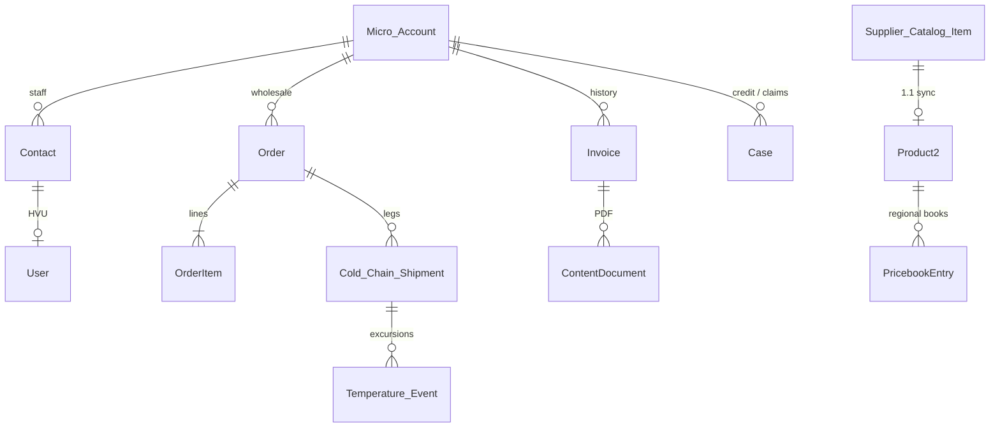

# 1.3 Micro-Buyer Registration

## Salesforce Architecture Design — FreshSource Global (FSG)

**Clouds in scope:** Salesforce Sales Cloud + Service Cloud (Core) + Experience Cloud only  
**Depends on:** 1.1 Supplier Onboarding (regional produce supply) and 1.2 Corporate Ordering (buyer portal, HVU sharing, Order submit/activate)  
**Platform guidance:** Salesforce Well-Architected (Account as identity/access anchor); Experience Cloud Sharing Sets / Share Groups; External Identity self-registration; *Designing Record Access for Enterprise Scale* (do **not** park all registrants under one Account); guest-user hardening.

---

## 1. Designed problem statement

Independent caterers, cafés, and food-truck operators (**Direct B2B Micro-Buyers**) must **register themselves** on FSG’s wholesale portal, then:

- browse **available regional produce** (what FSG can sell in their DC/region **today**, at wholesale — not another region’s list, not another chain’s contracted book, not raw supplier farm records)
- place **one-off wholesale Orders**
- **track cold-chain deliveries** (status + temperature-exception visibility)
- **view historical invoices** (and PDFs)

They are **not** under a Master Agreement (that is 1.2). They are **not** suppliers (that is 1.1).

| Constraint | Design implication |
| --- | --- |
| Open registration (no corporate domain / store code) | Self-reg **is** required, but guest must still have **zero** CRM/catalog read. Email OTP before user create. |
| One business ≠ one shared “Registrants” Account | Trailhead’s single default Account is an **anti-pattern** here: Sharing Sets would show every caterer every other caterer’s orders. **One Business Account per micro-buyer.** |
| Wholesale B2B, often 1–3 people per business | **Business Account + Contact + HVU**, not Person Accounts (org already uses **Partner Community** for farms; Person Accounts complicate that mix and block a second user). |
| Regional assortment | Catalog is **DC/region-scoped**, not per-Account. Sharing Sets cannot express “all products in my region.” **Apex Catalog Service** (same pattern as 1.2) filtered by `Account.Primary_DC__c` / `Region__c`. |
| Cold-chain tracking without Order Management / Field Service | Those add-ons are **out of scope**. Custom `Cold_Chain_Shipment__c` (+ optional temp events) on Sales/Service Cloud. |
| Invoices without Salesforce Billing | Core Sales Cloud has **no** standard Invoice for Experience Cloud. Custom `Invoice__c` + Files. |
| Same org as 1.1 / 1.2 | Same buyer LWR site; **different** registration path, record type, price-book resolver, and credit gate. |

**Out of this workstream:** Commerce Cloud, Order Management invoices/fulfillment orders, Revenue Cloud, Field Service, supplier onboarding, corporate master agreements.

---

## 2. Architecture decisions (locked)

| Decision | Choice | Why (Salesforce recommendation) |
| --- | --- | --- |
| Identity anchor | **One `Micro_Buyer` Business Account per business** → Contact → User | Experience Cloud: start with Account. Sharing Sets match User.Account. |
| Person Accounts | **Do not enable** | Micro-buyers are wholesale B2B; a helper/driver may need a second user. Partner licenses (1.1) cannot use Person Accounts. |
| Default self-reg Account | **None.** Handler **creates** a new Account | Salesforce UI offers a default Account for all registrants. That causes **parent-child skew** and **cross-customer data leakage** via Sharing Sets. |
| License | **Customer Community (HVU)** | Same as 1.2 chefs: tens of thousands of small buyers; no role per Account. Sharing Sets are sufficient when everyone at the café sees the same orders/invoices. |
| Second user at the café | HVU + Sharing Set (same Account). Optional `PSG_Micro_Owner` + the 1.2 **Manage Branch Users** Apex (AccountId equality) | Native Delegated External User Admin is CC+/Partner only. Do not switch the whole population to CC+ just for this. |
| Site | **Same** Enhanced LWR **FSG Corporate Buyer Portal**, second register path **Independent wholesale** | One login/MFA/catalog shell. Corporate handler (domain + store) vs micro handler (new Account) must stay separate. |
| Self-registration | Configurable Self-Reg **or** custom LWC Flow; **email OTP first**; most restrictive HVU profile | Salesforce guest guidance: verify before create; never grant guest object CRUD. |
| Browse vs buy | After login: **browse** regional catalog. **Checkout** only if `Ordering_Status__c = Active` | Open self-reg is a scraping/fraud vector. KYC/credit Case before first paid order. |
| Regional catalog | Product2 + **regional/DC Price Books** populated from 1.1 approved SKUs. HVU **no** Product/Price Book FLS. Apex resolver. | Shared catalog is not Account-owned. Procedural access control (Experience Cloud Developer Guide). |
| Orders | Standard Order on the Micro Account. **Controlled by Parent** (aligned with 1.2). Add Order to Sharing Set **if** the org’s Sharing Set picker includes Order | Help lists Order on Sharing Sets in current docs; CBP remains the reliable parent-access model. Chefs/micro-buyers **cannot Activate Orders**. |
| Cold-chain | `Cold_Chain_Shipment__c` Lookup → Order + Account | Buyer Read via Sharing Set on Account. Internal logistics Read/Write. |
| Invoices | `Invoice__c` Lookup → Account + Order; PDF as File | Sharing Set Read. Generated on activation/delivery by Flow. |
| OWD | Account/Case/Invoice/Shipment **Private** external. Order **CBP**. Secure guest user record access **ON** | Least privilege; no guest sharing rules. |
| Account ownership | Round-robin **regional Inside Sales** owners; **fewer than 10,000** (ideally ≪ 50,000) portal users per owner | Salesforce: max **50,000** customer/partner users per Account owner; ownership skew ~10,000 records. |

---

## 3. Personas, licenses, and identity

| Persona | Type | License | What they do |
| --- | --- | --- | --- |
| Micro-buyer (owner / chef) | External | Customer Community (HVU) | Register, browse regional catalog, submit orders, track shipments, read invoices |
| Café helper (optional) | External | HVU on **same** Account | Same record access via Sharing Set |
| Guest | Unauthenticated | Guest | Register/login pages only |
| Inside Sales / Micro-Buyer AM | Internal | Salesforce | Owns the Account; credit/KYC; commercial follow-up |
| Order Ops / Cold-chain logistics | Internal | Salesforce | Activate orders; update shipments; temp excursions |
| Q&C (from 1.1) | Internal | Salesforce | Temp-excursion Cases (perishable compliance) |
| Finance ops | Internal | Salesforce | Invoice generation / disputes |

```
User (Customer Community HVU)
  └── Contact
        └── Account (Micro_Buyer)   ← sharing key, no HQ parent
```

Login: **Login Discovery** by email + **MFA**. No corporate SSO expected (food trucks). Time zone from Account (delivery tracking display).

**Do not** enable these users on the Supplier Network site.

---

## 4. Experience Cloud site

Reuse **FSG Corporate Buyer Portal** (Enhanced LWR). Add an **Independent business** registration entry (separate Screen Flow + Apex). Do **not** run the 1.2 domain/store handler for these users.

| Area | Audience | Behavior |
| --- | --- | --- |
| Register — Independent | Guest | Business name, tax id, address, region, email, phone, reCAPTCHA; OTP |
| Shop | HVU | Regional wholesale catalog (Apex); no prices until logged in |
| Cart / Order | HVU | Draft Order; submit blocked if credit pending/hold |
| Track delivery | HVU | Path on shipment: Packed → In transit (cold) → Out for delivery → Delivered; excursion banner |
| Invoices | HVU | List + PDF download (Files they can see via parent Invoice) |
| Support | HVU | Case on their Account |
| Knowledge | HVU | Ordering, packing, claims |

**Guest lockdown** (unchanged bar from 1.1/1.2):

- No CRUD on Account, Contact, Order, Product, Price Book, Invoice, Shipment, User
- APIs off; Secure guest user record access on; no guest sharing rules
- Self-reg Flow + one Apex class only
- Catalog is **not** public — “register to browse” means **authenticated** browse

---

## 5. Data model



### 5.1 Account (`Micro_Buyer` record type)

Reserved in 1.1; now used.

- `Region__c`, `Primary_DC__c`, `Time_Zone__c`, `Country__c`
- `Ordering_Status__c`: `Pending_KYC` → `Active` → `Credit_Hold` / `Closed`
- `Tax_Id__c` (encrypted)
- `Price_Book_Key__c` (text, copied from Custom Metadata **DC/Region → wholesale Price Book**, not a lookup — keeps catalog updates from locking all buyer Accounts)
- `Business_Type__c`: Café / Caterer / Food Truck / Other
- **No** ParentId to a dummy “All Micro-Buyers” Account
- **No** Contract/Master Agreement required to browse or (after KYC) to buy

### 5.2 Catalog (bridge from 1.1)

Merchandising Flow/Batch (internal):

1. Approved `Supplier_Catalog_Item__c` + in-season + matching DC pickup → upsert `Product2` (FSG sellable SKU, origin text, temperature class).
2. Maintain **one Price Book per DC** (or per Region if assortment is identical): `PB_Wholesale_{DC}`.
3. `PricebookEntry` = wholesale list (or FSG margin price). Not the 1.2 contracted book.
4. Availability: `Regional_Availability__c` (Product + DC + qty/window) **or** a checkbox `Is_Orderable__c` on PBE. Apex filters `IsActive` + availability + buyer DC. Buyers never query supplier Accounts.

Corporate chefs (1.2) keep calling Catalog Apex with **agreement** price-book key. Micro-buyers call the same service with **DC wholesale** key. Record type selects the resolver. One LWC.

### 5.3 Order, shipment, invoice, case

| Object | Role |
| --- | --- |
| `Order` / `OrderItem` | One-off wholesale capture. `AccountId` = Micro Account. `Pricebook2Id` set in system mode. `Type` = Wholesale / Micro. |
| `Cold_Chain_Shipment__c` | `Account__c`, `Order__c`, `Status__c`, `Carrier__c`, `Tracking_Number__c`, `Temp_Class__c`, `Last_Recorded_Temp__c`, `Has_Excursion__c`, `ETA__c`. Updated by logistics integration user. |
| `Temperature_Event__c` | Child of shipment (time, temp, location). Buyer sees **Read** on excursion flag + last temp; FLS hides raw logger payloads if needed. |
| `Invoice__c` | `Account__c`, `Order__c`, `Invoice_Number__c` (unique), `Invoice_Date__c`, `Amount__c`, `Status__c` (Open/Paid/Void). File PDF linked to Invoice. |
| `Case` | Record types: `Micro_KYC`, `Order_Issue`, `Cold_Chain_Excursion`, `Invoice_Dispute`. |

Do **not** use Salesforce Order Management `FulfillmentOrder` / OM `Invoice` unless FSG later buys that product.

---

## 6. End-to-end process (step by step)

### Phase A — Register (guest → HVU)

1. Independent operator opens **Register as a wholesale buyer**.
2. Email **OTP** (Configurable Self-Reg). No User row until verified (Salesforce: reduces dummy users).
3. Screen Flow collects legal name, tax id, street, city, country, region, business type, phone.
4. Apex handler (`without sharing`, no guest CRUD):
   - reCAPTCHA + file/field validation.
   - **Duplicate rules:** email exact; tax id exact; name + postal code fuzzy. If match on an existing `Micro_Buyer` Account/Contact: attach User to **that** Contact if email matches; otherwise reject to CS (do not silently merge competing businesses).
   - **Never** insert under a shared Registrants Account.
   - Insert `Micro_Buyer` Account (`Ordering_Status__c = Pending_KYC`), Contact, HVU (`FSG Micro Buyer` profile).
   - Stamp `Primary_DC__c` from country/postal Custom Metadata; stamp `Price_Book_Key__c`.
   - Round-robin **Account Owner** = regional Inside Sales user (cursor table per region; keep portal-user counts per owner well under 50,000).
   - Insert Case `Micro_KYC` (New) linked to Account.
5. Welcome email + MFA enrollment Login Flow. Guest session ends.

### Phase B — KYC / credit (assignment)

6. Omni-Channel Flow routes `Micro_KYC` to regional **Inside Sales / Credit** queue (skills: Region, Language). Same 14-timezone presence model as 1.1/1.2.
7. Officer verifies business, tax id, delivery address vs DC service area. Approve → `Ordering_Status__c = Active`. Reject / fraud → freeze User, status Closed.
8. **Browse is allowed in `Pending_KYC`** (meets “register to browse”). **Add to cart / submit** requires `Active` (validation in Catalog/Submit Apex).

### Phase C — Browse regional produce

9. Shop LWC → `BuyerCatalogService` (extend 1.2):
   - Resolve User → Micro Account → `Price_Book_Key__c` + DC.
   - Query PBE + availability for **that** book only.
   - Reject any price-book Id the client tampers in the request.
   - Do not return supplier Account Ids; origin name as text is OK for farm-to-table.
10. LATAM user cannot load an EMEA wholesale book. Corporate user cannot call the micro resolver for a DC book they are not entitled to (record type gate).

### Phase D — Place wholesale order

11. Draft Order on the Micro Account; prices must match PBE; temperature class on lines drives shipment planning.
12. Submit → Flow: owner = regional **Order Ops** queue; status Submitted. HVU still sees the Order (CBP + Sharing Set).
13. Internal **Activate Orders** (Experience Cloud cannot). Warehouse packs by temp class; Flow creates `Cold_Chain_Shipment__c` (Account + Order stamped).

### Phase E — Track cold-chain delivery

14. 3PL/integration user updates shipment status and last temp (Named Credential / inbound integration user with a tight permission set — not the guest profile).
15. Buyer portal: Path + tracking number + ETA in **Account time zone**.
16. If temp out of range: set `Has_Excursion__c`; Flow opens Case `Cold_Chain_Excursion` → Omni to **Q&C + Logistics** (1.1 perishable skills). Notify buyer (Experience Cloud notification / email). Buyer **cannot** edit the shipment.

### Phase F — Historical invoices

17. On Activated (or Delivered — FSG policy): Flow creates `Invoice__c`, generates PDF (standard document generation or Visualforce/Flow PDF), attaches File, sets Invoice Number.
18. Portal **Invoices** list (Sharing Set). Read only. Dispute → Case `Invoice_Dispute` → Finance/CS Omni.
19. Archive old Orders/Invoices per LDV practice (same 50k orders/day org concern as 1.2); portal queries stay Account-scoped.

### Phase G — Optional second user

20. Account owner (micro) with `PSG_Micro_Owner` uses the same **Manage users** Apex as 1.2: target Contact.AccountId must equal running user’s AccountId. Profile `FSG Micro Buyer` only.

---

## 7. Sharing model

### 7.1 Organization-wide defaults

| Object | Internal | External | Notes |
| --- | --- | --- | --- |
| Account | Private | Private | Micro vs Corporate vs Supplier isolated by record type + rules |
| Contact | CBP | CBP | |
| Order | **CBP** | **CBP** | Follows Micro Account |
| Case | Private | Private | Sharing Set |
| `Cold_Chain_Shipment__c` | Private | Private | Sharing Set via `Account__c` |
| `Temperature_Event__c` | CBP / Private | CBP if MD to shipment | Prefer MD → Shipment |
| `Invoice__c` | Private | Private | Sharing Set Read |
| Product / Price Book | Internal merchandising | **No HVU object access** | Apex only |
| User | Private | Private | EPIM; site user visibility off |

### 7.2 Sharing Sets (extend the 1.2 buyer Sharing Set)

Add profile `FSG Micro Buyer` (and `FSG Micro Owner`) to the **same** Sharing Set used for branch chefs **or** a clone if FLS differs. Mappings:

| Object | User | Target | Access |
| --- | --- | --- | --- |
| Account | User.Account | Account | Read |
| Contact | User.Account | Contact.Account | Read (Owner Read/Write) |
| Case | User.Account | Case.Account | Read/Write |
| Order (if listed) | User.Account | Order.Account | Read/Write |
| `Invoice__c` | User.Account | Account | Read |
| `Cold_Chain_Shipment__c` | User.Account | Account | Read |

Café A cannot see Café B: different Accounts, Private OWD, no criteria sharing to external users.

**Share Group:** same internal `FSG_Order_Ops_Internal` / `FSG_CS_Internal` as 1.2 so HVU-owned Cases (and Draft Orders if still HVU-owned) are visible before queue take-up.

### 7.3 Internal sharing

Do **not** add a sharing rule per micro-buyer.

| Mechanism | Rule |
| --- | --- |
| Role hierarchy | Inside Sales owner sees **their** Micro Accounts (distributed ownership) |
| Criteria sharing | `RecordType = Micro_Buyer` AND `Region__c = NA` → `NA_Inside_Sales` / CS Read/Write (LATAM/EMEA copies) |
| Restriction rules | User region = Account region (same defense in depth as 1.1/1.2) |
| KYC Case | Omni owner + regional CS group |
| Shipment | Criteria: Region → Logistics public group Read/Write |

Supplier and corporate criteria rules already filter on **their** record types. Micro rules must use `Micro_Buyer` only.

### 7.4 Guest

**No guest sharing rules.** No public product list. Registration Apex creates the Account in system context and assigns ownership immediately (guests cannot own records).

### 7.5 Why not one “Registrants” Account

Salesforce self-reg setup screens invite a **default Account**. If every food truck were a Contact on `Account = Registrants`:

- Sharing Set User.Account = Order.Account would show **all** micro-buyer orders to **all** micro-buyers
- Contact volume on one parent would exceed the **~10,000** parent-child skew line immediately
- Account owner would hit the **50,000 portal users per owner** limit

Each business **must** be its own Account. The handler ignores any default Account Id passed by the site configuration.

---

## 8. Security

1. **Object:** HVU Create/Read/Edit Order (not Delete, not Activate); Read Invoice/Shipment; Create Case; Read own Account. No Product, Price Book, Contract, Supplier objects.
2. **Record:** Sharing Sets + CBP Orders + Apex checks (`AccountId` = running user’s Account).
3. **FLS:** Hide internal cost, logistics notes, logger payloads; show last temp + excursion.
4. **Open self-reg abuse:** OTP, reCAPTCHA, rate limit, duplicate rules, KYC before checkout, generic errors (no “that tax id belongs to …”).
5. **Catalog IDOR:** ignore client price-book Id; always use server-side `Price_Book_Key__c`.
6. **MFA** for HVU; session timeout appropriate for mobile food-truck use.
7. **Files:** Invoice PDFs owned by automation user, linked to Invoice; HVU access via parent record, not a public library.
8. **Integration user** for carrier updates: IP/Named Credential, only shipment fields, no Setup.
9. **Cross-audience:** Micro profile is not a member of the Supplier site; Catalog Apex returns wholesale DC books only for `Micro_Buyer`.

---

## 9. Assignment of records

| Record | Assigned to | How |
| --- | --- | --- |
| New Micro Account | Regional Inside Sales (round-robin) | Handler + `Round_Robin_Cursor__c` |
| `Micro_KYC` Case | Credit/Inside Sales Omni queue | Region + Language skills |
| Draft Order | Creating HVU | Until submit |
| Submitted Order | Regional Order Ops queue | Record-triggered Flow |
| Activated Order | Ops / warehouse | Internal Activate Orders |
| `Cold_Chain_Shipment__c` | Logistics queue or integration user | Created on activate; updates from 3PL |
| Temp excursion Case | Q&C + Logistics Omni | High-risk perishable skill from 1.1 |
| Invoice dispute Case | Finance/CS Omni | Region |
| Failed/duplicate reg | CS queue | No extra Account |

---

## 10. Automation catalog

| Automation | Type | Purpose |
| --- | --- | --- |
| Independent self-reg Flow + handler | Screen Flow + Apex | OTP, duplicate, create Account/Contact/User/KYC Case |
| BuyerCatalogService | Apex | DC wholesale vs 1.2 contracted book |
| SubmitOrder | Apex + Flow | Price integrity, credit gate, queue |
| SKU_Sync_From_Supplier | Batch/Flow | 1.1 catalog → Product2 + DC Price Book |
| Shipment_On_Activate | Flow | Create cold-chain leg(s) by temp class |
| Excursion_To_Case | Record-triggered Flow | Q&C Case + buyer notify |
| Invoice_On_Fulfill | Flow | Invoice__c + PDF File |
| Login Flow | Login Flow | MFA, TZ, terms |

---

## 11. Coexistence with 1.1 and 1.2

| Topic | 1.1 Supplier | 1.2 Corporate | 1.3 Micro-buyer |
| --- | --- | --- | --- |
| Site | Supplier Network | Buyer Portal | **Same Buyer Portal**, other register path |
| License | Partner (roles) | HVU on **Branch** | HVU on **own Micro Account** |
| Self-reg | Off | Domain + store | **Open** + OTP + new Account |
| Catalog | Farm MD SKUs | Agreement Price Book | **DC wholesale** Price Book |
| Pricing | N/A (sell-side later) | Contracted + volume tiers | Wholesale list; no Master Agreement |
| Isolation | Farm A ≠ Farm B | Branch A ≠ Branch B | **Café A ≠ Café B** |

---

## 12. Implementation sequence

1. `Micro_Buyer` record type, fields, duplicate rules, DC→price-book Custom Metadata, shipment/invoice objects, encryption on tax id.
2. OWD/CBP, Sharing Set mappings + Share Group, regional criteria + restriction rules, round-robin owners.
3. Self-reg Flow/handler (ignore default Account), KYC Omni queue, credit statuses.
4. Extend Catalog Apex + shop LWC record-type resolver; supplier SKU sync batch.
5. Order submit/activate (reuse 1.2); shipment Path; excursion Case; invoice Flow + Files.
6. UAT: (a) two food trucks cannot open each other’s Orders/Invoices/Shipments by Id; (b) guest cannot list Products via Aura; (c) `Pending_KYC` can browse, cannot submit; (d) EMEA price book Id is rejected for a NA buyer; (e) default Registrants Account is unused; (f) HVU cannot activate Order; (g) excursion creates Q&C Case and buyer-visible banner; (h) corporate chef still sees only contracted catalog.

---

## 13. Salesforce documentation mapped to this design

| Topic | Guidance used |
| --- | --- |
| Account per company; Sharing Sets when all users share Account data | Experience Cloud: Start with Accounts; Sharing Sets Help |
| Do not bucket thousands of Contacts/users on one Account | Parent-child skew; 50,000 portal users per owner |
| Self-reg with verification; restrictive profile | ConfigurableSelfRegHandler; External Identity; guest-hardening blog |
| Custom access control when catalog is not Account-owned | Experience Cloud Developer Guide (`without sharing` + procedural auth) |
| Orders: CBP and/or Sharing Set; Activate Orders internal-only | Sharing Sets object list; Orders permissions cheat sheet |
| HVU Share Groups for internal visibility | Help: Share Groups |
| No OM/Billing required | Stay on Sales + Service custom objects for shipment/invoice |

---

## 14. Final outcome (brief)

- Each independent café/caterer/food truck is its **own `Micro_Buyer` Business Account** with HVU users — **not** Person Accounts and **not** one shared Registrants Account (avoids Sharing Set leakage and data skew).
- Registration is **open but gated**: email OTP, duplicate check, **KYC Case** (Omni, regional). They can **browse** when pending; they can **order** only when `Ordering_Status__c = Active`.
- Regional produce is a **DC wholesale Price Book** fed from **1.1 approved SKUs**. The shop uses the **same Apex catalog** as 1.2 with a record-type resolver; HVU have **no** Product/Price Book CRUD.
- One-off wholesale **Orders** sit on that Account (**CBP** + Sharing Set). Micro-buyers **submit**; FSG **activates**.
- Cold-chain is a **custom shipment** (status, tracking, last temp, excursion). Excursions open a **Q&C Case** and notify the buyer; buyers cannot edit logistics.
- **Historical invoices** are `Invoice__c` + PDF Files, Read via Sharing Set — no Salesforce Billing required.
- Café A cannot see Café B; guests cannot see catalog or invoices; MFA on; regional restriction rules for internal CS/sales.
- Same **buyer LWR site** as corporate, different register path and price-book key; supplier data stays on the 1.1 site/roles.
