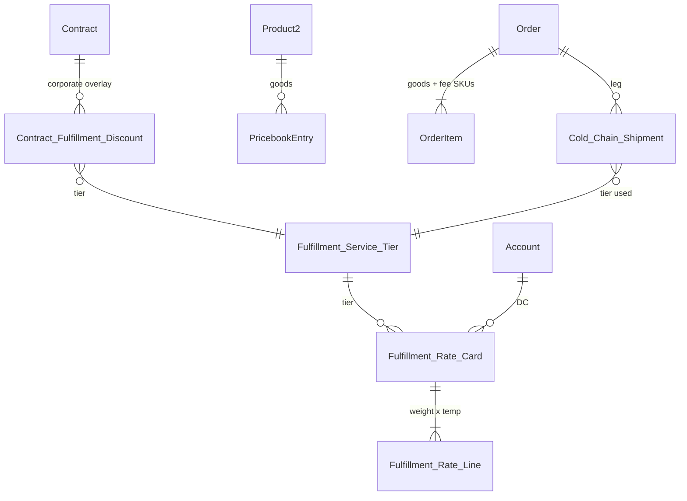

# 1.4 Pricing & Service Tiers

## Salesforce Architecture Design — FreshSource Global (FSG)

**Clouds in scope:** Salesforce Sales Cloud + Service Cloud (Core) + Experience Cloud only  
**Depends on:** 1.1 (temperature class, DC, supplier SKUs), 1.2 (contracted Price Book + volume tiers), 1.3 (DC wholesale Price Book, Orders, cold-chain shipments)  
**Platform guidance:** Well-Architected least privilege; Price Books for **goods**; custom rate cards + Apex when CPQ/Commerce are not licensed; Experience Cloud custom access-control model (no guest/HVU CRUD on price masters).

---

## 1. Designed problem statement

FSG sells produce **and** fulfillment. Every wholesale Order must be priced from four independent drivers:

| Driver | Meaning | Already in the org? |
| --- | --- | --- |
| **Goods price** | SKU × qty | 1.2 contracted Price Book / 1.3 DC wholesale Price Book |
| **Weight** | Shipment mass (kg) | Not modeled yet — add on Product / OrderItem |
| **Temperature classification** | Ambient / Chilled / Frozen | 1.1 `Temperature_Class__c` on catalog SKUs |
| **Delivery urgency / service tier** | Standard Ground, Express Cold-Chain (Refrigerated), Priority Ultra-Fresh (Same-Day) | **New** |
| **Corporate contract tier discounts** | Master Agreement overlays on goods **and** fulfillment | 1.2 Contract + `Volume_Discount_Tier__c` (goods only today) |

Buyers on Experience Cloud must see **eligible** tiers and **their** price only. They must not read another chain’s contracted book, FSG’s rate-card rows, or supplier cost.

**Out of this workstream:** Revenue Cloud / CPQ, B2B Commerce Cart Calculate / shipping calculators, carrier rating APIs as a required dependency (optional later behind Named Credentials).

---

## 2. Architecture decisions (locked)

| Decision | Choice | Why (Salesforce recommendation) |
| --- | --- | --- |
| Split price into two layers | **Goods** = Price Book Entry. **Fulfillment** = custom rate card + Apex | Sales Cloud Price Books do list price well. They do **not** do weight bands × temp × urgency without SKU explosion. CPQ/Commerce shipping services are out of license scope. |
| Three service tiers | Custom object `Fulfillment_Service_Tier__c` (not a Product family of every SKU) | Tiers are fulfillment methods, not produce. Three Product2 **fee SKUs** exist only so the fee can post as OrderItems. |
| Rate card grain | **DC + Tier + Currency**, versioned; lines = weight band × temperature class | Matches FSG’s 14-timezone DC network. Avoids 1,200 contract × 3 tier **Price Books**. |
| Corporate discounts | `Contract_Fulfillment_Discount__c` on the 1.2 Contract + existing goods volume tiers | Contract stays the commercial overlay. Branches still store **Agreement Number text**, not a lookup (skew). |
| Runtime engine | Invocable **`FsgPricingService`** (system mode + procedural auth) | Same pattern as 1.2/1.3 Catalog Apex. HVU have **no** FLS on rate cards, Contracts, or Price Books. |
| Mixed cart | **One fulfillment fee per temp-class shipment leg**, not one fee for the whole Order | Aligns with 1.3 `Cold_Chain_Shipment__c` split by temperature. Frozen fish does not “upgrade” dry paper goods to Ultra-Fresh. |
| Eligible tiers | Derived, not free picklist | Frozen → Express or Ultra-Fresh only. Ultra-Fresh only if SKU + Branch/DC same-day window. |
| Experience Cloud | Cart LWC calls pricing Apex; stores quote snapshot on Order | Guests never price. HVU see DTO (tier code, SLA, fee), not rate-card Ids. |
| Rate-card change control | Draft → **Approval Process** → Active; effective dating | Pricing Managers own cards; CS cannot silently edit live rates. |
| OWD | Rate card / lines / tiers **Private** internal + external | No guest sharing rules; no Sharing Set to buyers. |

**Rejected alternatives**

- One Price Book per (DC × tier): still cannot express weight bands; book count explodes with 1.2’s ~1,200 contract books.
- Three Product2 clones per produce SKU: unmaintainable against 1.1 farm catalogs.
- Standard Quote for portal checkout: Customer Community (HVU) is a poor Quote citizen; keep Quotes **internal** for exceptions only.

---

## 3. Personas, licenses, and assignment

| Persona | License | Pricing duty |
| --- | --- | --- |
| Corporate chef / micro-buyer | HVU (1.2 / 1.3) | Select an **eligible** tier; see calculated goods + fulfillment; cannot edit unit prices |
| Guest | Guest | **No** pricing |
| Pricing Manager (regional) | Salesforce | Owns rate cards for their DCs; submits approval |
| Pricing Director | Salesforce | Approves rate cards / contract fulfillment discounts |
| Strategic AM | Salesforce | Negotiates Contract overlays (goods + fulfillment %) on HQ |
| Order Ops | Salesforce | Sees snapshot on Order; does not edit live rate cards |
| Q&C / Logistics | Salesforce | Constraint data (temp class, same-day cutoff) — not prices |

**Record assignment**

| Record | Owner / queue | How |
| --- | --- | --- |
| `Fulfillment_Rate_Card__c` | Regional Pricing Manager for that DC | Flow on create from DC.Region__c |
| Rate card approval | Pricing Director (or regional director) | Approval Process; High-risk Ultra-Fresh cards always two-step |
| `Contract_Fulfillment_Discount__c` | Follows Contract owner (SAM) | Created in Contract approval (1.2) |
| Pricing exception Case | Omni-Channel **Pricing_Exceptions_{Region}** | Overweight, no band match, same-day unavailable after cart — skills: Region + Language |
| Order (unchanged) | HVU then Order Ops queue | 1.2 / 1.3 |

Do **not** assign rate cards to a single global owner (ownership skew if thousands of versioned cards). DC-level cards stay well under 10,000 children per parent DC Account (lines are MD to the **card**, not to the DC Account).

---

## 4. Data model

### 4.1 Service tiers (`Fulfillment_Service_Tier__c`)

Three seeded records (Custom Metadata is acceptable if truly static; **object** is better so SLA/cutoff can be DC-overridden without a deploy):

| Code | Name | Allowed temp classes | Default SLA | Fleet |
| --- | --- | --- | --- | --- |
| `STD_GROUND` | Standard Ground | Ambient only | e.g. 2–5 business days | Dry |
| `EXP_COLD` | Express Cold-Chain (Refrigerated) | Chilled, Frozen | e.g. 1–2 days | Refrigerated |
| `PRI_ULTRA` | Priority Ultra-Fresh (Same-Day) | Ambient (produce), Chilled | Same calendar day, DC cutoff | Dedicated / local |

Fields: `Code__c` (unique), `Allowed_Temperature_Classes__c` (multi-select), `Is_Same_Day__c`, `Requires_Refrigerated_Fleet__c`, `Sort_Order__c`, `Is_Active__c`.

DC override: `DC_Tier_Capability__c` (junction DC Account ↔ Tier) for “this DC does not offer same-day.” Ultra-Fresh is never offered if the junction is missing.

### 4.2 Rate cards and lines

**`Fulfillment_Rate_Card__c`**

- Lookups: `Distribution_Center__c` (Account `Distribution_Center`), `Service_Tier__c`, `CurrencyIsoCode`
- `Effective_From__c` / `Effective_To__c`, `Status__c` (Draft / In Approval / Active / Retired)
- `External_Id__c` = DC + Tier + Currency + Effective_From (unique)

**`Fulfillment_Rate_Line__c`** (Master-Detail → Rate Card)

- `Weight_From_Kg__c`, `Weight_To_Kg__c` (inclusive/exclusive documented; no overlapping bands — validation)
- `Temperature_Class__c` (Ambient / Chilled / Frozen)
- `Base_Fee__c`, `Per_Kg_Rate__c` (formula used: `Base_Fee__c + Per_Kg_Rate__c * billable_kg`)
- Optional `Min_Fee__c` / `Max_Fee__c`

Weight lives on **`Product2.Weight_Kg__c`** (Sales Cloud has no standard product weight) and rolls to OrderItem via Apex (`Quantity * Weight_Kg__c`). 1.1 `Supplier_Catalog_Item__c` gains the same field so the merchandising sync copies it.

### 4.3 Corporate contract overlay

On the 1.2 **Contract** (HQ only):

**`Contract_Fulfillment_Discount__c`**

- `Service_Tier__c`, `Discount_Percent__c` **or** `Override_Base_Fee__c` / `Override_Per_Kg__c` (mutually exclusive)
- Effective dating aligned to Contract start/end

Goods remain: Price Book + `Volume_Discount_Tier__c` (1.2). Pricing service applies **goods volume % first**, then **fulfillment overlay**. Micro-buyers (1.3) have **no** Contract overlay — list rate card only.

Do **not** lookup 15k Branch Accounts to this discount object. Apex loads discounts by `Agreement_Number__c` (indexed Contract.ContractNumber), same anti-skew pattern as 1.2.

### 4.4 Order snapshot (audit)

Never re-price history from “today’s” card.

On **Order**: `Pricing_Snapshot__c` (long text JSON or child `Order_Price_Breakdown__c` rows): goods subtotal, volume % applied, each leg (tier, temp, kg, base, per-kg, contract %, fee), grand total, rate-card Id, card version datetime.

On **OrderItem**:

- Produce lines: PBE unit price after volume tier
- One **fee line per shipment leg**: Product2 `FSG-FEE-STD` / `FSG-FEE-EXP` / `FSG-FEE-ULT` (not shown in shop). UnitPrice = calculated fee. Quantity = 1.

On **`Cold_Chain_Shipment__c`**: `Service_Tier__c`, `Billable_Weight_Kg__c`, `Fulfillment_Fee__c` (copied from snapshot).

---

## 5. Pricing algorithm (runtime)

`FsgPricingService.quote(accountId, lines[], requestedTiers[])` — `without sharing` + **procedural** checks (running user’s Contact.AccountId must be that Account or ACR, record type Corporate_Branch or Micro_Buyer).

1. **Authorize** Account (1.2/1.3 rules). Load `Primary_DC__c`, `Price_Book_Key__c`, `Agreement_Number__c`, `Ordering_Status__c`.
2. **Goods:** for each line, `PricebookEntry` in that book; apply 1.2 volume tier if Contract exists. Reject SKU not in book.
3. **Partition** lines into legs by `Temperature_Class__c` (and optionally Ultra-Fresh eligibility flag).
4. **Eligible tiers per leg:**
   - Ambient: Standard Ground; Ultra-Fresh if `Is_Ultra_Fresh_Eligible__c` on Product **and** `DC_Tier_Capability__c` for same-day **and** now < DC cutoff (Business Hours or `Same_Day_Cutoff__c` on DC Account, in DC time zone).
   - Chilled: Express Cold-Chain; Ultra-Fresh if eligible + cutoff.
   - Frozen: Express Cold-Chain **only** (not Standard Ground; Ultra-Fresh only if FSG explicitly allows frozen same-day on the junction — default **off**).
5. **Weight:** `sum(qty * Weight_Kg__c)` per leg. If a Product has no weight → do not silently treat as 0; return error / Pricing Exception Case.
6. **Rate:** active card for (DC, tier, currency) where today ∈ [Effective_From, Effective_To]; matching line for (weight band, temp class). If no line → exception Case, do not undercharge.
7. **Corporate overlay:** if Agreement Number resolves to Activated Contract, apply `Contract_Fulfillment_Discount__c` for that tier.
8. **Return DTO:** per-leg options (tier, SLA label, fee, ineligible reason). UI selects one tier **per leg** (or a convenience “cheapest eligible”).
9. **On submit:** re-run in the same transaction; if fee drifts > tolerance (e.g. 0), reject. Write snapshot + fee OrderItems. Then 1.2/1.3 submit (ops queue).

Display currency = Price Book / Account currency. Multi-currency: rate cards are per `CurrencyIsoCode`.

---

## 6. End-to-end process (step by step)

### Phase A — Internal: publish rate cards

1. Pricing Manager opens Lightning app **FSG Pricing**.
2. New `Fulfillment_Rate_Card__c` for DC + tier; owner assigned by DC region Flow.
3. Add weight/temp lines; validation: no gaps/overlaps for a given temp class.
4. Submit Approval Process. Director approves → Status Active. Previous card for same DC+tier gets `Effective_To__c` = new From − 1 day (Flow).
5. Sharing: criteria `DC.Region__c = NA` → Public Group `NA_Pricing` Read/Write; restriction rule User.Region = Card’s DC Region.

### Phase B — Internal: corporate fulfillment discounts

6. On Master Agreement (1.2 Contract approval), AM adds `Contract_Fulfillment_Discount__c` rows (e.g. Express −15%, Ultra-Fresh −5%, Ground $0 overlay).
7. Same Approval Process as Contract (or child approval). Micro-buyers skip this phase.

### Phase C — Experience Cloud cart

8. Buyer (HVU) adds produce. Cart LWC calls `FsgPricingService` (not guest).
9. UI shows **goods** line prices (contracted or wholesale) and **fulfillment options per temp group** with fees.
10. Ineligible tiers shown disabled with reason (“Frozen cannot ship Standard Ground”).
11. Guest / unauthenticated: no callout; no rate cards on public pages.

### Phase D — Submit and fulfill

12. Submit Apex recalculates, stamps snapshot, inserts fee OrderItems, creates `Cold_Chain_Shipment__c` per leg with chosen tier (extends 1.3).
13. Order Ops activates (internal **Activate Orders**). Logistics executes that tier’s SLA; Ultra-Fresh uses same-day Path / milestone (regional Business Hours).
14. Invoice (1.3) includes goods + fulfillment fee lines. Historical invoice uses **snapshot**, never live cards.

### Phase E — Exceptions

15. No weight, no band, DC missing Ultra-Fresh, cutoff passed mid-checkout → Case `Pricing_Exception` Omni to regional Pricing queue; cart shows “Call FSG” / retry Standard or Express.
16. Manual override (AM): internal-only; Field History + `Override_Reason__c`; HVU cannot set it.

---

## 7. Sharing

### 7.1 OWD

| Object | Internal | External |
| --- | --- | --- |
| `Fulfillment_Service_Tier__c` | Public Read Only or Private + criteria | **No HVU object access** (labels from Apex DTO) |
| `Fulfillment_Rate_Card__c` / Lines | **Private** | **Private**, no Sharing Set |
| `DC_Tier_Capability__c` | Private | No HVU access |
| `Contract_Fulfillment_Discount__c` | Private (with Contract) | No HVU access |
| Price Book / PBE | View Only internal; HVU **no** object CRUD | Unchanged from 1.2/1.3 |
| Order / OrderItem | CBP | CBP — buyer sees **their** fee lines because they see the Order |

### 7.2 External (buyers)

Sharing Sets stay **Account-scoped** (Orders, Cases, shipments, invoices). They **must not** include rate cards.

Corporate chef vs micro-buyer isolation remains: goods book from `Price_Book_Key__c`; fulfillment from DC card ± Contract overlay resolved only if **that** Account’s Agreement Number matches. Micro Account with a guessed Contract Id is rejected in Apex.

### 7.3 Internal

- Pricing groups by region (few criteria rules, not per DC).
- Restriction rules: Pricing Manager region = DC region.
- SAM sees discounts on **their** Contracts (role hierarchy + 1.2 Contract sharing).
- Order Ops Read on Orders they own/queue; **Read** on snapshot fields; no edit on Active rate cards.
- Suppliers (Partner Community) **no** access to buyer prices or rate cards (different site, no object permissions).

### 7.4 Guest

No guest sharing rules. Pricing Apex is **not** in the guest profile class access list.

---

## 8. Security

1. **Object:** HVU cannot Read rate cards, Contracts, PBE. Shop and cart only via Apex allow-list DTOs.
2. **Record:** Private OWD + no Sharing Set on pricing masters. IDOR: AccountId must equal running user’s Account (or ACR).
3. **FLS:** Internal cost, `Per_Kg_Rate__c`, contract override amounts hidden from CS if needed; never on buyer layouts.
4. **Price integrity:** Submit path **recalculates**; HVU cannot patch `OrderItem.UnitPrice` for fee or goods (validation / strip in Apex; lock fields on Experience layouts).
5. **Snapshot:** persists awarded rates for disputes and invoices (legal/audit).
6. **MFA** unchanged; catalog/pricing classes listed only on buyer profiles, not guest.
7. **SOQL:** bind DC, tier, weight, effective dates; rate-line query selective (indexed External Id / card Id).

---

## 9. Experience Cloud UX (buyer portal)

Extend the 1.2/1.3 cart — no new site.

- After cart contents stabilize, show **Fulfillment** panel grouped by temperature.
- Each group: radio list of eligible tiers + fee + SLA in the **DC time zone** for same-day cutoff.
- Order summary: goods, volume discount, fulfillment subtotal, total.
- Order detail / invoice: same breakdown from snapshot.

Supplier portal (1.1) is unchanged (farms do not set FSG fulfillment list prices).

---

## 10. Automation catalog

| Automation | Type | Purpose |
| --- | --- | --- |
| FsgPricingService | Apex | Quote + submit recalc + auth |
| Rate_Card_Owner | Record-triggered Flow | Assign Pricing Manager by DC region |
| Rate_Card_Approval | Approval Process | Activate / retire previous |
| Contract_Fulfillment_On_Agreement | Flow / included in 1.2 approval | Overlay rows |
| Cart / Submit Order | LWC + Apex | Persist snapshot + fee SKUs + shipments |
| Pricing_Exception_Omni | Omni-Channel Flow | Unrateable carts |
| Weight_Required | Validation / Apex | Block PBE active without `Weight_Kg__c` for orderable SKUs |

---

## 11. Coexistence with 1.1–1.3

| Layer | Source | 1.4 role |
| --- | --- | --- |
| Temp class, DC Account | 1.1 | Eligibility + rate-card grain |
| Contracted goods PBE + volume % | 1.2 | Goods subtotal |
| DC wholesale PBE | 1.3 | Goods subtotal for micro-buyers |
| Order CBP, HVU, Activate Orders | 1.2 / 1.3 | Unchanged |
| Shipment per temp class | 1.3 | Now also **priced** per leg + tier |

---

## 12. Implementation sequence

1. Product `Weight_Kg__c`; three fee Product2; DC capability junction; tier/card/line objects; Contract fulfillment discount; snapshot child or JSON field.
2. OWD Private, regional pricing sharing + restriction rules, Approval Process, Pricing app.
3. Seed three tiers + first Active cards per DC (weight bands).
4. Extend Catalog/Cart LWC + `FsgPricingService`; submit recalc; fee OrderItems; shipment.tier.
5. Wire Contract overlay into 1.2 agreement approval.
6. Omni Pricing Exception queues.
7. UAT: (a) frozen SKU cannot select Standard Ground; (b) two cafés same DC same cart see **same** fulfillment list rates; (c) two hotel branches same SKU see **same** card but **different** goods + overlay from their Contract; (d) HVU SOQL/Aura cannot read `Fulfillment_Rate_Line__c`; (e) guest cannot call pricing; (f) mixed Ambient+Frozen cart prices **two** legs; (g) Ultra-Fresh hidden after cutoff in DC TZ; (h) invoice PDF matches snapshot after a later rate-card change.

---

## 13. Salesforce documentation mapped to this design

| Topic | Guidance used |
| --- | --- |
| Price Books for list/contracted **goods** | Sales Cloud Price Book OWD (View Only / Use) — not a freight engine |
| No native weight-band shipping in Sales Cloud | Do not fake it with CPQ Product Options or Commerce Cart Calculate (out of license) |
| Custom access control for Experience Cloud | Developer Guide: no guest/HVU CRUD; Apex `without sharing` + procedural auth |
| Sharing Sets for Account-scoped Orders only | Help: Sharing Sets; do not share rate cards to HVU |
| Activate Orders internal-only | Orders permissions — fee lines added while Draft |
| Skew / 10k children | Rate lines MD to **card**, not to HQ/DC Account with 15k buyers looking up a rate card |
| Approval Process for commercially sensitive masters | Standard governance for price changes |
| Omni-Channel for exception work | Same regional skills/hours pattern as 1.1–1.3 |

---

## 14. Final outcome (brief)

- **Goods** stay on **Price Books** (contracted 1.2, DC wholesale 1.3). **Fulfillment** is **not** another Price Book — it is a **DC + tier rate card** with **weight × temperature** lines.
- The three tiers (**Standard Ground**, **Express Cold-Chain**, **Priority Ultra-Fresh**) are master records plus **DC capability** (same-day not universal).
- A single **Apex pricing service** (authenticated HVU only) applies goods PBE + volume % + eligible tier + weight band + optional **Contract fulfillment discount**.
- Mixed carts are priced **per temperature shipment leg**, matching cold-chain splits.
- Buyers never Read rate cards or Contracts; they see **DTOs** and an **Order snapshot** so invoices stay correct after rates change.
- Frozen cannot ship Ground; Ultra-Fresh respects DC cutoff in the **DC time zone**.
- Pricing Managers **own** regional cards with **Approval**; exceptions go to **Omni-Channel**; Order submit still **recalculates** so portal users cannot spoof fees.
- Suppliers, guests, and other enterprises cannot see these prices; sharing stays Private on pricing masters and Account-scoped on Orders.
