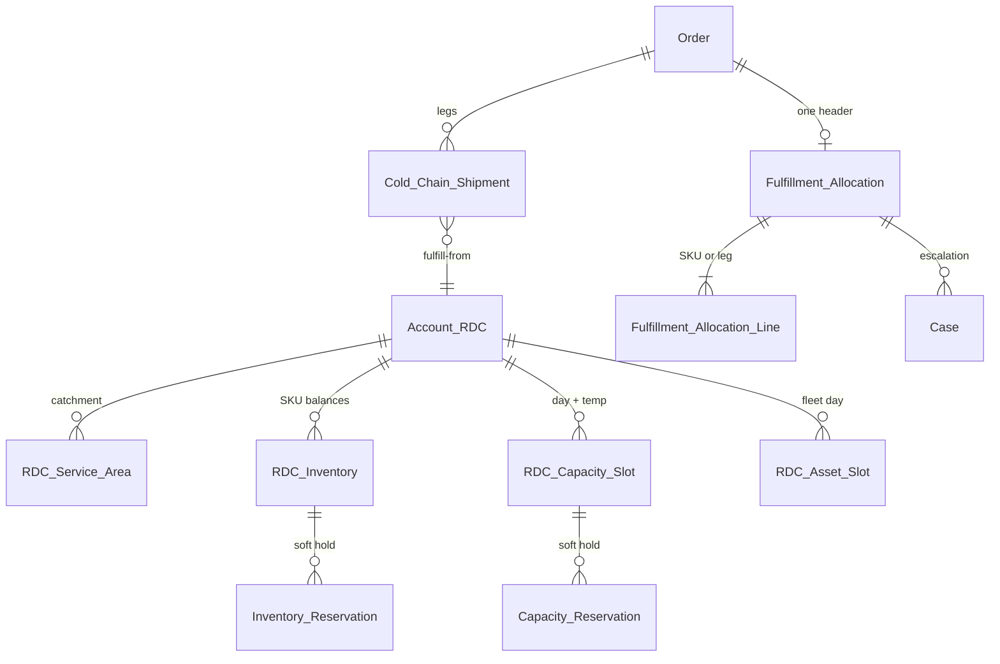

# 1.5 Dispatch & Capacity Allocation Logic

## Salesforce Architecture Design — FreshSource Global (FSG)

**Clouds in scope:** Salesforce Sales Cloud + Service Cloud (Core) + Experience Cloud only  
**Depends on:** 1.1 (RDC = `Account` record type `Distribution_Center`, temp class), 1.2/1.3 (Order submit, `Primary_DC__c`, cold-chain shipments), 1.4 (service tier, weight, shipment **legs** by temperature)  
**Platform guidance:** Well-Architected least privilege and LDV locking; SOQL `DISTANCE()` for proximity; Omni-Channel + Case for human exception work; **do not** use Omnichannel Inventory / Order Management (those products are out of license scope).

---

## 1. Designed problem statement

When a **bulk wholesale Order** is submitted, Salesforce must **allocate fulfillment automatically** to the **nearest Regional Distribution Center (RDC)** that has:

- **inventory** for the ordered SKUs, and
- **cold-storage (and dry) capacity** for the required temperature class(es), and
- **refrigerated delivery assets** when the 1.4 tier is Express Cold-Chain or Priority Ultra-Fresh

If **no** single RDC can take the order (at capacity, no stock, or no refrigerated fleet), the Order must **not** silently ship from the buyer’s default `Primary_DC__c`. It must **escalate** to the **Regional Fulfillment Director** for:

- **manual re-allocation** to another RDC, or
- **split-shipment approval** (multiple RDCs / multiple `Cold_Chain_Shipment__c` legs)

Buyers on Experience Cloud see **allocation status**, not inventory positions or other customers’ orders.

---

## 2. Architecture decisions (locked)

| Decision | Choice | Why (Salesforce recommendation) |
| --- | --- | --- |
| RDC master | Existing **Account** `Distribution_Center` | Locked in 1.1. Geolocation on that Account. |
| Inventory / capacity system of record in Salesforce | Custom **balance** rows + **reservations**, not fields on the DC Account | Updating one DC Account on every order causes **row lock** and parent-child skew (*Designing Record Access*, `UNABLE_TO_LOCK_ROW`). |
| Native OCI / Order Management | **Out of scope** | Requires Commerce/OM. Replicate the **reserve → fulfill / release** pattern in Apex on custom objects. |
| “Nearest” | **Service-area ranked candidates**, then `DISTANCE()` tie-break | Pure geo can pick a closer DC that does not legally/operationally serve that postal code. Catchment is a business rule; distance is a tie-break. |
| When allocation runs | **After** 1.4 pricing submit, **before** Activate Orders | Need known legs (temp + tier + kg). Do not activate until allocated (or director-approved). |
| Auto vs human | Apex `FsgAllocationService` first; **Case** to Director if auto fails or split is required | Omni-Channel is the Salesforce routing model for skilled exception work across 14 time zones. |
| Split shipment | Extra `Cold_Chain_Shipment__c` rows + **Approval Process** on `Fulfillment_Allocation__c` | Director explicitly approves split; inventory reserved only after approve. |
| Buyer DC field | `Primary_DC__c` = **default catchment**, not a hard allocation | Auto-allocate may choose a nearer/capable neighbor. Buyer cannot pick the RDC. |
| Experience Cloud | HVU Read on Order/shipment **status**; **no** object access to inventory/capacity | Same custom access-control model as catalog/pricing. |

---

## 3. Personas, licenses, assignment

| Persona | License | Duty |
| --- | --- | --- |
| Corporate / micro buyer | HVU | Places Order; sees `Allocation_Status__c` (Allocated / In Review / Split / Rejected) |
| Guest | Guest | None |
| Allocation automation user | Salesforce | Runs `FsgAllocationService`; owns reservation DML |
| Warehouse / inventory integration | Salesforce (integration) | Syncs on-hand from WMS if present; otherwise CS/warehouse UI |
| Regional Fulfillment Director | Salesforce (Service) | Omni work item: reallocate or submit split for approval |
| Order Ops | Salesforce | Activates Order **after** `Allocation_Status__c = Allocated` |

| Record | Assigned to | How |
| --- | --- | --- |
| `Fulfillment_Allocation__c` | Automation user, then Director if escalated | Apex sets owner to Omni queue **or** keeps automation when auto-success |
| Escalation **Case** (`Fulfillment_Escalation`) | `FF_Director_{Region}` Omni queue | Omni-Channel Flow: skills Region + Language; Ultra-Fresh / bulk = higher routing priority |
| Reservations | Automation user | Created in the allocation transaction |
| Order | Unchanged (Ops queue) | Ops list view filters `Allocation_Status__c = Allocated` |

Directors work in an internal Lightning app **FSG Fulfillment**, not Experience Cloud.

---

## 4. Data model

### 4.1 Where the RDC lives

Unchanged: **Account** (`Distribution_Center`) with `BillingLatitude` / `BillingLongitude` (or custom `Geo__c`). Buyer Account / ship-to has the same. `Primary_DC__c` on the buyer is the **home** RDC.

### 4.2 Catchment (“nearest” that FSG will actually dispatch)

**`RDC_Service_Area__c`**

- `Postal_Prefix__c` (or country + postal), `Distribution_Center__c`, `Rank__c` (1 = preferred, 2 = overflow, …), `Max_Distance_Km__c`

Allocation loads **ranked candidate RDCs** for the ship-to postal code (typically 2–5). Among those that pass inventory/capacity/asset filters, pick the **lowest Rank**, then nearest `DISTANCE(buyer.Geo__c, rdc.Geo__c, 'km')`.

If no service-area row exists, fall back to: DCs in the same `Region__c` ordered by `DISTANCE()`, filtered by `Max_Distance_Km__c` on the DC (e.g. Ultra-Fresh 80 km).

### 4.3 Inventory (not OCI)

**`RDC_Inventory__c`** — one row per (DC × `Product2`), unique external id.

- `Qty_On_Hand__c`, `Qty_Reserved__c`, `Qty_Available__c` (formula: On Hand − Reserved)
- Updated: WMS sync **or** warehouse users; **allocation only increments Reserved** (never blindly decrements On Hand)

**`Inventory_Reservation__c`** — Lookup (not MD) to Inventory, Order, Product, DC, Qty, Status (`Held` / `Released` / `Consumed`).

Lookup, not Master-Detail, so releasing a hold does not thrash implicit sharing on a hot inventory parent (*parent-child skew*).

**Locking (Salesforce-recommended pattern without OCI):** in `FsgAllocationService`, query candidate `RDC_Inventory__c` rows `FOR UPDATE` in a **stable Id order**, add qty to `Qty_Reserved__c`, insert reservation rows, retry on `UNABLE_TO_LOCK_ROW` (finite retries + backoff). Do **not** lock the DC Account.

### 4.4 Cold-storage and refrigerated assets

Capacity is **time-phased** (same-day vs next-day), so it is **not** a single field on the RDC Account.

**`RDC_Capacity_Slot__c`** — unique (DC × `Slot_Date__c` × `Temperature_Class__c`)

- `Storage_Capacity_Units__c` (pallets or kg — same UOM as 1.4 billable weight or palletized conversion)
- `Storage_Reserved__c`, available = capacity − reserved

**`RDC_Asset_Slot__c`** — unique (DC × `Slot_Date__c`)

- `Refrigerated_Vehicles__c`, `Refrigerated_Reserved__c`
- `Dry_Vehicles__c` (Standard Ground)

**`Capacity_Reservation__c` / `Asset_Reservation__c`** — same hold/release pattern, `FOR UPDATE` on the slot row.

Rules:

- Ambient leg → Ambient storage + dry **or** reefer.
- Chilled/Frozen → **cold** storage slot + **refrigerated** asset if tier is Express or Ultra-Fresh.
- If refrigerated vehicles available = 0 → **cannot auto-allocate** that RDC for cold legs → try next candidate → else escalate.

Slot date: Standard Ground = first DC ship date from SLA; Ultra-Fresh = **today in DC time zone**.

### 4.5 Allocation header (work record for the Director)

**`Fulfillment_Allocation__c`**

- Master lookup to Order (1:1)
- `Status__c`: `Queued` → `Auto_Allocated` → `Escalated` → `Reallocated` / `Split_Approved` / `Rejected`
- `Requested_Ship_Date__c`, `Buyer_Account__c`, `Home_DC__c`, `Region__c`
- `Escalation_Reason__c` (multi): `No_Inventory`, `Storage_Capacity`, `No_Reefer_Assets`, `Distance`, `Partial_Only`

**`Fulfillment_Allocation_Line__c`**

- Product, qty, temp class, **proposed** DC, **confirmed** DC, split flag

On success, each 1.4 `Cold_Chain_Shipment__c` gets `Fulfillment_DC__c` (the allocated RDC, which may differ from buyer `Primary_DC__c`).

---

## 5. Allocation algorithm (step by step)

`FsgAllocationService.allocate(orderId)` — after 1.4 snapshot exists; `without sharing` + **internal/automation only** (not guest, not HVU). Invoked from submit Flow (async **if** the Order is large; synchronous for small carts with a governor-safe SKU cap; bulk corporate orders → Queueable).

1. **Guard:** Order Draft/Submitted, `Allocation_Status__c` not already `Allocated`. Load OrderItems (goods only), ship-to geo/postal, region, 1.4 legs (temp + tier + kg).
2. **Candidates:** `RDC_Service_Area__c` for postal prefix, ordered by `Rank__c`. Cap to top N (e.g. 5). If empty, same-region DCs with `DISTANCE()` < DC max radius.
3. **Per leg** (temperature × chosen 1.4 tier):
   - Needed ship date from SLA / Ultra-Fresh = today in DC TZ.
   - For each candidate DC in rank/distance order:
     - Inventory: every SKU on that leg `Qty_Available__c >= qty` (after this transaction’s tentative holds).
     - Storage: `RDC_Capacity_Slot__c` available ≥ billable units for that temp.
     - Assets: if tier needs reefer, `RDC_Asset_Slot__c` refrigerated remaining ≥ 1 (or ≥ ceil(kg / truck capacity) if modeled).
     - Ultra-Fresh: DC has `DC_Tier_Capability__c` for same-day (1.4) **and** distance ≤ same-day radius.
   - First DC that passes → **select**.
4. **Single-DC win:** If **all legs** can be served by **one** DC (prefer home DC if it ties), lock inventory + capacity + assets `FOR UPDATE`, write reservations, set shipments’ `Fulfillment_DC__c`, `Fulfillment_Allocation__c.Status = Auto_Allocated`, Order `Allocation_Status__c = Allocated`. Stop.
5. **Auto split (policy):** Optional Custom Metadata `Allow_Auto_Split__c`. If false (recommended for **bulk**), go to step 6 even if two DCs could cover two legs. If true for micro-orders, auto-create two shipments only when **each leg fully fits** a (possibly different) DC — still no SKU-level split without a Director.
6. **Escalate:** Status `Escalated`; reason codes; **do not** consume reservations (or hold a **short TTL** reservation on the best partial DC if FSG wants to pause stock — default **no hold** until Director acts, to avoid stranding capacity). Insert Case `Fulfillment_Escalation` (Account = buyer, Order lookup, Allocation lookup, Priority High for Ultra-Fresh/bulk). Omni-Channel Flow routes to `FF_Director_{Region}`.
7. **Director UI (Screen Flow on Case):**
   - See why auto failed (missing SKUs, slot remaining, reefer = 0).
   - **Re-allocate:** pick another candidate DC (list is internal-only). Flow calls allocate-to-DC (same locks). On success Case Closed, status `Reallocated`.
   - **Split:** propose line→DC map (including SKU split). Submit **Approval Process** (`Fulfillment_Split_Approval`) — Director or designated second approver for bulk above a value/weight threshold. On Approve: reservations + multiple shipments. On Reject: reject Order / ask buyer (CS Case).
8. **Activate Orders** (1.2/1.3) allowed only when `Allocation_Status__c = Allocated`. Validation on Order. Warehouse **Consumes** reservations on pick; cancel/reject **Releases**.

---

## 6. Sharing

| Object | Internal OWD | External OWD | Who sees it |
| --- | --- | --- | --- |
| `RDC_Inventory__c`, slots, reservations | **Private** | **Private** | Warehouse + Directors + integration. **No** Sharing Set to HVU. |
| `RDC_Service_Area__c` | Public Read Only or Private + criteria | No HVU access | Pricing/allocation Apex only for external |
| `Fulfillment_Allocation__c` | Private | Private | Directors via Case/queue; Ops Read on related Order |
| Case escalation | Private | Private | Omni owner + regional Director group; **not** the buyer (same pattern as 1.1 Q&C Cases) |
| Order / Shipment | CBP / Sharing Set as 1.2–1.3 | Buyer sees **status** and fulfill-from **name/city** (FLS hides capacity) |

**Internal:** criteria `Region__c = NA` → `NA_Fulfillment_Directors` Read/Write on inventory/slots/allocations for that region. **Restriction rules:** Director `User.Region__c` = record Region (NA Director cannot see EMEA stock).

**Do not** criteria-share inventory to all internal users. Suppliers (1.1) do not see RDC on-hand (that is FSG warehouse data, not farm inventory).

**Guest:** no access; allocation Apex not on the guest profile.

---

## 7. Security

1. **Object:** HVU no CRUD on inventory, slots, service areas, allocation header (optional Read on Order fields only).
2. **Record:** Private masters; Apex allocation is **internal/automation**. Buyer Apex (catalog/pricing) must **not** query `Qty_On_Hand__c`.
3. **FLS:** Buyer shipment layout: DC name, ETA, tier. Hide reserved qty, vehicle counts, other DCs.
4. **Integrity:** Reservations only in `FsgAllocationService`. Cancel Order Flow releases holds. Idempotent `OrderId` unique on Held reservations.
5. **IDOR:** Director Flow only lists DCs in their region (restriction rule + Flow filter).
6. **Concurrency:** `FOR UPDATE` + retry; no capacity field on the hot DC Account; no RSF from 50k Orders to DC.
7. **Audit:** Field History on allocation status; Director decisions on the Case.

---

## 8. Experience Cloud (buyer)

- After submit: Order Path includes **Allocating → Confirmed / Review**.
- If escalated: message “FSG is confirming fulfillment” — **no** Case thread, **no** other RDC options to shop.
- When allocated: show fulfill-from RDC **label** (not inventory). Split: two shipment cards (already 1.3/1.4 UX).
- Buyer cannot change `Fulfillment_DC__c`.

---

## 9. Automation catalog

| Automation | Type | Purpose |
| --- | --- | --- |
| FsgAllocationService | Apex Queueable + invocable | Candidate DCs, locks, reservations, escalate |
| Order_Submitted_Allocate | Record-triggered Flow | Call allocation after 1.4 snapshot |
| Route_Fulfillment_Escalation | Omni-Channel Flow | Director queue + skills + Ultra-Fresh priority |
| Fulfillment_Split_Approval | Approval Process | Split-shipment |
| Director_Reallocate | Screen Flow | Manual DC pick + invoke Apex |
| Release_On_Cancel | Flow | Reservations → Released |
| Consume_On_Pick | Flow / integration | Held → Consumed; On Hand down |
| Inventory_Sync | Integration user | WMS → `Qty_On_Hand__c` (optional) |
| Activate_Guard | Validation Rule | Cannot activate until Allocated |

---

## 10. Coexistence with 1.1–1.4

| Prior design | 1.5 use |
| --- | --- |
| RDC Account + `Primary_DC__c` | Home/catchment; allocation may override fulfill-from |
| 1.4 legs (temp + tier + kg) | Unit of allocation and capacity UOM |
| `Cold_Chain_Shipment__c` | Stamped with allocated RDC; split = extra rows |
| Activate Orders internal-only | **Plus** allocated-only |
| Regional Omni (14 TZ) | Director presence; work stays in-region |

Pricing (1.4) used the buyer’s **home** DC rate card. If allocation **moves** the Order to another RDC, policy options: (a) keep original fulfillment fee (quoted), or (b) re-quote and notify. **Recommended default:** **keep the snapshot** (quoted price stands); Director split does not silently change portal prices. Document as a commercial rule.

---

## 11. Implementation sequence

1. Geo on RDC and ship-to; `RDC_Service_Area__c`; inventory/slot/reservation objects; allocation header/lines; Order `Allocation_Status__c`.
2. OWD Private, regional Director groups, restriction rules, FLS on shipment, validation on Activate.
3. `FsgAllocationService` + lock/retry + Queueable for bulk.
4. Omni Case + Director Screen Flow + split Approval Process.
5. WMS sync or warehouse UI for on-hand; consume/release Flows.
6. UAT: (a) home RDC with stock auto-allocates; (b) home full, rank-2 nearer overflow with stock auto-allocates; (c) no reefer → Escalated, not Ground substitution for frozen; (d) two concurrent Orders cannot oversell (`FOR UPDATE`); (e) buyer cannot Read inventory; (f) NA Director cannot open EMEA slots; (g) split creates two shipments only after Approval; (h) cancel releases reservations.

---

## 12. Salesforce documentation mapped to this design

| Topic | Guidance used |
| --- | --- |
| Do not hot-update a parent Account from every Order | Parent-child / ownership skew; row locking |
| `FOR UPDATE` + retry | Apex DML lock pattern for `UNABLE_TO_LOCK_ROW` |
| `DISTANCE()` / geolocation | SOQL location-based queries on Account |
| Reserve / release / fulfill lifecycle | Same *idea* as OCI, implemented on custom objects (OCI itself not licensed) |
| Omni-Channel + skills + regional business hours | Exception work for Directors across 14 time zones |
| Cases not shared to portal users | 1.1/1.2 pattern: status on Order, internal Case |
| Sharing Sets only for Account-scoped buyer records | Inventory stays internal |

---

## 13. Final outcome (brief)

- Fulfillment allocates in Salesforce to the **nearest eligible RDC Account**, not blindly to `Primary_DC__c`.
- **Nearest** = service-area **rank**, then `DISTANCE()`; must also pass **inventory**, **cold/dry storage slot**, and **reefer assets** (for Express/Ultra-Fresh).
- Inventory and capacity live on **slot/balance objects** with **reservations** and `FOR UPDATE` — not on the DC Account (avoids lock/skew). Omnichannel Inventory / OM are **not** used.
- If no RDC fits, Order goes **Escalated**; Omni-Channel assigns a **Regional Fulfillment Director** to **re-allocate** or **approve a split shipment**.
- Split = extra `Cold_Chain_Shipment__c` rows after **Approval**; reservations commit only then.
- Orders **cannot be activated** until `Allocation_Status__c = Allocated`.
- Buyers see status (and DC name), **not** stock or capacity; Directors are region-restricted; guests have no allocation access.
- Quoted 1.4 prices **do not** auto-change when the Director sends the Order to another RDC.
