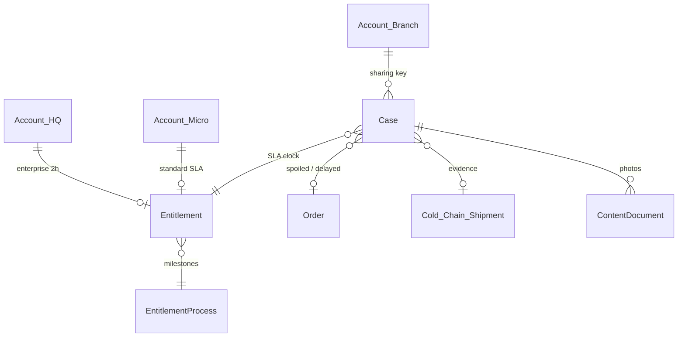

# 1.6 Customer Support & Incident Management

## Salesforce Architecture Design — FreshSource Global (FSG)

**Clouds in scope:** Salesforce Sales Cloud + Service Cloud (Core) + Experience Cloud only  
**Depends on:** 1.2 / 1.3 (buyer portal, HVU, Order CBP, Sharing Sets), 1.4 (temp class / tier), 1.5 (shipment, allocated RDC)  
**Platform guidance:** Service Cloud **Entitlements + Milestones** for SLA; **Omni-Channel Flow** (skills + capacity) over classic assignment rules; Experience Cloud Sharing Sets; guest-user hardening (no unauthenticated Case create).

---

## 1. Designed problem statement

When a perishable Order is **spoiled** or **delayed**, authenticated buyers log a **support ticket on the Experience Cloud portal**. FSG agents work those tickets in **Salesforce Service Cloud**.

| Rule | Design implication |
| --- | --- |
| Enterprise Corporate Accounts | **2-hour resolution SLA** (strict, perishable — **calendar / 24×7**, not a 9–5 business-day clock) |
| Routing | **Language skill** + **Omni-Channel capacity** (workload), not round-robin alone |
| Priority | Enterprise incidents **ahead of** micro-buyer tickets |
| Isolation | Branch A cannot see Branch B tickets; Café A cannot see Café B |
| Evidence | Photos / docs on the Case; link to Order + shipment |

Micro-buyers (1.3) can also file the same incident types, with a **longer** entitlement (not 2 hours). Guests cannot open tickets.

**Out of this workstream:** Digital Engagement add-ons (Chat/WhatsApp) unless already licensed; Salesforce Maps; third-party WFM.

---

## 2. Architecture decisions (locked)

| Decision | Choice | Why (Salesforce recommendation) |
| --- | --- | --- |
| Ticket object | Standard **Case** (`Perishable_Incident`) | Native portal Cases, entitlements, Omni, Knowledge |
| SLA | **Entitlement Process** + **Milestone** “Resolution” = 120 minutes | Salesforce system of record for SLA; reporting on milestone violations |
| 2-hour “strict” | Milestone uses a **24×7 Business Hours** record (`Perishable_24x7`) | Default regional business hours would pause overnight and **break** a perishable 2-hour promise |
| Enterprise vs micro | Two Entitlement Processes: `ENT_Enterprise_Perishable_2H`, `ENT_Micro_Standard` | Stamp `Case.EntitlementId` from Account record type / Agreement — do **not** create 15,000 unique processes |
| Routing | **Omni-Channel Flow** + **skills-based routing** + **capacity** | Trailhead: skills for many languages/countries; capacity is Omni presence. Do not make classic assignment rules the primary engine (same as 1.1) |
| Skills | Language (EN/ES/PT/FR) + Incident (`Spoilage` / `Delay`) + Region | Matches FSG’s 14 time zones and perishable specialization |
| Workload | Omni **Units of Capacity** (e.g. Enterprise spoilage = 2 units, delay = 1) | Agents only receive work they can take; overflow to senior queue |
| Portal | Same **FSG Corporate Buyer Portal**; New Incident Screen Flow | Authenticated HVU only; AccountId/OrderId enforced server-side |
| Internal notes | Agent private Case comments / `Internal_Comments__c` **not** in Experience | Portal shows **published** comments and status only |
| Entitlement parent | One Entitlement on **HQ Account** (enterprise); Flow stamps it on **Branch** Cases | Avoids 15k Entitlement records and lookup skew on HQ from entitlement children; Case.AccountId stays the **Branch** for sharing |

---

## 3. Personas, licenses, assignment

| Persona | License | Duty |
| --- | --- | --- |
| Corporate chef / branch manager | HVU | Create/read incidents for **their Branch Account** |
| Micro-buyer | HVU | Same for **their Micro Account** |
| Guest | Guest | **No** Case create |
| Perishable Support Agent | Salesforce (Service) | Omni widget; spoilage/delay skills + languages |
| Enterprise specialist | Same + skill `Enterprise_Priority` | Takes 2-hour SLA work first |
| Support lead | Salesforce | Overflow queue; milestone violation |

| Record | Assigned to | How |
| --- | --- | --- |
| New Case | Regional Omni queue **with routing config** | Omni-Channel Flow after insert |
| Agent | First **Available** agent with **all required skills** and **remaining capacity** | Skills-based Omni |
| Overflow | `Support_Lead_{Region}` queue **without** routing config | Omni overflow assignee (Salesforce Help) |
| Milestone violation | Lead / swarm Case | Milestone action: re-route / notify |

Agents work in Lightning **Service Console** (`FSG Perishable Support`), not Experience Cloud.

---

## 4. Data model

### 4.1 Case (`Perishable_Incident`)

- `Type` / `Incident_Type__c`: `Spoiled` \| `Delayed`
- Lookups: `Order__c`, `Shipment__c` (1.3/1.5 `Cold_Chain_Shipment__c`), `AccountId` = buyer Account (Branch or Micro)
- `Language__c`, `Region__c` (copied from Account)
- `Is_Enterprise__c` (formula from Account record type `Corporate_Branch` / HQ)
- `Priority`: Enterprise + Spoiled = **Critical**; Enterprise + Delayed = **High**; Micro = Medium/Low
- `EntitlementId` set in **before-save** Flow (cannot rely on the buyer)
- Photos: Salesforce Files on the Case

Validation: `Order__c.AccountId` must equal `Case.AccountId`. Quantity spoiled ≤ order qty.

### 4.2 Entitlements (SLA)

**Business Hours:** `Perishable_24x7` (every day, 00:00–24:00, no holidays) for **enterprise resolution**. Optional separate `Micro_Regional` hours for 1.3 (e.g. 8 business hours first response).

**Entitlement Process `ENT_Enterprise_Perishable_2H`**

| Milestone | Starts on | Completes when | Time | Hours |
| --- | --- | --- | --- | --- |
| First Response | Case create | First **published** comment or status ≠ New | 30 min (recommended) | 24×7 |
| **Resolution** | Case create | Status in Closed/Credit Approved/Rejected (Status Category Closed) | **2 hours** | 24×7 |

Warning action at 60 minutes (notify agent + lead). Violation action: raise Priority, notify lead, optional Omni transfer to overflow.

**Entitlement Process `ENT_Micro_Standard`:** e.g. first response 4 **regional** business hours; resolution 1 business day — still Omni-routed, **lower queue priority**.

**Enterprise Entitlement record:** on **HQ Account**, name `Enterprise Perishable 2H`, process above, start/end aligned to the 1.2 Contract. Branch Cases receive this `EntitlementId` via Flow (`Agreement_Number__c` → Contract → HQ → Entitlement). That keeps **one entitlement per enterprise**, not 15,000.

**Micro:** one Entitlement per Micro Account **or** a single “Micro Standard” Entitlement on a **non-skew** operations Account used only as entitlement template — **prefer per-Account Entitlement** created in 1.3 KYC approve (volume = number of cafés, not 15k under one parent). Do not park all micro entitlements on one dummy Account (1.3 skew rule).

### 4.3 Skills and queues

**Skills:** `Lang_EN`, `Lang_ES`, `Lang_PT`, `Lang_FR`, `Incident_Spoilage`, `Incident_Delay`, `Region_NA` / `_LATAM` / `_EMEA`, `Enterprise_Priority`.

**Queues (with routing configuration):** `PS_Enterprise_{Region}`, `PS_Micro_{Region}`.  
**Overflow (no routing config):** `PS_Lead_{Region}`.

Routing config: Enterprise queue **priority 1**, Micro **priority 2**. Capacity: agent max 4 units; Critical spoilage work item size **2**.

---

## 5. End-to-end process (step by step)

### Phase A — Buyer logs the ticket (Experience Cloud)

1. Authenticated HVU opens Order or Shipment → **Report spoilage / delay**.
2. Screen Flow (Experience): incident type, qty, description, file upload, optional temperature notes from shipment.
3. Flow runs **with sharing**. It does **not** let the user set Account, Entitlement, Priority, or Owner.
4. Subflow/Apex sets `AccountId` = running user’s Account (or ACR-related Account if the Order is on a related branch — must match Order.AccountId).
5. Insert Case `Perishable_Incident`, Status New, Origin `Portal`. Files linked to Case (owner = automation user; visibility via Case access).
6. Buyer sees Case Number and status. **No** Salesforce Id in emails (optional encrypted token unnecessary here — they are logged in).

Guest profile: **no** Case create, no Flow except login/register (1.2/1.3).

### Phase B — SLA stamp (before Omni)

7. Fast Field Updates Flow: if Account is Corporate Branch → query HQ Entitlement by `Agreement_Number__c`; set `EntitlementId`, `Is_Enterprise__c`, `Priority`, `Language__c`, `Region__c`, `BusinessHoursId` = `Perishable_24x7`.
8. Micro → micro Entitlement + regional business hours.
9. Milestones start on insert once EntitlementId is set (**same transaction** — use before-save + entitlement lookup that does not depend on after-insert Omni).

### Phase C — Route by language, skill, capacity

10. After-save Flow invokes **Omni-Channel Flow** `Route_Perishable_Incident`:
    - Required skills from Case: language, incident type, region; add `Enterprise_Priority` if enterprise.
    - Route to `PS_Enterprise_{Region}` or `PS_Micro_{Region}`.
11. Omni offers the Case only to agents who are **Online**, have **all skills**, and **capacity remaining**. Enterprise queue is drained before Micro (priority).
12. If no agent: wait in queue; overflow assignee = regional lead queue (Help: overflow must be a user/queue **without** a routing configuration).
13. Agent **Accepts** → Owner = agent. Classic assignment rules are **not** the primary path (they do not evaluate Omni capacity).

### Phase D — Handle in Service Cloud

14. Console: Path, Order/Shipment, Files, Knowledge (spoilage claims, credit policy), Entitlement banner (time remaining).
15. First published comment to portal completes **First Response** milestone.
16. Outcome: replacement Order, credit (`Approved_Credit_Amount__c` + Finance Flow / 1.3 invoice), or reject with reason. Closing completes **Resolution** milestone.
17. Buyer sees status + published comments only. Internal chatter / private comments hidden (Experience Cloud preference + layouts).

### Phase E — Breach

18. At 60 minutes: notify current owner + lead.
19. At 2 hours (enterprise): milestone violation; auto-transfer to lead Omni / raise to Critical; report **SLA success %** on HQ Account.

---

## 6. Sharing

| Object | Internal | External | Mechanism |
| --- | --- | --- | --- |
| Case | Private | Private | Sharing Set: `User.Account` = `Case.Account` (Read/Write). ACR mapping for multi-location chefs (1.2). |
| Account | Private | Private | Existing 1.2/1.3 sets |
| Order / Shipment | CBP / sets | Buyer’s own only | Flow checks Order.AccountId |
| Entitlement | Private | **No HVU object access** (clock shown via Case milestone in portal if enabled) | Internal on HQ |
| Files | Via Case | Via Case | No public library |
| Knowledge | Internal + published articles | Data category visible in portal | No draft articles |

**Share Group** (existing 1.2): HVU-owned New Cases visible to support queues **before** Omni accept.

**Internal:** criteria Case.Region + RecordType Perishable → regional support public group. **Restriction rules:** agent `User.Region__c` = `Case.Region__c` (NA cannot open EMEA incidents).

**Enterprise vs branch:** Sharing Set is **Branch Account**, so a chef does not see 15,000 other stores. HQ merchandisers stay **internal** (1.2).

**Suppliers (1.1):** not members of the buyer site; no perishable-incident Case access.

**Guest:** no guest sharing rules for Case.

---

## 7. Security

1. **Object:** HVU Create/Read/Edit **own** incidents (Edit limited: add comments/files, not Priority/Owner/Entitlement). No Delete.
2. **Record:** Sharing Set + Flow stamps Account from the user. IDOR: Order/Shipment must belong to that Account (or ACR).
3. **FLS:** Hide internal comments, credit authority, agent skills, SLA violation flags as needed from portal layouts.
4. **Files:** MIME/size limits; related only to the Case.
5. **MFA** unchanged. Case Apex/Flow not on guest profile.
6. **PII:** photos may show kitchen staff — Files not public; EPIM on User as before.

---

## 8. Experience Cloud UX

- Order / shipment actions: **Report spoilage**, **Report delay**.
- **My incidents** list (Sharing Set).
- Detail: status Path, published comments, files, milestone time remaining (standard Entitlement component if licensed in Experience).
- Knowledge deflection before submit (optional).
- No Case Owner, no queue name, no other buyers’ tickets.

---

## 9. Automation catalog

| Automation | Type | Purpose |
| --- | --- | --- |
| Portal_Log_Perishable_Incident | Screen Flow | Create Case + files |
| Case_Stamp_Entitlement | Before-save Flow | Entitlement, priority, language, 24×7 hours |
| Route_Perishable_Incident | Omni-Channel Flow | Skills + enterprise vs micro queue |
| ENT_Enterprise_Perishable_2H | Entitlement Process | 30 min response / **2 h resolution** |
| Milestone warning / violation | Milestone actions | Notify / overflow |
| Close_Completes_Milestone | Status mapping | Resolution clock |
| Credit_On_Approve | Flow | Finance / invoice (1.3) |

---

## 10. Coexistence with 1.1–1.5

| Prior | 1.6 |
| --- | --- |
| 1.2/1.3 Sharing Sets on Case | **Reuse** — add `Perishable_Incident` usage, do not share by enterprise HQ |
| 1.3 generic order-issue Case | Split: logistics questions stay `Order_Issue`; spoiled/delayed use **this** record type + entitlements |
| 1.5 Director Cases | Stay **internal** fulfillment; buyer incidents are **separate** Cases (link Order) |
| Omni language + region | Same skill catalog; new incident + enterprise skills |
| 14 time zones | Enterprise **2 h is 24×7**; agent **presence** still respects who is Online (work may wait in queue if no agent — violation then fires) |

If no agent is Online, the **milestone still runs** (strict SLA). Staffing 24×7 or follow-the-sun Omni (NA → EMEA → LATAM) is an **operating** requirement; overflow and violation actions are the Salesforce controls.

---

## 11. Implementation sequence

1. Record type, fields, 24×7 business hours, two Entitlement Processes, HQ Entitlement on Contract activate (1.2).
2. Skills, presence, capacity, queues, routing configs, Omni Flow.
3. Portal Screen Flow + entitlement stamp Flow; Sharing Set already includes Case; FLS/layouts; restriction rules.
4. Console app, Knowledge, milestone actions, reports (enterprise % resolved in 2 h).
5. UAT: (a) branch chef cannot open another store’s Case; (b) guest cannot create Case; (c) enterprise Case Entitlement is HQ 2 h / 24×7; (d) Spanish spoilage goes only to ES+Spoilage agents with capacity; (e) enterprise queue taken before micro; (f) Order from another Account rejected; (g) internal comment not visible in portal; (h) milestone completes on Closed; (i) micro Case does **not** get 2-hour process.

---

## 12. Salesforce documentation mapped to this design

| Topic | Guidance used |
| --- | --- |
| Entitlements + milestones | Service Cloud SLA system of record |
| Business Hours on milestone | 24×7 for perishable “strict 2 hours” |
| Omni-Channel skills + capacity | Trailhead: many languages/products; presence = workload |
| Queue priority + overflow assignee | Help: Routing Configuration |
| Sharing Sets for HVU Cases | Help: site users, Account match |
| No guest Case create | Guest hardening / least privilege |
| Entitlement on HQ, Case on Branch | Avoid 15k entitlement-per-branch unless reporting requires it |

---

## 13. Final outcome (brief)

- Buyers log **spoiled/delayed** tickets as **Cases** on the **existing buyer portal**; guests cannot.
- **Enterprise** Cases get Entitlement Process **2-hour resolution on 24×7 hours** (plus a short first-response milestone). Micro-buyers get a **separate, longer** entitlement.
- The 2-hour Entitlement lives on the **HQ Account** and is stamped on **branch** Cases so sharing stays **branch-scoped**.
- Omni-Channel routes by **language, incident type, region, and agent capacity**; **enterprise queues have higher priority**; overflow goes to a regional lead.
- Sharing Sets keep tickets on the buyer’s Account; restriction rules keep agents in-region; portal hides internal comments.
- SLA clocks **do not pause overnight**; if no agent is Online, the Case waits in queue and **violation actions** still fire — staffing is follow-the-sun.
- Resolution (credit/replacement) closes the milestone; photos and Order/shipment links stay on the Case for the agent console.
