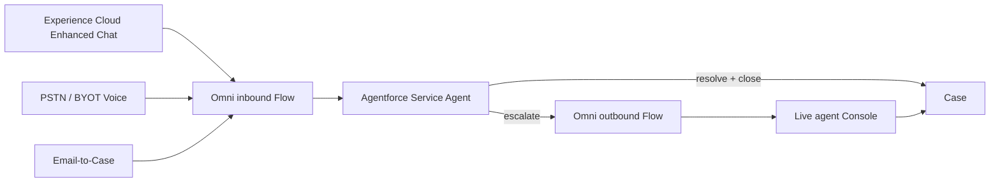

# 1.7 Scale Customer Support & Improve Customer Experience

## Salesforce Architecture Design — FreshSource Global (FSG)

**CRM of record:** Salesforce Sales Cloud + Service Cloud + Experience Cloud (same org as 1.1–1.6)  
**Channel/AI add-ons required to meet this problem as written:** see §2. These are **Service Cloud channel products**, not Commerce/Revenue/Marketing Cloud.  
**Platform guidance:** Unified Case + Omni-Channel; Agentforce Service Agent (or Einstein Bots) on Messaging and Voice; authenticated Experience Cloud context; least-privilege agent actions; 1.6 entitlements on **human** escalation only.

---

## 1. Designed problem statement

FSG buyers (and suppliers) need **fast, conversational** answers **while they are in the portal**, instead of waiting on email. Agents today juggle **disconnected voice, email, and chat** tools, which breaks during **seasonal spikes**. FSG **cannot hire** enough live agents.

The platform must:

| Need | Design implication |
| --- | --- |
| Understand / answer / **resolve** routine work **without a human** | An **AI service agent** with **actions** (Flows/Apex) on CRM data — not a static FAQ widget |
| **Digital + voice** | Same agent + same Omni-Channel, two channel connections (Messaging and Voice) |
| Seamless **escalation** | Omni **outbound** flow hands the **transcript + Case** to a live agent; customer does not repeat themselves |
| One agent desktop | **Service Console**: Case, Messaging Session, Voice Call — retire sidecar inboxes |
| Seasonal scale | Bot takes unbounded routine volume; humans only take **escalations** (and 1.6 2-hour perishable SLAs) |
| Portal | **Authenticated** Messaging on the buyer (and supplier) Experience Cloud sites |

**Routine (bot-resolvable) examples:** order status, allocation status, invoice copy, delivery ETA, service-tier eligibility, “how do I file spoilage?”, password/MFA, DC hours, catalog “is this SKU in season?”.

**Human-required (escalate):** spoilage/delay **claims** (1.6 SLA), credit amounts, allocation Director work (1.5), KYC, anything the bot cannot verify with sharing-safe data.

---

## 2. License reality (architect constraint)

**Sales + Service + Experience Cloud alone cannot** run autonomous **voice** or **in-portal conversational messaging**. Experience Cloud hosts the site; Service Cloud holds Cases and Omni-Channel. The **conversation fabric** is a Service add-on.

| Capability | Salesforce product (current recommendation) | Why it is needed |
| --- | --- | --- |
| Chat widget on Experience Cloud | **Messaging for In-App and Web** (Enhanced Chat) via Embedded Service Deployment | Replaces Live Agent; creates `MessagingSession` |
| Autonomous digital agent | **Agentforce Service Agent** (fallback: Einstein Bots) | Understand / respond / resolve; topics + actions |
| Autonomous + assisted **voice** | **Agentforce Voice** + telephony (**Salesforce Voice** / Agentforce Contact Center **or BYOT** SIP/partner) | Speech-to-text, same topics, Omni voice escalation |
| Email in the same omnichannel | Enhanced Email / Email-to-Case on **Enhanced Omni-Channel** | Kill the standalone email client |
| Grounding | **Knowledge** + optional Data Cloud (nice-to-have, not required for v1) | Approved answers; no hallucinated prices |

**If those SKUs are not purchased:** Phase 0 below (Knowledge + Screen Flows + Email-to-Case) **improves** email delay but **does not** satisfy conversational voice/digital. Do not pretend a Screen Flow is a voice bot.

The rest of this design assumes **Messaging + Agentforce Service Agent + a Voice connection** on the **existing** FSG org.

---

## 3. Architecture decisions (locked)

| Decision | Choice | Why (Salesforce recommendation) |
| --- | --- | --- |
| First responder | **Agentforce Service Agent** `FSG_Support_Agent` | Trailhead: inbound Omni Flow → AI agent; outbound Flow → human queue with history |
| Portal channel | **Enhanced Chat (MIAW)** on buyer + supplier LWR sites | Authenticated users; pre-chat = logged-in Contact |
| Voice | Same AI agent + **inbound/outbound Omni Voice flows** | Same escalation pattern as messaging |
| Work object | Always a **Case** (plus Messaging Session / Voice Call) | 1.6 entitlements, reporting, Sharing Sets |
| Bot identity | **Authenticated Experience user** for record actions; **restricted Agent User** only for Knowledge/guest | Least privilege. Guest/bot must **not** run as System Admin |
| Guest chat | Knowledge + “log in to see your order” only | Same guest lockdown as 1.1–1.6 |
| Escalation | Omni **Route Work** to 1.6 queues (language, region, enterprise, capacity) | Humans stay on perishable SLA; bot never “closes” a spoilage claim |
| Email | Email-to-Case → **same inbound Omni Flow** (bot first, then human) | One queueing model |
| Disconnected tools | **Retire** them; CTI/Voice into Salesforce; no parallel Zendesk/Teams as system of record | Operational inefficiency in the problem statement |

---

## 4. Personas, licenses, assignment

| Persona | License | Role |
| --- | --- | --- |
| Buyer / supplier (logged in) | HVU / Partner (1.1–1.3) | Chats/calls in the portal or phone; sees own Cases |
| Guest | Guest | Knowledge-only bot; no Orders |
| Agentforce Service Agent | Agent User + permission set **FSG_Bot_Authenticated_Actions** (narrow) | First responder |
| Live agent | Salesforce Service | Omni: messaging + voice + email + 1.6 Cases |
| Supervisor | Salesforce | Omni supervisor; bot deflection reports |

| Work item | First owner | Then |
| --- | --- | --- |
| New Messaging Session / Voice Call / Email | Inbound Omni Flow → **FSG_Support_Agent** | Bot resolves **or** outbound Flow → human queue |
| Escalated session | 1.6 `PS_Enterprise_{Region}` / `PS_Micro_{Region}` / supplier Q&C queue | Skills + **capacity** (unchanged) |
| New Case from bot | Automation / messaging user; Account = customer’s Account | Sharing Set as 1.2/1.6 |
| Spoilage intent | Bot **does not resolve**; creates 1.6 Case + escalates immediately | 2-hour entitlement stamp (1.6) |

---

## 5. Channel and data model

**Standard objects:** `MessagingSession`, `MessagingEndUser`, `VoiceCall` (if Voice), `EmailMessage`, `Case`, `CaseComment`, `KnowledgeArticle`, `User`, `Account`, `Contact`, `Order` (read via action).

**Reuse:** 1.6 `Perishable_Incident` Case; 1.2/1.3 Sharing Sets; Omni skills/capacity.

**Optional custom:** `Bot_Resolution__c` (session Id, intent, resolved Y/N, deflection) for reporting without mining transcripts.

Transcripts stay on Messaging Session / Voice Call. Do **not** copy full transcripts to a custom object the guest profile can read.

---

## 6. What the bot is allowed to do (topics + actions)

Ground the agent on **published Knowledge** (data categories: `Buyer`, `Supplier`, `Guest`). Actions are **Flows/Apex `with sharing`** invoked as the **end user** when authenticated.

| Topic | Action (with sharing) | Resolve without human? |
| --- | --- | --- |
| Order status / ETA | Query Order + `Allocation_Status__c` + shipment | Yes |
| Invoice copy | Latest `Invoice__c` + File link the user can access | Yes |
| Catalog / tier FAQ | Knowledge; **no** live rate-card SOQL (1.4: prices via existing catalog Apex only if user could already shop) | Yes |
| How to report spoilage | Knowledge + start 1.6 Screen Flow / create Case + **escalate** | Escalate |
| Password / MFA | Experience identity / Knowledge | Yes (or to login Help) |
| Credit amount / exception | None | Escalate |
| 1.5 re-allocation | None | Escalate (Director) |

**Guardrails (Salesforce-style):**

- Allow-listed objects/fields in actions; `StripInaccessible` / USER_MODE.
- Bot cannot Activate Orders, edit rate cards, change Entitlement, or see other Accounts.
- If SOQL returns 0 rows, say “I can’t see that order” — **never** guess.
- Prices: reuse `FsgPricingService` auth; bot does not dump PBE.
- Guest session: **zero** Order/Invoice actions.

---

## 7. End-to-end process (step by step)

### Phase 0 — Core only (if channel SKUs delayed)

1. Knowledge on both portals; guided Flows (track order, 1.6 incident).
2. Email-to-Case + Omni (1.6 skills/capacity).
3. **Outcome:** less email chaos, **not** conversational/voice.

### Phase 1 — Digital agent on Experience Cloud (Salesforce recommended)

4. Enable **Enhanced Omni-Channel**, Messaging, Agentforce Service Agent.
5. Build agent `FSG_Support_Agent`: topics above; Knowledge library; escalation subagent.
6. **Inbound Omni-Channel Flow:** Messaging Session created → identify Contact (pre-chat / logged-in user) → **Route Work** to the AI agent; if agent unavailable → human messaging queue (degraded mode).
7. Embedded Service Deployment → add **Enhanced Chat** to **FSG Corporate Buyer Portal** (and Supplier Network). Authenticated: pass User/Contact. Guest: Knowledge-only topic set.
8. Customer asks “Where is order 123?” → action queries **with sharing** → answers. Bot opens/closes a Case `Bot_Resolved` (Origin = Chat) for audit.
9. Customer says “the fish arrived spoiled” → bot collects facts, **inserts 1.6 Case** (same stamp Flow: Entitlement, 2-hour SLA), **Outbound Omni Flow** routes **Messaging Session + Case** to `PS_Enterprise_{Region}` (language + spoilage skills + capacity). Transcript visible in Console. Agent continues the **same thread**.
10. If **no human** is Online: session waits in queue; **1.6 milestone still runs** for perishable Cases (same as 1.6). Bot sends “a specialist will take this”; does **not** fake a claim decision.

### Phase 2 — Email into the same brain

11. Support@ email → Email-to-Case / Enhanced Email → **same inbound Flow** → bot drafts/resolves routine; else Omni email to humans. Agents stop using Outlook as the ticket system.

### Phase 3 — Voice (required for the problem’s voice clause)

12. Provision phone numbers (Salesforce Voice / Contact Center **or BYOT**).
13. **Inbound Voice Omni Flow** → same `FSG_Support_Agent` (Agentforce Voice: STT → intent → TTS).
14. **Outbound Voice Omni Flow** → live voice queue (same skills). Screen pop: Voice Call + Case + transcript. Optional whisper: “Customer already identified; spoilage claim Case 00012345.”
15. After-hours voice: bot resolves routine 24×7; perishable claims still create 1.6 Cases (clock runs).

### Seasonal spike mode

16. Supervisors do **not** hire: raise bot containment (more Knowledge + actions), **lower** live-agent concurrency for chat FAQs (already bot), **keep** capacity for Critical 1.6 work (work item size 2).
17. Reports: containment %, escalate %, 1.6 SLA on escalated only.

---

## 8. Sharing

| Object | External | Who |
| --- | --- | --- |
| Case | Sharing Set Account match (1.2/1.6) | Buyer sees bot-created and human Cases on **their** Account |
| Messaging Session | Channel user sees the widget; **no** HVU list of all sessions | Do not Sharing-Set sessions org-wide |
| Voice Call | Internal + the voice user | Not in the portal list |
| Knowledge | Data categories by site/profile | Guest: guest category only |
| Order / Invoice | Existing 1.2–1.4 | Bot actions **with sharing** — same as UI |

**Bot user:** must **not** have org-wide View All. Authenticated actions run as the **Experience user**. A separate **Guest Bot** permission set: Knowledge Read, no Account/Order.

**Live agents:** same regional restriction rules as 1.6. Transcripts follow Case access in Console (agent already has the Case).

**Share Group:** unchanged for HVU-owned Cases so queues see them.

**Guest:** no Case create except via bot **Knowledge** path; bot must not insert Cases for guests except “general inquiry” owned by a **queue** with **no** customer PII from CRM (or require login).

---

## 9. Security

1. **Object:** Agent permission sets are allow-list (Case create, Order Read, Invoice Read). No Setup, no rate cards, no inventory (1.5).
2. **Record:** USER_MODE / `with sharing` on every action. IDOR: Order Id must belong to `User.AccountId` (same as 1.6 Flow).
3. **Guest:** separate agent version or topic filter; Enhanced Chat guest user ≠ authenticated user.
4. **Prompt injection:** actions ignore user-supplied SOQL; bind variables only; no “ignore policies” tool.
5. **PII:** transcripts in Salesforce; Event Monitoring; retention; voice **consent** prompt.
6. **MFA** for humans; portal session for authenticated chat.
7. **CORS / Trusted URLs** only FSG Experience domains (Salesforce embed guide).
8. **Einstein/Agentforce:** do not ground on unpublished Knowledge or supplier PII data categories.

---

## 10. Live-agent experience (kill disconnected systems)

Single **Service Console** with Omni for **Messaging, Voice, Email, Cases** (1.6).

- Accept work → see transcript, Case, Order, entitlement banner.
- Same language/region/capacity model as 1.6.
- No requirement to log into a separate chat vendor or phone turret **as the system of record** (BYOT is allowed **behind** Salesforce Voice).

---

## 11. Automation catalog

| Automation | Type | Purpose |
| --- | --- | --- |
| Inbound_Messaging_To_Bot | Omni-Channel Flow | Route session to Agentforce |
| Outbound_Bot_To_Human | Omni-Channel Flow | Escalate + keep history |
| Inbound_Voice_To_Bot / Outbound_Voice_To_Human | Omni-Channel Flow | Same for PSTN |
| Inbound_Email_To_Bot | Omni-Channel Flow | Unify email |
| Bot_Order_Status | Flow/Apex with sharing | Routine resolve |
| Bot_Create_Perishable_Case | Subflow | Reuse 1.6 stamp + entitlement |
| Knowledge data categories | Knowledge | Grounding |

---

## 12. Coexistence with 1.1–1.6

| Prior | 1.7 |
| --- | --- |
| 1.6 2-hour SLA | Applies when bot **escalates a perishable Case**, not to bot FAQs |
| Omni skills/capacity | Humans only receive **escalations** + email the bot cannot close |
| Guest lockdown | Guest bot = Knowledge only |
| 1.4/1.5 sensitive objects | Not in bot allow-list |

---

## 13. Implementation sequence

1. Knowledge model + data categories; Phase 0 Flows/Email-to-Case (immediate pain relief).
2. Messaging + Enhanced Omni + Embedded Chat on buyer portal (authenticated).
3. Agentforce Service Agent topics/actions; inbound/outbound Omni Flows; Console.
4. Wire spoilage intent → 1.6 Case + human queue.
5. Email onto Omni; retire extra inboxes.
6. Voice numbers + Voice Omni Flows (same agent).
7. UAT: (a) logged-in chef gets **their** order status, not another branch; (b) guest cannot retrieve an Order Id; (c) spoilage escalates with transcript and **2-hour** entitlement; (d) Spanish session only to ES-skilled humans; (e) bot cannot Read `Fulfillment_Rate_Line__c`; (f) after-hours FAQ resolved with no agent Online; (g) voice escalation screen-pops the same Case.

---

## 14. Salesforce documentation mapped to this design

| Topic | Guidance used |
| --- | --- |
| Inbound Omni → AI agent; outbound Omni → human with history | Trailhead: Agentforce deployment, messaging connection |
| Embed agent on Experience Cloud | Embedded Service Deployment + Messaging for In-App and Web |
| Voice uses the same Omni inbound/outbound pattern | Trailhead: Voice connection for AI service agents |
| Messaging/Voice are Contact Center / Digital Engagement SKUs | Agentforce Contact Center product guidance |
| Sharing Sets + USER_MODE actions | Experience Cloud + Apex security; 1.2/1.6 |
| Entitlements on human perishable Cases | 1.6 / Service Cloud milestones |

---

## 15. Final outcome (brief)

- **Routine** portal and phone questions are handled **24×7 by Agentforce Service Agent** (actions **with sharing**), so FSG does not scale live headcount for FAQs.
- **Enhanced Chat** on Experience Cloud and **Voice** use the **same** agent and **same** Omni-Channel; email joins that fabric — agents leave disconnected tools.
- **Complex** work (spoilage/delay, credit, allocation) **escalates** with transcript to **1.6** skilled, capacity-aware humans; enterprise **2-hour SLA** still applies.
- Guests get **Knowledge only**; authenticated buyers see **only their** Account data; rate cards/inventory stay off the bot.
- **Sales + Service + Experience Cloud** remain the CRM; **Messaging + Agentforce (+ Voice telephony)** are the required Service add-ons. Without them, only Phase 0 (Knowledge/Flows/Email-to-Case) is possible — and that does **not** meet the conversational/voice requirement.
