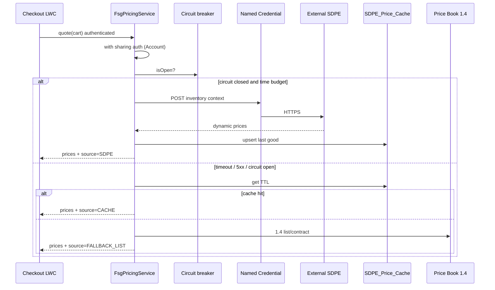

# 2.1 Spoilage & Dynamic Pricing Engine (SDPE)

## Salesforce Architecture Design — FreshSource Global (FSG)

**Clouds:** Salesforce Sales Cloud + Service Cloud + Experience Cloud (same org as 1.1–1.7). **SDPE is external** (not a Salesforce product).  
**Depends on:** 1.4 `FsgPricingService` (goods Price Book + fulfillment rate cards), 1.5 inventory context (RDC, qty, temp class), authenticated checkout (1.2/1.3).  
**Platform guidance:** Integration pattern **Remote Process Invocation — Request and Reply**; **Named Credentials**; never call the engine from the browser; **fail-open checkout** with a documented fallback price.

This document first lists **every viable pattern**, then locks a **recommended hybrid**.

---

## 1. Designed problem statement

At checkout, Salesforce must send **inventory context** to FSG’s proprietary **SDPE** and receive **dynamic perishable prices** (remaining shelf-life, demand, discounts).

If SDPE is **down, slow, or returns errors**, checkout must **still complete**. Buyers must not see another customer’s prices. Secrets must not sit in Experience Cloud or Apex.

**Inventory context to send (minimum):** Account/RDC Id, Product/SKU, qty, temperature class, requested service tier, requested ship date, on-hand/reserved if available (1.5), maybe days-on-hand. **Do not send:** tax ids, payment data, other customers’ orders, rate-card internals.

---

## 2. All possible solutions (catalog)

Salesforce can talk to SDPE in several **integration styles**. They can also **cache** and **fall back** in several ways. Mix one style + one fallback.

### 2.1 Integration styles (how Salesforce gets an SDPE price)

| # | Pattern | How it works | Checkout fit | Salesforce docs / notes |
| --- | --- | --- | --- | --- |
| A | **Synchronous Apex HTTP callout** | `FsgPricingService` → Named Credential → SDPE REST; wait for JSON | **Best primary** — price needed before submit | *Remote Process Invocation — Request and Reply*. Timeout ≤ 120s; UX should abort ~2–3s |
| B | **Apex Continuation** | Async HTTP from LWC/VF; callback with price | Good if SDPE is **slow** (3–10s) but checkout can wait | Continuation for long-running callouts; more moving parts on LWR |
| C | **External Services (OpenAPI)** | Register SDPE OpenAPI; invoke from **Flow** | Same as A, more declarative | Good if pricing stays in Flow; still a sync callout |
| D | **MuleSoft / middleware façade** | Salesforce calls MuleSoft; MuleSoft calls SDPE + cache/circuit breaker | Strong for enterprise ops, retries, mapping | Extra product; Salesforce still uses Named Credential to MuleSoft |
| E | **Salesforce Connect (OData / custom adapter)** | External Object `SDPE_Price__x` queried in Apex | Weak — SDPE is a **calculator**, not a stable table | Connect is for remote **data**, not real-time quote engines |
| F | **Inbound push (SDPE → Salesforce)** | SDPE writes `Dynamic_Price__c` on a schedule or event (Composite/Bulk/PE) | Checkout is **100% native** (fast, resilient) | Prices can be **stale** vs true real-time; good **complement** to A |
| G | **Platform Events / CDC outbound** | Order/cart event → SDPE; SDPE responds async | **Poor for checkout** — user cannot wait on an event | Fire-and-forget / request-callback; use for cache **refresh**, not the click |
| H | **Queueable / `@future` / Batch** | Async Apex callout | **Poor for checkout** | Fine for cache warm-up and retry |
| I | **Heroku / Salesforce Functions / off-core** | Custom app calls SDPE | Extra runtime; same security questions | Avoid unless SDPE protocol is not HTTPS/JSON |
| J | **Client-side LWC → SDPE** | Browser calls SDPE | **Forbidden** | Exposes URL/keys; bypasses sharing; CORS nightmare |
| K | **Commerce Cart Calculate / CPQ** | Commerce or CPQ hook | **Out of stated stack** | Not Sales+Service+Experience |

**Combinations that make sense:** **A+F**, **A+D**, **B+F**, **C+F**. **G/H** only as cache refresh. **E/J/K** rejected for this problem.

### 2.2 Fallback styles (when SDPE is unavailable)

Checkout **must fail open** (problem statement). Pick one **price source of last resort** plus **circuit breaker**.

| # | Fallback | Behavior | Risk |
| --- | --- | --- | --- |
| F1 | **1.4 Price Book + volume / contract %** | Use last contracted/wholesale list | No spoilage discount; FSG may **overcharge** vs SDPE |
| F2 | **Platform Cache** last good SDPE quote (SKU+RDC+tier) | Sub-second; volatile (org cache eviction) | May miss after restart; pair with F3 |
| F3 | **Durable cache object** `SDPE_Price_Cache__c` | Last successful quote + timestamp; TTL (e.g. 15–60 min) | Slightly stale demand/shelf-life |
| F4 | **Stale-while-revalidate** | Return F3 immediately; Queueable refresh if TTL expired | Best UX; still needs F1 if cache empty |
| F5 | **Fail closed** (block checkout) | Show error | **Violates** “fully operational” — **do not use** as sole path |
| F6 | **Degraded SKU drop** | If no price for a line, remove perishable lines / allow dry goods | Harsh UX; optional for zero-cache SKUs |
| F7 | **Circuit breaker** | After N failures, skip callout for T minutes; use F1/F3 | Protects governor limits and SDPE during outage |
| F8 | **Idempotent retry** | 1–2 retries on 429/503 with backoff, then fallback | Do not retry 401/400 in a loop |

**Recommended fallback stack:** **F7 + F4 + F3 + F1** (circuit breaker → cache if fresh/stale → else 1.4 list price). Always **tell the buyer** “standard pricing applied” when not live SDPE (honest UX; optional).

### 2.3 Where inventory context comes from

| Source | Use |
| --- | --- |
| 1.5 `RDC_Inventory__c` | On-hand, reserved, available at allocated or home RDC |
| Order / cart lines | SKU, qty, temp class, weight (1.4) |
| Account | Region, `Primary_DC__c`, agreement number (not the whole Contract) |
| Shipment slot date | Requested ship date for shelf-life |

Send a **DTO**, not raw Salesforce Ids if SDPE does not need them (external SKU + DC code).

---

## 3. Recommended solution (locked)

**Primary:** Pattern **A** — sync Apex callout from `FsgPricingService` (extend 1.4), **server-side only**.  
**Cache warm:** Pattern **F + H** — SDPE or a scheduled job upserts `SDPE_Price_Cache__c`; optional MuleSoft (**D**) if FSG already has it.  
**Fallback:** **F7 + F3 + F1** (circuit breaker → durable cache if `Last_Success__c` within TTL → else Price Book).  
**Not used at click:** G, E, J, K.

Optional upgrade: wrap SDPE in **MuleSoft** for SLA, mapping, and breaker **outside** Apex governor limits — Salesforce still calls **one** Named Credential.

---

## 4. Data model (Salesforce side)

| Object | Type | Purpose |
| --- | --- | --- |
| `SDPE_Price_Cache__c` | Custom | External Id = DC + SKU + UOM + currency; `Unit_Price__c`, `Discount_Pct__c`, `Shelf_Life_Hours__c`, `Demand_Index__c`, `Source__c`, `Received_At__c`, TTL |
| `SDPE_Callout_Log__c` | Custom | Status, latency, HTTP code, **no** payload PII; 7-day purge |
| `SDPE_Health__c` (1 row or CMDT + Custom Setting) | Custom / CMDT | `Failure_Count__c`, `Circuit_Open_Until__c` |
| `Named Credential` `NC_SDPE` | Setup | URL + External Credential (OAuth2 client credentials or named principal API key) |
| Existing 1.4 Price Book / PBE | Standard | Fallback goods price |
| `Order` / `OrderItem` | Standard | Persist `Price_Source__c` (`SDPE` / `CACHE` / `LIST`) on snapshot (1.4) |
| `Case` `SDPE_Outage` | Standard | Opened when circuit opens; closed when healthy |

Do **not** store SDPE API keys on Custom Objects.

Cache rows: **Lookup to Product2 and RDC Account is optional**. Prefer **external codes** on the cache to avoid 15k-branch lookup skew and to survive Product Id changes. If you lookup Product2, one Product will have many cache children (one per DC) — that is fine (DCs ≪ 10k).

---

## 5. Runtime (step by step)

1. HVU checkout calls `FsgPricingService` (same auth as 1.4: running user’s Account / ACR).
2. Build **inventory context** from cart + 1.5 availability for the **home or allocated** RDC (if not yet allocated, use `Primary_DC__c`).
3. If circuit **open** → skip to step 7.
4. HTTP POST via `NC_SDPE`, timeout **2–3 seconds** (HttpRequest.setTimeout). One callout **per cart** (batch lines in one payload) to stay in governor limits (50k orders/day cannot do N callouts per SKU synchronously without flattening).
5. On **2xx**: validate line prices (numeric, currency, SKU match); apply **floor** (never below FSG min margin Custom Metadata); merge with **1.4 fulfillment** fees (SDPE prices **goods**, not trucking, unless SDPE is extended later).
6. Upsert cache; reset failure count; return DTO `source=SDPE`.
7. On timeout, 5xx, 429 after one retry, parse error, or circuit open: read cache for each SKU+DC. If `Received_At__c` ≥ now − TTL → `source=CACHE`. Else **1.4** PBE + volume/contract → `source=LIST`.
8. Increment failure count; if ≥ threshold, set `Circuit_Open_Until__c` = now + 5–15 min; insert/update **Case** `SDPE_Outage` (see assignment).
9. Submit Order: **re-call** the same function (same as 1.4 recalc). Persist `Price_Source__c` on snapshot. Buyer **cannot** post their own unit prices.
10. Scheduled **Queueable** every 5–15 min (and after circuit open): health ping + cache refresh for top SKUs (pattern H), so fallback stays warm during a brownout.

**Experience Cloud:** LWC never sees the SDPE URL. Only Apex.

---

## 6. Sharing

| Object | Internal OWD | External OWD | Access |
| --- | --- | --- | --- |
| `SDPE_Price_Cache__c` | Private | Private | **No** Sharing Set. Apex `without sharing` **after** Account auth (same as 1.4 catalog). HVU **no** object CRUD |
| `SDPE_Callout_Log__c` | Private | Private | Integration + Pricing/IT only |
| `SDPE_Health__c` | Private | Private | Integration user |
| Price Book / PBE | As 1.4 | No HVU FLS | Fallback in Apex |
| Case outage | Private | Private | Ops queue; **not** the buyer |

Buyers see only the **quoted number** on the cart/Order they already can access (CBP/Sharing Set). They never list the cache.

Restriction rules: Pricing/IT regional if needed; usually a **central integration** public group is enough (few users).

---

## 7. Security

1. **Named Credential + External Credential** (no hardcoded secrets; rotate in Setup). Named **Principal** (integration identity), not each chef.
2. **No client callouts.** CSP on Experience Cloud does not include SDPE.
3. **Least payload:** SKU, DC code, qty, temp, ship date, available qty. No names, emails, tax ids.
4. **Inbound (pattern F):** Dedicated **API User** + Connected App + IP allowlist; only upsert cache object; no `Modify All`.
5. **Price integrity:** Server recalc on submit; floors/ceilings; reject negative prices.
6. **Logs:** status/latency only; strip bodies or hash SKUs if required.
7. **TLS** only; certificate pinning via Named Credential.
8. Guest checkout does not exist (1.2/1.3); guest cannot invoke `FsgPricingService`.

---

## 8. Assignment

| Record / event | Owner | How |
| --- | --- | --- |
| `SDPE_Price_Cache__c` | Integration user | API / pricing Apex |
| Circuit opens | Case `SDPE_Outage` → Omni queue **IT_Integration** or Pricing ops | Flow on health object |
| Circuit closes | Same Case Closed | Health ping success |
| Fallback rate too long | Escalation Case to Pricing Manager | Scheduled: cache age > X and circuit open |

Humans do **not** own checkout quotes. Directors (1.5) do not need SDPE access.

---

## 9. Limits and resilience (Salesforce)

- **One batched callout per quote**, not per line (heap/time/callout limits).
- Callout **timeout** shorter than the LWC spinner budget.
- Circuit breaker avoids hammering a dead SDPE (and burning daily callout/API).
- Cache object is **selective** (External Id); no row-lock on Product2.
- 50k orders/day: prefer **warm cache + short sync call** when healthy; during outage **zero** callouts (circuit open) so checkout stays on Salesforce.

---

## 10. Mapping to 1.4

| 1.4 | 2.1 |
| --- | --- |
| Goods = Price Book | Goods = **SDPE if up**, else cache, else Price Book |
| Fulfillment = rate card | **Unchanged** (unless SDPE later owns freight — not in this problem) |
| Snapshot on Order | Add `Price_Source__c` |
| HVU no PBE FLS | HVU no cache FLS either |

---

## 11. Implementation sequence

1. Named Credential, cache/log/health objects, OWD Private, integration user, floors in CMDT.
2. Extend `FsgPricingService`: context DTO, callout, validate, cache, breaker, fallback.
3. Cart LWC: show optional “promotional perishable price” vs “standard price”.
4. Order snapshot field; submit recalc.
5. Health Case Flow; scheduled cache warm.
6. Optional MuleSoft façade; optional SDPE push (F) for freshness.
7. UAT: (a) SDPE up → source SDPE; (b) timeout → cache; (c) empty cache → 1.4 list and Order still submits; (d) circuit opens after N failures and checkout skips callout; (e) HVU cannot query cache; (f) LWC network tab has no SDPE host; (g) chef cannot use another branch’s quote; (h) fulfillment fee still from 1.4.

---

## 12. Salesforce documentation mapped here

| Topic | Guidance |
| --- | --- |
| Sync quote at checkout | Integration pattern **Request and Reply** |
| Secrets | Named / External Credentials |
| Long SDPE | Continuations (option B), not `@future` |
| Cache | Platform Cache (volatile) + **custom object** (durable) |
| Connect External Objects | Not for a pricing **engine** |
| Experience Cloud | Custom access control; no guest/browser callouts |
| Fail open | Business continuity; persist `Price_Source__c` for audit |

---

## 13. Final outcome (brief)

- **All viable paths:** sync Apex (A), Continuation (B), External Services (C), MuleSoft (D), Connect (E — poor), SDPE push (F), events/batch (G/H — cache only), Functions (I), **browser (J — never)**, Commerce/CPQ (K — out of stack).
- **Chosen:** **A + durable cache (F3) + 1.4 list (F1) + circuit breaker (F7)**; optional MuleSoft and SDPE push to warm cache.
- Checkout always returns a price: **live SDPE → cache → Price Book**.
- Inventory context is a **server DTO** from cart + 1.5; **Named Credential** only.
- HVU never Read cache/logs; submit **recalculates**; Order stores **price source**.
- Outage opens an **internal Case**; buyers still check out.
