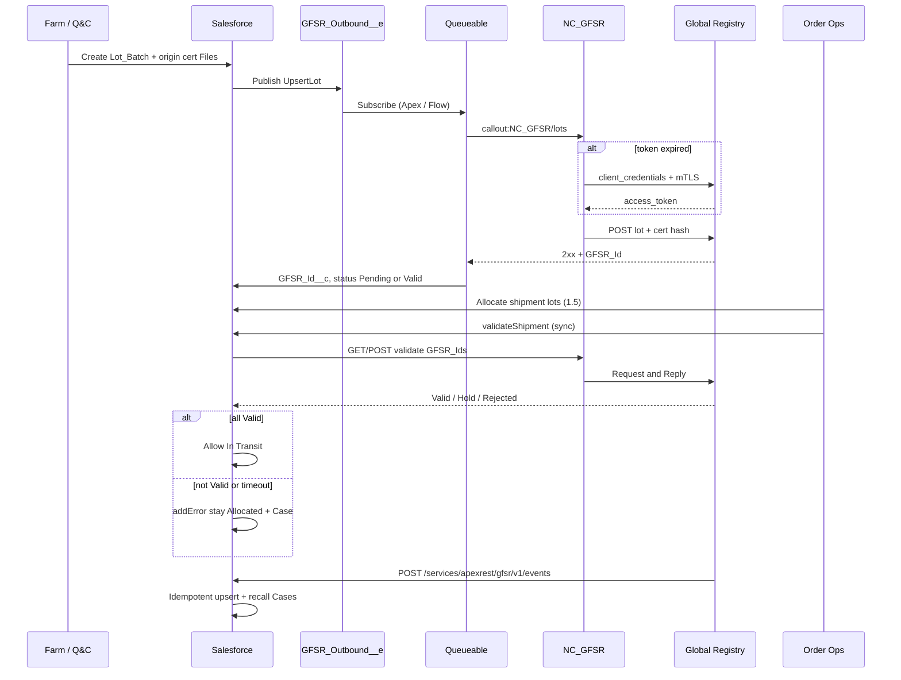

# 2.2 Global Food Safety & Traceability Registry (GFSR)

## Salesforce Architecture Design — FreshSource Global (FSG)

**Best-path design** on **Sales Cloud + Service Cloud + Experience Cloud only**. GFSR is **external** (national/supranational). No Commerce Cloud, CPQ, Order Management, Field Service, or Marketing Cloud.

**Depends on:** 1.1 farm origin certs and Files; 1.5 shipments / RDC allocation; 1.2–1.3 Orders; 1.6 perishable incident Cases.

**Contrast with 2.1 SDPE:** pricing **fail-open** at checkout (cart always completes). **Cross-border dispatch is fail-closed** until GFSR says the lots, origin certificates, and import docs are Valid / Accepted. Food safety outranks uptime.

**Salesforce patterns used** (Architects Guide — *Integration Patterns and Practices*):

| Pattern | Where used |
| --- | --- |
| *Remote Process Invocation — Fire and Forget* | Register / update lots, cert metadata, and import dossiers (Platform Event → Queueable callout) |
| *Remote Process Invocation — Request and Reply* | Border gate: `GfsrValidationService.validateShipment` before **In Transit** |
| *Batch Data Synchronization* | Nightly GET of `Pending` lots to catch missed webhooks |
| *Remote Call-In* (Apex REST) | GFSR → Salesforce status / Hold / Recall events |

Named Credential + External Credential (not Remote Site + hardcoded URL). No browser callouts. No Salesforce Connect as the operational system of record.

---

## 1. Designed problem statement

For **international and cross-border perishable shipments**, Salesforce must **bi-directionally** synchronize with the Global Food Safety Registry:

| Data | Outbound (Salesforce → GFSR) | Inbound (GFSR → Salesforce) |
| --- | --- | --- |
| Batch **lot numbers** | Register / update harvest, SKU, farm, expiry | `Valid` / `Rejected` / `Hold` / `Recalled` |
| **Farm origin certificates** (1.1) | Cert metadata + **SHA-256** of the File | Expiry, revocation, registry id |
| **Import compliance documentation** | Dossier (phytosanitary, customs, origin) | `Accepted` / `Rejected` |

**Secure:** secrets only in Named / External Credentials; least privilege; Experience Cloud **guest and buyer users never call GFSR**. Traceability chain stays in Salesforce: **farm → lot → shipment → order**.

---

## 2. Best-path decisions (locked)

| Decision | Choice | Why (Salesforce recommendation) |
| --- | --- | --- |
| Legal SoR | **GFSR** for official validity | Government / supranational registry is the legal source of Valid / Hold / Recall |
| Operational SoR | **Salesforce** lots, shipments, Files, Cases | FSG must pick, allocate (1.5), ship, and support (1.6) even when GFSR is slow |
| Outbound register | Platform Event `GFSR_Outbound__e` → Queueable `Database.AllowsCallouts` via `NC_GFSR` | Architect Guide: Fire and Forget for DML-initiated remote work. Triggers **cannot** call out synchronously. Queueable provides guaranteed retry (unlike fire-and-forget with no subscriber retry) |
| Dispatch gate | **Sync** `GfsrValidationService.validateShipment` | Request and Reply — the only moment that must be right before cargo moves |
| Inbound | Apex REST `/gfsr/v1/events` + upsert by External Id `GFSR_Id__c` | Custom transaction: idempotent log + lot/doc update + Case fan-out. Standard REST sObject API cannot encapsulate that. GFSR typically POSTs webhooks; it will not subscribe to Salesforce Pub/Sub |
| Nightly | Batch Apex GET of `Pending` older than SLA | Batch Data Synchronization — catches missed / delayed webhooks |
| Auth to GFSR | **OAuth 2.0 Client Credentials + mTLS** on Named Credential, identity **Named Principal** | Same family as 2.1 `NC_SDPE`. Not Per-User (8k farms / 150k buyers have no GFSR logins). mTLS is typical for food-safety / customs APIs |
| Inbound auth | Connected App, **JWT Bearer** (preferred) or Client Credentials; IP allowlist; Integration User | Salesforce Help: OAuth for inbound REST. JWT is the agency pattern (certificate, no shared secret in flight) |
| Fail closed | International shipment **cannot** go **In Transit** unless all lots `Valid`, certs not revoked, required docs `Accepted` | Opposite of 2.1. If GFSR is down, stay **Allocated** |
| Documents | Salesforce **Files** (`ContentVersion`); outbound **SHA-256 + metadata**; binary only if GFSR requires it | Do not store PDFs in Long Text. No public `ContentDistribution` |
| Middleware | **Direct REST first** | Stay on core. Add MuleSoft **only** if GFSR is EDI / AS2 / SOAP / multi-agency fan-out |
| External Objects | **Not** the operational SoR | Salesforce Connect is a **live query**, not bi-directional sync. `__x` cannot host Files, Sharing Sets, last-known status when GFSR is down, or fail-closed dispatch. Optional read-only peek for Compliance UI only |
| Who calls GFSR | **Order Ops / automation user** — never HVU or Partner | Unlike 2.1 quote (runs in the buyer transaction), Named Credential principal is **not** granted to community users |

**Rejected:** External Objects as SoR; browser / LWC callouts to GFSR; Outbound Messaging (legacy; replace with Platform Events); `@future` as the only retry; fail-open international ship; Person Accounts; guest Apex.

---

## 3. Data model

| Object | Role |
| --- | --- |
| `Lot_Batch__c` | Lot number, farm Account (`Supplier_Account__c`), Product, harvest / expiry, origin cert lookup, `GFSR_Id__c` (**External Id**, unique), `GFSR_Status__c`, `GFSR_Last_Validated__c`, `Ready_To_Submit__c` |
| `Shipment_Lot__c` | Junction: `Cold_Chain_Shipment__c` ↔ `Lot_Batch__c` + qty; **`Buyer_Account__c`** for Sharing Set |
| `Import_Compliance_Doc__c` | Phytosanitary / customs / origin; File; `GFSR_Document_Id__c` (External Id); `GFSR_Doc_Status__c` |
| `Food_Safety_Certification__c` | **Reuse 1.1** origin cert (do not clone blobs) |
| `GFSR_Sync_Log__c` | Direction, correlation Id (External Id), HTTP, retries; **no PII body**; purge policy |
| `Cold_Chain_Shipment__c` | `Is_International__c`; `Fulfillment_DC__c` (1.5 Account `Distribution_Center`); blocked until Valid |
| `Country_Lane__mdt` | Origin/dest pair → international flag + required doc types |
| `GFSR_Settings__mdt` | Validate timeout (5–8s), Queueable max retries, Pending SLA hours |

`GFSR_Status__c`: `Not_Submitted` → `Pending` → `Valid` \| `Rejected` \| `Hold` \| `Recalled`.

**Traceability chain (local, always queryable):**

`Account (Official_Supplier)` → `Food_Safety_Certification__c` + Files → `Lot_Batch__c` → `Shipment_Lot__c` → `Cold_Chain_Shipment__c` → `Order` → buyer `Account`.

---

## 4. Authentication (best flow)

There are **three** authentications. They must not be mixed. (Same split as 2.1: portal login ≠ integration login.)

| Hop | Who | Best flow | Why |
| --- | --- | --- | --- |
| 1. Farmer / buyer → Salesforce | Partner (1.1) or HVU (1.2/1.3) | Experience Cloud Login Discovery + MFA | Sharing and Account context come from **User → Contact → Account** |
| 2. Salesforce → GFSR | Integration / Order Ops automation | **OAuth 2.0 Client Credentials** on External Credential + **mTLS** client certificate on Named Credential `NC_GFSR`, **Named Principal** | Machine-to-machine. Farms and chefs have no GFSR identities. Salesforce stores and refreshes the access token; Apex never sees the client secret |
| 3. GFSR → Salesforce | GFSR / agency middleware | Connected App **JWT Bearer** (or Client Credentials); optional inbound mTLS on port **8443** | Agency systems prefer certificates. Integration User only |

### 4.1 Salesforce → GFSR setup (Help: Named Credentials / External Credentials / client certificates)

1. Certificate and Key Management: generate or import the **client certificate** (CSR in Salesforce so the private key never leaves the org). GFSR signs / trusts it.
2. External Credential `EC_GFSR`: protocol **OAuth 2.0**, flow **Client Credentials** (token URL + client id/secret on the **Named Principal** `FSG_GFSR_App`).
3. Named Credential `NC_GFSR`: API base URL; External Credential = `EC_GFSR`; attach the **mutual TLS** certificate; `Generate Authorization Header` = true; **do not** allow merge fields in body.
4. Apex uses **only** `callout:NC_GFSR/...`. Token refresh is automatic. **401 after refresh** = fail-closed at dispatch; Queueable retry for async upserts.
5. Permission set `PSG_GFSR_Callout`: **External Credential Principal Access** to `FSG_GFSR_App`. Assign to the **integration / automation user** that runs Queueable and `validateShipment`. **Do not** grant this to HVU or Partner (unlike 2.1 checkout, which must run as the buyer).
6. If GFSR cannot do OAuth: External Credential **Custom** (API key in a named header) still via Named Credential — treat as a downgrade. Still use mTLS if offered.

### 4.2 GFSR → Salesforce setup

7. Connected App `FSG_GFSR_Inbound`: OAuth scopes `api` (and `refresh_token` only if using a refreshable flow). **JWT Bearer:** upload GFSR’s public certificate; **Admin approved users are pre-authorized**; pre-authorize the Integration User’s profile. **Client Credentials** is acceptable if the agency cannot mint JWTs.
8. Integration User: **API Only**; CRUD only on `Lot_Batch__c`, `Import_Compliance_Doc__c`, `GFSR_Sync_Log__c`; **Create** Case. **No** View All Data if the Apex REST class is scoped. **No role** (avoid skew).
9. Network Access / Connected App IP relax **off**; **IP allowlist** to GFSR egress. TLS 1.2+. Optional: **Enforce SSL/TLS Mutual Authentication** on the Integration User (inbound mTLS, port 8443) when the agency can present a client cert.
10. Farmers authenticate to **Experience Cloud** (1.1 Partner). That login is **not** a GFSR login.

---

## 5. Detailed step-by-step

### A. Setup (once)

1. Custom objects above; External Ids unique; **Shield Platform Encryption** (or Classic encryption) on lot number / cert numbers if FSG’s compliance requires it; **OWD Private** internal and external on all GFSR objects.
2. Field History on `Lot_Batch__c.GFSR_Status__c` and `Import_Compliance_Doc__c.GFSR_Doc_Status__c`.
3. `NC_GFSR` + Connected App + Integration User as in section 4.
4. Permission sets:
   - `PSG_GFSR_Integration` — Integration User (CRUD lots/docs/logs, Create Case, principal access).
   - `PSG_GFSR_Compliance` — Q&C / Trade Compliance (Read/Write lots and import packs; Read logs).
   - `PSG_GFSR_Farm` — Partner: CRUD **own** lots/certs via sharing; Read `GFSR_Status__c`; **no** principal access.
   - Buyer HVU: Read `Shipment_Lot__c` via Sharing Set only; FLS hides farm tax id / full cert numbers / import Files.
   - **Guest: nothing** (no Apex, no objects, no Files).
5. Custom Metadata: `Country_Lane__mdt` (origin/dest → `Is_International__c` + required doc types); `GFSR_Settings__mdt` (timeout 5000–8000 ms, retries, Pending SLA).
6. Omni-Channel queues `Trade_Compliance_{Region}` (language skill) and reuse 1.1 Q&C (commodity + region).
7. High-volume Platform Event `GFSR_Outbound__e`: `Lot_Id__c`, `Shipment_Id__c`, `Action__c` (`UpsertLot` \| `UpsertDossier` \| `ValidateAsync`), `Correlation_Id__c`.
8. Named Credential replaces Remote Site Settings (Salesforce recommendation).

### B. Outbound — register lot and certificates (Fire and Forget)

9. Farm (Partner site) or Q&C creates `Lot_Batch__c`, links a **valid** 1.1 `Food_Safety_Certification__c` + Files. Status `Ready_To_Submit`.
10. After-save **Record-Triggered Flow** (or trigger) publishes `GFSR_Outbound__e` (`Action__c = UpsertLot`). **Do not** call out from the trigger — Salesforce forbids synchronous callouts in trigger context (Architect Guide: Fire and Forget).
11. Platform Event–triggered Flow **or** Apex trigger on `__e` enqueues `GfsrOutboundQueueable` (`Database.AllowsCallouts`).
12. Queueable loads lot + cert metadata + **SHA-256** of latest `ContentVersion`; POST `callout:NC_GFSR/lots`. Send **minimized** payload: lot number, SKU, harvest/expiry, farm registry id, cert hash, correlation Id. **Do not** send buyer PII, payment, or other farms’ lots.
13. **2xx:** store `GFSR_Id__c`; set `GFSR_Status__c` to `Pending` or `Valid` if the API is synchronous; write `GFSR_Sync_Log__c` with correlation Id.
14. **429 / 5xx / timeout:** chain Queueable with exponential backoff (Salesforce: Queueable chaining). After N failures: insert Case `GFSR_Sync_Failure` → Omni `Trade_Compliance_{Region}`. **Do not** set `Valid`.
15. When warehouse attaches `Import_Compliance_Doc__c` + File, publish the same event with `Action__c = UpsertDossier` (hash + metadata; binary only if GFSR requires).

### C. Cross-border dispatch gate (Request and Reply)

16. 1.5 allocates RDC (`Account` record type `Distribution_Center`); warehouse adds `Shipment_Lot__c` (FEFO). If dest country ≠ origin (CMDT) → `Is_International__c = true`. **Domestic** shipments skip GFSR validate.
17. Before **Activate / In Transit**, a **before-save Flow** or Apex service calls `GfsrValidationService.validateShipment(shipmentId)` **synchronously**. Timeout **5–8 seconds** (`HttpRequest.setTimeout`) — **not** the 2–3s SDPE checkout timeout; this call is allowed to wait. Still far below the 120s Apex maximum.
18. Request: list of `GFSR_Id__c` + dest country + required doc types. Response: current status per lot and doc.
19. **All** lots `Valid` **and** origin certs not revoked **and** required docs `Accepted` → allow status **In Transit**. Stamp `GFSR_Last_Validated__c`.
20. Else **`addError`** / stay **Allocated**. Insert Case to Q&C with GFSR reason codes. Buyer portal message: “food-safety / import clearance pending.” **No silent ship if GFSR is down, times out, or returns 5xx** (fail-closed — opposite of 2.1).
21. Circuit **does not** fail-open. Optional: cache last successful validate for **display only**; it **must not** clear the gate.

### D. Inbound — status, hold, recall (Remote Call-In)

22. GFSR POST `https://{myDomain}/services/apexrest/gfsr/v1/events` (`@RestResource(urlMapping='/gfsr/v1/events')`) with correlation Id, `GFSR_Id__c`, new status, optional document statuses, optional recall reason.
23. Authenticate via hop 3 (JWT / Client Credentials). Apex runs as Integration User.
24. If correlation Id already exists on `GFSR_Sync_Log__c` → **200 no-op** (idempotent; required because agencies retry).
25. Upsert `Lot_Batch__c` / `Import_Compliance_Doc__c` by External Id (Salesforce recommendation for inbound sync).
26. If `Hold` or `Recalled`:
    - Mark lot ineligible for new `Shipment_Lot__c`.
    - Release **unused** 1.5 reservations (`RDC_Capacity_Slot__c` / inventory) for lots not yet In Transit.
    - Insert **parent** Q&C Case (`Perishable_Incident` / `Food_Safety_Recall`).
    - Fan-out **child Cases** to each `Buyer_Account__c` on in-transit or delivered `Shipment_Lot__c` (1.6 sharing / Entitlements).
27. Return 200 with Salesforce Ids. Return 400 for schema errors (do not retry). Return 503 only if Salesforce itself cannot persist (GFSR may retry).

### E. Nightly reconcile (Batch Data Synchronization)

28. Schedulable Batch Apex: query `Lot_Batch__c` where `GFSR_Status__c = Pending` and `LastModifiedDate` older than CMDT SLA.
29. Per-execute (governor-safe chunks): GET `callout:NC_GFSR/lots/{GFSR_Id}` (or a bulk status API if GFSR offers one). Align local status. Same Hold/Recall Case logic as inbound.
30. This is the Salesforce-recommended **safety net** when webhooks are at-least-once or can be missed (Platform Event bus is not a substitute for GFSR’s webhook reliability).

### F. Experience Cloud

31. **Supplier (Partner) site:** CRUD **own** lots and cert Files (1.1 sharing: `Supplier_Account__c` = their Account; one role per farm). See `GFSR_Status__c`. **Cannot** invoke `NC_GFSR`.
32. **Buyer (HVU) site:** lot number + Valid / Hold / Recalled on **their** shipment only (Sharing Set on `Shipment_Lot__c` via `Buyer_Account__c` = User.Account). Import Files **hidden** (FLS). No Order Sharing Set historically — keep lot status on the **junction**, not only on Order.
33. **Guest:** no objects, no Apex, no Files, no Named Credential.

---

## 6. Sharing, security, assignment

**Sharing**

- All GFSR objects **Private** (internal and external OWD).
- Farms: Partner Community sharing where `Supplier_Account__c` = their Account (same 1.1 pattern; **one role per farm**, not three).
- Buyers: **Sharing Set** Read on `Shipment_Lot__c` (`Buyer_Account__c` = Account). Do **not** Sharing-Set `Lot_Batch__c` or `Import_Compliance_Doc__c` (would leak other buyers on the same lot and farm tax/cert data).
- Import packs: public groups / queues `Trade_Compliance_{Region}` + 1.1 Q&C. **Restriction Rules:** user region = shipment region (Architect Guide: Restriction Rules for sensitive operational data).
- Logs: Integration User + Compliance Admin only. No Sharing Set.

**Security**

- Named Credential secrets; mTLS out; inbound JWT + IP allowlist; optional inbound mTLS.
- Encryption + Field History on status fields.
- No public File links (`ContentDistribution` off for these libraries).
- Payload minimization; logs without bodies.
- `USER_MODE` / `StripInaccessible` for any buyer-facing status DTO.
- Integration User **without sharing** **only** inside the Apex REST class (needed to upsert lots owned by farms); do not grant View All Data org-wide.
- Guest lockdown: no Apex class access, no object perms.

**Assignment**

- Sync / dispatch fail → Omni **Trade Compliance** (region + language).
- Reject / Hold → Omni **Q&C** (commodity + region), 1.6 Entitlement if the buyer is already in SLA scope.
- Recall → Q&C Manager **parent** Case + per-buyer child Cases (existing 1.6 CBP / Sharing Set).
- Integration User owns inbound DML (no role — data skew).
- Humans never “own” the Named Credential.

**Scale**

- ~50k orders/day; only **international** lines hit validate (CMDT). Batch lots in **one** validate callout per shipment (same governor lesson as 2.1: not one callout per SKU).
- Queueable for register: one job per lot or small list; watch daily async limits.
- High-volume Platform Events (72-hour replay). Subscriber must be **idempotent** (correlation Id).
- Avoid >10k `Shipment_Lot__c` children under one owner; Integration User + queue ownership.

---

## 7. Salesforce documentation mapped

| Need | Salesforce guidance |
| --- | --- |
| Register lots/docs without blocking the farm UI | *Remote Process Invocation — Fire and Forget*: Platform Event + Queueable retry (not a sync trigger callout) |
| Must-validate at the border | *Remote Process Invocation — Request and Reply* Apex HTTP callout via Named Credential |
| Missed webhooks / Pending lots | *Batch Data Synchronization* (Batch Apex GET) |
| Inbound Valid / Hold / Recall | Apex REST + **External Id upsert**; idempotent correlation Id; OAuth Connected App |
| Secrets / token refresh / mTLS | Named Credentials + External Credentials (Winter ’23+ preferred); client certificates for two-way SSL |
| Community data | Private OWD; Sharing Sets on the **buyer-safe junction only**; Restriction Rules for Compliance |
| Not Connect as SoR | External Objects **query** remote data; this problem is **bi-directional synchronization** plus Files, sharing, and fail-closed dispatch |
| Trigger callouts | Not allowed synchronously — Architect Guide marks trigger callouts as Fire and Forget only |
| Outbound Messaging | Legacy; replace with Flow-triggered Platform Events |

---

## 8. Final outcome (brief)

- Salesforce holds **farm → lot → shipment → order**; GFSR is the **legal** validator for lot numbers, origin certificates, and import documents.
- **Bi-directional sync:** outbound Queueable register/update; **sync validate** before international **In Transit**; inbound REST for Valid / Hold / Recall; nightly GET reconcile.
- **OAuth Client Credentials + mTLS** (Named Principal) out; **JWT Bearer or Client Credentials** + IP allowlist in. Farm/buyer portal login is **not** GFSR auth.
- **International dispatch blocks** until lots are `GFSR_Valid` and required docs are `Accepted`. GFSR downtime does **not** clear the border (**opposite of 2.1 checkout fail-open**).
- Farms see **own** lots/certs; buyers see **lot status on their shipment**; import dossiers stay with regional Trade Compliance / Q&C.
- Recalls freeze lots, free unused 1.5 capacity, and **assign** a Q&C parent Case plus per-buyer child Cases (1.6).
- Stay on **Sales + Service + Experience Cloud**; add middleware only if GFSR is not REST.
