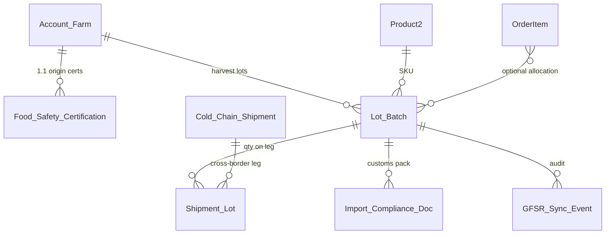

# 2.2 Global Food Safety & Traceability Registry (GFSR)

## Salesforce Architecture Design — FreshSource Global (FSG)

**Clouds:** Salesforce Sales Cloud + Service Cloud + Experience Cloud (same org as 1.1–2.1).  
**External system:** national/supranational **Global Food Safety Registry (GFSR)** — system of record for **cross-border** lot validity, farm origin certificates, and import dossiers.  
**Depends on:** 1.1 (`Food_Safety_Certification__c`, farm Account, Files), 1.5 (`Cold_Chain_Shipment__c`, RDC), 1.2/1.3 Orders, 1.6 perishable Cases.  
**Platform guidance:** Integration patterns **Batch Data Synchronization** (steady state) + **Remote Process Invocation — Request and Reply** (hold at dispatch) + **Event-driven inbound**; **Named Credentials** / mTLS; **idempotent** upserts; never call GFSR from the browser.

Unlike 2.1 (checkout **fail-open**), a **failed or pending GFSR validation must fail-closed for cross-border dispatch**. Domestic moves can proceed under FSG policy.

---

## 1. Designed problem statement

For **international / cross-border** perishable shipments, FSG must **validate with GFSR**:

- **Batch lot numbers**
- **Farm origin certificates**
- **Import compliance documentation**

The interface is **secure and bi-directional**:

| Direction | Salesforce must |
| --- | --- |
| **Outbound** | Publish lots, origin cert metadata (and document hashes/Files), import packs when a shipment is allocated to a cross-border lane |
| **Inbound** | Accept validation results, holds, certificate expiry/revocation, **recalls** — and freeze lots / open Q&C work |

Buyers and farms must **not** see other parties’ dossiers. Agents work results in Service Cloud. Experience Cloud shows only **their** lot/status.

---

## 2. Architecture decisions (locked)

| Decision | Choice | Why (Salesforce recommendation) |
| --- | --- | --- |
| System of record | **GFSR** for official validity; **Salesforce** for FSG operations and traceability graph | Government registry is authoritative; CRM orchestrates farms, orders, shipments |
| Sync style | **Async guaranteed delivery** (CDC/Platform Event → Queueable or middleware) **plus** a **sync validate** callout at **Activate / border dispatch** | Request-Reply at the control point; batch/event for documents and status |
| Middleware | **Named Credential to GFSR** for v1; **MuleSoft** if GFSR is EDI/AS2/SOAP, needs replay store, or multiple countries | Apex HTTPS/JSON first; middleware when the protocol is not REST |
| Identity of a lot | `Lot_Batch__c.Lot_Number__c` + farm + product **External Id**; store `GFSR_Id__c` | Idempotent upsert both ways |
| Documents | **Salesforce Files** on cert/import records; outbound **hash + metadata**; binary via API only if GFSR requires | Do not put PDFs in long text; do not guest-share Files |
| Fail closed | Cross-border `Cold_Chain_Shipment__c` cannot leave **Allocated → In Transit** unless lots are `GFSR_Valid` | Food-safety over checkout convenience (opposite of 2.1) |
| Recall inbound | Platform Event or REST → Apex **without sharing** (integration user) → freeze lots + 1.6-style Cases | Fast, auditable |
| Browser | **No** LWC → GFSR | Same as 2.1 |

---

## 3. Data model (traceability graph)

### 3.1 `Lot_Batch__c` (core)

- `Lot_Number__c` (unique with `Supplier_Account__c` + `Product__c`)
- `Supplier_Account__c` (farm), `Product__c`, `Harvest_Date__c`, `Best_Before__c`, `Temperature_Class__c`
- `Origin_Country__c`, `Origin_Certificate__c` (lookup 1.1 `Food_Safety_Certification__c`)
- `GFSR_Id__c` (External Id), `GFSR_Status__c`: `Not_Submitted` / `Pending` / `Valid` / `Rejected` / `Hold` / `Recalled`
- `GFSR_Last_Sync__c`, `GFSR_Payload_Hash__c`
- `Is_Cross_Border_Eligible__c`

### 3.2 `Shipment_Lot__c`

Junction: `Cold_Chain_Shipment__c` + `Lot_Batch__c` + qty. External Id = shipment + lot. This is the **traceability** link farm → RDC → buyer.

### 3.3 `Import_Compliance_Doc__c`

- Type: phytosanitary, health cert, customs invoice, origin, other
- Lookup `Lot_Batch__c` and/or `Cold_Chain_Shipment__c`
- `GFSR_Document_Id__c`, `Status__c`, `Valid_To__c`
- Files via `ContentDocumentLink`

### 3.4 `GFSR_Sync_Log__c`

Direction (`Out`/`In`), object, HTTP/status, correlation Id, retry count, **no** raw PII in Description. 90-day retention (compliance teams use Field Audit Trail / Files).

Reuse 1.1 Files on `Food_Safety_Certification__c` as the **origin certificate**; do not duplicate blobs.

---

## 4. Bi-directional integration (Salesforce patterns)

### 4.1 Outbound (Salesforce → GFSR)

**Steady state — Fire and Forget with replay**

1. After save on `Lot_Batch__c` / cert / import doc (status `Ready_To_Submit` or shipment `Cross_Border__c = true`): publish **Platform Event** `GFSR_Outbound__e` (LotId, DocId, Action: UpsertLot / UpsertCert / UpsertDossier).
2. Trigger → **Queueable** (chained retries) **or** middleware subscribed to the event.
3. Callout via **Named Credential** `NC_GFSR` (OAuth2 client credentials **or** mTLS — many government APIs require mutual TLS; Named Credential supports certificate).
4. Map to GFSR schema: lot number, farm registry id (stored on Account), cert number, document SHA-256, country pair (origin → destination).
5. On 2xx: store `GFSR_Id__c`, `GFSR_Status__c = Pending` (until inbound confirm) or `Valid` if the API is synchronous.
6. On 5xx/timeout: retry with backoff (Platform Event replay / Queueable); **do not** mark Valid. After N failures: Case `GFSR_Sync_Failure`.

**Control point — Request and Reply**

7. Before **Activate Orders** / shipment **In Transit** if `Is_International__c`: `GfsrValidationService.validateShipment(shipmentId)` **sync** callout: “are these lot Ids still Valid in GFSR?”
8. If not Valid / timeout: **block** dispatch (fail-closed). Open Q&C Case. Ops retries when GFSR is back (unlike 2.1 pricing).

Change Data Capture on Lot/Cert is an alternative to step 1 if middleware owns the mapping (Salesforce recommended when using MuleSoft).

### 4.2 Inbound (GFSR → Salesforce)

**Authoritative status, holds, recalls**

1. GFSR (or middleware) calls Salesforce **REST** (Connected App, JWT/OAuth, IP allowlist) `PATCH /sobjects/Lot_Batch__c/GFSR_Id__c/{id}` **or** a thin **Apex REST** `/gfsr/v1/status` for multi-object payloads (lot + docs + recall).
2. Apex **without sharing**, running as **GFSR Integration User**:
   - Upsert by `GFSR_Id__c` (idempotent).
   - Update `GFSR_Status__c`, cert `Valid_To__c` / Revoked, doc status.
   - If `Recalled` or `Hold`: set lot ineligible; **release 1.5 reservations** for unused qty; **do not** silently delete Files.
   - Insert Case `Food_Safety_Recall` or `GFSR_Hold` (see assignment).
   - Optional Platform Event `Lot_Recalled__e` for UI/Experience notifications.
3. Duplicate delivery: same correlation Id in `GFSR_Sync_Log__c` unique → **no-op**.

**Batch reconciliation (nightly)**

4. Queueable/Batch: query lots `Pending` older than SLA; GET GFSR by `GFSR_Id__c`; align status (**Batch Data Synchronization**). Catches missed inbound webhooks.

---

## 5. End-to-end process (step by step)

### Farm / lot creation (1.1 + harvest)

1. Q&C or farm Partner user (1.1 Sharing) creates `Lot_Batch__c` against **their** farm Account + SKU; links origin `Food_Safety_Certification__c` + Files.
2. Validation: cert must be 1.1 `Valid` and cover commodity/country.
3. Status `Ready_To_Submit` → outbound event → GFSR registers lot → `Pending`/`Valid`.

### Cross-border order path (1.2–1.5)

4. Order allocated (1.5); warehouse assigns **lots** to `Shipment_Lot__c` (FEFO).
5. If destination country ≠ origin: `Cold_Chain_Shipment__c.Is_International__c = true`; import doc checklist (Custom Metadata by lane).
6. Compliance user or Flow attaches `Import_Compliance_Doc__c` + Files; outbound dossier sync.
7. **Activate / dispatch guard:** sync `validateShipment`. All lots `Valid`, certs not expired/revoked, required docs `Accepted`.
8. Pass → In Transit. Fail → stay Allocated; Case to Q&C; buyer Order stays Submitted (portal: “customs/food-safety clearance”).

### Inbound recall / invalidation

9. GFSR posts Recall on a `GFSR_Id__c`.
10. Salesforce freezes lot; finds `Shipment_Lot__c` in transit/delivered; opens **per-buyer** 1.6-style Cases (Sharing Set still by buyer Account) + internal Q&C parent Case; Knowledge/bot (1.7) can explain “lot hold” **without** exposing other customers.

---

## 6. Sharing

| Object | Internal | External | Who sees what |
| --- | --- | --- | --- |
| `Lot_Batch__c` | Private | Private | **Farm (Partner):** criteria/role — `Supplier_Account__c` = their Account (1.1). **Buyer HVU:** **no** object access by default. Show **lot number + Valid/Hold** on **their** shipment via Apex DTO or formula on `Shipment_Lot__c` if Sharing Set includes a buyer-safe child with `Account__c` = buyer |
| `Shipment_Lot__c` | Private | Private | Stamp `Buyer_Account__c`; Sharing Set User.Account = Buyer_Account (Read). Hide farm tax id / cert numbers via FLS |
| `Import_Compliance_Doc__c` | Private | Private | Internal Compliance + Q&C regional groups. **Not** on buyer portal. Farms see **origin certs** only (1.1), not import packs |
| `Food_Safety_Certification__c` | As 1.1 | Farm only | Unchanged |
| `GFSR_Sync_Log__c` | Private | Private | Integration + Compliance Admin. No Sharing Set |
| Case recall | Private | 1.6 Sharing Set | Buyer sees **their** incident, not the global recall list |

**Internal:** Public Groups `NA_QC` / `LATAM_QC` / `EMEA_QC` (1.1) + `Trade_Compliance_{Region}` criteria on `Origin_Country__c` / destination region. **Restriction rules:** user region = shipment region.

**Integration user:** bypasses sharing for inbound upserts; does **not** get Export Reports / View All Data if avoidable — use **Modify All** only on GFSR objects or Apex without sharing **scoped** to those objects.

**Guest:** no lots, no Files, no GFSR.

**Do not** parent 50k lots to one dummy Account (skew). Lots parent to **farm Account** (8k farms) or to Product (watch lookup skew on a hot SKU — prefer farm + lot number External Id, lookup Product without 10k+ children on one Product if volume is extreme; if needed, no Product lookup, store SKU text).

---

## 7. Security

1. **Named Credential `NC_GFSR`:** OAuth2 and/or **mTLS** certificate; secrets not in Apex.
2. **Inbound:** Connected App, JWT bearer or client credentials, **IP allowlist**, least-privilege Integration User, Apex REST idempotency.
3. **Shield Platform Encryption** on lot number, farm identifiers, cert numbers (same class of data as 1.1 tax id).
4. **Field Audit Trail** (if licensed) on `GFSR_Status__c`, cert validity.
5. **Files:** private library; `ContentDistribution` **off** for GFSR docs; hash outbound.
6. **No Experience Cloud guest or HVU class access** to `GfsrValidationService` except a **read-status** method that only returns DTO for lots on **their** shipment.
7. **PII minimization** outbound: farm **registry id**, not chef personal emails.
8. **Event Monitoring** on API user and Named Credential usage.
9. Fail-closed dispatch: Validation Rule / Apex addError if international and any lot ≠ `Valid`.

---

## 8. Assignment

| Work | Assigned to | How |
| --- | --- | --- |
| Sync failure / timeout at dispatch | Case `GFSR_Sync_Failure` → Omni **Trade_Compliance_{Region}** (language + region skills) | Flow on log / validate fail |
| GFSR Rejected / Hold | Case `GFSR_Hold` → **Q&C** Omni (1.1 commodity + region) | Inbound Apex |
| Recall | Parent Case Q&C Manager; child Cases per affected **buyer Account** | Inbound Apex + 1.6 routing if customer-facing |
| Farm missing cert | Task/Case on farm Account owner (1.1 Supplier Manager) | Flow |
| Integration user | Owns inbound DML and sync logs | Named user, no role (avoid skew) |

Human **Regional Trade Compliance** (internal Salesforce license) owns exception queues — not Partner farms, not HVU buyers.

---

## 9. Experience Cloud

- **Supplier portal (1.1):** create/view **own** lots and origin certs/Files; see `GFSR_Status__c`; cannot call GFSR; cannot see import dossiers.
- **Buyer portal (1.2/1.3):** on shipment, **lot number + Valid/Hold/Recalled** only; **Report issue** still 1.6.
- **No** public lot search (enumeration / competitor harvest data).

---

## 10. Automation catalog

| Automation | Type | Purpose |
| --- | --- | --- |
| Lot_Ready_Publish | Record-triggered → PE → Queueable | Outbound upsert |
| GfsrValidationService | Apex sync callout | Dispatch gate |
| Activate_International_Guard | Before-save Flow / VR | Fail-closed |
| GFSR inbound REST | Apex REST | Status, hold, recall |
| Nightly_Reconcile | Batch | Pending lots vs GFSR GET |
| Recall_Fanout | After inbound | Cases + freeze + 1.5 release |
| Retry_Policy | Queueable chain | 5xx/timeout |

---

## 11. Coexistence

| Prior | 2.2 |
| --- | --- |
| 1.1 certs/Files | Origin certificates in the dossier |
| 1.5 allocation | Lots assigned **after** allocate; international **validate** before In Transit |
| 2.1 fail-open pricing | **Does not** apply to GFSR; food-safety is fail-closed |
| 1.6 Cases | Customer-facing recall/hold messages |
| 1.7 bot | May read **buyer-visible** lot status via with-sharing action; **no** GFSR callout |

---

## 12. Implementation sequence

1. Objects, External Ids, encryption, File model, Named Credential, Integration User, Connected App.
2. Outbound PE + Queueable; inbound REST + idempotency log.
3. Dispatch guard on international shipments; Q&C/Compliance Omni queues.
4. Sharing Sets/FLS for `Shipment_Lot__c`; farm partner access to lots; restriction rules.
5. Recall fan-out; nightly reconcile; reports (pending > SLA, reject rate by country).
6. UAT: (a) farm A cannot open farm B lot; (b) buyer sees only lot on **their** shipment; (c) guest 404 on lot API; (d) GFSR down → international dispatch **blocked**, domestic allowed; (e) duplicate inbound recall does not double-create Cases; (f) mTLS/Named Credential used (no key in debug logs); (g) NA Q&C cannot load EMEA import docs; (h) revoked cert sets lots ineligible before next validate.

---

## 13. Salesforce documentation mapped here

| Topic | Guidance |
| --- | --- |
| Outbound register/update | **Fire and Forget** + Queueable retry; or CDC + middleware |
| Validate at border | **Request and Reply** callout |
| Nightly align | **Batch Data Synchronization** |
| Inbound status | REST / Composite upsert by External Id; idempotency |
| Secrets / mTLS | Named Credentials |
| Sharing | Private OWD; Sharing Sets only buyer-safe junction; restriction rules |
| Files | Salesforce Files; not public links |
| Platform Events | Replay for missed outbound |

---

## 14. Final outcome (brief)

- Salesforce holds the **operational traceability graph** (farm → lot → shipment → order); **GFSR** remains the **legal** validator for cross-border lots, origin certs, and import docs.
- **Bi-directional:** outbound events/callouts register dossiers; inbound REST updates **Valid/Hold/Recalled**; nightly GET **reconciles**.
- **Cross-border dispatch is fail-closed** until lots are `GFSR_Valid`; GFSR downtime does **not** silently ship (unlike 2.1 pricing).
- Security: **Named Credential / mTLS**, Integration User, encrypted lot/cert fields, no browser or guest access to GFSR.
- Sharing: farms see **own** lots/certs; buyers see **lot status on their shipment only**; import packs stay internal Compliance/Q&C by region.
- Holds/recalls freeze lots, release unused 1.5 capacity, and open **assigned Q&C / buyer Cases** (Omni, 1.6 pattern).
