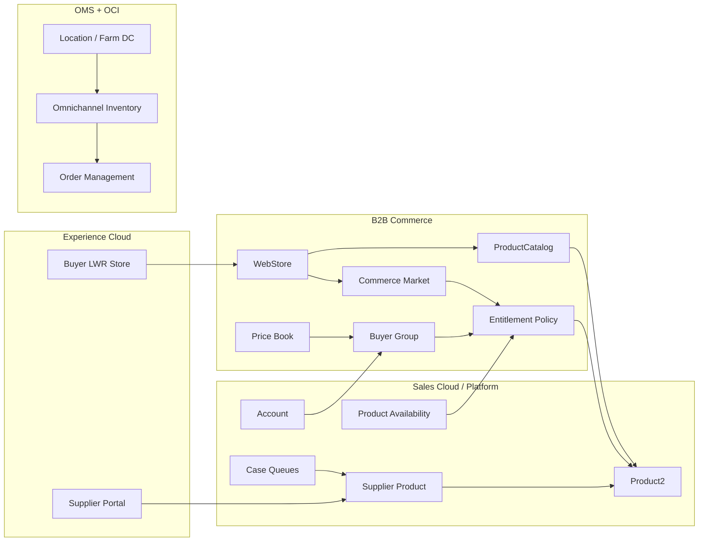
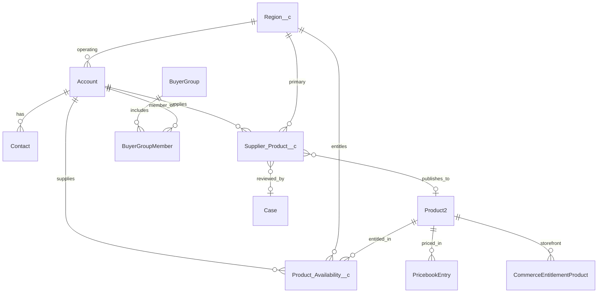

# FreshSource Global (FSG) — Product Catalog Solution Architecture

**Clouds:** B2B Commerce (LWR), Experience Cloud, Sales Cloud, Order Management, Omnichannel Inventory, optional Revenue Cloud and Data Cloud  
**Principle:** Out-of-the-box Salesforce first. Custom objects, automation, and Apex only where the platform cannot enforce regional access.  
**Scope:** Product catalog setup so buyers and suppliers see products for **their region only**, with sharing, security, and record assignment designed to Salesforce documentation and Well-Architected guidance.

---

## 1. Executive recommendation

FSG should **not** try to hide products by region using `Product2` sharing.

Salesforce `Product2` has organization-wide defaults, but it has **no `OwnerId`, no share table, no internal sharing rules, and no manual sharing**. Regional isolation on `Product2` itself is not a supported sharing design. Salesforce Commerce documentation instead requires:

1. **Private external OWD on Product** so Experience Cloud users cannot SOQL every SKU across stores.
2. **B2B Commerce Markets + Entitlement Policies + Buyer Groups + Price Books** as the storefront access layer.
3. **Permission sets** (not profiles) for commerce object access.
4. A **shareable custom object** when internal merchandisers and supplier portal users need true record-level regional access.

**Target pattern**

| Layer | OOTB mechanism | What it controls |
| --- | --- | --- |
| Buyer storefront | One LWR B2B store, Commerce Markets per country/region, Entitlement Policies, Buyer Groups, regional Price Books | Which products a buyer can browse, price, and buy |
| Supplier portal | Experience Cloud + sharing sets on `Supplier_Product__c` | Farms see and edit only their own listings |
| Internal merchandising | Role hierarchy, public groups, criteria sharing, queues, Case assignment rules | Who reviews and publishes which region |
| Master product | Shared `Product2` + one `ProductCatalog` | Single SKU definition, not a security boundary |
| Regional entitlement system of record | Custom `Product_Availability__c` (Private OWD) synced to Commerce entitlements | CRM-side regional access that `Product2` cannot provide |
| Inventory / fulfillment | Location, Location Group, Omnichannel Inventory, Order Management | Physical availability by farm/DC, not catalog visibility |
| Internal quoting (if needed later) | Revenue Cloud Product Catalog Management qualification rules | Region-aware product selection on quotes |

Do **not** create 8,000 catalogs, 8,000 stores, or 8,000 buyer groups (one per farm). That design will hit Commerce entitlement and search-index limits.

---

## 2. Business problem

FreshSource Global is a farm-to-table distributor working with **8,000+ independent farms and artisan producers** across countries, regions, and time zones.

**Process 1 — Product Catalog**

FSG must set up products in Salesforce so that:

- Multiple **buyers** see only products they are allowed to purchase in their region (import rules, cold-chain, local assortment, currency, language).
- Multiple **suppliers** see and maintain only their own listings, in the regions they are allowed to sell.
- Internal catalog, merchandising, and sales teams are assigned work for the regions they own.
- The model remains secure for Experience Cloud users (least privilege, no cross-store product discovery).

This is a **data-visibility and assignment** problem, not only a PIM data-entry problem.

---

## 3. Design principles (Salesforce-aligned)

1. **OOTB first.** Use standard Commerce, Experience Cloud, Case, Queue, Assignment Rule, Price Book, Territory, and sharing features before Apex.
2. **Do not fight `Product2` sharing limits.** Treat `Product2` as a shared master. Enforce region on entitlements and on shareable objects.
3. **Separate navigation from security.** `ProductCategory` is browse structure. `CommerceEntitlementPolicy` / Market is access control. Both are required on the storefront.
4. **Segment by region, not by supplier.** Buyer Groups and Entitlement Policies are regional (and optionally tiered). Supplier isolation uses Account-based sharing sets.
5. **Permission sets over profiles.** Salesforce Commerce recommends not granting Product and related commerce objects at the profile. Assign a permission set only to the intended persona.
6. **Private by default for external users.** External OWD Private on Product, Account, Catalog, Entitlement Policy, Order, and custom catalog objects.
7. **Declarative assignment.** Case assignment rules, queues, territories, and record-triggered Flows. Apex only for Commerce Buyer Group Extensibility or high-volume entitlement sync if Flow hits limits.
8. **Stay inside published Commerce limits.** Especially 2,000 buyer groups per product for search indexing, 200 buyer groups per entitlement policy, one catalog per store, five category levels.

---

## 4. Personas and intended access

| Persona | License (OOTB) | Sees | Does not see | Assignment |
| --- | --- | --- | --- | --- |
| Buyer (restaurant, retailer, distributor) | Customer Community Plus + B2B Commerce | Entitled products for their Market / ship-to country | Other regions’ SKUs, supplier cost, draft listings | Account → Buyer Group → Market |
| Supplier (farm / artisan) | Customer Community (high volume) for listing-only; Partner Community if they need Opportunities/Orders | Own `Supplier_Product__c` records | Other farms’ listings, global `Product2` via SOQL | Sharing set: User.Account = Supplier Account |
| Regional merchandiser | Salesforce | Availabilities and listings for their region | Other regions’ availability records | Public group + criteria sharing + queue |
| Global catalog admin | Salesforce | All catalog objects | — | View All / Modify All on catalog objects + custom permission |
| Regional account manager | Salesforce | Buyer and supplier Accounts in territory | Accounts outside territory | Enterprise Territory Management |
| Guest / unauthenticated | None | Nothing (B2B; guest browsing off) | All products | Guest user sharing remains Private |

---

## 5. Recommended cloud map



**Why these clouds**

- **B2B Commerce LWR** is the Salesforce-documented product catalog, category, entitlement, and storefront model. A store can have **one catalog**; a catalog can serve **multiple stores**. New B2B work should use LWR, not Aura.
- **Experience Cloud** is the OOTB portal for buyers and suppliers. Salesforce explicitly supports **multiple stores for different business areas or regions**.
- **Sales Cloud** remains the Account / Contact / Case / Territory / Price Book backbone.
- **Omnichannel Inventory + Location** is the OOTB way to represent farm and DC stock by geography. Location does **not** replace catalog entitlement; it answers “is it in stock here?”
- **Order Management** is the OOTB order lifecycle after checkout.
- **Revenue Cloud Product Catalog Management** is the OOTB path if internal sellers also need region qualification on quotes (qualification / disqualification rules). It is **not** required to launch the buyer catalog.
- **Data Cloud** is optional later for regional segments at scale. Do not use it as the primary entitlement engine.
- **Manufacturing Cloud / Consumer Goods Cloud** are not the primary catalog tools for this farm-to-table buyer/supplier portal. Manufacturing Cloud Partner sites can complement supplier commercial agreements later.

---

## 6. Critical platform constraint: `Product2` sharing

This constraint drives the entire custom layer.

Salesforce behavior for `Product2` (Spring/Summer ’22 onward):

- Internal and external **OWD** can be Private, Public Read Only, or Public Read/Write.
- **Sharing rules for internal users are not supported.**
- **Manual sharing is not supported.**
- There is **no `OwnerId`** and **no product share table**.
- Guest users are Private unless a **guest user sharing rule** is created.
- Price Books no longer control product visibility; they control whether a product can be **used** on an Opportunity (internal: Use / View Only / No Access). External Price Book OWD is **No Access**.

Salesforce Commerce documentation adds:

> Set Default External Access on Product to **Private** for all commerce use cases. If it is not Private, authenticated users can SOQL all products regardless of entitlements (they still cannot see prices or purchase). Do not grant Product access at the profile. Use a permission set assigned only to buyers / buyer managers.

**Implication for FSG**

| Goal | Supported OOTB on `Product2`? | What to use instead |
| --- | --- | --- |
| Hide NA SKUs from EMEA buyers on the storefront | No (not via sharing) | Commerce Entitlement Policy / Market |
| Stop Experience Cloud SOQL of all SKUs | Yes | External OWD Private |
| Let a farm edit only its SKUs | No | `Supplier_Product__c` + sharing set |
| Let EMEA merchandisers edit only EMEA entitlements | No | `Product_Availability__c` + sharing rules + validation rule |
| Control which SKUs sales can add to an Opportunity | Partial | Regional Price Books + Use sharing |
| Region-qualify products on a Revenue Cloud quote | Yes, if licensed | Qualification rules, not `Product2` OWD |

Internal OWD for `Product2` should be **Public Read Only**. Merchandisers cannot be granted Edit on `Product2` without being able to edit every product, because there is no record-level grant path. Therefore:

- Only **FSG Catalog Admin** (Modify All on Product) edits `Product2`.
- Regional merchandisers edit **`Product_Availability__c` and `Supplier_Product__c`**.
- A validation rule blocks merchandisers from writing availability outside `User.Operating_Region__c`.

That is the least-privilege design the platform actually supports.

---

## 7. OOTB solution (implement this first)

### 7.1 Org, identity, and OWD

Run **Commerce Setup Assistant** so recommended sharing defaults are applied, then confirm:

| Object | Internal OWD | External OWD | Notes |
| --- | --- | --- | --- |
| Account | Private | Private | Territory + sharing rules / sharing sets open access |
| Contact | Controlled by Parent | Controlled by Parent | |
| Product2 | Public Read Only | **Private** | Required Commerce recommendation |
| Price Book | View Only | No Access (fixed) | Grant **Use** on regional price books to internal roles; Commerce uses Buyer Group price books for the storefront |
| Catalog / ProductCatalog | Public Read Only | Private | |
| Entitlement Policy | Public Read Only | Private | |
| Buyer Group | Public Read Only | Private | |
| Order | Private | Private | |
| Case | Private | Private | Queues + assignment rules |
| Location / Location Group | Public Read Only | Public Read Only or Private | Follow Commerce Setup Assistant; do not use Location as the catalog entitlement object |
| `Region__c` | Public Read Only | Public Read Only | Reference data; suppliers must look up a region |
| `Product_Availability__c` | **Private** | **Private** | Shareable security object |
| `Supplier_Product__c` | **Private** | **Private** | Shareable security object |

**Role hierarchy (internal)**

```text
FSG Global Catalog Director
  ├── NA Catalog Manager → NA Merchandisers
  ├── EMEA Catalog Manager → EMEA Merchandisers
  ├── APAC Catalog Manager → APAC Merchandisers
  └── LATAM Catalog Manager → LATAM Merchandisers
```

Grant Access Using Hierarchies remains on for `Product_Availability__c` and `Supplier_Product__c` so managers inherit their team’s records.

**Permission sets** (provided in this repo)

- `FSG_Catalog_Admin` — Modify All on catalog custom objects + custom permission `FSG_Bypass_Region_Validation`
- `FSG_Regional_Merchandiser` — CRUD without View All; sharing rules constrain records
- `FSG_Buyer_Portal` — CRM field access only; storefront uses Commerce buyer permission sets
- `FSG_Supplier_Portal` — Create/Edit `Supplier_Product__c`; **no Product2 Read**

Also assign Salesforce-provided **Buyer**, **Buyer Manager**, and **B2B Commerce Super User** permission sets to the correct commerce personas. Site membership is by profile/permission set on the Experience Cloud site.

### 7.2 Catalog topology (Commerce)

Salesforce rule: **a store has exactly one catalog; a catalog may be assigned to many stores.**

**Recommended for FSG launch**

1. **One global `ProductCatalog`** — `FSG Master Catalog`.
2. **One B2B LWR `WebStore`** — `FSG Buyer Store`, unless legal entity, tax engine, domain, or checkout must differ by region. Salesforce allows up to 100 B2B stores; do not multiply stores without a hard boundary.
3. **Commerce Markets per ship-to country or operating region** (UK, DE, US, AU, … or NA/EMEA/APAC/LATAM if assortment is truly regional).
4. **Buyer Group per Market** (plus optional tier: `EMEA-Retail`, `EMEA-Foodservice` only if pricing/entitlement truly differs).
5. **One Entitlement Policy per Market**, assigned **to the Market**.
6. **One Price Book per currency** (and extra books only when a Market has unique list prices).
7. **Category tree** for navigation only (Produce → Vegetables → Tomatoes), max **5 levels**, keep it shallow.

**Why Markets are the OOTB regional switch**

Salesforce Help (*Considerations for Market and Buyer Group Setup for B2B Commerce Stores*):

- A Market carries locale, ship-to country, price book, and entitlement policy.
- **If Markets are assigned, only entitlement policies on the Market are used. Entitlement policies on Buyer Groups are ignored.**
- If no ship-to country is set on Market or Buyer Group, the store default is used.
- Markets change search indexing: only locales on those Markets are indexed.

So the regional catalog for buyers is: **Account ship-to country → Market → Entitlement Policy → entitled Product2 records.**

**Storefront visibility checklist (both required)**

1. Assign `Product2` to a `ProductCategory` in the store catalog (`ProductCategoryProduct`).
2. Include `Product2` in the Market’s `CommerceEntitlementPolicy` (`CommerceEntitlementProduct`) with `CanViewProduct` / `CanViewPrice`.
3. Rebuild the store **search index** after entitlement or category changes.

A product in a category but not in the policy is invisible to that buyer. A product in the policy but not in a category is not navigable.

### 7.3 Accounts, buyers, and suppliers (OOTB data model)

Use **standard Account and Contact**, not a custom Party object.

| Record type / field | Buyer | Supplier |
| --- | --- | --- |
| Account Record Type | Buyer | Supplier |
| `Party_Type__c` | Buyer | Supplier |
| `Operating_Region__c` | Required | Required |
| `Ship_To_Country_ISO__c` | Required | Optional |
| Commerce | Enable as Buyer Account; add to regional Buyer Group | Not a Buyer unless they also purchase |
| Addresses | `ContactPointAddress` default shipping drives Market | Farm location on Account + Location record |
| Parent | Buying group / HQ optional | Co-op optional |

**Buyer enablement (OOTB)**

1. Create or use a business Account.
2. Enable the Account as a Commerce buyer.
3. Add the Account to the Buyer Group from `Region_Commerce_Map__mdt` (for example `FSG EMEA Buyers`).
4. Associate that Buyer Group with the store.
5. Ensure the Market for that country is on the store and has the regional entitlement policy and price book.

Use a **record-triggered Flow on Account** (after save) to add/remove `BuyerGroupMember` when `Operating_Region__c` or `Ship_To_Country_ISO__c` changes. Read the target Buyer Group name from `Region_Commerce_Map__mdt`. No Apex.

### 7.4 Product master (OOTB `Product2`)

One `Product2` per sellable SKU (or variation parent + children for pack size / grade).

Recommended standard / custom attributes:

- Name, Product Code / SKU, Description, Family, Is Active
- `Supplier_Account__c`, `Origin_Region__c`, `Origin_Country__c`, `Is_Regional_Restricted__c`
- Commerce: variation, quantity rules, product media (max 9 images), CMS workspace
- Translation Workbench / Commerce locales for multi-language (up to 25 locales per store)

**Variations:** parent “Heirloom Tomato” with children by grade/pack. Limit 200 variants per parent.

**Do not** clone the same SKU into 8,000 Product2 records per farm unless the commercial SKU is truly farm-specific (lot, certification, brand). Prefer:

- Shared commodity SKU + supplier as fulfillment Location, **or**
- Farm-branded SKU when the buyer must order that farm’s product.

Farm-branded SKUs are common in artisan/farm-to-table. Still entitle them by **region**, not by creating per-farm catalogs.

### 7.5 Price Books (OOTB)

- Standard Price Book: one list price per SKU (required parent of custom books).
- Custom books: `FSG NA USD`, `FSG EMEA EUR`, `FSG APAC USD`, `FSG LATAM USD` (extend per country if prices differ).
- Assign books to Markets / Buyer Groups.
- Internal sales: OWD View Only, then **Use** sharing on the regional book to the regional role.
- Experience Cloud does not use Price Book sharing; storefront pricing is Commerce Buyer Group / Market price books.

### 7.6 Inventory and locations (OOTB, complementary)

Catalog entitlement answers “may this buyer see this SKU?”  
Inventory answers “can we ship it from a farm/DC in range?”

- Create a **Location** per farm or consolidation DC.
- Group locations into **Location Groups** per region/store.
- Load availability into **Omnichannel Inventory**.
- Order Management routes fulfillment.

A UK buyer should not see a US-only SKU even if a US farm has stock. Entitlement hides it. A UK-entitled SKU with zero UK Location Group quantity shows as out of stock, not as another region’s catalog.

### 7.7 Record assignment (OOTB)

Do not build a custom assignment engine.

| Work item | OOTB feature | Rule |
| --- | --- | --- |
| New supplier listing | **Case** record type `Product Onboarding` | Assignment rule: `Catalog_Region__c` = EMEA → Queue `FSG_EMEA_Merchandising` |
| Listing draft | `Supplier_Product__c` owned by the supplier user | Queue members may take the related Case |
| Account ownership | **Enterprise Territory Management** by country / region | Account teams for overlay roles |
| Buyer Group membership | Record-triggered **Flow** | Region map custom metadata |
| Approvals | **Approval Process** on Case or Supplier Product | Regional merchandiser → Catalog manager |
| SLA / timezone | Case entitlement + business hours per region | Align with regional queues |

Queues in this repo: `FSG_NA_Merchandising`, `FSG_EMEA_Merchandising`, `FSG_APAC_Merchandising`, `FSG_LATAM_Merchandising` (Case + Supplier Product).

### 7.8 Experience Cloud sites

**Buyer site:** LWR Commerce store. Guest browsing **off**. Login as Contact on the Buyer Account. Self-registration only if FSG staff still approve Buyer Group assignment (never auto-entitle a new buyer to all products).

**Supplier site:** Experience Cloud (Customer Community or Partner).

- Listing-only at 8,000 farms: **Customer Community** + **sharing set** (scales; no portal role explosion).
- If suppliers must see Opportunities, Leads, or Partner Relationship Management: **Partner Community**, enable **Account Role Optimization** before role count grows.

Sharing set (OOTB, configure in Digital Experiences):

- Profile: FSG Supplier
- Object: `Supplier_Product__c`
- User.Account = `Supplier_Product__c.Supplier_Account__c`
- Access: Read/Write

Do not put suppliers in the buyer store unless they also buy.

### 7.9 Internal quoting (optional OOTB)

If FSG account managers quote in Salesforce:

- **Sales Cloud:** Opportunity Product uses regional Price Book (Use access). List views filter `Origin_Region__c`.
- **Revenue Cloud PCM:** Qualification rules (location / account / customer type) hide ineligible products in the catalog picker. This is the documented PCM visibility model. It still does not replace Commerce entitlements on the storefront.

---

## 8. Custom solution (only what OOTB cannot do)

Custom metadata in `force-app` implements the shareable catalog control plane.

### 8.1 Why custom objects are required

| Requirement | OOTB gap | Custom object |
| --- | --- | --- |
| Record-level regional access for merchandisers | `Product2` cannot be shared by region | `Product_Availability__c` |
| Supplier sees only own drafts | `Product2` has no owner/share table | `Supplier_Product__c` |
| Stable region key for sharing rules | Criteria sharing cannot use cross-object formulas | Stamped `Region_Code__c` |
| Map region → Market / Buyer Group / Queue without code | Hard-coded Flow values drift | `Region_Commerce_Map__mdt` |
| Reference data for country, currency, timezone | No first-class FSG region record | `Region__c` |

### 8.2 Data model



**`Region__c`** — Operating region (NA, EMEA, APAC, LATAM, or country). Public Read Only internally and externally (reference data). Fields: Region Code, Country ISO, currency, locale, timezone, Commerce Market Name.

**`Supplier_Product__c`** — Farm-owned listing. Private. Unique `Supplier_SKU_Key__c`. Status Draft → Submitted → In Review → Approved → Published / Rejected. Lookup to Case for OOTB assignment.

**`Product_Availability__c`** — Junction Product + Region. Private. Unique `Product_Region_Key__c`. Status Draft / Approved / Published / Suspended / Expired. `Can_View_Product__c` / `Can_View_Price__c` map to the Commerce policy. Only **Published** rows are synced to `CommerceEntitlementProduct`.

**`Region_Commerce_Map__mdt`** — Seeded for NA, EMEA, APAC, LATAM with Buyer Group, Entitlement Policy, Market, Price Book, Queue, and Public Group developer names.

### 8.3 Sharing and security on custom objects

**Supplier Product**

1. OWD Private / External Private.
2. Owner = creating supplier user (implicit access).
3. Sharing set: other contacts on the same Account.
4. Criteria sharing: `Region_Code__c = EMEA` → group `FSG_EMEA_Merchandisers` (Edit).
5. Validation: Experience Cloud users cannot set `Supplier_Account__c` to another Account.
6. Restriction rules: not required at launch; available later if a merchandiser public group is too broad (restriction rules are **not** supported on `Product2`).

**Product Availability**

1. OWD Private / External Private. External users get **no** object permission (buyers never query this object).
2. Criteria sharing to regional merchandiser groups (Edit).
3. Catalog Admin: Modify All.
4. Validation: `Region__c` must equal `User.Operating_Region__c` unless `FSG_Bypass_Region_Validation`.

**Field-level security**

- Hide requested/cost price from buyers.
- Certification details readable by merchandisers and the owning supplier only (FLS + sharing).
- `Commerce_Sync_Status__c` merchandiser/admin only.

### 8.4 Automation (declarative)

Implement as **before-save / after-save Flows**. No Apex unless volume requires it.

| Flow | Trigger | Action |
| --- | --- | --- |
| Stamp region keys | Before-save Supplier Product / Product Availability | Copy `Region__r.Region_Code__c`; set `Product_Region_Key__c` or `Supplier_SKU_Key__c` |
| Submit listing | After-save Supplier Product Status = Submitted | Create Case (Product Onboarding), set `Catalog_Region__c`, let **Case assignment rules** route to the regional queue |
| Publish listing | After-save Status = Approved (admin/merchandiser) | Create/update `Product2`, category assignment, PricebookEntry on the regional book, `Product_Availability__c` = Published |
| Sync entitlement | After-save Product Availability Status = Published | Create `CommerceEntitlementProduct` for the policy named in `Region_Commerce_Map__mdt`; set Sync Status. On Suspended/Expired, remove the junction |
| Buyer group membership | After-save Account | Upsert `BuyerGroupMember` from the region map |
| Search index | Scheduled / after bulk publish | Remind merchandiser or call Commerce index rebuild (index rebuild is a store admin action / API) |

**Approval Process (OOTB):** Supplier Product Status Submitted → regional merchandiser. Unlock Published Product fields only for Catalog Admin.

### 8.5 Custom Apex — last resort only

| Need | OOTB alternative | Apex only if |
| --- | --- | --- |
| Dynamic buyer group from shipping address at session time | Static Market / Buyer Group on Account | Buyer Group Extensibility (Commerce extension class) when the same user must switch country in-session |
| Entitlement sync at hundreds of thousands of rows | Flow + scheduled path | Queueable / bulk API if Flow CPU or DML limits fail |
| Product2 regional edit | Validation rule + no Edit permission | Never mimic a share table on Product2 |

Buyer Group Extensibility (Commerce) is the **supported** extension point for runtime group resolution. It is still custom code; keep the default path as static Market membership.

---

## 9. End-to-end regional access paths

### Buyer in EMEA

1. Logs into the LWR store as a Contact on an EMEA Buyer Account.
2. Account is in Buyer Group `FSG EMEA Buyers` and Market `FSG EMEA` (ship-to DE/UK/…).
3. Storefront Connect APIs resolve Market entitlement policy `FSG EMEA Entitlement`.
4. Only products on that policy (and in a category, active, in-date) appear in browse/search.
5. Price comes from `FSG EMEA EUR` (or the Market price book).
6. Direct SOQL on `Product2` fails or returns nothing useful because **external Product OWD is Private** and buyers should not have Product2 Read on the profile.
7. Inventory check uses the EMEA Location Group.

### Supplier farm in EMEA

1. Logs into the Supplier portal.
2. Sharing set returns only `Supplier_Product__c` where Supplier Account = their Account.
3. They cannot Read `Product2` or other farms’ listings.
4. Submit creates a Case assigned to `FSG_EMEA_Merchandising`.
5. After publish, `Product_Availability__c` for EMEA is shared with EMEA merchandisers; Commerce entitlement is added only to the EMEA policy.

### EMEA merchandiser

1. In public group `FSG_EMEA_Merchandisers`.
2. Sees EMEA availability and listings via criteria sharing.
3. Cannot save an availability with Region NA (validation rule).
4. Does not receive Modify All on `Product2`.

---

## 10. Security architecture (layered)

Salesforce Well-Architected access is layered. FSG uses all of them:

1. **Org & network** — Experience Cloud login, MFA, IP/session settings as required; no guest catalog.
2. **Identity** — Contacts enabled as users; one user, one Contact, one Account. No shared supplier logins.
3. **Object** — Permission sets; commerce objects not on the base profile.
4. **Field** — FLS for cost, certifications, sync status.
5. **Record** — Private OWD + sharing rules + sharing sets. Not Product2 sharing.
6. **Storefront entitlement** — Market / policy / buyer group (independent of CRM sharing).
7. **CRUD validation** — Region and supplier-account validation rules.
8. **Audit** — Field History on Supplier Product, Product Availability, Case; Setup Audit Trail for entitlement admin.

**Multi-store warning (from Salesforce Commerce):** if Product external OWD is not Private and users can access multiple stores or mixed Experience Cloud sites, they can discover all products by API even when entitlements hide them on a given storefront.

---

## 11. Scale, limits, and anti-patterns

| Limit (B2B) | Value | FSG guidance |
| --- | --- | --- |
| Catalogs per store | 1 | One master catalog |
| Products per catalog | 3 million | Comfortable |
| Products per store / search | 4 million / 1 million searchable | Use entitlements so each buyer searches a regional slice; third-party search if SKUs exceed 1 million searchable |
| Category depth / per catalog | 5 / 15,000 | Shallow tree |
| Entitlement policies | 105,000 / org | One per Market, not per farm |
| Buyer groups per policy | 200 | Keep policies regional |
| Buyer groups per product (search) | **2,000** | Never entitle a SKU to thousands of farm-specific groups |
| Stores per org | 100 | Few stores; many Markets |
| Locales per store | 25 | |
| Portal roles (CC+ / Partner) | 50,000 default | Prefer Customer Community + sharing sets for 8,000 farms |

**Anti-patterns**

- One `ProductCatalog` or `WebStore` per supplier or per country without a legal/tax reason.
- One Buyer Group per farm.
- Public Read/Write Product for external users.
- Using categories as the only visibility control.
- Using Location or inventory as the only visibility control.
- Granting merchandisers Modify All on Product2 to “make sharing work.”
- Hard-coding Buyer Group Ids in Flow instead of `Region_Commerce_Map__mdt`.

---

## 12. Implementation sequence

1. Enable Experience Cloud, B2B Commerce LWR, multi-currency, Translation Workbench as needed. Run Commerce Setup Assistant. Confirm Product **external OWD Private**.
2. Deploy this package (`Region__c`, availability, supplier product, maps, permission sets, groups, queues, sharing rules).
3. Load Regions and confirm custom metadata names match live Market / Buyer Group / Policy / Price Book / Queue API names.
4. Create the master catalog, category tree, store, Markets, Buyer Groups, Entitlement Policies, Price Books. Assign catalog to store; policies to Markets.
5. Build buyer and supplier Experience Cloud sites; sharing set; permission set groups; guest access off.
6. Configure Case record type, assignment rules, approval process, Account Flow for Buyer Group membership, stamp/publish Flows.
7. Pilot one region (for example EMEA): 10 suppliers, 10 buyers, publish SKUs, verify storefront, SOQL as buyer, supplier isolation, merchandiser cannot edit NA.
8. Rebuild search index. Add OCI locations. Expand regions.

---

## 13. Testing matrix

| Test | Expected |
| --- | --- |
| EMEA buyer storefront search | Only EMEA-entitled, categorized, active products |
| EMEA buyer Apex/SOQL `Product2` | No cross-region product dump (Private OWD + no Product Read on profile) |
| NA buyer URL of EMEA-only SKU | Not visible / not purchasable |
| EMEA supplier list view | Only own `Supplier_Product__c` |
| EMEA supplier edits another farm’s Id | Validation error |
| EMEA merchandiser list of Product Availability | EMEA rows only |
| EMEA merchandiser saves Region = NA | Validation error |
| Catalog admin saves any region | Success (custom permission) |
| Account region change EMEA → NA | Buyer Group membership updated; old entitlements no longer apply |
| Entitlement change | Search index rebuild required before search results change |
| Price Book Use | NA AE can add NA book products to Opportunity; cannot Use EMEA book |

---

## 14. Decision log

| Decision | Choice | Rationale |
| --- | --- | --- |
| Regional buyer visibility | Commerce Markets + Entitlement Policies | Documented OOTB; storefront APIs honor it |
| Product2 OWD | Internal Public Read Only; External Private | Commerce security recommendation + no Product2 sharing rules |
| Supplier isolation | Custom `Supplier_Product__c` + sharing set | Product2 cannot isolate by owner/account |
| Merchandiser isolation | `Product_Availability__c` sharing + validation | Product2 Edit is all-or-nothing |
| Stores vs Markets | One store, many Markets at launch | Fewer checkout/tax/search indexes; Markets are the country switch |
| Buyer Groups | One per region/Market, optional tier | Avoid 8,000-group explosion and 2,000-group search cap |
| Supplier license | Customer Community + sharing sets default | 8,000 farms; Partner only if CRM sales objects are required |
| Assignment | Case queues + assignment rules | OOTB; timezone-friendly queues |
| Inventory | OCI Location Groups | Separate from catalog entitlement |
| Apex | None for MVP | Flows + CMD; Buyer Group Extensibility later if in-session country switch is required |

---

## 15. Salesforce documentation (authoritative)

- [Product and Catalog Data Model](https://developer.salesforce.com/docs/commerce/salesforce-commerce/guide/b2b-b2c-comm-data-model-product-catalog.html) — one catalog per store; catalog reusable across stores.
- [Commerce Key Concepts](https://help.salesforce.com/s/articleView?id=commerce.comm_key_concepts.htm) — Store, Catalog, Buyer Group, Buyer Account, Entitlement, Price Book; multiple stores for regions.
- [Product Data Limits](https://developer.salesforce.com/docs/commerce/salesforce-commerce/guide/b2b-b2c-comm-data-model-product-limits.html)
- [Entitlement Data Limits](https://developer.salesforce.com/docs/commerce/salesforce-commerce/guide/b2b-b2c-comm-data-model-entitlement-limits.html) — 2,000 buyer groups per product for search.
- [Store Data Limits](https://developer.salesforce.com/docs/commerce/salesforce-commerce/guide/b2b-b2c-comm-data-model-store-limits.html)
- [Market and Buyer Group considerations](https://help.salesforce.com/s/articleView?id=commerce.comm_market_considerations.htm) — Market entitlements override Buyer Group entitlements.
- [Access to a B2B Store](https://help.salesforce.com/s/articleView?id=commerce.comm_access.htm)
- [Create a Catalog and Assign It to a Store](https://help.salesforce.com/s/articleView?id=commerce.comm_catalog_create_assign.htm)
- [Organization-Wide Defaults](https://help.salesforce.com/s/articleView?id=sf.admin_sharing.htm) — Product OWD caution with custom code/packages.
- [Sharing and Record Access](https://help.salesforce.com/s/articleView?id=sf.managing_the_sharing_model.htm)
- [Platform Sharing Architecture](https://architect.salesforce.com/docs/architect/fundamentals/guide/platform-sharing-architecture) — restriction rules not on Product2.
- [Experience Cloud User Licenses](https://help.salesforce.com/s/articleView?id=users_license_types_communities.htm)
- [Control Access to Price Books and Products](https://trailhead.salesforce.com/content/learn/projects/manage-products-prices-quotes-orders/control-access-price-books-products)
- [Revenue Cloud product offerings / qualification rules](https://trailhead.salesforce.com/content/learn/modules/revenue-cloud-design/set-up-your-product-offerings)
- Salesforce Commerce Implementation Guide (PDF): Default External Access **Private** on Product; permission sets rather than profiles for commerce objects.

---

## 16. What this repository contains

| Path | Purpose |
| --- | --- |
| `docs/architecture/FSG_Product_Catalog_Architecture.md` | This design |
| `docs/architecture/FSG_Catalog_Implementation_Runbook.md` | Org setup and deploy order |
| `force-app/main/default/objects/` | `Region__c`, `Product_Availability__c`, `Supplier_Product__c`, Account/Product2/User/Case fields, custom metadata type |
| `force-app/main/default/permissionsets/` | Persona permission sets |
| `force-app/main/default/sharingRules/` | Regional merchandiser criteria sharing |
| `force-app/main/default/groups/` `queues/` | Regional groups and merchandising queues |
| `force-app/main/default/customMetadata/` | NA / EMEA / APAC / LATAM Commerce maps |

Commerce store, Markets, Experience Cloud sharing sets, Case assignment rules, and Flows are **org setup** (runbook). They are not fully packagable without a target org.
