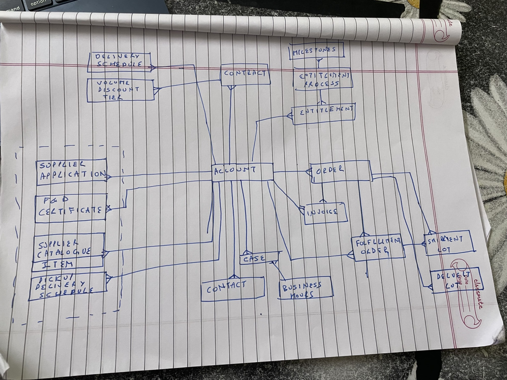
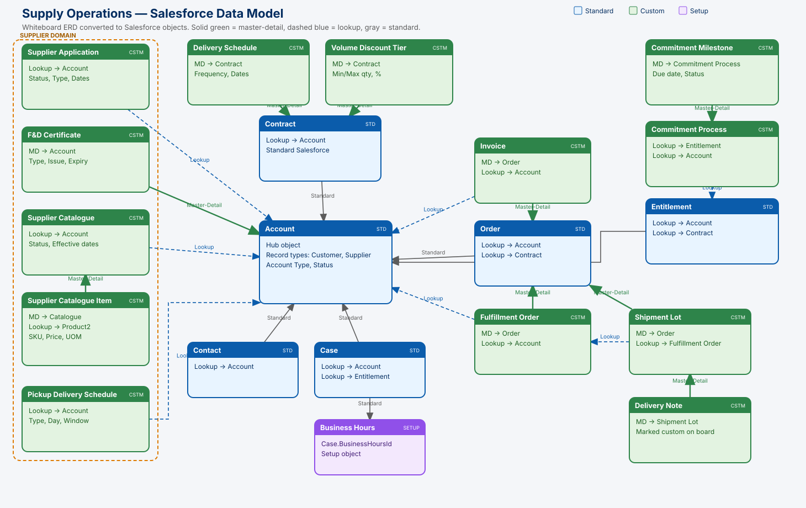
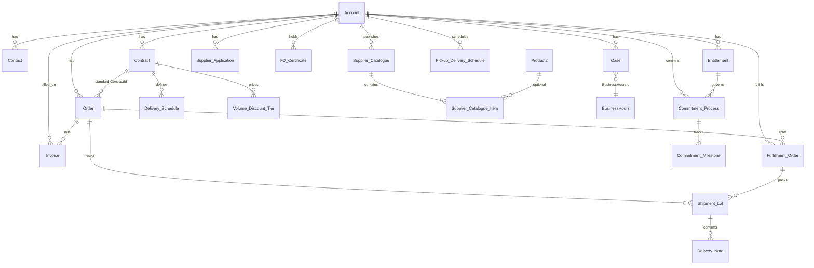

# Supply Operations Salesforce Data Model

This project turns the handwritten whiteboard ERD in `docs/source/whiteboard-data-model.jpg` into a deployable Salesforce DX data model.

Account is the hub. Supplier onboarding sits on the left. Commercial contracts and service entitlements sit above. Orders, invoices, fulfillment, and delivery sit on the right. Service cases sit below.



The generated schema:



## How to read the model

| Style on the board | Salesforce relationship |
| --- | --- |
| Solid line into a parent | Master-Detail when the child cannot exist alone |
| Loose / optional line | Lookup |
| Standard Salesforce nouns | Reuse the standard object |
| Red **custom** on Delivery Note | `Delivery_Note__c` |

## Object map

### Standard objects (reused)

| Whiteboard | Salesforce | Parent | Notes |
| --- | --- | --- | --- |
| Account | `Account` | — | Record types **Customer** and **Supplier**. Custom `Account_Type__c`, `Supplier_Status__c`, `Customer_Status__c`. |
| Contact | `Contact` | Account | Standard `AccountId`. |
| Contract | `Contract` | Account | Standard `AccountId`. Extra volume and delivery-term fields. |
| Order | `Order` | Account | Standard `AccountId` and `ContractId`. Enable Orders in the target org. |
| Invoice | `Invoice__c` | Order + Account | Custom so the model deploys without Revenue Cloud. Replace with standard `Invoice` if Billing is licensed. |
| Case | `Case` | Account | Standard `AccountId`, `ContactId`, `EntitlementId`. |
| Business Hours | `BusinessHours` | Case | Setup object. Use standard `Case.BusinessHoursId`. |
| Entitlement | `Entitlement` | Account | Standard `AccountId`. Optional custom lookup to sales `Contract`. |
| Fulfillment Order | `Fulfillment_Order__c` | Order + Account | Custom so the model deploys without Order Management. Replace with `FulfillmentOrder` if OM is licensed. |

### Custom objects (from the board)

| Whiteboard | API name | Relationship | Sharing |
| --- | --- | --- | --- |
| Supplier Application | `Supplier_Application__c` | Lookup → Account | Private / ReadWrite |
| F&D Certificates | `FD_Certificate__c` | Master-Detail → Account | Controlled by parent |
| Supplier Catalogue | `Supplier_Catalogue__c` | Lookup → Account | ReadWrite |
| Item (nested in Catalogue) | `Supplier_Catalogue_Item__c` | Master-Detail → Catalogue; Lookup → Product2 | Controlled by parent |
| Pickup Delivery Schedule | `Pickup_Delivery_Schedule__c` | Lookup → Account | ReadWrite |
| Delivery Schedule | `Delivery_Schedule__c` | Master-Detail → Contract | Controlled by parent |
| Volume Discount Tier | `Volume_Discount_Tier__c` | Master-Detail → Contract | Controlled by parent |
| Commitment Process | `Commitment_Process__c` | Lookup → Entitlement, Lookup → Account | ReadWrite |
| Milestones | `Commitment_Milestone__c` | Master-Detail → Commitment Process | Controlled by parent |
| Shipment Lot | `Shipment_Lot__c` | Master-Detail → Order; Lookup → Fulfillment Order | Controlled by parent |
| Delivery Note (custom) | `Delivery_Note__c` | Master-Detail → Shipment Lot | Controlled by parent |

The nested **ITEM** box under Supplier Catalogue is modeled as two objects: a catalogue header and catalogue items. That matches how Salesforce merchandising catalogs are usually built.

## Relationship diagram



## Domain walkthrough

### Supplier domain (dashed box on the left)

Use an Account with record type **Supplier**.

1. Capture onboarding on `Supplier_Application__c`.
2. Store food and drink compliance on `FD_Certificate__c`.
3. Publish sellable range on `Supplier_Catalogue__c` / `Supplier_Catalogue_Item__c`.
4. Hold standing pickup/delivery windows on `Pickup_Delivery_Schedule__c`.

### Commercial domain

Use an Account with record type **Customer**.

1. Contract the customer (`Contract`).
2. Attach delivery cadence (`Delivery_Schedule__c`) and quantity breaks (`Volume_Discount_Tier__c`).
3. Place Orders against the Account (and optionally the Contract).
4. Bill with `Invoice__c`, pick with `Fulfillment_Order__c`, ship with `Shipment_Lot__c`, confirm with `Delivery_Note__c`.

### Service domain

1. Entitlement on the Account (optionally linked to the sales Contract).
2. `Commitment_Process__c` holds the operational commitment.
3. `Commitment_Milestone__c` holds timed checkpoints (the board's Milestones).
4. Cases use the Account, Contact, Entitlement, and org Business Hours.

## Deploy

Requires Salesforce CLI and an org with **Orders** enabled (`Setup → Order Settings`).

```bash
sf project deploy start --source-dir force-app
sf org assign permset --name Supply_Operations_User
```

Optional sample Accounts and Contacts:

```bash
sf data import tree --plan data/sample/import-plan.json
```

Licensed-feature swap:

- Revenue Cloud / Salesforce Billing: keep `Invoice__c` or retire it in favor of standard `Invoice`.
- Order Management: keep `Fulfillment_Order__c` or retire it in favor of `FulfillmentOrder` / `Shipment`.
- Native entitlement processes: `Commitment_Process__c` can later map to Entitlement Process + Milestone Type setup. It is a data object here so it deploys without that configuration.

## Project layout

```
force-app/main/default/
  applications/Supply_Operations.app-meta.xml
  permissionsets/Supply_Operations_User.permissionset-meta.xml
  objects/          # custom objects + fields on Account, Contract, Order, Entitlement
  tabs/
scripts/generate_metadata.py   # regenerates object XML from the model definition
scripts/validate_data_model.py
scripts/render_erd.py
```

Regenerate metadata after changing `CUSTOM_OBJECTS` or `STANDARD_FIELDS` in `scripts/generate_metadata.py`:

```bash
python3 scripts/generate_metadata.py
python3 scripts/validate_data_model.py
python3 scripts/render_erd.py
```
