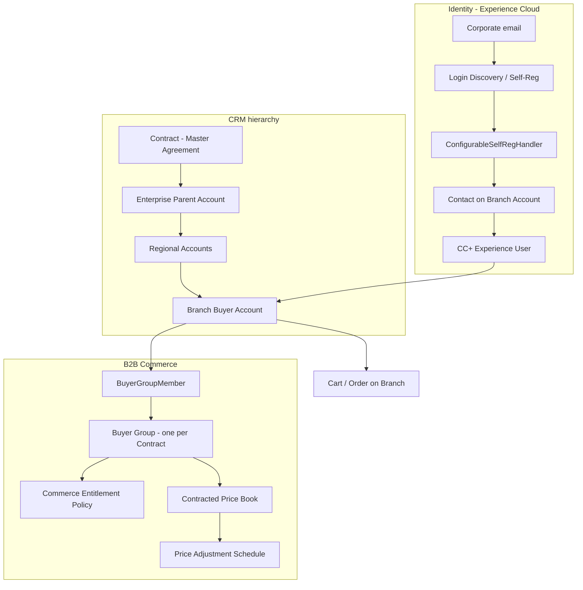

# FSG 1.2 Corporate Ordering — Salesforce Architecture

**Client:** FreshSource Global (FSG)
**Requirement:** 1.2 Corporate Ordering
**Products:** Sales Cloud, B2B Commerce (Lightning), Experience Cloud, Salesforce Order Management
**Principle:** Prefer Salesforce out-of-the-box (OOTB) features. Use custom Apex/LWC only where documented limits or FSG-specific rules make OOTB insufficient.
**Well-Architected:** Account-first identity ([Salesforce Architects](https://www.salesforce.com/blog/experience-cloud-identity-access-account/)), least privilege, and documented large-data-volume (LDV) limits.

---

## 0. Executive recommendation

**Use Business Accounts + Contacts + B2B Commerce Buyer Groups, with each branch as its own Buyer Account.**

That is the Salesforce-documented B2B pattern. It is the only model that keeps contracted catalog/pricing, branch-only user administration, and 15,000 locations inside platform features and published limits.

| Need | OOTB mechanism | Custom only if |
| --- | --- | --- |
| Multi-year Master Agreement | Standard **Contract** on the enterprise Account | Custom Agreement object (unnecessary) |
| Pre-negotiated catalog and prices | **Buyer Group + Entitlement Policy + Price Book** (one group per contract) | Per-branch groups (anti-pattern; hits the 2,000 buyer-groups-per-product search index) |
| Tiered volume discounts | **Price Adjustment Schedule / Tier** (`Volume`, Range or Slab) | Retrospective rebate true-up to ERP |
| Delivery schedules | Branch shipping address + **Order Delivery Method** + **Desired Delivery Date** | Capacity-constrained `Delivery_Slot__c` |
| Chef self-register with corporate email | Experience Cloud Login & Registration + OTP | Documented **self-reg handler** to bind email domain + location to the correct Branch Account |
| One user manages others **only in their branch** | **Delegated External User Administration** + **Super User Access** on that Branch Account | Custom admin LWC (only if FSG refuses branch Accounts) |
| 15,000 locations under one agreement | Regional **intermediate Accounts** (stay under 10,000 children per parent) | — |
| HQ orders for thousands of stores | External Managed Accounts / Account Switcher **up to 200** | Custom location picker using `effectiveAccountId` (OOTB switcher degrades past 200, fails ~2,000) |
| SSO per enterprise at scale | **Login Discovery** keyed off Account | Handler reads IdP key from Enterprise Account |

**Do not use Person Accounts for corporate chefs.** They are representatives of a company, not the customer. Person Accounts cannot be Partner users, collapse hierarchy and contracts, and make Delegated External User Administration meaningless.

---

## 1. Requirement in architecture terms

Corporate enterprises sign a multi-year Master Agreement with FSG. After the enterprise is onboarded:

- Individual store managers and head chefs self-register with their **corporate email**.
- They must land on **that company’s** pre-negotiated catalog, **tiered volume discounts**, and **delivery schedules**.
- One FSG client has **15,000+ branch locations** under a **single** Master Agreement.
- From the broader FSG model: one user in a branch must manage other users **only in that branch**.
- FSG also serves 150,000+ local branch buyers and 50k orders/day across 14 time zones.

This is a **B2B Account-centric** problem (company + locations + contracted commerce), not a B2C Person Account problem.

Official Salesforce guidance this design follows:

- Identity and access start at **Account**: User → Contact → Account ([Salesforce Architects / Experience Cloud identity](https://www.salesforce.com/blog/experience-cloud-identity-access-account/)).
- Person Accounts store **individual consumers**; default Accounts are **business accounts** ([Salesforce Help — Person Accounts](https://help.salesforce.com/s/articleView?id=sf.account_person.htm)).
- Do not put more than **10,000 child records** under one parent Account ([Salesforce Help — Sharing performance](https://help.salesforce.com/s/articleView?id=platform.security_sharing_performance.htm); [Parent-Child Data Skew](https://developer.salesforce.com/docs/atlas.en-us.draes.meta/draes/draes_object_relationships_parent_child_data_skew.htm)).
- B2B catalog/price entitlement is **Buyer Group + Entitlement Policy + Price Book**, not one policy per location ([B2B Commerce data model](https://developer.salesforce.com/docs/commerce/salesforce-commerce/guide/b2b-b2c-dev-data-model.html)).
- Delegated user admin is scoped to the user’s Account ([Delegate External User Administration](https://help.salesforce.com/s/articleView?id=sf.networks_delegate_external_user_admin.htm); [Buy on behalf / External Managed Accounts](https://help.salesforce.com/s/articleView?id=commerce.comm_buy_on_behalf.htm)).
- Super User Access is same-Account / same-or-below-role visibility, not cross-branch admin ([Super User Access](https://help.salesforce.com/s/articleView?id=sf.networks_partners_super_user_access.htm)).
- Account Role Optimization (ARO) and Account Relationship Data Sharing Rules **cannot be combined** ([Salesforce Help](https://help.salesforce.com/s/articleView?id=004693450)). FSG needs ARO at this volume, so HQ cross-branch access must use Sharing Sets, sharing rules, or a custom picker — not ARDS.

---

## 2. Two solution paths (OOTB and custom)

Salesforce’s own docs tell you to stay on the standard commerce and identity model and extend only at documented extension points. Both paths are described so FSG can see the trade-off. **Path A is the recommended production design.** Path B is the fallback if FSG refuses additional Accounts; it is not Salesforce best practice.

### 2.1 Path A — OOTB-first (recommended)



**What stays 100% OOTB**

1. **Business Account hierarchy** — enterprise, region, branch. Each branch is a Buyer Account.
2. **Contract** on the enterprise for the Master Agreement, with `Pricebook2Id`.
3. **One Buyer Group per Master Agreement** shared by all 15,000 branch Buyer Accounts (limit: 10 million members per group).
4. **Commerce Entitlement Policy** for the contracted catalog; **BuyerGroupPricebook** for negotiated prices.
5. **Price Adjustment Schedule** (`ScheduleType = Volume`) for cart-time tiered discounts.
6. **Order Delivery Method** + checkout **Desired Delivery Date**, defaulted from branch fields.
7. **Experience Cloud** B2B store, email OTP, Login Discovery.
8. **Delegated External User Administration** so a branch manager creates / resets / deactivates users **only on that Account**.
9. **Super User Access** so that manager sees other users’ orders/cases **on the same branch**.
10. **Customer Community Plus** + Commerce Buyer, with **Account Role Optimization** and one portal role per Account.
11. **Sharing Sets** (User → Contact → Account) for branch-scoped record access; external OWD **Private**.
12. **External Managed Accounts / Account Switcher** only for HQ users who buy for **≤ 200** locations.

**Documented OOTB extensions (still the Salesforce-supported path, not a custom engine)**

- `Auth.ConfigurableSelfRegHandler` or B2B `CommerceSelfRegistrationController` to place the Contact on the **chosen Branch Account** instead of the site default Account ([ConfigurableSelfRegHandler](https://developer.salesforce.com/docs/atlas.en-us.apexref.meta/apexref/apex_interface_Auth_ConfigurableSelfRegHandler.htm), [B2B custom self-registration](https://developer.salesforce.com/docs/commerce/salesforce-commerce/guide/b2b-comm-custom-self-registration.html)).
- Login Discovery handler that reads the enterprise IdP key from Account ([identity blog](https://www.salesforce.com/blog/experience-cloud-identity-access-account/)).
- Checkout Flow / LWR component that defaults and validates `desiredDeliveryDate` from branch cadence fields.

### 2.2 Path B — custom (not recommended as primary)

**Single Enterprise Account + custom Location object + all Contacts on the enterprise.**

This looks simpler and avoids 15,000 Accounts, but it **breaks** the OOTB features Path A relies on:

| OOTB feature lost | Consequence |
| --- | --- |
| Delegated External User Administration | Admin is no longer branch-scoped. Must write a custom user-admin LWC and enforce Location in Apex. |
| Super User Access | Visibility fans out to every contact on the enterprise, not “this kitchen only.” |
| B2B Buyer Account / cart / ship-to | Commerce context is Account-based; you would fake a buyer per location anyway. |
| Parent-child / account data skew | 15,000+ Contacts on one Account is the textbook [parent-child data skew](https://developer.salesforce.com/docs/atlas.en-us.draes.meta/draes/draes_object_relationships_parent_child_data_skew.htm) example. |
| Sharing Sets | Cannot isolate “users in my branch only” without custom sharing. |

Use Path B only if FSG refuses additional Accounts **and** accepts 100% custom commerce buyer context, custom user admin, and custom sharing. That is not Salesforce best practice.

**Person Accounts are rejected for both paths.** Help text: they extend B2B account functionality to store information about **individual people**. Using them for 15,000 chefs would:

- Treat the person as the customer, so catalog/price would be per person, not per company.
- Destroy Account hierarchy and Contract ownership.
- Block Partner licenses if FSG later needs them ([portal-to-community guidance](https://resources.docs.salesforce.com/latest/latest/en-us/sfdc/pdf/salesforce_portal_to_community_migration_cheatsheet.pdf): Person Accounts cannot be partner accounts).
- Make Delegated External User Administration meaningless (each person is their own Account).

**Micro-buyers** (independent cafes / food trucks) still should be **Business Accounts**. A food truck is a company with one location, not a consumer.

---

## 3. OOTB data model (Path A)

```text
Enterprise Parent Account  (legal entity, Master Agreement owner)
        │
        ├── Regional Account  (NA / LATAM / EMEA or brand/division)
        │         │
        │         ├── Branch Account (Buyer Account)  ← store / kitchen
        │         │         ├── Contact  (chef / store manager)
        │         │         └── User     (Experience Cloud)
        │         └── Branch Account ...
        └── Regional Account ...
```

### 3.1 Objects and OOTB purpose

| Object | Record type / usage | OOTB role |
| --- | --- | --- |
| Account | Enterprise Parent | Legal entity, SSO config, commercial owner of the Master Agreement |
| Account | Regional (intermediate) | Hierarchy roll-up only. Prevents parent-child data skew at 15,000 locations |
| Account | Branch (Buyer Account) | Ordering party, ship-to, delegated admin boundary |
| Contact | Branch staff | Person working at that location |
| User | Customer Community Plus | Login identity; created from the Contact |
| Contract | Master Agreement | Multi-year term, status, contracted price book |
| BuyerAccount | Enabled on each Branch Account | Makes the Account a Commerce buyer |
| BuyerGroup | One per Master Agreement (or per pricing track) | Shared catalog, prices, entitlements |
| BuyerGroupMember | Branch Account → BuyerGroup | Entitles the location to the enterprise deal |
| CommerceEntitlementPolicy | Contracted catalog | Which products the buyer group can see |
| Pricebook2 + PricebookEntry | Contracted prices | Pre-negotiated unit prices |
| BuyerGroupPricebook | Buyer Group ↔ Price Book | Storefront pricing |
| PriceAdjustmentSchedule + PriceAdjustmentTier | Volume / tier discounts | Cart-time quantity breaks |
| OrderDeliveryMethod | Cold-chain / standard / rush | Checkout delivery options |
| CartDeliveryGroup / OrderDeliveryGroup | DesiredDeliveryDate | Requested delivery date on the order |
| WebStore | FSG B2B store | Authenticated wholesale storefront |

Do **not** model a branch as the standard **Location** object. Location is for inventory / warehouses / OMS fulfillment nodes, not for B2B buyers. Buyer context, delegated admin, and sharing all key off **Account**.

### 3.2 Why each branch is an Account (not a Location custom object)

Salesforce **Delegated External User Administration** lets an external user create, edit, reset, and deactivate users **on their own Account**.

If all 15,000 kitchens lived as Contacts (or custom Location records) under **one** enterprise Account:

- A “branch admin” could manage users across **every** location.
- 15,000+ Contacts under one Account would create **parent-child data skew**.
- Orders, carts, and Buyer Account context in B2B Commerce are Account-based.

Therefore the branch **must** be an Account for OOTB admin, commerce, and sharing to stay inside documented features.

### 3.3 Why not 15,000 children under one parent

Salesforce’s documented threshold is **10,000 children per parent**. One enterprise with 15,000 branch Accounts as direct children is a **parent-child data skew** anti-pattern: implicit sharing recalculation, record locking, and slow owner/parent changes.

**OOTB fix:** insert Regional (or Brand/Division) Accounts so no parent has ≥10,000 children.

Example for 15,000 locations:

- 1 Enterprise Parent
- 20 Regional Accounts (~750 branches each), or
- Region × Brand if that matches how FSG sells and delivers

Account hierarchy is for reporting and CRM navigation. It does **not** grant Experience Cloud access by itself. Access still comes from sharing sets / roles / buyer groups.

### 3.4 Master Agreement = Contract, not a custom “Agreement” object

Use the standard **Contract** on the Enterprise Parent Account:

- Start date, end date, status, contract term
- `Pricebook2Id` for the negotiated book
- Optional standard Contract Line Items if SKU-level contracted prices are sold through CPQ/Revenue Cloud
- Custom fields only for FSG-specific commercial terms (rebate calculation method, delivery SLA class, catalog version)

Automation (Flow, not Apex unless limits require it):

1. Contract activated → create or activate Buyer Group `{Account.Name} – {ContractNumber}`
2. Create BuyerGroupPricebook and CommerceEntitlementBuyerGroup
3. Add existing branch Buyer Accounts as BuyerGroupMembers
4. New branch Account with `Master_Contract__c` populated → Flow adds BuyerGroupMember

One Buyer Group per Master Agreement scales. Salesforce allows **10 million Buyer Accounts per Buyer Group**. Creating 15,000 Buyer Groups (one per branch) would hit entitlement and search limits (2,000 buyer groups indexed per product).

---

## 4. Identity, registration, and branch-scoped user admin

### 4.1 OOTB identity stack

Follow Salesforce’s published Account-first identity pattern:

1. **Business Account** is the company (or branch) anchor.
2. **Contact** is the person.
3. **User** is the login.
4. **Login Discovery** asks for email and routes SSO or Salesforce login from Account configuration.
5. Access is granted explicitly (Sharing Sets and/or roles), not by the hierarchy alone.

License (OOTB feature fit, not “buy the most expensive SKU”):

| Persona | License | Why |
| --- | --- | --- |
| Branch chef / buyer | Customer Community Plus + Commerce Buyer | Needs cart/order on their Account, and optionally reports |
| Branch user admin | Same, plus **Delegated External User Administration** and **Super User Access** | OOTB Account Management page + same-branch record visibility |
| Enterprise HQ buyer-for (≤200 locations) | CC+ + **Buyer Manager** + Account Switcher | OOTB “Buy For” / Manage Users on External Managed Accounts |
| High-volume buyer with no admin rights (optional later) | Customer Community | Sharing Sets only; cannot use DEUA or full sharing model |

**Enable Account Role Optimization (ARO).** Customer Community Plus creates portal roles. Default org limit is **50,000 portal roles** ([Experience Cloud user licenses](https://help.salesforce.com/s/articleView?id=users_license_types_communities.htm)). Fifteen thousand branches with 2+ users each will consume roles quickly. ARO delays role creation until a second user exists on the Account. Reduce roles per Account to the minimum (often one). Request a limit increase only after ARO and role minimization.

**Do not enable Account Relationship Data Sharing Rules in this org if ARO is on.** Salesforce documents that ARDS does not work when ARO (or Person Accounts) is enabled. HQ cross-branch needs must use Sharing Sets, owner-based/criteria sharing rules, or the custom Account Switcher — not ARDS.

Do **not** default every corporate buyer to Partner Community. Partner licenses are for partners who need Leads/Opportunities/PRM. FSG’s chefs are customers, not channel partners. Partner Community also **cannot** use Person Accounts.

### 4.2 OOTB self-registration (baseline)

Experience Cloud Login & Registration:

- Enable self-registration on the B2B store.
- Email verification (Configurable Self-Reg Page).
- Default Account on `NetworkSelfRegistration` is **not** sufficient for FSG: it would dump every chef onto one Account (skew + wrong catalog).

Salesforce documents two supported extension points (this is the “OOTB + documented handler” path, not a greenfield engine):

1. **`Auth.ConfigurableSelfRegHandler`** — generated when you choose the Configurable Self-Reg Page; modify how the User/Contact/Account are created ([Apex Reference](https://developer.salesforce.com/docs/atlas.en-us.apexref.meta/apexref/apex_interface_Auth_ConfigurableSelfRegHandler.htm)).
2. **B2B Commerce custom self-registration** — LWC + Apex that creates User, enables Buyer Account, and adds Buyer Group membership ([B2B Commerce Developer Guide](https://developer.salesforce.com/docs/commerce/salesforce-commerce/guide/b2b-comm-custom-self-registration.html)).

### 4.3 Registration rules for FSG (handler logic)

Collect: first name, last name, **corporate email**, phone, and **branch / location code** (or searchable store list).

Handler / Flow steps:

1. Verify email (OTP) — OOTB.
2. Reject consumer domains (gmail, yahoo, etc.).
3. Match email domain to Enterprise Parent (custom field `Approved_Email_Domains__c`, e.g. `acmehotels.com`).
4. Require the user to pick a **Branch Account** that is a descendant of that enterprise (and active under the current Contract).
5. Create Contact on the **selected Branch Account**, then Experience Cloud User.
6. Enable Buyer Account on the branch if not already enabled; add BuyerGroupMember from the active Contract.
7. First active user on a branch: assign permission set **Branch User Admin** (Delegated External User Administration + Super User Access). Subsequent users: **Branch Buyer** only.
8. If domain matches but branch is unknown, or domain does not match: create no buyer access. Create a Case / Approval for FSG onboarding. Never attach unmatched users to a dummy “Unassigned” Account (documented skew anti-pattern).

Email domain is **not** proof of employment. Salesforce’s own identity guidance treats Account as the trust boundary; FSG should add OTP plus either (a) branch admin approval of first-time users or (b) enterprise SSO via Login Discovery once the client is large enough.

### 4.4 Branch-only user management (OOTB)

Salesforce splits “manage users” and “see their data.” Use both, still OOTB, still Account-scoped.

| Capability | OOTB feature | Scope |
| --- | --- | --- |
| Create / edit / deactivate users, reset passwords, assign allowed permission sets | **Delegated External User Administration** → Account Management page | Contacts on **that** Account only |
| See other chefs’ orders, cases, and related records on the same kitchen | **Super User Access** (same role or below on the Account) | Same Account; does not cross branches |
| Buy or manage users on *other* Accounts | **Buyer Manager** + External Managed Accounts | Hard limit **200** Buy For accounts per user |

A branch manager cannot see other branches because they are not Contacts on those Accounts and are not given External Managed Account rows.

**Do not use External Managed Accounts / Account Switcher for “admin of all 15,000 stores.”** Salesforce documents a **200 Buy For / managed accounts per user** limit. Performance degrades past 200; the switcher **fails at ~2,000**. HQ users who must order for many locations need the custom Account Switcher path in section 6.

### 4.5 Sharing (least privilege)

- External OWD: **Private** for Account, Order, Case, Cart-related objects as applicable.
- Each user sees their Branch Account via the User → Contact → Account relationship.
- Sharing Set (works even on Customer Community): AccountId = user’s Account, plus related Orders/Cases/Carts ([Create a Sharing Set](https://help.salesforce.com/s/articleView?id=sf.networks_setting_light_users.htm)).
- Super User Access / CC+ role hierarchy only if a true manager-sees-team requirement appears **inside** a branch. Do not model the 15,000-location org chart as roles.
- Cross-branch HQ visibility: Sharing Set via Account Contact Relationships (for small HQ sets) or a custom picker. **Not** Account Relationship Data Sharing Rules, because ARO is required at this volume.

---

## 5. Catalog, pricing, volume discounts, delivery

### 5.1 Pre-negotiated catalog (OOTB)

```text
WebStore
  └── Buyer Group  (Master Agreement)
        ├── CommerceEntitlementPolicy  → entitled Product2 records
        └── BuyerGroupPricebook        → contracted Pricebook2
```

All 15,000 branch Buyer Accounts are **members of the same Buyer Group**. Search indexing stays well under the **2,000 buyer groups per product** entitlement limit.

If one Master Agreement has two commercial tracks (e.g. “Core SKUs” vs “Premium protein program”), use **two Buyer Groups**, still shared by all branches, not 15,000 groups.

Stay inside documented B2B limits ([entitlement limits](https://developer.salesforce.com/docs/commerce/salesforce-commerce/guide/b2b-b2c-comm-data-model-entitlement-limits.html), [price book limits](https://developer.salesforce.com/docs/commerce/salesforce-commerce/guide/b2b-b2c-comm-data-model-price-book-limits.html), [buyer group limits](https://developer.salesforce.com/docs/commerce/salesforce-commerce/guide/b2b-b2c-comm-data-model-shopper-buyer-groups-accounts-limits.html)):

- ≤ 20 buyer groups per buyer account (soft; do not one-off every location)
- ≤ 50 price books per buyer group; ≤ 25 evaluated per pricing call
- ≤ 200 buyer groups per entitlement policy
- ≤ 2,000 buyer groups indexed per product (search)

### 5.2 Tiered volume discounts (OOTB)

Use **Price Adjustment Schedule** (`ScheduleType = Volume`) and **Price Adjustment Tier** ([PriceAdjustmentSchedule](https://developer.salesforce.com/docs/atlas.en-us.revenue_lifecycle_management_dev_guide.meta/revenue_lifecycle_management_dev_guide/sforce_api_objects_priceadjustmentschedule.htm)):

- `Range`: entire quantity gets the highest qualifying tier (typical wholesale break).
- `Slab`: each quantity band gets its own rate.

Attach the schedule to the contracted price book / products. This is cart-time discounting and is the documented B2B Commerce mechanism.

**Volume rebates** in the broader FSG story (true-up on quarterly spend, paid back to the enterprise) are **not** the same as cart tiers. OOTB Promotions / adjustment schedules do not replace rebate accounting. Model rebates as:

- OOTB: Rebate / program records if Revenue Cloud capabilities are in the org, **or**
- Custom: `Volume_Rebate_Program__c` on the Contract + batch true-up to ERP/billing

Do not try to fake enterprise rebates as 15,000 buyer-group promotions.

### 5.3 Delivery schedules (OOTB first)

OOTB Commerce already has:

- Branch Account shipping addresses (each kitchen’s dock)
- **Order Delivery Method** (e.g. Cold Chain AM, Dry Grocery, Will-Call)
- Checkout **Desired Delivery Date** ([Update Checkout Information](https://developer.salesforce.com/docs/commerce/salesforce-commerce/guide/b2b-comm-checkout-update-information.html))
- Shipping integration that can filter methods by address / date
- OMS **Order Delivery Group** for fulfillment

Put contracted cadence on the **Branch Account** with standard or custom fields, not a new commerce engine:

- `Preferred_Delivery_Days__c` (multi-select)
- `Delivery_Window__c` (e.g. 04:00–07:00)
- `Default_Delivery_Method__c`
- `TimeZoneSidKey` (branch local time; FSG spans 14 time zones)

Checkout Flow / LWR checkout component:

1. Default `desiredDeliveryDate` to the next eligible day from the branch fields, computed in the branch time zone.
2. Restrict selectable dates to those days (LWC validator or checkout calculator).
3. Auto-select the contracted Order Delivery Method.

That covers most “delivery schedule” needs without a custom object.

Use a custom `Delivery_Slot__c` child of Branch Account only if FSG sells **capacity-constrained slots** (this kitchen can receive only two pallets on Tuesday AM). That is operational, not commercial, data.

---

## 6. Custom solution (only where OOTB stops)

Salesforce’s own docs tell you when to customize. Use custom code for these gaps; do not rebuild Commerce.

| Gap | Why OOTB is not enough | Custom solution | Stay aligned with docs |
| --- | --- | --- | --- |
| Bind a registering chef to the **correct branch** | Standard self-reg uses one default Account | `Auth.ConfigurableSelfRegHandler` or documented B2B `CommerceSelfRegistrationController` | Keep User → Contact → Account; enable Buyer Account + Buyer Group in the same transaction |
| Domain + location eligibility | No OOTB “email domain directory” object | `Approved_Email_Domains__c` on Enterprise Account; query in the handler | Never park rejects on a catch-all Account |
| HQ orders for **thousands** of stores | Account Switcher limit **200**; fails ~**2,000** | Custom account/location picker using `effectiveAccountId` / Buy For APIs, with search, not a 15k dropdown | Documented extension of Account Switcher |
| Retrospective volume rebates | Price Adjustment Tiers are cart-time | Contract-level rebate program + scheduled Apex / Data Cloud / ERP | Keep Buyer Group pricing OOTB |
| Slot-level delivery capacity | DesiredDeliveryDate is a date, not a capacity slot | `Delivery_Slot__c` + checkout validator | Still use OrderDeliveryMethod |
| Role explosion if every branch has many CC+ users | 50,000 portal role default | ARO + fewer roles first; if still over, mix **Customer Community** buyers with **CC+** delegated admins, or request limit increase | Do not invent a parallel user table |
| Chef works at multiple branches | One Contact, one Account | Enable **Contacts to Multiple Accounts**; Contact-Account Relationships. Commerce effective account still needs an explicit switch | EMA only if ≤200 locations per person |
| SSO per enterprise at scale | One IdP button per client does not scale | Login Discovery handler reads IdP key from Enterprise Account ([Salesforce identity blog](https://www.salesforce.com/blog/experience-cloud-identity-access-account/)) | Configuration per Account, not a new package per client |
| HQ visibility while ARO is on | ARDS is incompatible with ARO | Sharing Sets / criteria sharing / custom picker | Do not turn off ARO to unlock ARDS at 15k branches |

### 6.1 Path B custom model (not recommended as primary)

Covered in section 2.2. Repeat: use it only if FSG refuses additional Accounts **and** accepts 100% custom commerce buyer context. That is not Salesforce best practice.

### 6.2 Person Account option (reject for 1.2)

Covered in section 2.2. Person Accounts are for individual consumers, not enterprise branch buyers.

---

## 7. End-to-end process

### 7.1 Enterprise onboarding (FSG internal)

1. Sales closes Master Agreement → Opportunity → **Contract** on Enterprise Parent Account.
2. Load or create Regional + Branch Accounts (Bulk API; round-robin ownership to avoid **ownership skew** of 10,000+ records on one user).
3. Enable Buyer Account on branches in bulk.
4. Flow: Contract Activated → Buyer Group + entitlement + price book + BuyerGroupMembers.
5. Store approved email domains and optional SSO key on the Enterprise Account.
6. Seed the first Branch User Admin (manual or data load) for a pilot location.

### 7.2 Chef / store manager registration

1. User opens FSG B2B store → Register.
2. Enters corporate email → OTP.
3. Handler matches domain → shows eligible branches.
4. Contact + User created on Branch Account; buyer group inherited from Contract.
5. User sees only the contracted catalog and prices; checkout defaults to that branch’s delivery schedule.

### 7.3 Branch user administration

1. Branch User Admin opens **Account Management** (OOTB).
2. Adds a sous-chef as Contact → enables customer user.
3. Super User Access lets them see that user’s orders on the same Account.
4. Cannot switch to another store’s Account.

### 7.4 Ordering

1. Authenticated session; effective Account = Branch.
2. Product search filtered by Entitlement Policy.
3. Prices from contracted price book + volume tiers.
4. Delivery date constrained by branch schedule; method = cold chain as contracted.
5. Order + Order Delivery Group written; OMS / ERP fulfillment.

---

## 8. Scale, limits, and LDV controls

FSG is a **large data volume** org (50k orders/day, 150k buyers, 15k locations on one contract). Design to documented limits from day one.

| Risk | Documented limit / guidance | FSG control |
| --- | --- | --- |
| Parent-child skew | 10,000 children per parent | Regional intermediate Accounts |
| Ownership skew | 10,000 records per owner | Pool of integration/owner users; round-robin branch ownership |
| Portal roles | 50,000 default | ARO, one role per Account, monitor 95% email from Salesforce |
| ARO vs ARDS | Mutually exclusive | Keep ARO; do not use ARDS |
| Account Switcher | 200 per user; fails ~2,000 | OOTB only for small HQ sets; custom picker otherwise |
| Buyer groups per product (search) | 2,000 indexed | One (or few) groups per Master Agreement |
| Buyer groups per account | 20 (soft) | Do not assign location-specific groups |
| Buyer groups per entitlement policy | 200 | Few groups per contract, not per branch |
| Price books per pricing call | 25 | One contracted book + sparse overlays |
| Buyer Accounts per Buyer Group | 10 million | 15,000 members is well inside |
| Buyer users | 1.5 million (soft) | 150k branch users is in range |
| Time zones / 50k orders/day | Platform API and OMS throughput | Async order capture, index only needed fields, Big Objects / Data Cloud for history |

Also:

- Do not use a single “Unassigned Corporate Users” Account.
- Do not give the Contract integration user a role that sits high in the internal hierarchy (sharing fan-out).
- Use **skinny indexes** on `Account.ParentId`, `Account.Master_Contract__c`, email domain, and location code if queries appear in self-reg.
- 14 time zones: store delivery windows in the **branch local time zone** (`TimeZoneSidKey` on Account or User); compute `DesiredDeliveryDate` in that zone.

---

## 9. Decision summary

| Design question | OOTB choice | Custom only if |
| --- | --- | --- |
| Person vs Business Account | **Business Account + Contact** | Never for corporate 1.2 |
| What is a branch? | **Child Business Account (Buyer)** | Location custom object (not recommended) |
| 15,000 locations under one parent | **Regional intermediate Accounts** | — |
| Master Agreement | **Contract** on enterprise Account | Custom Agreement object (unnecessary) |
| Catalog and contracted price | **Buyer Group + Entitlement + Price Book** | Per-branch groups (anti-pattern) |
| Tiered discounts | **Price Adjustment Schedule/Tier** | Rebate true-up engine |
| Delivery schedule | Account fields + **Delivery Method + Desired Delivery Date** | Slot capacity object |
| Registration | Experience Cloud self-reg + **documented handler** | Fully custom IdP |
| Branch user admin | **DEUA + Super User Access** | Custom admin LWC |
| HQ buy-for many stores | External Managed Accounts if ≤200 | **Custom Account Switcher** |
| Cross-branch sharing | Sharing Sets / custom picker | Do not use ARDS with ARO |
| License | **Customer Community Plus** + ARO + Commerce Buyer | Mix CC for pure buyers if roles saturate |

**Best overall answer:** OOTB B2B Commerce on Experience Cloud, with **each store as a Buyer Account** under a **skew-safe hierarchy**, **one Buyer Group per Master Agreement**, **Delegated External User Administration + Super User Access** for branch-only user management, and a **documented self-registration handler** that maps corporate email domain + location to that Account. Customize only registration matching, large-scale buy-for, rebate true-up, and delivery-slot capacity.

---

## 10. Salesforce references

- [Person Accounts (Help)](https://help.salesforce.com/s/articleView?id=sf.account_person.htm)
- [Start with Accounts: Design Identity and Access That Scales](https://www.salesforce.com/blog/experience-cloud-identity-access-account/)
- [Best Practices for Optimizing Sharing Performance](https://help.salesforce.com/s/articleView?id=platform.security_sharing_performance.htm)
- [Parent-Child Data Skew — Designing Record Access for Enterprise Scale](https://developer.salesforce.com/docs/atlas.en-us.draes.meta/draes/draes_object_relationships_parent_child_data_skew.htm)
- [Experience Cloud User Licenses (portal role limit, ARO)](https://help.salesforce.com/s/articleView?id=users_license_types_communities.htm)
- [Account Role Optimization](https://help.salesforce.com/s/articleView?id=sf.networks_partners_optimize_roles.htm)
- [ARDS does not work with ARO or Person Accounts](https://help.salesforce.com/s/articleView?id=004693450)
- [Create a Sharing Set](https://help.salesforce.com/s/articleView?id=sf.networks_setting_light_users.htm)
- [ConfigurableSelfRegHandler](https://developer.salesforce.com/docs/atlas.en-us.apexref.meta/apexref/apex_interface_Auth_ConfigurableSelfRegHandler.htm)
- [Implement Custom Self-Registration for a B2B Store](https://developer.salesforce.com/docs/commerce/salesforce-commerce/guide/b2b-comm-custom-self-registration.html)
- [Delegate External User Administration](https://help.salesforce.com/s/articleView?id=sf.networks_delegate_external_user_admin.htm)
- [Super User Access](https://help.salesforce.com/s/articleView?id=sf.networks_partners_super_user_access.htm)
- [Grant Buyers Access to External Accounts (Buy For, 200-account limit)](https://help.salesforce.com/s/articleView?id=commerce.comm_buy_on_behalf.htm)
- [B2B Commerce Data Model](https://developer.salesforce.com/docs/commerce/salesforce-commerce/guide/b2b-b2c-dev-data-model.html)
- [Entitlement Data Limits](https://developer.salesforce.com/docs/commerce/salesforce-commerce/guide/b2b-b2c-comm-data-model-entitlement-limits.html)
- [Price Book Data Limits](https://developer.salesforce.com/docs/commerce/salesforce-commerce/guide/b2b-b2c-comm-data-model-price-book-limits.html)
- [Shopper and Buyer Group Data Limits](https://developer.salesforce.com/docs/commerce/salesforce-commerce/guide/b2b-b2c-comm-data-model-shopper-buyer-groups-accounts-limits.html)
- [PriceAdjustmentSchedule](https://developer.salesforce.com/docs/atlas.en-us.revenue_lifecycle_management_dev_guide.meta/revenue_lifecycle_management_dev_guide/sforce_api_objects_priceadjustmentschedule.htm)
- [Update Checkout Information (desiredDeliveryDate, deliveryMethodId)](https://developer.salesforce.com/docs/commerce/salesforce-commerce/guide/b2b-comm-checkout-update-information.html)
