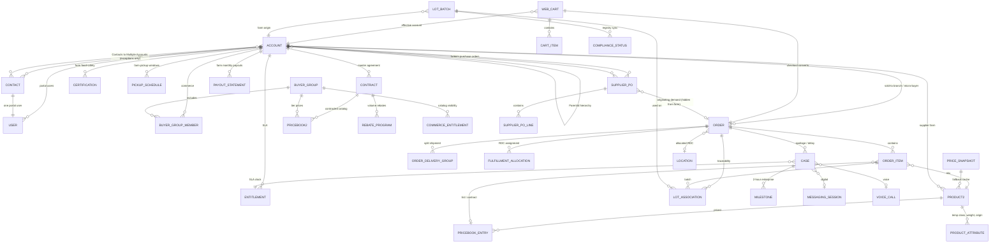
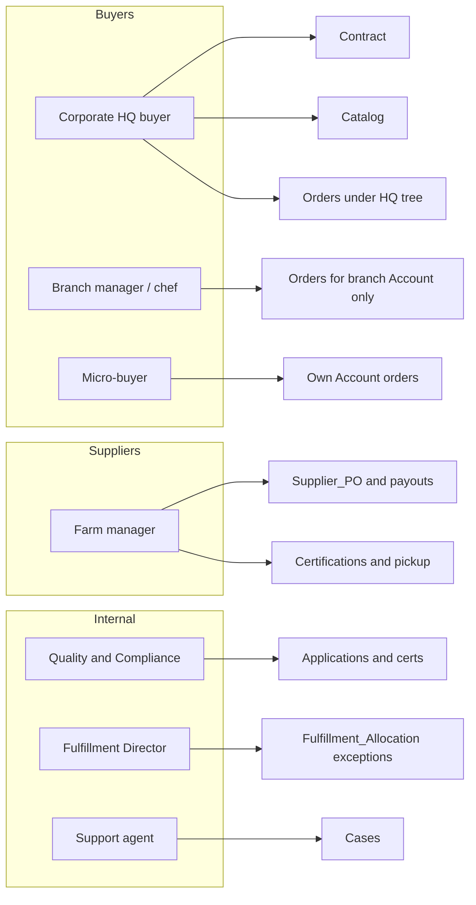

# 1. Data Architecture

## 1.1 Design principles

1. **Standard objects first.** Orders, products, contracts, cases, entitlements, price books, and commerce carts stay on Salesforce standard / B2B Commerce objects so Customer Community users remain inside the 10 custom-object license cap.
2. **Separate buyer demand from supplier supply.** A buyer `Order` is never the record a farm user opens. Farms see `Supplier_PO__c` (and related schedules/payouts) parented to the farm Account. That is the only reliable way to satisfy 3.1 and 3.2 without leaking counterparty data through sharing.
3. **Hot / warm / cold data tiers.** Salesforce stores what agents and buyers need for the current fulfillment + claims window. SAP stores the financial ledger. Telemetry stays in the IoT/time-series platform.
4. **Account is the security spine.** Every external user is a Contact on exactly one operating Account (branch, micro-buyer business, or farm). Hierarchy is used for roll-up, not for dumping 15,000 children on one parent.
5. **Lookups that 50k daily transactions will hit must not concentrate on one parent record.**

## 1.2 Account topology (critical LDV decision)

The requirement that one enterprise has **15,000 branches under a single Master Agreement** cannot be modeled as `HQ Account ← 15,000 Branch Accounts`. That pattern is parent-child data skew (Salesforce guidance: keep children per parent well below 10,000) and would also explode implicit-share maintenance.

```text
Enterprise HQ Account                    Master Agreement (Contract)
        │
        ├── Region Account (e.g. US-East)     ≤ few hundred children
        │     └── District / Banner Account   ≤ few hundred children
        │           └── Branch Account        sold-to / ship-to / bill-to
        │                 └── Contacts (chefs, store manager)
        └── (repeat per region)
```

**Rules**

| Node | Record type | Purpose |
| --- | --- | --- |
| HQ | `Enterprise_HQ` | Legal entity, master agreement, corporate catalog, rebate program |
| Region | `Enterprise_Region` | Breaks the 10k-child ceiling; regional buyer visibility |
| District | `Enterprise_District` | Optional for the 15k-location client only |
| Branch | `Branch_Location` | Sold-to Account for Commerce and Orders |
| Micro-buyer | `Micro_Buyer` | **One Account per cafe/truck** — never a shared “all micro-buyers” Account |
| Farm | `Supplier_Farm` | Partner Account; certifications; POs; payouts |
| RDC | `Distribution_Center` | Internal Account + Salesforce `Location`; not a customer |

**Assumption:** the 15,000-location client is modeled as HQ → ~20 Regions → ~40 Districts → ~20 branches (~8,000–15,000 leaves) so no parent exceeds a few hundred children.

**Ownership:** Branch / farm Accounts are owned by a **pool of regional integration users with no role** (or a stable top-level role that is never moved). No single user owns more than 10,000 Accounts.

## 1.3 Logical data model



## 1.4 Object catalog — standard vs custom

### Standard / Salesforce Commerce (preferred)

| Object | Role in FSG |
| --- | --- |
| `Account` / `Contact` / `User` | Party model, portal identity, sharing spine |
| `Contract` | Multi-year master agreement; service tier eligibility |
| `Product2` + `Pricebook2` + `PricebookEntry` | Localized catalog and contracted base price |
| `BuyerAccount`, `BuyerGroup`, `WebStore`, `WebCart`, `CartItem` | B2B Commerce storefront |
| `CommerceEntitlementPolicy` | Which SKUs a corporate vs regional buyer may see |
| `Order`, `OrderItem`, `OrderDeliveryGroup` | Operational order capture and split shipments |
| `OrderSummary` (OMS, optional phase 2) | Agent-friendly order view if OMS is licensed |
| `Location` | Regional Distribution Center |
| `Case`, `Entitlement`, `EntitlementProcess`, `Milestone` | Support + 2-hour Enterprise SLA |
| `Knowledge__kav` | Agentforce grounding and portal self-service |
| `MessagingSession`, `VoiceCall`, `LiveChatTranscript` | Digital / voice transcripts |
| `Asset` (optional) | Cold-chain delivery asset assigned to an RDC, if tracked in CRM |
| External objects (`Invoice__x`, `Payout__x`, `RebateAccrual__x`) | SAP virtualization via Salesforce Connect OData 4.01 |

### Custom objects (keep the buyer-visible set ≤ 10)

Customer Community users can access **10 custom objects**. Partner Community on the **External Apps SKU** can access 100. Therefore custom objects are either (a) internal-only, (b) partner-only, or (c) carefully counted on the buyer site.

| API name | License surface | Purpose |
| --- | --- | --- |
| `Supplier_Application__c` | Guest create; internal process | Public farm onboarding intake |
| `Certification__c` | Partner + internal | Food-safety certs, expiry, auditor |
| `Pickup_Schedule__c` | Partner + internal | Localized pickup windows |
| `Supplier_PO__c` / `Supplier_PO_Line__c` | Partner + internal | Farm-visible purchase orders |
| `Farm_Performance__c` | Partner (read) | Scores / OTIF / spoilage rate (monthly rollup, not per-event) |
| `Payout_Statement__c` | Partner **or** external object | Monthly farm payout; prefer SAP virtualization long-term |
| `Fulfillment_Allocation__c` | Internal | RDC, capacity used, split-shipment flag, director approval |
| `RDC_Capacity_Cache__c` | Internal | Near-real-time cache from WMS (not SoR); keyed by RDC + temp zone + day |
| `Lot_Batch__c` | Internal + restricted partner | Thin lot header (lot #, farm, expiry, registry status) — not telemetry |
| `Lot_Association__c` | Internal | Junction OrderItem ↔ Lot |
| `Compliance_Sync_Log__c` | Internal | Registry message log (short retention) |
| `Rebate_Program__c` | Internal + HQ buyer read | Commercial terms; actuals from SAP |
| `Price_Snapshot__c` | System | Last-good SDPE price per SKU + RDC + temp class (fallback) |
| `Cold_Chain_Alert__c` | Internal / Case child | Exception only (temp excursion), not IoT stream |
| `Allowed_Email_Domain__c` | Internal | Corporate self-registration allowlist |

**Explicitly not Salesforce objects:** IoT temperature pings, GPS breadcrumbs, WMS bin-level inventory, SAP journal entries, full lot genealogy beyond what compliance officers need in CRM.

## 1.5 Persona → records



## 1.6 Key process objects

### Supplier onboarding

1. Unauthenticated Experience Cloud form creates `Supplier_Application__c` (guest user with **Create** only on that object, no related lists, no list views).
2. Record-triggered Flow converts high-quality applications to a **Lead** (or keeps the custom object) and opens a Compliance **Case**.
3. Quality & Compliance Officer completes certification review (`Certification__c` + Files).
4. Approval Process + e-signature (DocuSign via MuleSoft) activates the Farm Account.
5. Flow creates Partner User(s), default `Pickup_Schedule__c`, and a restricted Commerce catalog assignment (supplier-side assortment), not storefront buy-side access.

### Corporate and micro ordering

| Attribute | Stored on | Notes |
| --- | --- | --- |
| Master agreement | `Contract` on HQ Account | Price book, rebate program, SLA entitlement |
| Branch eligibility | `BuyerGroupMember` on Branch Account | Catalog + contracted prices |
| Service tier | `Order.Service_Tier__c` (`Standard` / `Express_Cold_Chain` / `Priority_Ultra_Fresh`) | Maps to Commerce shipping method + product temp class |
| Base price | `PricebookEntry` | Contract tier or regional wholesale list |
| Dynamic spoilage overlay | Cart item adjustment + `Price_Snapshot__c` | From SDPE; stamped on `OrderItem` as `ListPrice` / `SDPE_Price__c` / `Fallback_Used__c` |
| Sold-to / ship-to | `Order.AccountId` = Branch or Micro-buyer Account | Never HQ Account (skew + wrong sharing) |

### Dispatch / capacity

Salesforce does **not** compute available pallets. On Place Order:

1. `Order` is created in `Submitted_Pending_Allocation`.
2. High-volume Platform Event `Order_Submitted__e` is published.
3. MuleSoft calls WMS allocation (nearest RDC with inventory **and** cold capacity **and** refrigerated assets).
4. Success writes `Fulfillment_Allocation__c` and moves Order to `Allocated` (supports split via multiple allocations / `OrderDeliveryGroup`).
5. Failure or policy breach creates a Case (`Fulfillment_Exception`) and Omni-Channel routes it to the Regional Fulfillment Director.

### Support

- Buyer portal creates `Case` with `OrderId`, `AccountId`, `ContactId`.
- Record-triggered Flow sets `EntitlementId` from Account (Enterprise vs Micro).
- Enterprise process: **Resolution milestone = 120 minutes, 24/7 business hours** (perishable — clock hours, not 8×5).
- Omni-Channel Flow adds skills: `Language`, `Commodity` (produce / dairy / protein), `Account_Tier=Enterprise`, and uses **Least Active** capacity.

## 1.7 Identity records

| Population | Account model | User model |
| --- | --- | --- |
| FSG staff | Internal | Salesforce user; Federation Id = Okta | 
| Farm managers | Business Account (`Supplier_Farm`) | Partner Community user on farm Account |
| Branch chefs | Branch Business Account | Customer Community (high volume) |
| Branch delegated admin | Same Branch Account | Customer Community Plus; Delegated External User Administrator |
| Corporate HQ merchandiser | HQ or Region Account | Customer Community Plus; External Account Hierarchy |
| Micro-buyers | One Business Account per business | Customer Community Login; Person Account **not** required (B2B Commerce prefers Account/Contact) |

**Do not** park all micro-buyers under one dummy Account. That is the textbook parent-child skew anti-pattern.

## 1.8 Record volume forecast (planning numbers)

Assumption: 15 line items average, 18-month operational interest, 90-day hot CRM window.

| Object | Daily | 90-day hot | 12-month if unarchived | Disposition |
| --- | --- | --- | --- | --- |
| Order | 50,000 | 4.5M | 18.3M | Hot 90 days; archive; virtualize from SAP |
| OrderItem | ~750,000 | ~67M | ~274M | Same lifecycle as Order; never unbounded reports |
| Case (spoilage/delay) | assume 1–2% of orders → 500–1,000 | ~45–90k | ~180–365k | Standard Case is fine |
| Cold-chain pings | millions | — | — | **Not in Salesforce** |
| Lot_Batch__c | thousands | low hundreds of k | — | Thin header only |
| Platform Events `Order_Submitted__e` | 50,000 | — | — | High-volume PE; subscribe via Pub/Sub API |

Data storage (order of magnitude): ~1 GB/day of Order+OrderItem if left in CRM → **hundreds of GB per year**. Extra data storage licenses are mandatory; archiving is not optional.

## 1.9 Indexing and physical design

| Object | Custom indexes / considerations |
| --- | --- |
| `Order` | Indexes on `AccountId + EffectiveDate`, `OrderNumber` (external id), `Status`, `Service_Tier__c`, `Allocated_RDC__c` |
| `OrderItem` | Avoid filters on non-selective status fields; always constrain by `OrderId` or date |
| `Case` | Index `AccountId`, `EntitlementId`, `Order__c` |
| `Supplier_PO__c` | External Id = SAP PO number; index `Farm_Account__c + Status` |
| `Price_Snapshot__c` | Unique key `SKU + RDC + TempClass + Tier` |
| `Lot_Batch__c` | Unique External Id = registry lot number |

Request **skinny tables** on `Order` (`Id, AccountId, Status, EffectiveDate, OrderNumber, Service_Tier__c, TotalAmount`) if list views / API queries slow after 10M rows. Use **HQ-requested custom indexes** before writing formula-filter reports.

Deterministic **External IDs** on Order, Supplier PO, Lot, and Invoice keys make SAP and Registry upserts idempotent.
