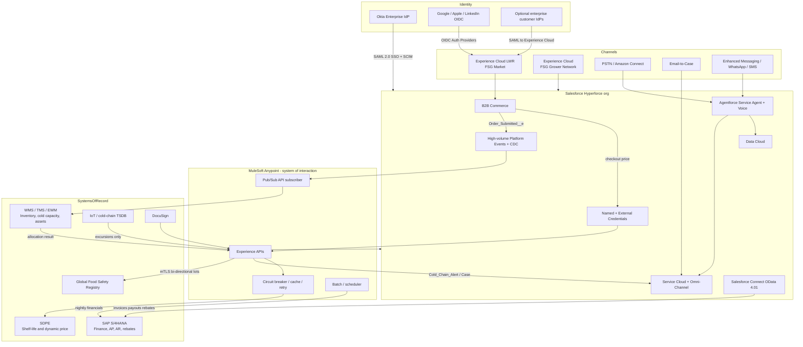
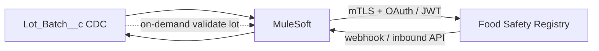

# 2. System Landscape and Integration

## 2.1 To-be system landscape



### Systems and what they own

| System | Owns | Does not own |
| --- | --- | --- |
| Salesforce | Parties, catalogs, contracts, carts, operational orders (hot), cases, SLAs, supplier onboarding, agent workspace | GL, AP/AR, bin inventory, IoT time series |
| SAP S/4HANA | Invoices, vendor payouts, rebate actuals, financial close | Buyer UX, case SLA |
| WMS/TMS | On-hand qty, cold-storage cubic capacity, refrigerated fleet, allocation | Customer master UX |
| SDPE | Shelf-life and demand price overlay | Contract base price |
| Food Safety Registry | Legal lot / origin / import validity | CRM case management |
| IoT platform | Telemetry | Customer-visible history (exceptions only) |
| Okta | Internal identity lifecycle | Customer/partner identity |
| MuleSoft | Orchestration, transformation, resilience, observability | Business records |

## 2.2 Experience and product topology

| Site | Template | Users | Why |
| --- | --- | --- | --- |
| **FSG Market** | LWR + B2B Commerce | Enterprise buyers + micro-buyers | Catalog, contracted pricing, checkout, order tracking, case logging, Agentforce chat |
| **FSG Grower Network** | LWR Partner / Partner Central pattern | Farm managers | Applications (public), POs, pickup, certs, scores, payouts |
| Internal | Lightning Service Console + Commerce Workspace | Staff | Compliance, fulfillment exceptions, omnichannel inbox |

**Regional stores:** three `WebStore` records (NA, LATAM, EMEA) sharing the org but with localized catalogs, currency, tax, and shipping methods. This stays under the 100-site org limit and avoids one mega-catalog.

**Why B2B Commerce rather than a fully custom Experience Cloud shop:** checkout, buyer groups, entitlements, and `PricingService` / `CommerceInventoryService` extensions are productized. Rebuilding cart/checkout on custom objects would burn the 10 custom-object Community cap and ignore Salesforce-supported extension points ([Commerce extensions](https://developer.salesforce.com/docs/commerce/salesforce-commerce/guide/extensions.html)).

## 2.3 Integration patterns by requirement

### 2.3.1 SDPE — spoilage and dynamic pricing (requirement 2.1)

**Pattern:** Request-Reply through MuleSoft, invoked from the B2B Commerce **Pricing Service extension** (`commercestorepricing.PricingService.processTransactionalPrice`).

```mermaid
sequenceDiagram
    autonumber
    actor Buyer
    participant Cart as B2B Cart / Checkout
    participant Ext as PricingService extension
    participant NC as Named Credential
    participant MS as MuleSoft Experience API
    participant Cache as Redis / Object Store + Price_Snapshot__c
    participant SDPE as SDPE
    participant PB as Contract Price Book

    Buyer->>Cart: View cart / checkout
    Cart->>Ext: processTransactionalPrice
    Ext->>NC: POST price-request (SKU, qty, RDC, temp, account tier)
    NC->>MS: OAuth 2.0 client credentials
    MS->>Cache: Read last-good snapshot
    alt SDPE healthy and p95 less than 800 ms
        MS->>SDPE: Request-reply
        SDPE-->>MS: Overlay prices + TTL
        MS->>Cache: Write snapshot
        MS-->>Ext: 200 overlay
        Ext-->>Cart: Contract base ± overlay
    else Circuit open / timeout / 5xx
        MS-->>Ext: 200 fallback payload + fallback=true
        Ext->>PB: Apply PricebookEntry
        Ext->>Cache: Use snapshot if younger than configured TTL
        Ext-->>Cart: Checkout continues; banner "indicative price"
    end
    Note over Cart: OrderItem.Fallback_Used__c stamped at place-order
```

**Resilience (mandatory)**

| Control | Design |
| --- | --- |
| Timeout | MuleSoft HTTP timeout ~800 ms; Apex callout timeout not used as the primary breaker |
| Circuit breaker | Trip after N failures / error rate; fail open to fallback, not fail closed |
| Cache | Redis (sub-second) + `Price_Snapshot__c` (durable last-good, Bulk upsert from MuleSoft every 1–5 min as a backstop) |
| Fallback price | Corporate: contracted `PricebookEntry`. Micro-buyer: regional wholesale list. If snapshot exists and is within TTL (e.g. 15–30 min), use snapshot |
| User honesty | Storefront shows “Estimated price — live market feed unavailable” when fallback is used |
| Idempotency | `Idempotency-Key` = CartId + timestamp bucket |
| Bulkhead | Pricing API is a dedicated MuleSoft worker; not the same pool as SAP batch |
| Never | Never block Place Order on SDPE. Price at cart; stamp at order; allocation is a separate async step |

**Auth:** Salesforce **External Credential** (OAuth 2.0 client credentials) → MuleSoft. MuleSoft → SDPE using **mTLS** plus application credentials. No secrets in Apex.

**Trade-off:** A pure Apex callout with retry is simpler but cannot implement a proper circuit breaker, shared cache, or burst shedding at 50k checkouts/day. MuleSoft is the correct hop.

### 2.3.2 Global Food Safety Registry (requirement 2.2)

**Pattern:** Event-driven bi-directional sync for **thin lot headers**, plus on-demand request-reply for user-initiated validation.



| Direction | Trigger | Payload | Target |
| --- | --- | --- | --- |
| Outbound | CDC on `Lot_Batch__c` / `Certification__c` (create/update of status, farm origin, expiry) | Lot #, farm GLN/id, commodity, cert ids | Registry |
| Inbound | Registry status change (hold, reject, clearance) | Lot #, compliance state, document URLs | Upsert `Lot_Batch__c`; if reject-in-transit → Case |
| Interactive | Compliance officer or checkout of cross-border SKU | Validate lot | Request-reply; cache 5–15 min |

**Auth:** Mutual TLS (both sides are national-scale registries) + OAuth 2.0 client credentials or signed JWT bearer, depending on the registry profile. Named Credential `callout:Food_Safety_Registry` never called directly from the browser.

**Data minimization:** Do not replicate the full registry. Store lot number, farm, status, expiry, last-sync timestamp, and a document URL. PDFs stay in the registry or Files if an officer attaches them.

**Conflict rule:** Registry is authoritative for **legal clearance**. Salesforce is authoritative for **which lot was allocated to which OrderItem**.

### 2.3.3 SAP S/4HANA (requirement 2.3)

**Pattern:** Near-real-time CDC to a staging area + **end-of-business-day batch reconciliation** (the requirement). Salesforce Connect for UX of historical invoices/payouts.

| Data | Pattern | Why |
| --- | --- | --- |
| Finalized orders (status ≥ Allocated/Fulfilled) | CDC (`Order` / `OrderItem`) → MuleSoft → SAP sales order / inbound delivery throughout the day | Avoid a 750k-line nightly spike |
| Invoices, vendor payouts, rebate actuals | Nightly batch SAP → MuleSoft (already SAP-owned) | Requirement 2.3; finance close |
| Salesforce operational close file | Nightly Bulk API 2.0 extract of day’s Orders vs SAP acknowledgements | Reconciliation, exception queue |
| Historical invoice / payout / rebate display | Salesforce Connect OData 4.01 external objects | Do not copy the ledger into CRM ([data integration guide](https://architect.salesforce.com/docs/architect/decision-guides/guide/data-integration.html)) |

**Business-day definition (assumption):** close is **per region**, not a single global midnight — NA 02:00 local, LATAM 02:00, EMEA 02:00 — three MuleSoft schedulers. A global 00:00 UTC close would strand 14 time zones.

**Idempotency:** `Order.SAP_Doc_Number__c` and `Supplier_PO__c.SAP_PO_Number__c` unique External Ids. Replay-safe.

**Auth:** MuleSoft SAP S/4HANA connector (OData / IDoc). Salesforce side: **Salesforce Integration** user + OAuth JWT bearer or refresh-token rotation via Named Credential. No stored SAP passwords in Salesforce.

### 2.3.4 WMS allocation (requirement 1.5)

**Pattern:** Fire-and-forget Platform Event + request-reply inside MuleSoft to WMS. Salesforce waits in `Pending_Allocation` (seconds, not a user-synchronous 30s checkout spinner).

| Step | Mechanism |
| --- | --- |
| Publish | High-volume PE `Order_Submitted__e` (OrderId, AccountId, postal code, temp class, weight, service tier) |
| Consume | MuleSoft **Pub/Sub API** (gRPC, flow control) — not CometD (daily delivery allocations are too low for 50k events) |
| Allocate | WMS algorithm: nearest RDC ∩ inventory ∩ cold capacity ∩ assets |
| Write-back | Composite API / sObject Collections to `Fulfillment_Allocation__c` + Order status |
| Escalate | If no RDC: create Case record type `Fulfillment_Exception`, Omni-Channel to Regional Fulfillment Director queue (skills: Region, TempClass) |
| Split | WMS may return N allocations; Salesforce creates N `OrderDeliveryGroup` rows |

**Inventory shown on the storefront:** Commerce `CommerceInventoryService` extension calls MuleSoft, which reads a **cache** of ATP (available to promise) by SKU+RDC, refreshed every 1–5 minutes. Omnichannel Inventory can be used as the cache, but **WMS remains SoR**.

### 2.3.5 IoT cold-chain

**Pattern:** Data virtualization / event filter. IoT platform evaluates rules (temp > threshold for N minutes). Only **excursions** POST to MuleSoft → `Cold_Chain_Alert__c` or Case. Salesforce never subscribes to the raw stream (Platform Event add-ons still cannot be the SoR for millions of pings/day).

## 2.4 Integration / security matrix

| Interface | Source → Target | Pattern | Protocol | AuthZ | Identity | Volume | Failure mode |
| --- | --- | --- | --- | --- | --- | --- | --- |
| Social login | IdP → Experience Cloud | SSO | OIDC | Auth Provider + Registration Handler | Google, Apple, LinkedIn | Burst at registration | Login fallback to local credentials optional |
| Internal SSO | Okta → Salesforce | SSO | SAML 2.0 SP + IdP initiated | Federation Id match | Okta groups → Profiles / PSGs | Workforce | Deny login if assertion invalid; no local password |
| Internal lifecycle | Okta → Salesforce | Provisioning | SCIM 2.0 / Okta Salesforce connector | Okta app token | Create / update / deactivate | Workforce | Deactivate on group removal same day |
| Enterprise buyer SSO (phase 2) | Customer IdP → Market site | SSO | SAML (`?community=` site URL) | JIT or pre-provisioned Contact | Email domain + branch attribute | 15k-location client | Manual user create by branch admin |
| SDPE price | Salesforce → MuleSoft → SDPE | Request-Reply + cache | HTTPS JSON | OAuth 2.0 CC + mTLS | Integration user | ~50k+ checkout/cart calls/day | Circuit breaker → contract / snapshot price |
| Order allocate | Salesforce → MuleSoft → WMS | Pub/Sub then Request-Reply | PE + HTTPS | OAuth 2.0 / mTLS | Integration user | 50k events/day | Order stays pending; Case to director |
| ATP cache | WMS → MuleSoft → Commerce / OCI | Cache refresh | HTTPS | mTLS | System | Minutes cadence | Show “availability updating”; do not oversell beyond safety stock |
| Registry | Salesforce ↔ MuleSoft ↔ Registry | Pub/Sub + Request-Reply | HTTPS / AS4 if required | **mTLS** + OAuth/JWT | System | Lots, not orders | Quarantine lot; block cross-border pick |
| SAP orders | Salesforce → SAP | CDC streaming + nightly recon | OData / IDoc | OAuth / SAP principal | Integration user | 50k headers + lines | Retry with idempotent key; recon exception queue |
| SAP invoices/payouts/rebates | SAP → Salesforce UX | Batch + **virtualization** | OData 4.01 | Named Credential | User (named principal) or per-user | Query-time | Empty state + “finance system unavailable” |
| DocuSign | Salesforce → DocuSign | Request-Reply | REST | OAuth 2.0 | Compliance officer | Low | Manual upload Files |
| Agentforce actions | Agent → MuleSoft / Salesforce | Request-Reply | Named Credential / Apex action | Einstein Trust Layer + user context | Buyer / agent | Conversational | Escalate to live Omni-Channel |
| Email / messaging / voice | Channels → Salesforce | Inbound | Email-to-Case, Messaging, SCV | Channel-specific | Contact match | Seasonal spikes | Agentforce first; overflow queues |

## 2.5 Salesforce API and event strategy

| Need | Choice | Rationale |
| --- | --- | --- |
| MuleSoft reads/writes | REST Composite + Bulk API 2.0 | Composite for allocation write-back; Bulk for nightly recon |
| Event subscribe | **Pub/Sub API** | Required scale; CometD PE delivery allocations are far below 50k/day |
| ERP UX | Salesforce Connect **OData 4.01** | Avoid OData 2.0/4.0 callout limits on new work |
| Secrets | External Credentials + Named Credentials + Permission Set mapping | No secrets in custom metadata |
| Integration identity | Salesforce **Integration** license user(s) split by domain (Commerce, Service, ERP) | Isolate token blast radius; Integration users have **no role** to limit sharing recalc |

## 2.6 Checkout transaction budget (governors)

Place Order must stay inside a synchronous governor envelope:

- SDPE already resolved on cart (cached on CartItem).
- Insert Order + OrderItems (12–20 lines) is well within DML/CPU.
- **Do not** call WMS or Registry synchronously in the same transaction as Place Order except a fast cache read.
- Allocation, supplier PO fan-out, and SAP posting are **after** commit via PE / async.

This is how 50k checkouts/day remain feasible: each is a small user transaction, not a 50k-row batch in one context.
