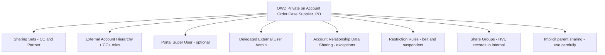

# 3. Security, Sharing, and Licensing

## 3.1 Security architecture principles

1. **Most restrictive external OWD**, then open only with the sharing mechanism that matches the persona ([Experience Cloud identity guidance](https://www.salesforce.com/blog/experience-cloud-identity-access-account/)).
2. **Account is the tenancy boundary.** A farm never receives sharing to a buyer Order. A branch chef never receives sharing to another branch’s Orders.
3. **High-volume users (Customer Community) do not get roles.** Roles are reserved for the much smaller CC+ / Partner populations so the org stays under the **50,000 portal role** default ([Experience Cloud user licenses](https://help.salesforce.com/s/articleView?id=users_license_types_communities.htm)).
4. **Restriction Rules are subtractive.** They hide rows the user would otherwise see; they do not grant access.
5. **Guest user is hostile.** Public supplier apply-form is a dedicated profile with Create on `Supplier_Application__c` only, no list views, no APIs, no related record access.

## 3.2 Organization-Wide Defaults

| Object | Internal OWD | External OWD | Grant access using hierarchies | Notes |
| --- | --- | --- | --- | --- |
| Account | Private | **Private** | Internal: Yes (controlled) | External hierarchy via External Account Hierarchy, not a wide internal grant |
| Contact | Controlled by Parent | Controlled by Parent | — | |
| Contract | Private | Private | No | HQ + internal sales only |
| Order | Private | **Private** | Internal: Yes | Buyers via Sharing Set / CC+ hierarchy |
| OrderItem | Controlled by Parent | Controlled by Parent | — | |
| Case | Private | Private | Yes | Entitlement + Sharing Set |
| Product2 | Public Read | Public Read | — | Visibility further limited by Commerce entitlements |
| Pricebook2 | Use | Use | — | Buyer Groups control which book is used |
| `Supplier_PO__c` | Private | Private | No | Sharing Set: user Account = Farm |
| `Certification__c` | Private | Private | No | Same farm |
| `Fulfillment_Allocation__c` | Private | Private | Yes | Internal only |
| `Lot_Batch__c` | Private | Private | No | Compliance + related farm |
| `Price_Snapshot__c` | Public Read | **Hidden** | No | System / integration |
| External invoices | — | — | — | Salesforce Connect sharing + named principal; filter by Account External Id |

Keep **external** defaults Private even if internal reporting is painful. Do not set Order to Public Read Only to “make LDV easier” — that would violate 3.1 / 3.2.

## 3.3 License selection

| Persona | License | Why this license | Why not the cheaper one |
| --- | --- | --- | --- |
| FSG sales, compliance, directors, ops | **Salesforce** (Service Cloud on Enterprise or Unlimited) | Cases, Omni-Channel, approvals, reports | Platform license lacks full Case+Omni+Knowledge on one seat |
| Support agents | Salesforce + **Service Cloud** + Omni-Channel + Knowledge | Inbox, SLA, console | — |
| Voice agents / AI voice | **Service Cloud Voice** (Amazon Connect) + **Agentforce** | Unified routing for voice + digital | CTI adapter without SCV splits routing brains |
| Autonomous digital/voice resolution | **Agentforce Service Agent** (+ Data Cloud grounding) | Unscripted voice + chat with escalation | Einstein Bots are dialog-tree and are being rebuilt onto Agentforce |
| Farm managers | **Partner Community** (login-based unless daily active) | B2B vendor portal; roles; reports; custom objects for POs/certs | Customer Community cannot use Partner Account model well and is capped at 10 custom objects / 0 API |
| Branch chefs / buyers | **Customer Community** (login-based) | High volume (150k users); Sharing Sets; Cases; Orders; Knowledge | CC+ for every chef would blow the 50k role limit and budget |
| Branch user-admin (“manage users in my branch only”) | **Customer Community Plus** | Delegated External User Administrator is supported on CC+ / Partner, not on Customer Community | Super User ≠ user administration |
| Corporate HQ / region merchandisers | **Customer Community Plus** | Need hierarchy visibility across child locations; reports | Sharing Sets do not roll up HQ → 15k branches |
| Micro-buyers | **Customer Community Login** | Large, bursty, social login, Sharing Set on own Account | CC+ unnecessary; Partner inappropriate |
| Middleware | **Salesforce Integration** user licenses | API-only, no UI | Do not consume full CRM seats for MuleSoft |
| B2B storefront | **B2B Commerce** store licenses / commerce entitlements as contracted | Cart, buyer groups, pricing extensions | Custom cart would violate object caps |

**SKU note:** If supplier-side custom objects exceed 10, purchase Partner licenses via the **External Apps SKU** (100 custom objects, higher API) rather than PRM SKU.

**Login- vs member-based:** prefer **login-based** for micro-buyers and many chefs (daily unique login). Prefer **member-based** for farm managers who work the portal every day and for branch delegated admins.

### Indicative license envelope (planning, not a quote)

| Population | Count (assumption) | License shape |
| --- | --- | --- |
| Internal FSG | 400–1,200 | Salesforce + ~150 Service Cloud agent seats + Voice add-on |
| Farm users | 8,000 farms × 2 | ~16,000 Partner Login |
| Branch delegated admins | ~1 per location; locations assumed 40–80k globally | CC+ member or login |
| Branch chefs | ~150,000 | Customer Community Login |
| Micro-buyers | elastic | Customer Community Login pool (1:20 login-to-license provisioning) |

## 3.4 Sharing model by persona

### 3.4.1 Micro-buyers (Customer Community)

| Need | Mechanism |
| --- | --- |
| See own orders, deliveries, invoices, cases | **Sharing Set:** `User.Contact.AccountId = Order.AccountId` (Read) and same for Case |
| Invoices in SAP | External object filtered by Account External Id; Connect named principal that enforces server-side filter in OData |
| Cannot see other cafes | OWD Private + one Account per business |

No roles. No sharing rules. No Super User.

### 3.4.2 Branch chefs (Customer Community)

Same Sharing Set pattern: records where `AccountId` = the chef’s Branch Account.

**“Or corporate account parent node”** is **not** granted to chefs. That visibility is a CC+ HQ/Region persona (below). Mixing both meanings on one Sharing Set would over-share.

### 3.4.3 Branch delegated admin (Customer Community Plus)

Requirement: *one user in the branch must manage other users only in their branch.*

| Capability | Mechanism |
| --- | --- |
| Create / deactivate / reset password for users **on this Account only** | Profile permission **Delegated External User Administrator**; Delegated External User Profiles = Branch Chef + Branch Admin clones |
| See all orders/cases for the branch (including those owned by other chefs) | Sharing Set on Account **or** Portal Super User on the branch Account |
| Cannot manage another branch | Delegated admin is Account-scoped. Do **not** grant External Managed Accounts except for a future HQ scenario |
| Cannot see HQ-wide data | Role is local to the branch Account; no parent-role grant |

**Account Role Optimization (ARO)** is enabled (default on new orgs). A branch with a single CC+ admin and many high-volume chefs often **does not materialize extra roles until a second role-using user exists**.

### 3.4.4 Corporate HQ / Region (Customer Community Plus)

Sharing Sets **do not roll up** the Account hierarchy. HQ visibility uses:

1. **External Account Hierarchy** aligned to HQ → Region → District → Branch.
2. CC+ users sitting on the HQ or Region Account with roles in that external hierarchy.
3. **Restriction Rule** on Order/Case: `Account.Enterprise_Number__c = $User.Contact.Account.Enterprise_Number__c` so a HQ user can never see another enterprise even if a sharing rule is misconfigured.

**Do not** put a formula lookup `Order.HQ_Account__c` pointing at the single 15,000-location HQ — that lookup would be a **hot parent** under concurrent checkout (lookup skew / `UNABLE_TO_LOCK_ROW`).

For the handful of HQ users who must “buy for” multiple branches, use Commerce **Effective Account** / Account Switcher with **External Managed Accounts** plus an Account Relationship — not a share of all 15,000 accounts’ full history inside CRM. History stays in SAP Connect.

### 3.4.5 Farm managers (Partner Community)

| Record | Access |
| --- | --- |
| Own farm Account, Contacts, certs, pickup, performance, POs, payouts | Implicit + **Sharing Set** `User.AccountId = Farm lookup` |
| Buyer Orders, buyer identities, contracted prices of restaurants | **No access** (different object: `Supplier_PO__c` contains only what the farm needs to fulfill) |
| Other farms | OWD Private; no partner super user at a holding-group level unless a future co-op Account is modeled |

Partner Super User is **not** granted by default (would expose sibling users on the same Account only — usually fine — but we still avoid it unless a farm office needs it).

### 3.4.6 Internal Quality, Fulfillment, Support

| Persona | Access |
| --- | --- |
| Support agent | Role hierarchy + **Queues** + Omni-Channel. Criteria sharing: Enterprise Cases to Enterprise Support role group |
| Records created by high-volume community users | **Share Groups** (required so internal users can see HVU-owned Cases/Orders) |
| Fulfillment Director | Criteria sharing on `Fulfillment_Allocation__c` / Case record type by `Region__c` |
| Compliance officer | Criteria sharing on `Certification__c` and `Supplier_Application__c` by region; Files via library permissions |
| Integration users | **No role**; Modify All Data avoided; permission sets per interface; IP + Named Credential |

### 3.4.7 Restriction Rules (defense in depth)

Apply to `Order`, `Case`, `Supplier_PO__c` for external profiles:

- Buyers: `AccountId = $User.AccountId` OR (CC+ HQ only) `Enterprise_Number__c = $User.Enterprise_Number__c` AND `Hierarchy_Path__c` starts with user’s node.
- Partners: `Farm_Account__c = $User.AccountId`.

Restriction Rules run after sharing. They are the backstop against a too-wide sharing rule.

## 3.5 Authentication and user lifecycle

### Internal staff (requirement 3.4)

| Control | Design |
| --- | --- |
| SSO | Okta is IdP; Salesforce is SP; **SAML 2.0**; My Domain; SP-initiated default (better CSRF posture than IdP-only) |
| MFA | Enforced in Okta; Salesforce “MFA” satisfied via SSO policy |
| Federation Id | Stable Okta user id (not email) |
| Provisioning | Okta group → Salesforce Profile + Permission Set Group via **SCIM / Okta Salesforce app provisioning** |
| Deprovision | Remove from Okta group → deactivate Salesforce user the same day; freeze if SCIM lag; disable UI + API |
| Just-in-time | JIT **off** for internal (SCIM is the source of truth; JIT creates orphan profiles) |
| Session | 15–30 min lock; 2–4 hour timeout; no “remember me” on consoles |

### Micro-buyers (requirement 3.3)

- Auth Providers: **Google, Apple, LinkedIn** (OIDC).
- Apex `Auth.RegistrationHandler`:
  - Match existing user on Federation Identifier / verified email.
  - Else create Account (Micro_Buyer) + Contact + Customer Community Login user.
  - Never attach new users to a shared Account.
- Collect business name and delivery postal code on first login (required for regional catalog).
- Optional password login for buyers who refuse social.

### Enterprise buyers (requirement 1.2)

- Self-register only if email domain is on `Allowed_Email_Domain__c` for that HQ Account.
- Registration handler **does not guess the branch**. User picks store number from a searchable list of Accounts under that enterprise (results filtered by domain).
- Branch delegated admin can also create users (primary path for the 15k-location client).
- **Phase 2:** that client federates via SAML to the Market site (`StartURL` includes `community=`). Assertion attributes: email, store code, role (`Chef` vs `Admin`).

### Suppliers

- After compliance approval, FSG creates the first Partner user (or the farm receives an invite).
- Subsequent farm users: Partner delegated admin on that farm Account (same DEUA pattern).

## 3.6 Portal and data-protection controls

| Control | Usage |
| --- | --- |
| Guest user sharing | Disabled except explicit `Supplier_Application__c` create |
| CSRF / CSP / clickjack | Experience Builder defaults + trusted script domains only |
| IP relax | Not used for internal; Okta Network Zone instead |
| Shield Platform Encryption | PII on Contact (email, phone) and farm tax ids if contractual; evaluate search/filter trade-offs |
| Field-Level Security | SDPE cost components hidden from all buyer profiles |
| Event Monitoring + Transaction Security | Alert on large Order exports and report downloads |
| Named Credentials | All callouts; External Credential principals per environment |
| Experience Cloud session security | Separate from internal; cannot “login as” without audit |

## 3.7 Object permissions (clone standard profiles)

Never use the stock Customer Community User profile. Clones:

| Profile | Key object access |
| --- | --- |
| Micro Buyer | Order R; Case C/R/E; Product R; Account R (own); no Contract; no Supplier_PO |
| Branch Chef | Same + Contract R if entitled via sharing (usually no) |
| Branch Admin CC+ | Same + Manage Users (delegated) + Contact C/E on own Account |
| HQ Buyer CC+ | Order R across hierarchy; reports; no user admin on child accounts unless EMA granted later |
| Farm Manager Partner | Supplier_PO R; Certification R/C/E; Pickup C/E; Account R/E (own); **no Order** |
| Support Agent | Case CRUD; Order R; Knowledge; no Price Snapshot |
| Compliance | Application, Certification, Lot, Account (suppliers) |
| Fulfillment Director | Allocation C/E; Order R/E (status); no pricing engine |

## 3.8 Entitlements vs sharing (do not confuse them)

- **Sharing** answers “may this user see the Case/Order?”
- **Entitlement + Milestone** answers “how fast must FSG resolve it?”
- **Buyer Group** answers “which SKUs and prices may they purchase?”
- **Delegated admin** answers “may they create users on this Account?”

All four are required; none substitutes for another.
