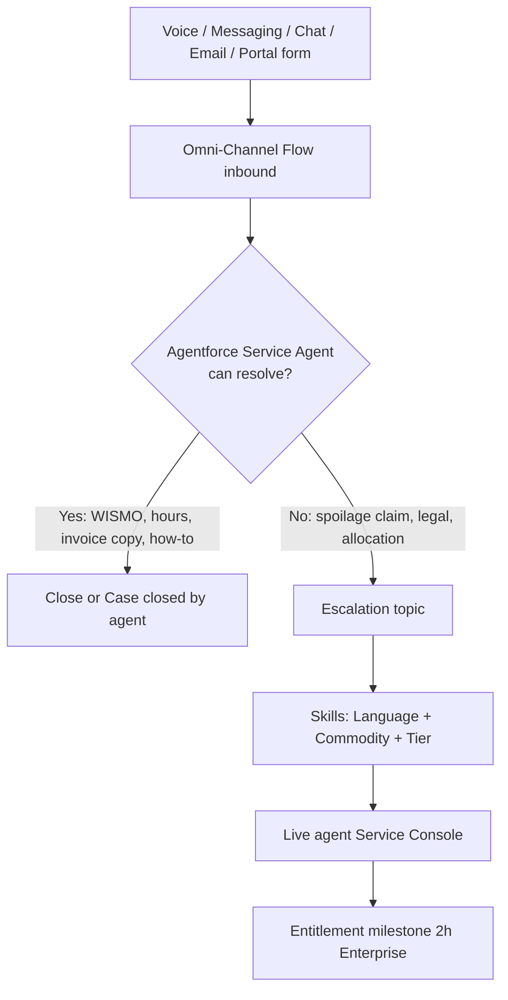

# 4. LDV, Service Experience, Governance, and Trade-offs

## 4.1 Large Data Volume strategy

Salesforce Well-Architected and the [LDV best practices](https://resources.docs.salesforce.com/latest/latest/en-us/sfdc/pdf/salesforce_large_data_volumes_bp.pdf) treat **volume, skew, and query selectivity** as first-class design inputs. FSG is an LDV org on day one.

### 4.1.1 What is “hot” in Salesforce

| Tier | Window | Store | User experience |
| --- | --- | --- | --- |
| Hot | 0–90 days | `Order` / `OrderItem` / open Cases | Portal tracking, Agentforce, claims |
| Warm | 90 days–18 months | Custom **Big Object** `Order_Archive__b` (header + rolled JSON or line stub) **or** Data Cloud | Support “find my old order” via Flow/Apex that queries the Big Object by AccountId + OrderNumber |
| Cold / financial | All time | **SAP** via Salesforce Connect | Invoices, payouts, rebates, statutory copies |

**Why not keep 18M orders/year in `Order`?** List views, sharing recalc, backup, and sandbox refreshes degrade. Storage cost grows ~1 GB/day. There is no business process that needs 274M `OrderItem` rows in CRM.

**Why Big Objects are not the buyer portal SoR:** no standard sharing, no triggers, limited UI. They are an archive, not a storefront.

**Why Salesforce Connect for invoices:** [Avoid unnecessary replication](https://architect.salesforce.com/docs/architect/decision-guides/guide/data-integration.html). Finance already has the ledger.

### 4.1.2 Skew mitigations (concrete)

| Skew type | FSG risk | Mitigation |
| --- | --- | --- |
| Parent-child Account | 15,000 branches under one HQ | Regional/District intermediate Accounts; hard cap monitoring at 8,000 children |
| Lookup skew | `Order.HQ_Account__c` → one HQ; `Order.Pricebook2Id` → one enterprise book | **No HQ lookup on Order**; Price Books sharded per region/contract version if a single book is updated concurrently at peak |
| Ownership skew | “Integration User” owns all Orders | **Pool of 20+ integration users** by region hash(`AccountId`); **no role** on those users ([ownership skew](https://developer.salesforce.com/docs/atlas.en-us.draes.meta/draes/draes_group_membership_data_skew.htm)) |
| Role explosion | 150k CC+ users × 1–3 roles/account | Chefs on **Customer Community (no roles)**; ARO; CC+ only for admins + HQ |
| Implicit share storm | HVU-owned Orders + internal access | Share Groups designed once; avoid Account-level implicit share by not parenting 67M line items to a skewed Account |
| Queue skew | One Enterprise Case queue | Regional Enterprise queues + skills |

### 4.1.3 Query, API, and automation hygiene

- Every portal query is **selective**: `AccountId = :userAccount` plus date.
- No `RecordTypeId` / Status-only list views on Order.
- Archive job: nightly Batch Apex (scope 200) moves Status=`Fulfilled` and `EffectiveDate < TODAY-90` to Big Object, then **hard deletes** in chunks with PK chunking. Recycle Bin emptied.
- Defer sharing recalculation for any bulk Account reparent (rare, off-peak).
- Flows on Order are **before-save** where possible; after-save only publishes PE. No invocable callouts in the same transaction as checkout.
- Triggers: one per object, handler pattern, recursion guard. Prefer Flow for low-volume (Applications, Certs).
- Reports for executives: **CRM Analytics** extract or SAP, not Salesforce standard reports on `OrderItem`.

### 4.1.4 Platform limits to track (operating model)

| Limit | Why it matters | Operating response |
| --- | --- | --- |
| Portal roles ~50,000 | CC+ / Partner | Monthly role count dashboard; ARO; mixed licenses |
| Sharing rules ~300 / object | Do not create a rule per enterprise | Criteria on `Account_Tier__c` / `Region__c` only |
| Daily API | 50k orders + MuleSoft + Connect | Integration users add API; CC adds **0**; do not let the storefront call Salesforce REST from the browser except LDS |
| PE CometD delivery | Far below 50k | Pub/Sub API only |
| Callout timeout / concurrent Apex | SDPE | Offload to MuleSoft |
| Custom objects on CC = 10 | Buyer site | External objects + standard Order/Case |
| Experience sites = 100 | Plenty | 2–3 external sites |
| Duplicate Account lock | Concurrent checkout | No updates to Branch Account during Place Order |
| Data storage | ~hundreds of GB / year if unarchived | Archive + extra storage SKU |

### 4.1.5 Data Cloud (bounded use)

Use Data Cloud for **Agentforce grounding** (order + case + knowledge + SAP invoice profile) and seasonal demand signals — not as a replacement for WMS. Identity resolution: Contact email + Account External Id. Do not pipe raw IoT into Data Cloud unless sampled.

---

## 4.2 Service experience (requirements 1.6 and 1.7)

Leadership cannot hire linearly with seasonal volume. The service design is **tier-0 autonomous**, **tier-1 specialized humans**, **tier-2 compliance/fulfillment**.

### Autonomous layer (budget constraint)

| Channel | Product | Typical containment |
| --- | --- | --- |
| Portal chat / WhatsApp / SMS | **Agentforce Service Agent** on Enhanced Messaging | Where is my order, delivery window, catalog how-to, reset via OTP, invoice lookup (Connect), log a Case |
| Voice | **Agentforce Voice** + Service Cloud Voice (Amazon Connect) + **Unified Routing** | Same intents on PSTN; handoff to human keeps transcript |
| Email | Einstein/Agentforce email classification + auto-reply; Case still created | Deflect duplicates; do not fully auto-close spoilage email |

**Grounding:** Knowledge, Order (hot), Case history, Data Cloud profile, guarded MuleSoft actions (WISMO from WMS). **Einstein Trust Layer** (no training on FSG data, toxicity, citation).

**Guardrails (do not let the LLM):** change contract price, approve rebate, override allocation, declare a lot legally cleared, issue untracked credit above a threshold. Those are Actions that either refuse or escalate.

**Escalation:** standard Agentforce escalation topic → Omni-Channel outbound flow → human. Context (intent, OrderId, language, transcript) lands on the Case / Messaging Session so the buyer does not repeat themselves.

### Human layer (requirement 1.6)

| Requirement | Salesforce product |
| --- | --- |
| Enterprise tickets prioritized, 2-hour resolution SLA | Entitlement Process `Enterprise_Perishable` with Resolution milestone **120 minutes**, 24/7 Business Hours (assumption: clock hours because food spoils; if Legal wants business hours, swap the Business Hours record — do not hard-code) |
| Route by language + workload | Omni-Channel **skills-based** routing + **Least Active** / capacity units. Skills: `Lang_EN`, `Lang_ES`, `Lang_FR`, `Lang_PT`, `Commodity_*`, `Tier_Enterprise` |
| Agents in one workspace | Service Console with Voice, Email, Messaging, Case — **no swivel-chair** |
| Micro-buyer SLA | Separate entitlement e.g. 8 business hours; lower Omni priority |

Warning action at T-30 minutes; violation action re-routes to senior queue and notifies the duty manager.

**Seasonal surge:** Agentforce containment is the capacity valve. Human queues get overtime / contractor profiles pre-staged in Okta groups (SCIM adds Salesforce seats). Do not copy Cases to a second CRM.

---

## 4.3 Technical governance

### Org and ALM

- **Single production org** on Hyperforce. Multi-org would split 150k buyers, SLA routing, and Agentforce grounding for a modest data-residency gain. If GDPR/LATAM residency becomes a hard constraint, evaluate Hyperforce data residency **before** a second org.
- DevOps Center / SFDX unlocked packages: `fsg-party`, `fsg-commerce`, `fsg-service`, `fsg-integrations` (Named Credential stubs).
- Environments: Scratch → Dev → QA (partial data) → Full-copy / Partial for UAT. **Never** refresh Full Copy without anonymizing farm tax ids and buyer PII.
- Named Credentials per environment; no hardcoded SDPE URLs.

### Integration COE

- MuleSoft Experience / Process / System API layers.
- Contract-first RAML/OAS; idempotency headers required.
- Timeout, retry (exponential, max 3), DLQ, replay from PE.
- Observability: MuleSoft Anypoint Monitoring + Salesforce Event Monitoring + WMS correlation id stamped on Order.

### Center of Excellence decisions that stay in writing

1. No new custom object on the buyer site without a license-impact review (CC 10-object cap).
2. No synchronous callout on Order after-insert.
3. No sharing rule per customer.
4. No “global dummy Account.”
5. Archive SLO: hot Order table growth must be net-zero month-over-month after go-live+90 days.

---

## 4.4 Architectural decisions and trade-offs

### AD-1 — Salesforce B2B Commerce vs headless custom shop

| | B2B Commerce on Core (chosen) | Headless (Commercetools / custom) + Salesforce CRM |
| --- | --- | --- |
| Fit | Buyer groups, contracted catalogs, Experience Cloud, pricing extensions to SDPE | Extreme peak scale, fully custom UX |
| Cost / time | Faster; OOTB cart/checkout | Duplicate identity and cart |
| Risk | 50k orders/day is **high** for Core; must keep transactions thin | Integration complexity; two sources of cart truth |
| Revisit trigger | Sustained p95 checkout > 5s or seasonal 3× volume with error spikes | — |

**Decision:** Commerce on Core for v1 with MuleSoft-offloaded pricing/ATP. Revisit headless only with measured evidence.

### AD-2 — Async allocation vs synchronous “confirm RDC at checkout”

Synchronous allocation is nicer UX (“your order ships from Dallas”) but couples checkout to WMS latency and locks. **Chosen:** accept order, allocate in seconds, notify via Messaging. Express / Ultra-Fresh can show a **cached nearest RDC** as indicative, then confirm.

### AD-3 — Mixed Experience Cloud licenses vs all CC+

All CC+ would satisfy delegated admin and HQ visibility in one model but **fails role limits and budget** at 150k users. Mixed licenses add operational complexity (Share Groups, two sharing models) and is the correct enterprise pattern.

### AD-4 — Supplier PO object vs sharing Order to farms

Sharing buyer Orders to farms leaks restaurant volumes and prices (competition / GDPR). A derived `Supplier_PO__c` costs an object and a sync but is the only clean 3.1 implementation.

### AD-5 — Nightly SAP only vs CDC + nightly recon

The RFP says end-of-day. A naive nightly dump of 750k lines is fragile. **Chosen:** CDC through the day + **nightly reconciliation** to honor the financial close requirement without a single-batch risk.

### AD-6 — Agentforce vs hiring vs Einstein Bots

Einstein Bots cannot cover unscripted voice+digital containment at FSG’s seasonal shape. Hiring is explicitly off the table. Agentforce + Omni-Channel escalation is the only design that matches 1.7 **today’s** product direction. **Trade-off:** license cost of Agentforce + Data Cloud vs bot rebuild in 2026 anyway.

### AD-7 — Salesforce OMS vs SAP/WMS fulfillment

Salesforce Order Management is elegant with Commerce but would become a **second OMS** beside SAP EWM/TM. **Chosen:** WMS/SAP fulfill; Salesforce stores allocation outcome only. Revisit OMS if FSG retires SAP logistics.

### AD-8 — Rebate calculation in Salesforce vs SAP

Volume rebates are money. **SAP is SoR for accrual and payout.** Salesforce stores program terms (`Rebate_Program__c`) for CX. Duplicate rebate engines would never reconcile.

### AD-9 — Single global midnight close vs regional close

14 time zones make a single “business day” ambiguous. **Regional close** is the assumption; finance must confirm posting calendars.

### AD-10 — Person Accounts for micro-buyers vs Business Accounts

Person Accounts work with CC licenses but B2B Commerce buyer accounts and delegated admin assume **Account → Contact**. **Chosen:** Business Account per micro-buyer (even a food truck). Slightly heavier data model; far fewer Commerce edge cases.

---

## 4.5 Risks and controls

| Risk | Impact | Control |
| --- | --- | --- |
| SDPE outage at lunch peak | Checkout stall | Circuit breaker + contract fallback already in AD pricing |
| 15k-location client modeled flat | Org performance incident | Hierarchy template + automated child-count monitor |
| CC+ granted to all chefs | Role limit hit; cannot create users | License policy in identity COE; Okta group ≠ CC+ |
| IoT written to custom object | Storage + automation CPU melt | Architecture review gate |
| Guest user mis-share | Data leak | Guest access report in every release |
| Agentforce hallucinated credit | Financial leakage | No unconstrained “issue refund” action; cap + escalate |
| Salesforce Connect timeout | Blank invoice tab | Cached last invoice PDF on Case for 90 days if a claim is open |

---

## 4.6 Phased delivery (capability, not calendar)

**Phase A — Foundation:** Party model, Okta SCIM/SSO, three sites, OWD/sharing sets, supplier onboarding, Knowledge, Entitlements, Omni-Channel, Agentforce FAQ, SAP Connect invoices (read).

**Phase B — Buy:** B2B Commerce regional stores, buyer groups, SDPE extension + fallback, Place Order + PE allocation, Enterprise self-reg domain allowlist, 2-hour SLA.

**Phase C — Trace and pay:** Lot sync with Registry, farm POs/payouts, rebate terms, archive jobs, CRM Analytics.

**Phase D — Scale the digital workforce:** Agentforce Voice, Unified Routing, Data Cloud profiles, seasonal playbooks.

Each phase keeps LDV controls from 4.1 in place; do not “add archive later.”

---

## 4.7 Assumptions log (complete)

1. Average 12–20 lines per order; 1–2% of orders generate a Case.
2. Enterprise 2-hour SLA is **clock hours**, 24/7.
3. WMS (SAP EWM or equivalent) already exists or will; Salesforce will not become the WMS.
4. SDPE exposes a synchronous HTTPS API with p95 &lt; 500 ms when healthy.
5. Food Safety Registry supports mTLS and lot-level webhooks or a poll API.
6. FSG accepts indicative pricing during SDPE outages.
7. The 15,000-location client will eventually federate with SAML; until then, delegated admins provision users.
8. Micro-buyers are businesses (Account/Contact), not Person Accounts.
9. One production Salesforce org; Hyperforce region chosen with Security.
10. Extra data storage, B2B Commerce, MuleSoft, Service Cloud Voice, Agentforce, Data Cloud, and Salesforce Connect licenses are in budget relative to not scaling live agents.
11. Languages in scope at minimum: EN, ES, FR, PT.
12. Currency: USD, CAD, EUR, GBP, MXN, BRL with advanced multi-currency.
13. Ultra-Fresh same-day is limited to RDC catchment; Commerce shipping method is hidden when ATP cache says impossible.
14. Buyer Community users will not call the Salesforce API (CC = 0 API); mobile app if any uses Experience Cloud session / headless Identity.
