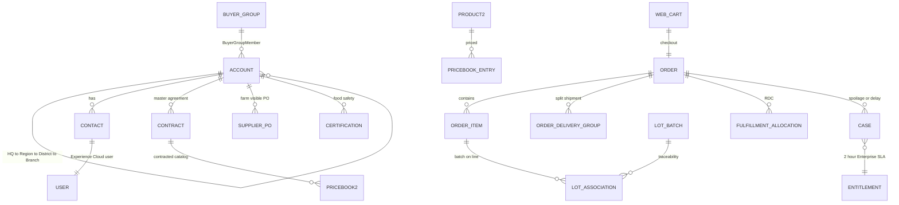
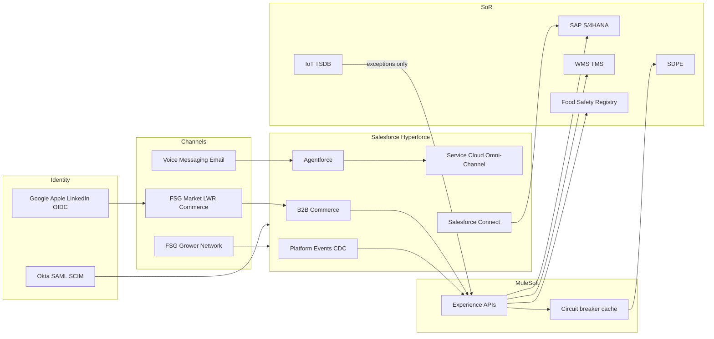

# Candidate artifacts

The three artifacts requested in the brief, with pointers to the full narrative.

## 1. Data model

Full object catalog, volume forecast, and account topology: [01-data-architecture.md](./01-data-architecture.md)

**LDV spine:** hot `Order`/`OrderItem` (90 days) → Big Object archive → SAP virtualization. No IoT objects. No 15,000 children on one HQ Account.

## 2. System landscape

Full landscape, sequences, and API strategy: [02-system-landscape-and-integration.md](./02-system-landscape-and-integration.md)

## 3. Integration and security matrix

Full matrix: [02-system-landscape-and-integration.md](./02-system-landscape-and-integration.md) §2.4  
Sharing and licenses: [03-security-sharing-and-licenses.md](./03-security-sharing-and-licenses.md)

| Interface | Pattern | Auth | Fallback / control |
| --- | --- | --- | --- |
| SDPE pricing | Request-Reply via MuleSoft | OAuth 2.0 + mTLS | Circuit breaker → contract / `Price_Snapshot__c` |
| WMS allocation | Pub/Sub then Request-Reply | OAuth 2.0 + mTLS | Pending status → Case to Fulfillment Director |
| Food Safety Registry | Bi-directional events + on-demand | **mTLS** + OAuth/JWT | Quarantine lot; block cross-border pick |
| SAP financials | CDC + regional EOD recon; Connect for UX | JWT / SAP principal | Idempotent External Ids; recon queue |
| Okta workforce | SAML SSO + SCIM lifecycle | SAML 2.0 | Deactivate on group removal |
| Micro-buyer login | OIDC social | Auth Provider | Registration Handler; one Account per business |
| Enterprise 2h SLA | Entitlements + Omni-Channel skills | Internal SSO | 120 min 24/7 milestone |
| Farm data isolation | Sharing Set on farm Account | Partner Community | Separate `Supplier_PO__c`; no buyer Order share |
| Branch isolation | Sharing Set on branch Account | Customer Community | CC+ delegated admin for user management only |
| HQ roll-up | External Account Hierarchy | Customer Community Plus | Restriction Rule on enterprise number |

## License snapshot

| Persona | License |
| --- | --- |
| Chefs / micro-buyers | Customer Community (Login) |
| Branch user-admin and HQ buyers | Customer Community Plus |
| Farm managers | Partner Community |
| FSG staff / agents | Salesforce + Service Cloud + Voice + Agentforce |
| MuleSoft | Salesforce Integration user |
