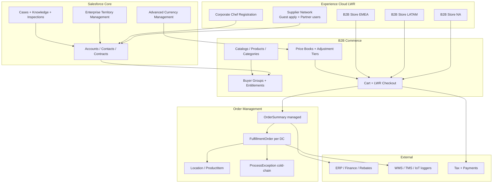
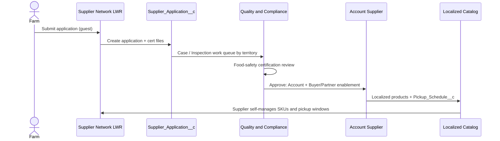
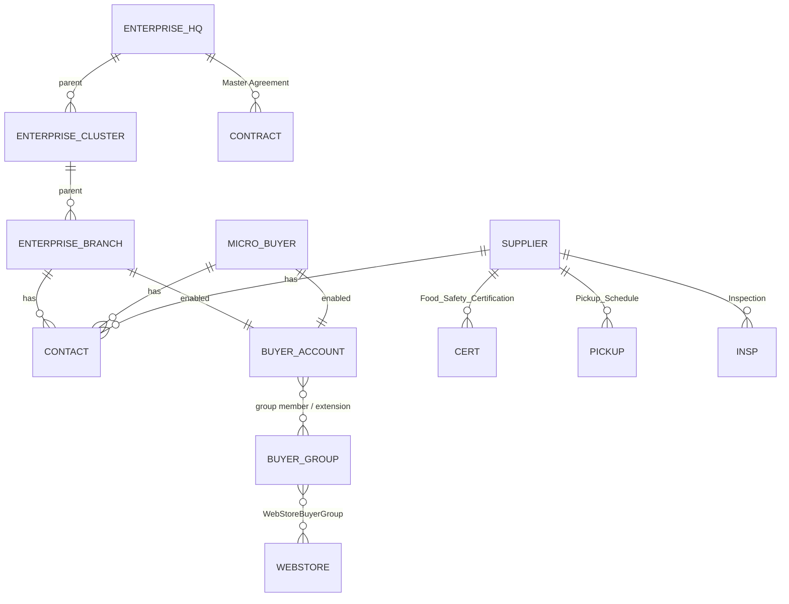
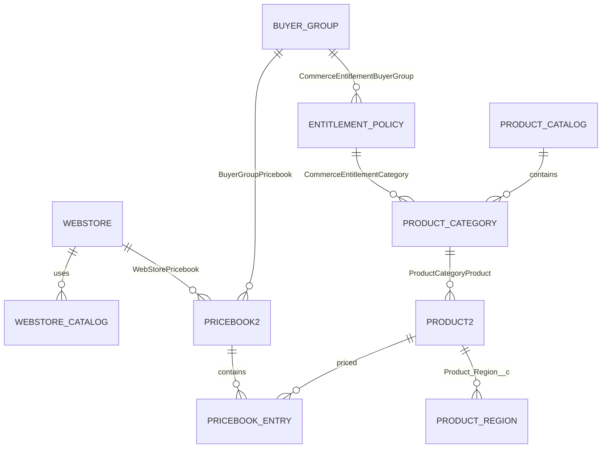
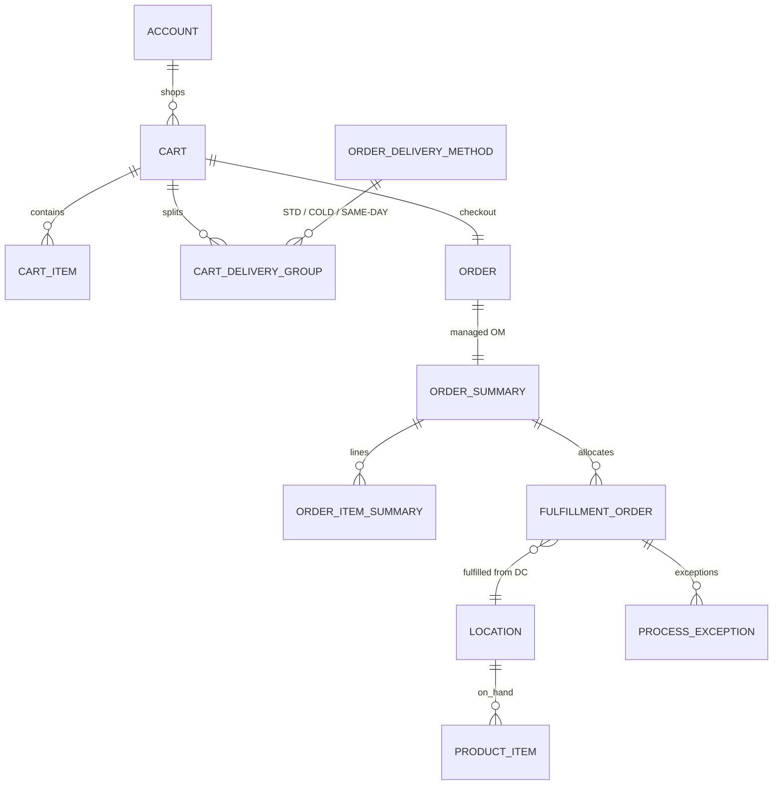

# FreshSource Global (FSG)

## Enterprise Solution Architecture

**Stack:** Salesforce Core + Experience Cloud LWR + B2B Commerce + Order Management  
**Date:** 15 September 2026  
**Classification:** Salesforce Architect design — LDV / multi-region B2B

---

## 1. Executive summary

FSG is a farm-to-table distributor processing **50,000+ orders per day** across **North America, LATAM, and EMEA** (14 time zones). The CRM/commerce platform must serve:

| Segment | Scale | Buying pattern |
| --- | --- | --- |
| Enterprise corporate accounts | 1,200 HQ accounts, 150,000 branch buyers/chefs | Contracted catalogs, tiered discounts, volume rebates, delivery schedules |
| Largest enterprise client | 15,000 branches under one Master Agreement | Same contract, isolated branch users and orders |
| Direct B2B micro-buyers | Independent cafes, caterers, food trucks | Self-register, regional catalog, wholesale orders, invoices |
| Suppliers | 8,000 farms / artisan producers | Public apply → Quality & Compliance vetting → localized catalog + pickup schedule |
| Internal | Quality & Compliance, merchandising, fulfillment, account management | Inspections, cold-chain compliance, regional DCs |

**Recommended platform shape (single org):**

1. **Salesforce Unlimited / Advanced Edition org** with External Sharing Model, Advanced Currency Management, and Enterprise Territory Management.
2. **Three regional B2B LWR WebStores** (NA, LATAM, EMEA) on **Commerce Cloud B2B Advanced** (full Order Management, 10 storefronts, 20 inventory locations included).
3. **Two additional LWR Experience Cloud sites:** Supplier Network (guest + Partner) and Corporate Onboarding (domain-validated chef registration).
4. **Managed Order Summaries** in Salesforce Order Management, fulfilled from regional Distribution Center `Location` records.
5. **LDV-first data model:** no 15,000-child Account skew, no 150,000 Customer Community Plus roles, category-level entitlements, dynamic buyer groups, and order archival.

This design answers the eleven architecture questions in sections 6–16 and is executable on Salesforce standard capabilities first, custom objects only where the standard model cannot express the process.

---

## 2. Architecture principles (Salesforce + LDV)

| Principle | How it is applied at FSG |
| --- | --- |
| Standard objects first | Account, Contract, Product2, Pricebook2, BuyerGroup, WebStore, Order, OrderSummary, FulfillmentOrder, Location, Case, Knowledge |
| Entitlement, not sharing, for catalog | Regional/contracted product visibility is Buyer Group + `CommerceEntitlementPolicy`, never Account sharing on Product2 |
| Sharing for people and transactions | Branch isolation is Account-centric (OWD Private + Sharing Sets / Super User). Territory is for **internal** coverage |
| Break data skew | Intermediate Account nodes so no parent has ~10k+ children; round-robin ownership; no “integration user owns everything” |
| Selective queries | External IDs, indexed keys (`Store_Code__c`, `Region_Code__c`, `OrderNumber`), skinny tables on Account/Case |
| Async at the edge | Commerce extensions (pricing, inventory, shipping, tax) instead of synchronous Apex on CartItem/OrderItem |
| Archive cold data | Carts auto-expire; Orders/OrderSummaries retained hot 18 months then Archive / Big Object / Data Cloud |
| Time-zone honesty | Org default GMT; every user `TimeZoneSidKey`; delivery SLAs stored as location-local windows, not org time |
| Least privilege | Permission Sets + PSGs, not profile sprawl. One profile per license family |

### 2.1 Volume math (design loads)

| Object / event | Steady-state | Why it matters |
| --- | --- | --- |
| Orders placed | 50,000 / day ≈ 18.25M / year | Order + OrderItem + OrderSummary + FulfillmentOrder family |
| Related commerce rows | ~15–25 per order | 270M–450M rows / year if never archived |
| Peak (harvest / holiday) | Design for 4× = ~200k orders/day | Checkout, inventory, OM flows must be bulk-safe |
| Buyer Accounts | ~150,000 branches + micro-buyers | Role explosion if every Account is CC+ |
| PricebookEntry | SKUs × currencies × price books | Must not explode; use regional books + contract books, not 1,200 unique books if avoidable |
| Inventory locations | DCs across 3 regions | Commerce Advanced includes **20 locations**; FSG will likely buy more |

---

## 3. Solution landscape



### 3.1 Site topology

| Site | Template | Audience | Auth |
| --- | --- | --- | --- |
| FSG Wholesale — North America | B2B Commerce LWR | Enterprise branches + micro-buyers in NA | Customer Community / CC+ |
| FSG Wholesale — LATAM | B2B Commerce LWR | LATAM buyers | Customer Community / CC+ |
| FSG Wholesale — EMEA | B2B Commerce LWR | EMEA buyers | Customer Community / CC+ |
| FSG Supplier Network | LWR (Build Your Own) | Farms applying and transacting | Guest + Partner Community |
| FSG Corporate Onboarding | LWR | Chefs registering with corporate email | Guest → CC / CC+ after approval |

Three regional stores (not one global store) are the LDV- and operations-correct choice: localized catalogs, pickup schedules, tax, inventory, languages, and supported currencies stay partitioned. Commerce Cloud B2B Advanced includes **10 storefronts**, so country-level stores can be added later without a new edition.

### 3.2 Org strategy

**Single Production org** (Unlimited / Advanced). Do not split orgs by region unless a data-residency regulator later forces it.

Reasons:

- One Master Agreement can cover 15,000 branches across countries.
- Order Management, entitlements, and rebate roll-ups need a single Account graph.
- Multi-currency + Markets + regional WebStores already isolate storefront behavior.
- 14 time zones are a user/location concern, not an org-split concern.

Use **Hyperforce region selection** aligned to FSG’s primary legal entity, plus Shield if food-safety audit trails require it.

---

## 4. End-to-end business processes

### 4.1 Supplier onboarding and management



1. Guest user on Supplier Network submits `Supplier_Application__c` (farm profile, regions served, certifications, pickup sites).
2. Flow creates a **Case** (record type `Supplier_Vetting`) owned via **Territory** (Q&C officer for that geography).
3. Q&C records `Food_Safety_Certification__c` and optional on-site `Inspection__c`.
4. Approval converts Application → `Account` (record type `Supplier`) with `Supplier_Code__c` External ID, Partner User(s), and a **supplier catalog slice** (category + entitlement used internally by merchandisers; suppliers do not shop the wholesale store).
5. `Pickup_Schedule__c` children drive OMS sourcing (which DC / farm pickup window feeds which WebStore region).

### 4.2 Corporate ordering (Master Agreement → branch chef)

1. FSG sales closes an Opportunity; `Contract` (Master Agreement) is activated on the **Enterprise HQ** Account. Contract stores term, currency, rebate policy, entitled catalog, and allowed service tiers.
2. Intermediate **Enterprise Region / Cluster** Accounts are created so the 15,000-location client never hangs 15,000 children off one parent.
3. Each restaurant/hotel/campus location is an **Enterprise Branch** Account and a **Buyer Account**.
4. A chef registers on Corporate Onboarding with a corporate email. Apex self-registration:
   - Matches email domain to HQ / Contract.
   - Requires `Store_Code__c`.
   - Creates Contact **only** on that Branch Account.
   - Status = Pending until the **Branch Manager** (delegated admin) or FSG KYC queue activates the User.
5. Buyer Group membership is assigned dynamically (region + contract + service eligibility), not by 150,000 static membership rows where it can be avoided.
6. Chef shops the regional LWR store, sees **only** the contracted/regional catalog in **branch currency**, checks out, and Salesforce OM creates a **managed Order Summary**.

### 4.3 Micro-buyer registration

1. Self-register on the regional store (LWR).
2. Create Business Account (`Micro_Buyer`) + Contact + High Volume Customer Community User + Buyer Account.
3. Auto-assign Buyer Groups from shipping country / postal region (Buyer Group Extension Apex).
4. Browse regional produce, place wholesale orders, track FulfillmentOrders (cold-chain), view invoices (`OrderSummary` + ERP invoice URL or native Invoice if Billing is in scope later).

### 4.4 Pricing and service tiers

Three **Order Delivery Methods** (not three products):

| Tier | `OrderDeliveryMethod` | Inventory / SLA |
| --- | --- | --- |
| Standard Ground | `STD_GROUND` | Ambient or mixed; DC-based, multi-day |
| Express Cold-Chain | `EXP_COLD` | Refrigerated locations only; logger required |
| Priority Ultra-Fresh | `PRI_SAME_DAY` | Same-day radius from DC / farm pickup |

**Price composition (Commerce Pricing extension + Price Books):**

`Unit price = contracted or list base (weight/UOM) × temperature class factor × service tier surcharge − contract tier discount`

Volume **rebates** are **not** cart discounts. They accrue on `Rebate_Accrual__c` from OrderSummary totals and settle against the HQ Contract (true B2B rebate, audit-friendly). In-cart **volume price tiers** (break quantities) use `PriceAdjustmentSchedule` / `PriceAdjustmentTier`.

---

## 5. Recommended org-level feature set

| Feature | Enable? | Purpose |
| --- | --- | --- |
| Multi-currency | **Yes** | See section 6 |
| Advanced Currency Management (dated rates) | **Yes** | Historical order and rebate accuracy |
| External Organization-Wide Defaults | **Yes** | Internal vs buyer/supplier sharing |
| Enterprise Territory Management | **Yes (internal)** | See section 7 |
| Experience Cloud | **Yes** | LWR sites |
| B2B Commerce | **Yes** | WebStore, Buyer, Entitlement, Cart |
| Order Management (managed lifecycle) | **Yes — Advanced edition** | Fulfillment, returns, cold-chain exceptions |
| Person Accounts | **No** | Micro-buyers are still businesses; Business Account + Contact keeps B2B Buyer clean |
| Parallel Sharing Recalculation | **Yes** | Territory and role changes at this volume |
| Granular locking | **Yes** | Reduce lock contention on HQ Account / Contract |
| Minimize digital experience roles | **Yes** | Limit CC+ role explosion |
| Salesforce Maps | Optional | Q&C routing, DC radius for same-day |
| Field Service | Optional later | On-site farm inspections; Phase 1 uses Case + Inspection__c + Mobile |
| Billing / Revenue Cloud | Optional later | Native invoicing; Phase 1 posts invoices from ERP |

---

## 6. Question 1 — Does enabling Multi-Currency help? How?

**Yes. Multi-Currency is mandatory, not optional.** Advanced Currency Management (ACM) should also be enabled.

FSG prices, contracts, tax, and settlement are inherently multi-currency (USD, CAD, MXN, BRL, EUR, GBP, and additional LATAM/EMEA currencies). A single-currency org would force shadow price books in “numeric local units,” break Order Management money fields, and corrupt rebate and revenue reporting.

### 6.1 What Multi-Currency gives FSG

| Capability | Behavior |
| --- | --- |
| Corporate (org) currency | USD (or FSG holding-company currency) for roll-up reporting |
| Account currency | Each HQ, branch, and micro-buyer Account has `CurrencyIsoCode` (e.g. a Paris branch is EUR) |
| User currency | Internal users see converted amounts in their currency; corporate reports stay in USD |
| PricebookEntry per currency | Standard Salesforce rule: one PBE per Product2 + Pricebook2 + CurrencyIsoCode |
| WebStore supported currencies | Each regional store enables only the currencies it actually sells in |
| Cart / Order / OrderSummary currency | Inherited from the Buyer Account (and store locale). Checkout fails closed if no PBE exists in that currency |
| Dated exchange rates (ACM) | Order placed 1 March at that day’s rate remains that rate when reported in June — required for 18M orders/year and multi-year contracts |
| Opportunity / Contract currency | Master Agreements stored in the negotiated currency (not silently converted) |
| Rebate math | Accrue in contract currency; convert to USD only for executive dashboards using dated rates |

### 6.2 How it is configured (standard)

1. Enable Multi-Currency; set corporate currency; activate ISO currencies FSG trades in.
2. Enable **Advanced Currency Management** and load dated exchange rates (daily feed from Treasury / ECB / Fed via middleware). Never rely on static conversion for OM.
3. Set default currency on Account record types (Branch inherits HQ currency unless locally overridden — e.g. Marriott US = USD, Marriott UK = GBP).
4. On each `WebStore`, set **Supported Currencies** to the regional subset (NA store: USD, CAD, MXN — not EUR).
5. Create `PricebookEntry` rows only for store-supported currencies (do not create EUR rows on the NA list book).
6. Use `BuyerGroupRelatedObject` (`DefaultCurrency`) and, where Markets are enabled, `BuyerCriteria` so the LWR storefront presents the correct book when a buyer’s locale changes.
7. Commerce **Pricing extension** reads `Cart.CurrencyIsoCode` and never converts ad hoc in Apex; conversion is a reporting concern, not a checkout concern.
8. Order Management **managed** OrderSummaries persist the transaction currency. Fulfillment and refunds stay in that currency.

### 6.3 What Multi-Currency does *not* do

- It does **not** hide products by region (that is Entitlement).
- It does **not** replace Buyer Groups.
- It does **not** share Accounts by geography (that is Territory + sharing).
- It does **not** auto-create prices; merchandising or integration must load PBE per currency.

### 6.4 LDV caution

`PricebookEntry` volume = products × books × currencies. Control it:

- One **Standard** book (all currencies FSG lists, used as the required standard-price parent).
- One **Regional List** book per WebStore (only that store’s currencies).
- **Contract books** only for enterprises whose prices truly differ SKU-by-SKU. Prefer `PriceAdjustmentSchedule` on a shared regional book when the contract is “list minus X%” or volume tiers.
- Daily dated-rate load via Bulk API 2.0; do not have interactive users edit rates.

**Verdict:** Enable Multi-Currency + ACM. This is the Salesforce-standard way for a three-region distributor and is a prerequisite for correct B2B storefront currency, OM money fields, and contracted pricing.

---

## 7. Question 2 — Does Enterprise Territory Management help? How?

**Yes, for internal go-to-market and Quality & Compliance coverage. No, not for storefront catalog or branch-user isolation.**

Enterprise Territory Management (ETM / Territory2) is the Salesforce-standard engine for **who on the FSG payroll owns or covers an Account**. It is the wrong tool for “a chef in Boston must not see a chef in Chicago’s cart.”

### 7.1 Where ETM is the right tool

| FSG need | ETM usage |
| --- | --- |
| 8,000 suppliers across 14 time zones | Geographic territories assign Q&C officers and supplier managers |
| 1,200 enterprise HQs + 150k branches | Named-account overlay for strategic HQ; geographic coverage for branches |
| Perishable inspections and DC compliance | Account assignment to Q&C territories; Inspection__c inherits Account sharing (master-detail) |
| Internal forecasting / account planning | Opportunity alignment to sales territories (optional) |
| Avoid role-hierarchy geography clones | Roles stay organizational (“Q&C Manager EMEA”); territories stay geographic. Salesforce best practice: do not duplicate territory in roles |

### 7.2 Recommended territory model (shallow, geography-primary)

Keep **three or four levels**. Use **inherited account assignment rules** so the engine does not evaluate every leaf for every Account.

```text
FSG Global
 ├─ NA
 │   ├─ US-Northeast
 │   ├─ US-Southeast
 │   ├─ US-Midwest
 │   ├─ US-West
 │   ├─ Canada
 │   └─ Mexico
 ├─ LATAM
 │   ├─ Brazil
 │   ├─ Andean
 │   └─ Southern Cone
 └─ EMEA
     ├─ UK-IE
     ├─ DACH
     ├─ France-Benelux
     ├─ Iberia
     ├─ Nordics
     └─ MEA
```

**Territory types:** `Sales_Coverage`, `Quality_Compliance`, `Supply_Management` (users can sit in more than one type; forecast only on Sales_Coverage).

**Account assignment rules (restrictive, indexed fields only):**

- `BillingCountry` + `Region_Code__c` (controlled picklist / External ID, never free text).
- `RecordType` (Supplier vs Branch vs HQ) so Q&C territories pick up Suppliers + DCs; sales territories pick up HQ + Branch.
- Named-account exception list for the 15,000-location client’s HQ (strategic overlay), **not** 15,000 individual branch rules.

Follow Salesforce LDV guidance: one primary rule per territory, inherited rules on parents, planning model for realignment, activate after dry-run. Automate structure via API if realignments are frequent; do not denormalize rules into a custom “shadow territory” object.

### 7.3 Where ETM must not be used

| Problem | Correct Salesforce feature |
| --- | --- |
| Chef sees only their branch orders | Sharing Set / Super User / Account ownership (section 12, 15) |
| Store sees regional products | Buyer Group + Entitlement Policy (section 14, 16) |
| Prices in local currency | Multi-currency + PricebookEntry (section 6, 14) |
| Branch manager manages users in that branch only | Delegated External User Admin + Buyer Manager (section 13) |

ETM Account shares would flood `AccountShare` at 150,000 branches × multiple users and make sharing recalculation a production incident. **Do not** put external community users in territories.

### 7.4 Verdict

Enable ETM. Use it as the **internal coverage and inspection-assignment** backbone. Combine with Account Teams for HQ named accounts. Keep the hierarchy shallow, rules indexed, and community users out of Territory2.

---

## 8. Question 3 — Objects (standard + custom) and how each fulfills the scenario

### 8.1 Party, contract, and buyer graph

| Object | Standard / custom | Role in FSG |
| --- | --- | --- |
| **Account** | Standard | Legal and operational party. Record types: `Enterprise_HQ`, `Enterprise_Cluster`, `Enterprise_Branch` (Buyer), `Micro_Buyer` (Buyer), `Supplier`, `Distribution_Center` (if not solely Location). |
| **AccountContactRelation** | Standard | Chef who covers two nearby branches without duplicating Contacts; still one primary Account for the User. |
| **Contact** | Standard | People: chefs, branch managers, farm owners, Q&C counterparts. One Contact → one Experience Cloud User. |
| **User** | Standard | Internal and external. External: HV Customer Community, CC+, Partner. |
| **BuyerAccount** | Standard (Commerce) | Commerce enablement of an Account (credit, commerce status). Created for every Branch and Micro-Buyer. |
| **BuyerGroup** | Standard | Cohorts that share catalog, price book, and promotions (e.g. `BG_NA_LIST`, `BG_MARRIOTT_US`, `BG_EMEA_MICRO`). |
| **BuyerGroupMember** | Standard | Static membership for contracted enterprises (thousands, not 150k if avoidable). |
| **BuyerGroupRelatedObject** | Standard | Default currency and ship-to countries for a group (multi-locale stores). |
| **BuyerCriteria / BuyerGroupBuyerCriteria** | Standard | Locale/currency qualifiers when Markets are used. |
| **WebStoreBuyerGroup** | Standard | Binds groups to a regional store. |
| **Contract** | Standard | Master Agreement (term, currency, entitled catalog, rebate policy). Parent = HQ Account. |
| **ContractLineItem** or **Master_Agreement_Term__c** | Standard / custom | Service tiers allowed, region scope, minimums. |
| **Opportunity** | Standard | New logo / contract renewal for enterprise sales. |
| **Quote / QuoteLineItem** | Standard (optional) | Complex enterprise bids before Contract activation. |
| **AccountTeamMember** | Standard | Named HQ coverage alongside territories. |
| **Territory2** (+ Model, Type, UserTerritory2Association, ObjectTerritory2Association) | Standard | Internal geographic coverage (section 7). |
| **ExternalManagedAccount** | Standard (Commerce) | Lets a Buyer Manager switch into / administer another Buyer Account (cluster manager). Used sparingly. |

### 8.2 Product, catalog, price, entitlement

| Object | Standard / custom | Role in FSG |
| --- | --- | --- |
| **Product2** | Standard | Sellable SKU (e.g. Heirloom Tomato 5kg chilled). Attributes for temperature class, origin, certifications, shelf-life hours. |
| **ProductCategory** | Standard | Navigation: region, commodity, temperature. Entitlements attach here (LDV-friendly vs per-SKU). |
| **ProductCategoryProduct** | Standard | SKU in category. |
| **ProductCatalog** | Standard | One catalog per regional store (NA / LATAM / EMEA), plus optional contract catalogs. |
| **ProductAttribute / ProductAttributeSet** | Standard | Pack size, grade, organic, temperature class for variants. |
| **ProductAttributeSetProduct** | Standard | Binds attribute set to a product. |
| **ProductVariation** (variation parent/child) | Standard | Same produce, different pack/grade. |
| **ProductMedia / ElectronicMediaGroup** | Standard | Imagery on LWR PLP/PDP. |
| **ProductSellingModel** | Standard | Quantity / unit of measure selling. |
| **CommerceEntitlementPolicy** | Standard | `CanViewProduct` / `CanViewPrice` for a buyer group. |
| **CommerceEntitlementProduct** | Standard | Use only for exceptions (restricted SKU). Prefer category entitlements. |
| **CommerceEntitlementCategory** | Standard | Primary regional/contract visibility control. |
| **CommerceEntitlementBuyerGroup** | Standard | Policy ↔ group. |
| **Pricebook2** | Standard | Standard, Regional List, Contract books. |
| **PricebookEntry** | Standard | Amount + `CurrencyIsoCode` per product/book. |
| **WebStorePricebook** | Standard | Storefront books. |
| **BuyerGroupPricebook** | Standard | Group-specific contracted prices. |
| **PriceAdjustmentSchedule / PriceAdjustmentTier** | Standard | Volume break discounts (in-cart). |
| **Promotion / Coupon / PromotionTarget** | Standard | Seasonal produce campaigns (use sparingly at this volume). |
| **Product_Region__c** | Custom (junction) | Which regions a SKU may be sold in (merchandising source of truth feeding entitlement jobs). |
| **Temperature_Class__c** (or picklist on Product2) | Custom field first | Ambient / Chilled / Frozen. Custom object only if class carries SLA rules. |
| **Service_Tier_Rule__c** | Custom | Which temperature classes may use which `OrderDeliveryMethod`; same-day radius km. |

### 8.3 Storefront, cart, checkout

| Object | Standard / custom | Role in FSG |
| --- | --- | --- |
| **WebStore** | Standard | Regional LWR B2B store (currencies, languages, catalog, guest browse). |
| **WebStoreCatalog** | Standard | Catalog attached to store. |
| **Cart** | Standard | Session / account cart. High churn — expire aggressively. |
| **CartItem** | Standard | Lines; do not put heavy automation here. |
| **CartDeliveryGroup** | Standard | Split by delivery method / ship-to. |
| **OrderDeliveryMethod** | Standard | Standard Ground, Express Cold-Chain, Priority Ultra-Fresh. |
| **GuestBuyerProfile** | Standard | Public catalog browse on supplier marketing pages if needed. |
| **Wishlist** | Standard | Optional for chefs. |
| **PaymentGroup / Payment / CardPaymentMethod** | Standard | Checkout authorization; OM capture. |

### 8.4 Order Management and logistics

| Object | Standard / custom | Role in FSG |
| --- | --- | --- |
| **Order** | Standard | Original + change orders from checkout. |
| **OrderItem** | Standard | Original lines. |
| **OrderSummary** | Standard (OM) | **System of record** for current order state (managed lifecycle). |
| **OrderItemSummary** | Standard | Current line state. |
| **OrderDeliveryGroup / OrderDeliveryGroupSummary** | Standard | Ship-to + method. |
| **FulfillmentOrder** | Standard | One per DC + method + recipient. |
| **FulfillmentOrderLineItem** | Standard | Allocated lines. |
| **Location** | Standard | Distribution centers, farm pickup points, cold stores. |
| **LocationGroup** | Standard | Regional inventory pools for ATP. |
| **ProductItem** | Standard | On-hand by SKU × Location. |
| **ProductItemTransaction** | Standard | Inventory movements. |
| **ProcessException** | Standard | Cold-chain break, shortage, failed logger. |
| **ReturnOrder / ReturnOrderLineItem** | Standard | Quality rejection of perishable goods. |
| **Shipment / ShipmentItem** | Standard | Physical dispatch + tracking. |
| **OrderAdjustmentGroup / OrderItemAdjustmentLineSummary** | Standard | Tier and contract adjustments. |
| **Pickup_Schedule__c** | Custom | Supplier/DC windows (local time zone, recurrence). |
| **Cold_Chain_Event__c** (Big Object if IoT volume) | Custom / Big Object | Logger telemetry; do **not** store millions of IoT pings on a standard custom object. |
| **Invoice** (native or ERP) | Standard or integration | Phase 1: ERP invoice linked from OrderSummary. |

### 8.5 Quality, compliance, supplier onboarding

| Object | Standard / custom | Role in FSG |
| --- | --- | --- |
| **Supplier_Application__c** | Custom | Public portal intake before Account exists. |
| **Food_Safety_Certification__c** | Custom | GFSI / HACCP / organic / country-specific certs, expiry, file. |
| **Inspection__c** | Custom (MD to Account) | Farm or DC inspection; sharing via Account/territory. |
| **Inspection_Finding__c** | Custom (MD to Inspection) | Line-level findings. |
| **Case** | Standard | Vetting, buyer issues, cold-chain incidents, chef support. |
| **Knowledge__kav** | Standard | Food-safety SOPs for Q&C and (optionally) supplier portal. |
| **ContentDocument / ContentVersion** | Standard | Certificates, inspection photos (monitor file storage). |
| **BusinessHours / Holiday** | Standard | Regional SLA clocks. |

### 8.6 Rebates, agreements, user-admin helpers

| Object | Standard / custom | Role in FSG |
| --- | --- | --- |
| **Volume_Rebate_Tier__c** | Custom | Contract child: spend thresholds and % (HQ currency). |
| **Rebate_Accrual__c** | Custom | Periodic accrual from OrderSummary (batch), rolled to HQ. |
| **Store_Profile__c** | Custom (1:1 Branch Account) | Ordering windows, default delivery method, local time zone, default DC. Keeps Account row slim (LDV). |
| **Branch_User_Request__c** | Custom | Chef access requests awaiting branch-manager approval (audit trail). |

No custom object is introduced where a standard object already expresses the process. Custom objects are process-specific (applications, certifications, inspections, pickup, rebates) or LDV offloads (telemetry Big Object, slim store profile).

---

## 9. Question 4 — How is an Account assigned and shared with the region it belongs to?

Region is a **first-class data attribute**, then **three different engines** consume it. Mixing those engines is the usual enterprise failure mode.

**Automatic assignment runbook (address → `Region_Code__c` → ETM leaf):** [automatic-region-assignment.md](./automatic-region-assignment.md).

### 9.1 Data: every Account carries region

On Account (indexed, not free text):

| Field | Purpose |
| --- | --- |
| `Region_Code__c` (External ID, unique where applicable) | `NA-US-NE`, `EMEA-DACH`, … — assignment key |
| `BillingCountry` / `BillingPostalCode` | Source for rules; postal used for same-day radius |
| `TimeZoneSidKey__c` | Delivery and pickup local time |
| `CurrencyIsoCode` | Native multi-currency field |
| `Store_Code__c` | Branch identifier for registration |
| `ParentId` | HQ → Cluster → Branch only (clusters cap fan-out) |

### 9.2 Assignment to FSG internal users (region they “belong to”)

**Enterprise Territory Management** assignment rules:

`IF BillingCountry IN (“US”) AND Region_Code__c STARTS WITH “NA-US-NE” AND RecordType IN (Enterprise_Branch, Enterprise_HQ, Supplier) → Territory NA / US-Northeast`

Result: `ObjectTerritory2Association` on the Account. Users in that territory get the access level defined on the territory (typically Read or Read/Write for Q&C).

**Account Teams** on HQ for named strategic owners who must see the HQ regardless of geography.

**Ownership:** round-robin or queue by region. Never assign 15,000 Marriott branches to one owner (ownership skew).

### 9.3 Sharing to the region (internal)

1. OWD Account = **Private** (internal and external).
2. ETM share: users in the Account’s territory can see it.
3. Role hierarchy: regional Q&C managers above officers see subordinates’ accounts.
4. Optional criteria-based sharing rule: `Region_Code__c = EMEA-DACH` → Role `Q&C EMEA` — use only if ETM access level is insufficient; prefer ETM to avoid duplicate share rows.
5. Child operational records (`Inspection__c`, `Pickup_Schedule__c`) are **master-detail to Account** so they inherit Account sharing — no extra share rows per inspection.

### 9.4 Sharing to the region (external buyers/suppliers)

External users are **not** in territories.

- A Boston chef belongs to the Boston **Branch Account**. Sharing Sets give that user the Branch Account and its Orders. They do not receive “all NA accounts.”
- Regional **catalog** is not Account sharing; it is Buyer Group `BG_NA_*` bound to the NA WebStore.
- Suppliers see their own Supplier Account via Partner role hierarchy / Super User, plus sharing sets.

### 9.5 The 15,000-branch client (skew break)

```text
Marriott HQ  (Enterprise_HQ)           ← Contract / Master Agreement lives here
  ├─ Marriott US Northeast (Cluster)   ← ≤ ~1,000 children recommended
  │    ├─ Marriott Boston Downtown (Branch Buyer)
  │    └─ …
  ├─ Marriott US West (Cluster)
  └─ Marriott EMEA UK (Cluster)
```

Salesforce guidance: avoid **lookup / parent-child skew** near 10,000 children on one parent. The 15,000-location client **must** use cluster nodes (or a junction to Contract without 15,000 `ParentId` pointers to HQ). Branches still lookup to `ContractId` via a custom indexed field `Master_Agreement__c` **only if** that lookup is not queried as a join hub; prefer `Cluster.Contract__c` and denormalize contract number onto the branch (indexed text), not 15,000 lookups to one Contract record.

**Granular locking** on HQ and Contract is required when orders stamp the HQ for rebate roll-up. Rebate batches should write `Rebate_Accrual__c` in chunks keyed by cluster, not lock HQ on every order.

---

## 10. Question 5 — License fees for all licenses used

Prices below are **USD list**, billed annually unless noted, compiled from Salesforce public pricing as of **September 2026** (Sales/Service Core–Advanced–Max announcement, Salesforce Add-on Pricing PDF, Experience Cloud pages, Commerce Cloud B2B edition page, Shield page).

**These are not a quote.** Enterprise discounts of ~30–50% off list are common. Commerce Cloud is **GMV-based** and must be quoted. Always confirm with a Salesforce AE. Existing customers on legacy Enterprise ($175) / Unlimited ($350) may remain on those SKUs.

### 10.1 Core CRM (internal users)

| License | List fee | Who at FSG | Notes |
| --- | --- | --- | --- |
| **Sales Cloud Core** | **$195 / user / month** | Account managers, supplier managers | Includes Premier Success, Slack Business+, Tableau Next in the 2026 Core bundle |
| **Sales Cloud Advanced** | **$395 / user / month** | Sales leadership needing Backup/Archive/Security Center | 2026 Advanced bundle |
| **Sales Cloud Max** | **$550 / user / month** | Optional Agentforce-heavy sellers | Same list as former Agentforce 1 |
| **Service Cloud Core** | **$195 / user / month** | Q&C officers, buyer support | Same Core/Advanced/Max ladder as Sales |
| **Service Cloud Advanced** | **$395 / user / month** | Q&C / OM leaders needing Archive + Security Center | Recommended at FSG order volume (native Archive) |
| **Service Cloud Max** | **$550 / user / month** | Optional AI service agents | Quote Flex Credits |
| **Salesforce Platform Starter** | **$25 / user / month** | Merchandisers, OM coordinators who do not need full Sales/Service | Custom apps, Commerce admin with Commerce PSL |
| **Salesforce Platform Plus** | **$100 / user / month** | Power ops (more objects/apps) | |
| **Salesforce Integration** | Typically **$0** (named integration users; confirm current policy) | MuleSoft / ETL / WMS users | Do not use a paid Sales seat for middleware |
| **Legacy Enterprise** (existing) | **$175 / user / month** | — | Grandfathered |
| **Legacy Unlimited** (existing) | **$350 / user / month** | — | Grandfathered |

**FSG recommendation:** **Service Cloud Advanced** for Q&C and order-support (Archive is an LDV requirement), **Sales Cloud Core or Advanced** for account management, **Platform Starter** for merchandising/OM clerks. For a greenfield enterprise of this scale, **Advanced Edition org** is the safer ceiling (higher limits, Premier, Archive).

### 10.2 Commerce Cloud + Order Management

| SKU | List fee | Why FSG needs it |
| --- | --- | --- |
| **Commerce Cloud B2B Growth** | **% of GMV — quote** (6 storefronts, **Order Management Lite**, 20 inventory locations, 250k Data Cloud credits) | Insufficient: FSG needs **full OM** for 50k orders/day and cold-chain exceptions |
| **Commerce Cloud B2B Advanced** | **% of GMV — quote** (10 storefronts, **Full Order Management**, 20 inventory locations, 500k Data Cloud credits, 5 CRM Analytics, 5 Knowledge) | **Selected edition** |
| **Additional Storefronts** | Quote | If country stores exceed 10 |
| **Additional Omnichannel Inventory Locations** | Quote | **Likely required** (only 20 DCs included; FSG multi-region DCs + farm pickup points) |
| **Additional Product SKUs** | Quote | If catalog exceeds edition cap |
| **Unmanaged Orders** | Quote | Historical / ERP-only orders not serviced in OM |
| **Salesforce Payments for B2B** | Quote (+ payment processing) | LWR checkout |
| **Standalone Order Management** (non-storefront channels) | Quote | Phone/EDI orders ingested into OM beyond storefront GMV inclusion |
| **Order Management Lite vs Full** | Bundled in Growth vs Advanced | Full = distributed OM, returns, exception management — required |

GMV = merchandise value through the **Commerce storefront**, excluding tax and shipping. Salesforce does not publish the GMV percentage. Industry conversations often cite roughly **low-single-digit %** for Advanced; treat that as unverified. Phone/EDI orders using OM are a **separate OM charge**.

**B2B Buyer and Buyer Manager Permission Set Licenses** are provisioned with Commerce Cloud (typically large seat counts). They are **not** a substitute for Experience Cloud user licenses.

### 10.3 Experience Cloud (external users)

| License | List fee (Add-on PDF) | Alternate public page | Who |
| --- | --- | --- | --- |
| **Customer Community** (High Volume) | **$5 / member / month** or **$2 / login / month** | Same | Chefs and micro-buyers who need Account-level sharing sets, not roles |
| **Customer Community Plus** | **$15 / member / month** or **$6 / login / month** | Manufacturing Experience Cloud page lists **$35 / member** or **$15 / login** | Branch managers: delegated user admin, Super User, Buyer Manager, reports |
| **Partner Community / PRM** | **$25 / member / month** or **$10 / login / month** | Manufacturing page **$50 / member** or **$20 / login** | Supplier users (catalog, pickup, inspections, cases) |
| **External Apps** | **$35 / member / month** or **$15 / login / month** | — | Only if a custom app exceeds CC+/Partner object mix |
| **External Identity** | Often **~$2–5 / login** (confirm AE) | — | Not sufficient alone for B2B checkout |
| **Channel Account** | Quote | — | Not required if Partner Community covers suppliers |
| **Mobile Publisher for Experience Cloud** | **$5 / member** or **$2 / login** (**$25,000 minimum**) | — | Optional branded chef/supplier mobile app |
| **CRM Analytics for Experience Cloud** | **$25 / member** or **$10 / login** | — | Optional supplier/buyer dashboards |

Login = **daily unique login**. Member = named user unlimited logins.

**License mix (architect mandate):**

| Persona | License | Why |
| --- | --- | --- |
| Branch chef / micro-buyer | **Customer Community login-based** | 150k named members at $5 is $9M/year list before discount. Login packs scale with active ordering days. Sharing Sets cover “my store’s records.” |
| Branch manager (user admin) | **Customer Community Plus member** | Super User + delegated admin **require CC+**. **Do not** put 150,000 CC+ seats on day one — phase by active enterprise locations; use custom LWR user-admin for HV users where role limits bind (see 10.6). |
| Supplier user | **Partner Community login** | 8,000 farms, infrequent logins; Partner roles stay within role-limit headroom. |
| Guest applicant | Site guest user | No license until conversion. |

**Commercial risk:** Commerce Cloud does **not** automatically include Experience Cloud user packs. Several B2B programs have been sold on GMV with Buyer PSLs but **without** CC/CC+ SKUs. Put Experience Cloud on the same bill of materials as Commerce.

### 10.4 Security, success, storage, add-ons

| SKU | List fee | FSG use |
| --- | --- | --- |
| **Salesforce Shield** | **30% of applicable net spend** | Platform Encryption, Event Monitoring, Field Audit Trail, Data Detect — food-safety audit |
| **Platform Encryption** (à la carte) | **20% of net spend** | If not buying full Shield |
| **Event Monitoring** | **10% of net spend** | |
| **Field Audit Trail** | **10% of net spend** | Certification and inspection field history beyond standard 18 months |
| **Privacy Center** | **15% of net spend** | GDPR/CCPA for EMEA/NA buyer data |
| **Premier Success** | **30% of net license fees** | Bundled in 2026 Core; still a line item on many enterprise contracts |
| **Signature Success** | Quote | Recommended at this operational criticality |
| **Developer Pro Sandbox** | **5% of net spend** | |
| **Partial / Full Copy Sandbox** | Quote / % of spend | Full Copy needed for LDV performance tests |
| **Salesforce Maps** | **Starting $75 / user / month** | Q&C routing, same-day radius |
| **Salesforce Maps for Experience** | **$25 / member** or **$10 / login** | Optional supplier maps |
| **Knowledge** | 5 users included in Commerce Advanced; additional via Service Cloud | Q&C SOPs |
| **CRM Analytics** | 5 users included in Commerce Advanced | |
| **Data Cloud credits** | 500k included in Advanced; overage quote | Order + telemetry analytics |
| **MuleSoft Anypoint** | Quote | ERP, WMS, TMS, IoT, tax, payments |
| **Salesforce Archive** (Advanced bundle / add-on) | Included in 2026 Advanced; else quote | Order archival |
| **Data storage overage** | Published storage is far too small for 18M orders/year | Budget Archive + extra storage from day one |
| **File storage** | Certificates + inspection photos | CDN / external ECM for heavy media |

### 10.5 Illustrative annual list (not a quote)

Assumptions for a **directional** bill of materials. Replace with AE numbers before any board paper.

| Item | Qty / basis | Illustrative list |
| --- | --- | --- |
| Service Cloud Advanced | 150 Q&C + support | 150 × $395 × 12 = **$711,000** |
| Sales Cloud Core | 80 account / supplier managers | 80 × $195 × 12 = **$187,200** |
| Platform Starter | 80 merchandisers / OM clerks | 80 × $25 × 12 = **$24,000** |
| Commerce Cloud B2B Advanced | GMV through storefront | **Quote** (dominant line item) |
| Extra inventory locations | DCs + pickups beyond 20 | **Quote** |
| Customer Community logins | Active chef/micro-buyer days | **Quote** (list $2/login) |
| Customer Community Plus members | e.g. 8,000 active branch managers | 8,000 × $15 × 12 = **$1,440,000** |
| Partner Community logins | Supplier daily unique | **Quote** (list $10/login) |
| Shield | 30% of applicable net | **Quote** |
| MuleSoft + Payments + tax | — | **Quote** |
| Signature Success | — | **Quote** |

CC+ for **all 150,000** branches at $15 member would be **$27M/year list** and would also **break the role hierarchy**. That is why the design uses HV Customer Community for chefs and a **phased, limited CC+** population for true branch administrators.

### 10.6 Role-limit and license interaction (must-read)

Customer Community Plus and Partner Community are **role-based**. Salesforce orgs typically start near a **~50,000 role** ceiling (higher only by exception).

150,000 Branch Accounts × even **one** CC+ user each ≈ 150,000 roles → **not viable**.

**Compliant pattern:**

1. Every Branch is still an Account + Buyer (Commerce needs it).
2. 90%+ of external users are **High Volume Customer Community** (no roles) + Sharing Sets.
3. CC+ only for managers who must use Super User / delegated admin / reports.
4. If CC+ accounts still threaten the role limit, implement **custom LWR delegated user admin** (Apex `without sharing` that only inserts Users whose `Contact.AccountId` equals the running user’s Account) and keep those managers on HV licenses.
5. Request a role-limit discussion with Salesforce only after the model is already minimized (`Minimize the number of roles` on the digital experience).

---

## 11. Question 6 — Data and object model

### 11.1 Account hierarchy (party model)



### 11.2 Commerce catalog, entitlement, price



### 11.3 Order to fulfillment



### 11.4 Logical data model (fields that carry the design)

**Account (all buyer/supplier types)**

- RecordType, ParentId, BillingAddress, `Region_Code__c` (indexed), `Store_Code__c` (External ID), `TimeZoneSidKey__c`, CurrencyIsoCode, `Master_Agreement_Number__c` (text, indexed — not 15k lookups to one Contract), `Default_Location__c` (lookup to Location), `Account_Status__c`

**Contract**

- AccountId (HQ), Start/End, CurrencyIsoCode, `Entitled_Catalog__c`, `Rebate_Policy__c`, Status = Activated

**Product2**

- IsActive, StockKeepingUnit (External ID), `Temperature_Class__c`, `Origin_Country__c`, `Shelf_Life_Hours__c`, `Weight_Kg__c`, `Requires_Cold_Chain__c`, QuantityUnitOfMeasure

**OrderDeliveryMethod**

- `STD_GROUND`, `EXP_COLD`, `PRI_SAME_DAY` + `Service_Tier_Rule__c` validation (cold SKUs cannot use Standard Ground)

**OrderSummary**

- AccountId = Branch, `BillToContactId`, CurrencyIsoCode, Status, OrderLifeCycleType = **MANAGED**, original OrderId

### 11.5 Volume objects vs system of record

| Data | System of record | Hot retention |
| --- | --- | --- |
| Cart / CartItem | Salesforce | Hours–days (expire) |
| Order / OrderSummary | Salesforce OM | 12–18 months hot, then Archive |
| IoT temperature pings | Big Object or Data Cloud | Salesforce not the telemetry lake |
| Product / price / entitlement | Salesforce | Current only; version via Price books effective dates / ETL |
| Certificates | Salesforce files or ECM | Until expiry + statutory period |
| Rebate accruals | Salesforce custom + ERP settlement | Current FY + 1 |

### 11.6 Object-relationship diagram (implementation view)

```text
Account (HQ)
  └── Contract (Master Agreement)
        └── Volume_Rebate_Tier__c
Account (Cluster)
Account (Branch) ── BuyerAccount ── BuyerGroupMember ── BuyerGroup ── WebStore
       │                              └── EntitlementPolicy ── Category / Product
       │                              └── Pricebook2 ── PricebookEntry (per currency)
       ├── Contact ── User (CC / CC+)
       ├── Store_Profile__c
       ├── Cart → Order → OrderSummary → FulfillmentOrder → Location
       └── Rebate_Accrual__c (rolled to HQ by batch)

Account (Supplier)
  ├── Supplier_Application__c (pre-conversion)
  ├── Food_Safety_Certification__c
  ├── Inspection__c ── Inspection_Finding__c
  ├── Pickup_Schedule__c
  └── Product2 (via merchandising; supplier-owned SKU flag)
```

---

## 12. Question 7 — Sharing configuration

### 12.1 Organization-wide defaults

| Object | Internal | External | Rationale |
| --- | --- | --- | --- |
| Account | Private | Private | 150k buyers + 8k suppliers cannot see each other |
| Contact | Controlled by Parent | Controlled by Parent | |
| Opportunity | Private | Private | Enterprise sales only |
| Contract | Private | Private | HQ contract; share explicitly to cluster sales |
| Case | Private | Private | |
| Order, OrderSummary, FulfillmentOrder | Private | Private | Branch isolation |
| Cart | Private | Private | |
| Product2, Pricebook2, Catalog, Category | **Public Read Only** (internal) / **Private** (external) | External users never query Product2 via sharing; the **storefront API** entitles products | Internal merchandisers need broad read; buyers get catalog via Commerce entitlements |
| PricebookEntry | Use + read via Commerce | Same | |
| Location / ProductItem | Private | Private | ATP only through Commerce inventory APIs |
| Inspection__c | Controlled by Parent (MD Account) | Controlled by Parent | Territory on Account flows down |
| Supplier_Application__c | Private | Private | Guest creates via Apex; Q&C via queue/territory |
| Rebate_Accrual__c | Private | No external access | Finance / AE only |
| Knowledge | Public Read Only internal; data category by region | Supplier library via data categories | |

Enable **Grant Access Using Hierarchies** for internal roles. For external, Partner/CC+ role hierarchy applies **within the Account**, not across FSG.

### 12.2 Internal sharing

1. **ETM** — primary share path for Accounts in a geography (Q&C, supplier managers, regional sales).
2. **Role hierarchy** — functional, not geographic: `CEO → Regional GM → Q&C Manager → Q&C Officer`. Geography lives in Territory2.
3. **Account Teams** — HQ named accounts.
4. **Criteria-based sharing** — spare use: e.g. `RecordType = Distribution_Center AND Region_Code__c = NA-*` → OM NA role. Prefer ETM.
5. **Manual / Apex managed sharing** — break-glass and integration.
6. **Queues** — Case queues per territory for vetting and process exceptions.
7. **Implicit parent-child** — Contacts, MD children.

### 12.3 External sharing (buyers)

**High Volume Customer Community (chefs, micro-buyers)**

Sharing Sets on each LWR site:

| User field | Target | Access | Effect |
| --- | --- | --- | --- |
| User.AccountId | Account.Id | Read | See own store Account |
| User.AccountId | Order.AccountId | Read | See store orders |
| User.AccountId | OrderSummary.AccountId | Read | Track deliveries |
| User.AccountId | Cart.AccountId | Read/Write | Own store carts |
| User.AccountId | Case.AccountId | Read/Write | Store support |
| User.ContactId | Contact.Id | Read | Own profile (plus related list config) |

HV users **cannot** use sharing rules or roles. They **can** see **all** Orders of their Account via the Sharing Set. That is the correct “store owners see related records of their store” behavior (Question 10).

**Customer Community Plus (branch managers)**

- Role under the Branch Account (User / Manager).
- **Super User** on the manager Contact: sees other users’ Orders/Cases **in that Account only**.
- **Delegated External User Administrator** restricted to the Branch Account: activate users, reset passwords, **only** Contacts on that Account.
- **Buyer Manager** permission set: Account Switcher / Manage Users on External Managed Account if a cluster manager is explicitly granted a child branch — default is **off**.

**Not used for branch isolation:** ETM, org-wide Public Read, “share all Accounts where Region = NA” to a community role (that would leak every NA restaurant to every NA manager).

### 12.4 External sharing (suppliers)

- Partner Community roles under the Supplier Account.
- Super User for the farm owner to see other farm-user Cases/Inspections.
- Sharing Set backup for objects not covered by role.
- Never share Buyer Accounts with suppliers.

### 12.5 Catalog is not sharing

Product2 OWD may be Public Read Only internally. Storefront product visibility is **Commerce Entitlement**, enforced by Connect/Commerce APIs. Do not build sharing rules on Product2 for 150k users.

### 12.6 LDV sharing practices

- Parallel sharing recalculation on.
- Avoid owner changes on HQ Accounts.
- Do not add 150k users to public groups.
- Territory realignments in a **planning model**, then activate off-peak.
- Cart, OrderItem, FulfillmentOrderLineItem: no extra Apex shares; inherit from parent.
- Test sharing calc time with Full Copy before go-live.

---

## 13. Question 8 — Profiles, roles, permission sets, and who gets what

### 13.1 Profile strategy

**One profile per license family.** All functional access in Permission Sets / Permission Set Groups.

| Profile | License | Assigned to |
| --- | --- | --- |
| FSG Internal Base | Salesforce (Sales/Service) | All employees (minimum: password, Lightning, export off) |
| FSG Platform Base | Salesforce Platform | Merchandisers, OM clerks |
| FSG Integration | Salesforce Integration | Middleware |
| FSG CC High Volume | Customer Community | Chefs, micro-buyers |
| FSG CC Plus | Customer Community Plus | Branch managers |
| FSG Partner | Partner Community | Supplier users |
| FSG Admin | Salesforce | System admins only |

Do not clone dozens of profiles for regions. Region is data + territory + buyer group, not profile.

### 13.2 Permission set groups (internal)

| PSG | Contains | Persona |
| --- | --- | --- |
| PSG_Sales_AE | Accounts/Opps/Contracts CRUD, Account Team, Reports | Enterprise AE |
| PSG_Supplier_Manager | Supplier Accounts, Applications read, Pickup read | Farm relationship |
| PSG_QC_Officer | Case, Inspection CRUD, Certification CRUD, Knowledge read, mobile | Quality & Compliance |
| PSG_QC_Manager | QC Officer + Approval + Knowledge author | QC leads |
| PSG_Merchandiser | Commerce Admin: Product, Category, Pricebook, Entitlement, WebStore | Catalog team |
| PSG_OM_Coordinator | OrderSummary, FulfillmentOrder, ProcessException, Location, ProductItem | DC ops |
| PSG_Finance_Rebate | Rebate objects, Contract read, OrderSummary read | Finance |
| PSG_SysAdmin_IAM | User manage, sharing, named credential | Admins |

Commerce **Merchant / B2B Commerce Admin** permission set licenses attach to merchandiser users.

### 13.3 Permission sets (external)

| Permission set | License | Access |
| --- | --- | --- |
| **Buyer** (standard Commerce) | Buyer PSL + CC HV | Shop, cart, checkout, view own/store orders |
| **Buyer Manager** (standard) | Buyer Manager PSL + **CC+ required** | Manage users, switch account, view store carts |
| **B2B Commerce User / Super User** as packaged | Per Salesforce Commerce templates | Storefront Apex / Connect |
| PS_Supplier_Portal | Partner | Application follow-up, certs, pickup, inspection responses, Cases |
| PS_Branch_Delegated_Admin | CC+ | Manage External Users, reset password, create users on own Account |
| PS_Reports_Branch | CC+ | Dashboards for store order history (not org-wide) |

### 13.4 Role hierarchy (internal — organizational)

```text
FSG CEO
 ├─ SVP Commercial
 │    ├─ AE Manager NA / LATAM / EMEA
 │    └─ Account Executives
 ├─ SVP Operations
 │    ├─ OM Manager NA / LATAM / EMEA
 │    └─ OM Coordinators (Platform)
 ├─ VP Quality & Compliance
 │    ├─ QC Manager NA / LATAM / EMEA
 │    └─ QC Officers
 └─ VP Digital (admins, merchandising)
```

Geographic visibility is **ETM**, not extra role nodes per country (prevents role explosion internally too).

### 13.5 External roles

| User | Role | Access summary |
| --- | --- | --- |
| Micro-buyer owner | *(none — HV)* | Sharing Set: own Account, orders, invoices, cases |
| Branch chef | *(none — HV)* | Same, scoped to Branch Account |
| Branch manager | CC+ **Manager** role on Branch Account + Super User | All store orders/users; delegated admin **only this Account** |
| Cluster manager (rare) | CC+ + External Managed Account **Manage Users** / **Buy For** on named branches | Explicit grants, not hierarchy walk of 15k children |
| HQ contract analyst (FSG internal, not community) | Internal AE | HQ Contract + rebate; not a community user |
| Supplier farm owner | Partner Executive Super User | All users/records on that Supplier Account |
| Supplier clerk | Partner User | Own records + shared pickup/certs |

### 13.6 “Manage other users only in their branch”

This is a **standard** Experience Cloud + B2B pattern when licenses are correct:

1. Contact lives on Branch Account A.
2. User is CC+ with **Delegated External User Administration**.
3. Delegated admin group: “Contacts where AccountId = running user’s Account.”
4. Buyer Manager: **Manage Users** enabled; **Buy For** only if they may order on behalf of others in the same store.
5. LWR Account Management component uses `{!CurrentUser.effectiveAccountId}`.
6. Validation: Apex trigger / Flow blocks `User.Contact.AccountId` ≠ manager’s AccountId.

HV chefs cannot use native delegated admin. They raise `Branch_User_Request__c`; the manager (CC+ or custom Apex admin) activates.

### 13.7 Access matrix (compressed)

| Data | Chef HV | Branch mgr CC+ | Micro-buyer | Supplier | QC Officer | Merchandiser | OM |
| --- | --- | --- | --- | --- | --- | --- | --- |
| Own branch Account | R | R/W (limited) | R | — | R (territory) | R | R (fulfillment) |
| Other branches same HQ | — | — unless External Managed Account | — | — | If in territory | R | R |
| Store catalog/prices | Entitled | Entitled | Entitled | Own SKUs only | — | CRUD | R |
| Cart/Order/OS of store | R (set) | R all store | Own account | — | Exception Cases | — | CRUD OM |
| Users in store | — | Manage | — | Own supplier users | — | — | — |
| Inspections | — | — | — | Own supplier | CRUD territory | — | — |
| Contract / rebate | — | — | — | — | — | — | R / Finance CRUD |

---

## 14. Question 9 — How store owners see products for their region and in their currency

Two independent pipes: **visibility (entitlement + store)** and **money (currency + price book)**.

### 14.1 Region → products

```text
Branch Account.Region_Code__c
    → Buyer Group (dynamic extension): BG_NA_US_NE_LIST or BG_MARRIOTT_US
        → WebStoreBuyerGroup → WebStore "FSG Wholesale NA"
        → CommerceEntitlementPolicy → CommerceEntitlementCategory (NA Produce, NA Dairy, …)
            → ProductCategoryProduct → Product2
```

**Rules:**

1. A NA branch user authenticates only to the NA site (or is redirected by Region_Code). They never receive EMEA entitlement policies.
2. Entitlements are **category-level**. A new SKU dropped in “NA / Chilled / Tomatoes” appears without 150k membership writes.
3. Enterprise contracted catalogs: additional Buyer Group `BG_MARRIOTT_US` with a tighter category set or a contract catalog; **union** of entitlements is the storefront view.
4. `Product_Region__c` is the merchandising source; a nightly (or event-driven) job syncs categories/entitlements. Do not compute region in the storefront request.
5. Inventory: `LocationGroup` = NA DCs. ATP in the NA store will not promise EMEA stock.

**Buyer Group Extension (Apex)** assigns groups at session start from Account fields (region, record type, contract number). This avoids 150,000 `BuyerGroupMember` rows for “everyone in NA.”

Static `BuyerGroupMember` is reserved for **exceptions** (a Florida hotel entitled to a special imported SKU list).

### 14.2 Currency → prices

```text
Account.CurrencyIsoCode = EUR
  → Cart.CurrencyIsoCode = EUR
  → PricebookEntry where Product2Id = X AND Pricebook2Id = entitled book AND CurrencyIsoCode = EUR
  → LWR displays EUR; OM stores EUR
```

**Rules:**

1. Multi-currency enabled (section 6).
2. NA WebStore supported currencies: USD, CAD, MXN. EMEA: EUR, GBP, … A US branch cannot check out in EUR because the store does not support it **and** NA books have no EUR PBEs.
3. `BuyerGroupPricebook` points at the book that contains that currency’s entries (regional list or contract book).
4. `BuyerGroupRelatedObject.DefaultCurrency` aligns the group.
5. If a PBE is missing for the Account currency, Commerce returns no price (`CanViewPrice` effectively false). Merchandising SLA: no SKU in a regional category without PBEs for every store-supported currency that region uses — or hide via entitlement until priced.
6. Service-tier surcharges: Pricing **extension** applies multipliers in **cart currency**, not via FX at checkout.

### 14.3 What the chef actually sees

| Layer | Mechanism |
| --- | --- |
| Which site | Region → WebStore |
| Which categories/SKUs | Entitlement policy of their Buyer Groups |
| Which price | PBE in Account currency in entitled price book(s), then volume tiers, then pricing extension (weight × temp × urgency × contract) |
| Which delivery options | `OrderDeliveryMethod` filtered by `Service_Tier_Rule__c` and ship-to distance to `Default_Location__c` |

---

## 15. Question 10 — How store owners see related records relevant to their store

“Store” = **Enterprise Branch Account** (or Micro-Buyer Account). All operational records hang off that Account.

| Record | Relationship | How the store user sees it |
| --- | --- | --- |
| Account | Self | Sharing Set: User.AccountId = Account.Id |
| Contacts / Users of the store | Contact.AccountId | Manager: Super User + Account Management LWR. Chef: own Contact only |
| Carts | Cart.AccountId | Sharing Set Read/Write; LWR cart is account-effective |
| Orders / OrderSummaries | AccountId | Sharing Set. Manager Super User sees orders placed by other chefs **in the same store** |
| FulfillmentOrders / Shipments | Via OrderSummary | Same parent sharing / storefront “Track order” Connect APIs |
| Cases | AccountId | Sharing Set |
| Invoices | Linked to OrderSummary or ERP URL on a custom Invoice__c with AccountId | Sharing Set if stored in Salesforce |
| Store profile / delivery schedule | Store_Profile__c MD or lookup to Account | Inherit |
| Catalog | Not a record share | Entitlement (section 14) |

**Effective Account:** Buyer Manager / Account Switcher uses `{!CurrentUser.effectiveAccountId}` / `User.Commerce.EffectiveAccountId` so related lists and Connect APIs run in the **store being managed**, not the manager’s home Contact Account if they were switched.

**Cross-store leakage prevention:**

- No parent-account Sharing Set (“User.AccountId = Account.ParentId”) for HV users — that would show sibling branches.
- No Super User on a Cluster Account with 1,000 children unless that person is a true regional admin (and even then, prefer External Managed Account grants per branch).
- Report folders for CC+ scoped to “My Account” filters; no all-HQ dashboards for branch managers.

**LWR implementation:** Account Management, Order History, and Reorder components bound to `effectiveAccountId`. Custom Lightning Web Components must use `with sharing` and query `AccountId = effectiveAccountId`.

---

## 16. Question 11 — How Product should be set up

### 16.1 Product design principles

1. **One Product2 per sellable SKU** (commodity + pack + grade + temperature handling), not one product per region.
2. **Region is entitlement + inventory**, not a product clone. Do not create “Tomato NA” and “Tomato EMEA” unless they are truly different SKUs (different origin/cert).
3. **Variation parent** for pack sizes (1kg / 5kg / 10kg) with variation attributes.
4. **Category is the entitlement atom.** Taxonomy: `Region → Temperature class → Commodity`.
5. **Standard price** in every active currency the SKU will ever sell, then **regional / contract** books for selling prices.
6. **Weight and temperature on the product** drive shipping and whether Express Cold-Chain is required.

### 16.2 Taxonomy

```text
Catalog: FSG NA
  Ambient
    Dry Goods
  Chilled
    Produce
      Tomatoes
      Leafy Greens
    Dairy
  Frozen
    Proteins
Catalog: FSG LATAM  (parallel, different SKU mix)
Catalog: FSG EMEA
```

Contract catalogs (optional): `Marriott US 2026` containing a subset of NA categories or a list of entitled SKUs via entitlement products (exceptions only).

### 16.3 Product2 fields (minimum viable enterprise)

| Field | Use |
| --- | --- |
| Name / SKU / GTIN | Identity; SKU = External ID |
| `Temperature_Class__c` | Ambient / Chilled / Frozen |
| `Requires_Cold_Chain__c` | Blocks STD_GROUND in pricing/shipping extension |
| `Shelf_Life_Hours__c` | OM / pickup SLA |
| `Weight_Kg__c` / `Catch_Weight__c` | Pricing by weight |
| `Origin_Country__c` | Compliance, origin labeling |
| `Certification_Flags__c` | Organic, GFSI-ready (for merchandising filters) |
| `Supplier_Account__c` | Primary farm (lookup — avoid skew: no 10k SKUs pointing to one mega-farm without care) |
| IsActive | Storefront readiness |
| `CommerceProductType` / selling model | Quantity |

Use **custom field indexes** on SKU, Temperature_Class__c, Supplier_Account__c as selectivity requires.

### 16.4 Variants vs bundles

- Pack size / grade → **variations**.
- Meal kits / mixed crates → **Product bundles** or a kit parent with required components.
- Do not use variants for region.

### 16.5 Entitlement setup (LDV-safe)

| Policy | Buyer groups | Entitles |
| --- | --- | --- |
| EP_NA_All_Wholesale | Dynamic NA list groups | Categories under FSG NA catalog |
| EP_LATAM_All_Wholesale | Dynamic LATAM | LATAM catalog |
| EP_EMEA_All_Wholesale | Dynamic EMEA | EMEA catalog |
| EP_Marriott_US | Static BG_MARRIOTT_US | NA catalog minus excluded categories + exception SKUs |
| EP_Micro_NA | Dynamic micro NA | NA catalog with SKU/MOQ filters via category “Micro pack sizes” |

`CanViewProduct = true`, `CanViewPrice = true` on policies that may purchase. Preview-only seasonal categories can be view-product / hide-price if needed.

**Never** create 150,000 entitlement policies. **Never** entitle 10,000 SKUs individually per enterprise if a category will do.

### 16.6 Price setup

| Book | Currencies | Audience |
| --- | --- | --- |
| Standard Price Book | All active ISO | Required parent PBEs |
| PB_NA_List | USD, CAD, MXN | Default NA buyers |
| PB_LATAM_List | BRL, MXN, … | LATAM store |
| PB_EMEA_List | EUR, GBP, … | EMEA store |
| PB_MARRIOTT_US | USD | Contracted unit prices when not “list minus %” |
| PB_MARRIOTT_UK | GBP | |

**PriceAdjustmentSchedule** on regional or contract books: e.g. 1–20 cases list, 21–100 −6%, 101+ −11%.

**Pricing extension** (recommended over a forest of books):

```text
extendedUnit = PBE.UnitPrice
extendedUnit *= temperatureFactor[Temperature_Class]
extendedUnit *= deliveryFactor[OrderDeliveryMethod]
extendedUnit *= contractMultiplier[Account]   // if contract is % off list
extendedUnit *= weightRatio                 // catch-weight
```

Keep the extension **stateless, bulkified, and cache-friendly**. No SOQL per CartItem.

### 16.7 Inventory and fulfillment readiness

- Each DC = `Location` (type Warehouse) in a regional `LocationGroup`.
- Farm pickup = `Location` (type Other / custom) with `Pickup_Schedule__c`.
- `ProductItem` on-hand at locations that actually hold the SKU.
- Same-day Ultra-Fresh: shipping extension checks distance from Account shipping address to `Default_Location__c` against `Service_Tier_Rule__c.Max_Radius_Km__c`.
- Cold-chain: only Locations with `Supports_Refrigeration__c` can fulfill `EXP_COLD` / chilled SKUs (OM allocation rules / extension).

### 16.8 Localization

- Product translations via standard translation / CMS for LWR.
- Media per locale if needed.
- Markets (optional): language + currency browsing within a regional store (e.g. Canada EN-USD vs EN-CAD vs FR-CAD) without a fourth WebStore.

### 16.9 Product readiness checklist (Salesforce Commerce)

A SKU is sellable in a region when **all** are true:

1. Product2 Active + variation complete.
2. In the regional catalog category.
3. Entitlement policy includes that category for the buyer’s group.
4. Standard PBE + regional/contract PBE exist in the buyer’s currency.
5. ProductItem quantity > 0 (or backorder policy) at a Location in the store’s LocationGroup.
6. Temperature class compatible with at least one OrderDeliveryMethod the buyer can select.
7. Search index updated (Commerce search). Batch publish; do not rely on interactive edits at 50k orders/day.

---

## 17. LDV engineering standards (non-negotiable)

| Area | Standard |
| --- | --- |
| Account hierarchy | Clusters; &lt; ~10k children per parent |
| Ownership | Pools / queues; no mega-owners |
| Lookups | No 15k branches lookup to one Contract; denormalize agreement number |
| Triggers | None on CartItem/OrderItem that do non-bulk SOQL; use OM flows and Platform Events |
| Indexes | External ID on Store_Code, SKU, Supplier_Code, Region_Code; request custom indexes from Support |
| Skinny tables | Account, Case (Support) |
| Query | Selective filters; no `LIKE '%tomato%'` in Apex on LDV objects |
| Sharing | Parallel recalc; no CC+ per branch at 150k |
| Buyer groups | Dynamic extension; category entitlements |
| Prices | Controlled PBE cardinality |
| Carts | Short TTL; do not report on Cart |
| Orders | Managed OrderSummary; Archive after 12–18 months |
| IoT | Big Object / Data Cloud, not Inspection comments |
| Integration | Bulk API 2.0 / CDC / Platform Events; named credentials |
| Testing | Full Copy performance test at 2× projected year-1 volume |
| Time | Store local time on Location and Store_Profile; org GMT |
| Governor | Commerce extensions async; CCS adapters for tax/ship/pay |

---

## 18. Integration architecture

| System | Pattern | Data |
| --- | --- | --- |
| ERP / Finance | MuleSoft + CDC | OrderSummary → invoice; rebate settlement; GL in corporate currency |
| WMS / TMS | Event-driven | FulfillmentOrder allocate/complete; tracking → Shipment |
| Cold-chain IoT | Telemetry lake → exceptions only in Salesforce | ProcessException when threshold breached |
| Tax | Commerce Tax extension | Checkout |
| Payments | Salesforce Payments / PSP adapter | Auth at checkout, capture on fulfill |
| Identity | SSO (corporate chefs), email+MFA (micro, supplier) | Experience Cloud |
| Treasury FX | Daily dated-rate load | ACM |
| Master data (farms, SKUs) | Bulk upsert on External IDs | Product2, Account Supplier |

B2B LWR checkout uses **Commerce Extensions** (pricing, inventory, shipping, tax) rather than Aura checkout integrations.

---

## 19. Experience Cloud LWR experience map

| Persona | Site | Key LWR capabilities |
| --- | --- | --- |
| Guest farm | Supplier Network | Application form, file upload, status token |
| Supplier user | Supplier Network | Cert expiry, pickup calendar, inspection responses, Knowledge |
| Guest chef | Corporate Onboarding | Domain + store code registration |
| Branch chef | Regional B2B store | PLP/PDP, contracted prices, 3 delivery tiers, reorder, track |
| Branch manager | Regional B2B store | Account Management, user admin, store order history |
| Micro-buyer | Regional B2B store | Self-reg, regional catalog, invoices |

LWR performance: CDN images, cached category pages, small page composition, Commerce search, no heavy Apex in PLP.

---

## 20. Phased delivery

| Phase | Scope |
| --- | --- |
| **1 — Foundation** | Org: ACM, External OWD, ETM, Account record types, Cluster hierarchy, 3 WebStores, list price books, HV buyers, managed OM to 1–2 DCs, supplier application |
| **2 — Enterprise** | Contracts, contract books / % extension, rebate batch, CC+ delegated admin, corporate email registration, volume tiers |
| **3 — Cold-chain** | Service_Tier_Rule, refrigerated locations, ProcessException, IoT integration, same-day radius |
| **4 — Scale** | Dynamic buyer groups, Archive, extra inventory locations, Full Copy LDV test, additional country stores |

---

## 21. Direct answers (one-line index)

| # | Question | Answer |
| --- | --- | --- |
| 1 | Multi-currency? | **Yes + ACM.** Account/store/PBE/cart/OM all in local ISO; dated rates for history and rebates. |
| 2 | ETM? | **Yes for internal** Q&C and sales coverage. **No** for catalog or branch-user isolation. |
| 3 | Objects? | Standard party/commerce/OM + custom application, cert, inspection, pickup, rebate, store profile, telemetry Big Object. Section 8. |
| 4 | Account ↔ region? | Indexed `Region_Code__c` → ETM assignment + inherited child sharing; buyers isolated by Account, not territory. |
| 5 | License fees? | Section 10 list prices; **Commerce Advanced GMV (quote)** + CC login + limited CC+ + Partner login + Service/Sales Advanced/Core. |
| 6 | Data model? | HQ → Cluster → Branch Buyer; regional WebStores; category entitlements; managed OrderSummary. Section 11. |
| 7 | Sharing? | Private OWD, ETM internal, Sharing Sets HV, Super User/delegated admin CC+ per branch, entitlements for products. |
| 8 | Profiles / roles / PS? | One profile per license; PSGs by persona; HV chefs; CC+ managers; ETM not roles for geography. |
| 9 | Regional products + currency? | Buyer Group + category entitlement + WebStore; PBE in Account currency. |
| 10 | Store-related records? | All transactional data on Branch Account; Sharing Set + Super User; `effectiveAccountId`. |
| 11 | Product setup? | One SKU globally; region via catalog/entitlement/inventory; variations for pack; three delivery methods; pricing extension for weight/temp/urgency/contract. |

---

## 22. Risks and explicit non-goals

| Risk | Mitigation |
| --- | --- |
| 150k CC+ roles | HV Community + phased CC+ + custom delegated admin |
| 15k children on one Account | Mandatory clusters |
| 20 inventory location cap | Buy additional locations SKU early |
| Experience Cloud omitted from Commerce deal | Single commercial BOM |
| Pricing extension latency | Cache factors; no per-line SOQL |
| Storage | Archive + extra storage in year-1 budget |
| Sharing recalc from territory changes | Planning model, off-peak activate |
| Guest PII on supplier applications | Shield / encryption, retention policy |

**Non-goals for Phase 1:** Revenue Cloud invoicing, Field Service, D2C, Person Accounts, putting community users in territories, cloning Product2 per country.

---

## 23. Sources (public Salesforce)

- Commerce Cloud B2B Growth/Advanced editions and GMV definition — [salesforce.com/commerce/b2b-ecommerce/pricing](https://www.salesforce.com/commerce/b2b-ecommerce/pricing/)
- Sales Cloud Core $195 / Advanced $395 / Max $550 — Salesforce 3 Sep 2026 edition announcement and [salesforce.com/sales/pricing](https://www.salesforce.com/sales/pricing/)
- Experience Cloud Customer Community $5 member / $2 login; CC+ $15 member / $6 login — [Salesforce Add-on Pricing PDF](https://c1.sfdcstatic.com/content/dam/web/en_us/www/documents/pricing/all-add-ons.pdf)
- Partner Community $25 member / $10 login — same PDF (PRM)
- Shield 30% of net spend — [salesforce.com/platform/shield/pricing](https://www.salesforce.com/platform/shield/pricing/)
- Platform Starter $25 / Plus $100 — [salesforce.com/platform/enterprise-app-development/pricing](https://www.salesforce.com/platform/enterprise-app-development/pricing/)
- B2B Store / entitlement / buyer group data model — Salesforce B2B Commerce Developer Guide
- OrderSummary / FulfillmentOrder — Salesforce Order Management Developer Guide
- ETM LDV practices — Salesforce Help *Territory Management Best Practices*
- Large Data Volumes — Salesforce LDV best practices
- Buyer Manager requires CC+ — Salesforce Help *Grant Buyers Access to External Accounts for a B2B Store*

---

*End of architecture document. Visual companion: `architecture.html`.*
