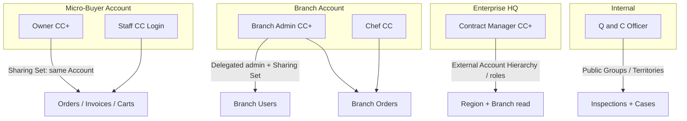
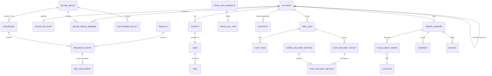
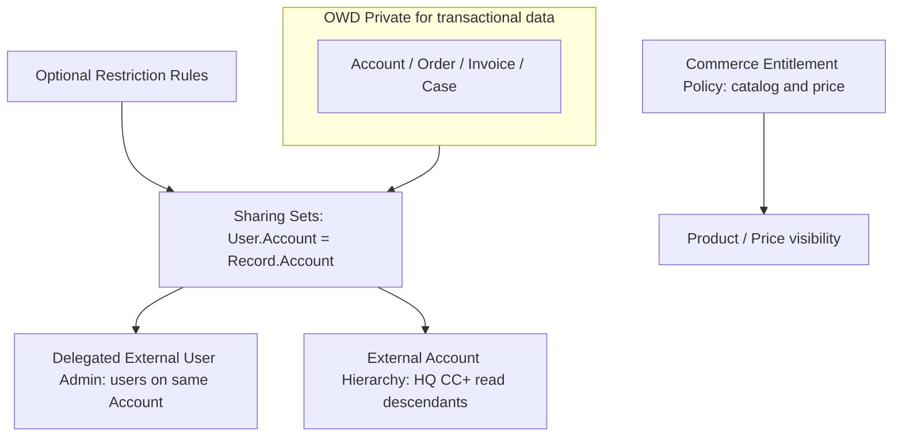

# 01 — Foundation: Personas, Licenses, Data Model, Sharing

This document is the platform foundation for FreshSource Global (FSG) buyer experience. Requirement-level designs in [02-requirements.md](./02-requirements.md) assume these decisions.

**Salesforce references:** [Experience Cloud user licenses](https://help.salesforce.com/s/articleView?id=users_license_types_communities.htm), [B2B Commerce data model](https://developer.salesforce.com/docs/commerce/salesforce-commerce/guide/b2b-b2c-dev-data-model.html), [Commerce key concepts](https://help.salesforce.com/s/articleView?id=commerce.comm_key_concepts.htm), [Access to a B2B store](https://help.salesforce.com/s/articleView?id=commerce.comm_access.htm), [Delegate External User Administration](https://help.salesforce.com/s/articleView?id=sf.networks_delegate_external_user_administration.htm), [Platform sharing architecture](https://architect.salesforce.com/docs/architect/fundamentals/guide/platform-sharing-architecture).

---

## 1. Personas

### 1.1 External buyer personas

| Persona | Who they are | Primary jobs | License / profile | Site |
| --- | --- | --- | --- | --- |
| **Micro-Buyer Owner** | Independent café, caterer, or food-truck proprietor | Register the business, browse regional produce, place wholesale orders, track deliveries, view invoices, optionally add a helper | Customer Community Plus (`FSG Micro-Buyer Owner`) | Buyer Marketplace |
| **Micro-Buyer Staff** | Cook / buyer employed by the micro-business | Browse, cart, checkout, track, invoices for **their** Account only | Customer Community Login (`FSG Micro-Buyer Shopper`) | Buyer Marketplace |
| **Enterprise HQ Contract Manager** | Procurement at a chain / hotel group / university | Maintain Master Agreement, contracted catalog, rebate targets; read-only across regions they own | Customer Community Plus (`FSG Enterprise HQ`) | Buyer Marketplace (Account Switcher limited to their hierarchy) |
| **Branch Buyer / Chef** | One of ~150,000 local branch buyers | Order from the contracted catalog for **this branch only** | Customer Community (`FSG Branch Buyer`) — high-volume, no role | Buyer Marketplace |
| **Branch User Admin** | Designated user **on the branch Account** | Create / deactivate / reset password for users **only on that branch** | Customer Community Plus + Delegated External User Administration (`FSG Branch Admin`) | Buyer Marketplace — Account Management |

Micro-Buyer Owner uses **Customer Community Plus (CC+)** so a small business can add staff with OOTB delegated administration. Micro-Buyer Staff uses **Customer Community Login** because they are high-volume, infrequent, and do not need roles or sharing rules. Branch chefs use named **Customer Community** (high-volume, Sharing Sets, no roles) so FSG does not consume the ~50,000 CC+ role cap on 150,000 chefs.

### 1.2 Internal FSG personas

| Persona | Who they are | Primary jobs | License | App |
| --- | --- | --- | --- | --- |
| **Quality & Compliance Officer** | Regional inspector for lots, cold-chain, RDCs | Inspections, holds, certificate review, Case work | Salesforce (Service Cloud) | FSG Quality Console |
| **Pricing / Merchandising Admin** | Category manager | Price books, entitlement policies, delivery methods, promotions | Salesforce | Commerce App |
| **Enterprise Account Executive** | Sales on the 1,200 parents | Contracts, rebates, QBR | Salesforce (Sales Cloud) | Sales Console |
| **Customer Support Agent** | Tier-1/2 | Cases, order exceptions, identity unlock | Salesforce + Service Cloud | Service Console |
| **Integration User** | Middleware | MuleSoft / ERP / WMS APIs | Salesforce Integration | N/A |

Quality officers are **employees**, not Experience Cloud users. They authenticate through Okta SAML and are assigned Permission Set Groups by region (NA / LATAM / EMEA) plus Omni-Channel skills (language, commodity, cold-chain).

### 1.3 Persona → record visibility (summary)



---

## 2. Experience Cloud sites and stores

Do **not** create 14 stores for 14 time zones. Time zone is a User field; locale/currency is Experience Cloud language + `WebStore` supported currencies.

| Site | Template | Audience | Guest access |
| --- | --- | --- | --- |
| **FSG Buyer Marketplace** | LWR B2B Commerce | Micro-buyers + enterprise buyers | Browse regional catalog only; no cart persist, no invoices |
| **FSG Supplier Network** (out of R1–R3 critical path) | LWR Partner | Farms / artisan producers | Public supplier application form only |
| Internal **FSG Quality Console** | Lightning App (not a site) | Q&C officers | N/A |

**WebStores (B2B Commerce Advanced, up to 10 storefronts):**

| WebStore | Catalog | Default Buyer Group | Currencies | Purpose |
| --- | --- | --- | --- | --- |
| `FSG_NA` | Global catalog, NA categories entitled | `BG_NA_Guest`, `BG_NA_Micro`, `BG_NA_Enterprise_*` | USD, CAD, MXN | NA + LATAM-north operating rhythm |
| `FSG_LATAM` | LATAM categories | `BG_LATAM_Guest`, `BG_LATAM_Micro`, `BG_LATAM_Enterprise_*` | BRL, COP, CLP, USD | LATAM |
| `FSG_EMEA` | EMEA categories | `BG_EMEA_Guest`, `BG_EMEA_Micro`, `BG_EMEA_Enterprise_*` | EUR, GBP, AED, USD | EMEA |

One global `ProductCatalog`; regional **Entitlement Policies** hide SKUs that cannot legally or logistically ship into that region. Buyers are routed to the correct store by Experience Cloud URL (for example `market-na.freshsource.com`) or a store-picker on the global vanity domain.

**OOTB store access** ([Access to a B2B Store](https://help.salesforce.com/s/articleView?id=commerce.comm_access.htm)):

1. Enable the Account as a **Buyer Account**.
2. Add it to one or more **Buyer Groups**.
3. Associate Buyer Groups to the store.
4. Entitlement Policies on those Buyer Groups control `CanViewProduct` / `CanViewPrice`.
5. Assign the OOTB **Buyer** permission set (shoppers) or **Buyer Manager** (branch/micro owners who manage users or buy-on-behalf).

---

## 3. License design

| Cohort | Volume | License | Why |
| --- | --- | --- | --- |
| Branch chefs | ~150,000 | **Customer Community** | High-volume, Sharing Sets, 10 custom objects, no roles — avoids the CC+ 50k role limit. |
| Branch User Admins | 1 per branch that needs self-admin (~thousands, not 150k) | **Customer Community Plus** | Required for [Delegated External User Administration](https://help.salesforce.com/s/articleView?id=sf.networks_delegate_external_user_administration.htm) and [Buyer Manager / Account Switcher](https://help.salesforce.com/s/articleView?id=commerce.comm_buy_on_behalf.htm). |
| Enterprise HQ managers | hundreds | **Customer Community Plus** | Role-based visibility up the External Account Hierarchy; not Sharing Sets (Sharing Sets do not roll up). |
| Micro-Buyer Owners | thousands–tens of thousands | **Customer Community Plus** | Same delegated-admin path if they add staff; Buyer Manager for Account Management. |
| Micro-Buyer Staff | variable | **Customer Community Login** | Login-based, cost-efficient, Sharing Set access to the same Account. |
| Q&C / sales / support | internal | **Salesforce** | Full CRM, Omni-Channel, reporting. |
| Middleware | few | **Salesforce Integration** | API-only. |

**Permission Set Groups (PSG)** rather than fat profiles:

| PSG | Key permission sets |
| --- | --- |
| `PSG_Micro_Owner` | Buyer, Buyer Manager, Delegated External User Administration, Account Switcher User (own Account only) |
| `PSG_Micro_Staff` | Buyer |
| `PSG_Branch_Admin` | Buyer, Buyer Manager, Delegated External User Administration |
| `PSG_Branch_Chef` | Buyer |
| `PSG_Enterprise_HQ` | Buyer Manager (view), CC+ standard, no create-user on sibling branches |
| `PSG_QC_Officer` | Inspections CRUD, Case, Knowledge, Omni-Channel |

Enable **Account Role Optimization** for CC+ so each partner/customer Account does not burn three roles. Keep CC+ roles at the org default of one role per Account unless a true manager/subordinate portal hierarchy is required.

---

## 4. Data and object architecture

### 4.1 Party model (customers, branches, suppliers, RDCs)

Use **standard Account + Contact + User**. Do not default micro-buyers to Person Accounts: they are legal businesses that can have multiple buyers, invoices, and tax IDs.

| Object | Record types | Role |
| --- | --- | --- |
| `Account` | `Enterprise_Parent`, `Enterprise_Region`, `Enterprise_Branch`, `Micro_Buyer`, `Supplier_Farm`, `RDC` | Party master in CRM. `ParentId` for hierarchy. |
| `Contact` | Buyer, Quality Contact, Farm Contact | Person at the Account. Portal users require a Contact. |
| `AccountContactRelation` | OOTB | Direct-indirect contacts if a chef ever works two branches (rare; prefer one Contact per branch). |
| `BuyerAccount` | OOTB Commerce | Enables purchasing; credit / order limits (B2B). |
| `BuyerGroup` / `BuyerGroupMember` | OOTB | Catalog, price book, and entitlement assignment. |
| `User` | Experience Cloud / internal | Login identity. `ContactId` + `AccountId` for external users. |
| `Contract` | `Master_Agreement` | Enterprise contracted pricing, rebate terms, service-tier eligibility. |
| `Entitlement` | `Enterprise_Support` | 2-hour SLA for enterprise Cases (Service Cloud). |

**Hierarchy rule (skew):** Salesforce sharing performance guidance treats **>10,000 children on one parent** as a skew risk. A 15,000-location enterprise **must not** hang all branches directly off HQ.

```text
Enterprise_Parent  (1,200)
  └── Enterprise_Region / District  (fan-out so no parent exceeds ~2,000–3,000 children)
        └── Enterprise_Branch       (ship-to, sold-to, portal users live here)
```

Micro-buyers are **flat**: one `Micro_Buyer` Account per legal entity. No parent.

Suppliers (`Supplier_Farm`) and RDCs (`RDC`) are Accounts with their own record types so Q&C inspections can look up a single party model.

### 4.2 Catalog, region, and perishability

| Object | OOTB / custom | Usage |
| --- | --- | --- |
| `ProductCatalog` | OOTB | One global catalog. |
| `ProductCategory` | OOTB | Region → Commodity → Cut/Pack. Entitlements filter by region. |
| `Product2` | OOTB + custom fields | Sellable SKU. Custom: `Temperature_Class__c` (Ambient / Chilled / Frozen / Ultra-Fresh), `Catch_Weight__c`, `Average_Ship_Weight__c`, `Shelf_Life_Hours__c`, `Origin_Region__c`, `Requires_Cold_Chain__c`. |
| `ProductAttribute` / variants | OOTB | Pack size, grade, organic flag. |
| `CommerceEntitlementPolicy` | OOTB | `CanViewProduct` / `CanViewPrice` per Buyer Group. |
| `ProductCategoryProduct` | OOTB | Category membership. |

Temperature class is a **product attribute**, not a price book. It drives: (a) which `OrderDeliveryMethod` rows a cart may use, (b) shipping surcharge, (c) which RDC locations can fulfill.

### 4.3 Pricing and service-tier objects

| Object | OOTB / custom | Usage |
| --- | --- | --- |
| `Pricebook2` / `PricebookEntry` | OOTB | `FSG_List_Wholesale_{Region}`, `FSG_Contract_{AccountOrTier}`, surcharge charge products. |
| `BuyerGroupPricebook` | OOTB | Assigns contracted or list books to a Buyer Group. Commerce picks the entitled book ([pricing APIs](https://developer.salesforce.com/docs/commerce/salesforce-commerce/guide/b2b-d2c-comm-pricing-promotions-apis.html)). |
| `PriceAdjustmentSchedule` + `PriceAdjustmentTier` | OOTB | Volume (quantity-band) discounts on a `PricebookEntry` via `PricebookEntryAdjustment`. [Object reference](https://developer.salesforce.com/docs/atlas.en-us.object_reference.meta/object_reference/sforce_api_objects_priceadjustmentschedule.htm). |
| `Promotion` / coupons | OOTB Commerce | Optional campaign overlays; not the contract engine. |
| `OrderDeliveryMethod` | OOTB | Three fulfillment SKUs: Standard Ground, Express Cold-Chain, Priority Ultra-Fresh. Each points at a **charge Product** ([Order Delivery Method fields](https://help.salesforce.com/s/articleView?id=commerce.om_order_delivery_method_fields.htm)). |
| `CartDeliveryGroup` / `CartDeliveryGroupMethod` | OOTB | Checkout options and calculated `ShippingFee`. |
| `Service_Tier_Rate__c` | **Custom** | Rate card: tier × temperature class × weight band × region → fee or multiplier. Read by `ShippingCartCalculator`. Not a shopping object. |
| `Contract_Tier__c` (or fields on `Contract`) | Custom fields on OOTB `Contract` | `Pricing_Tier__c` (for example Gold / Silver / Standard), `Eligible_Service_Tiers__c`, rebate percent. |

**Do not** clone the full catalog per customer. 1,200 parents × SKUs would explode `PricebookEntry`. Pattern: one list book per region + one contracted book per **tier** (or per parent only when prices are truly unique), assigned through Buyer Groups.

Period-end **volume rebates** (enterprise) are not checkout discounts. Model them on `Contract` + a thin `Rebate_Accrual__c` (or Revenue Cloud if licensed) and post financially in ERP. Checkout still shows the contracted unit price from the price book.

### 4.4 Order, fulfillment, tracking, invoice

| Object | OOTB | Portal use |
| --- | --- | --- |
| `WebCart` / `CartItem` | Commerce | Active cart. |
| `Order` / `OrderItem` | Standard | Captured order. |
| `OrderSummary` / `OrderItemSummary` | Order Management | Durable buyer-facing order. [Order Summary APIs](https://developer.salesforce.com/docs/commerce/salesforce-commerce/guide/b2b-d2c-comm-order-summaries-apis.html). |
| `OrderDeliveryGroup` | OOTB | Ship-to + selected delivery method. |
| `FulfillmentOrder` | OMS | Allocated to an RDC `Location`. |
| `Shipment` / `ShipmentItem` | OMS | Carrier tracking number; storefront shipments API. |
| `Invoice` / `InvoiceLine` | OMS | Buyer invoice history after capture. |
| `Location` / `LocationGroup` | OOTB | RDCs; group by region and cold capability. |
| `Cold_Chain_Alert__c` | **Custom, low volume** | Exception only (temperature excursion). Telemetry stays in IoT/Data Cloud. |

### 4.5 Identity objects

| Object | Usage |
| --- | --- |
| Auth Provider metadata (Setup) | Google, LinkedIn, Apple / OpenID Connect. |
| `ThirdPartyAccountLink` | Links a Salesforce User to an IdP subject (`RemoteIdentifier`). Repeat social logins call `updateUser`. [Field reference](https://developer.salesforce.com/docs/atlas.en-us.sfFieldRef.meta/sfFieldRef/salesforce_field_reference_ThirdPartyAccountLink.htm). |
| `User` / `Contact` / `Account` | JIT-created for new micro-buyers. |
| `LoginHistory` / Event Monitoring | SOC / fraud. |

### 4.6 Quality & compliance (supporting, not R1–R3)

| Object | OOTB / custom | Usage |
| --- | --- | --- |
| `Case` | OOTB | Inspection findings, holds, buyer incidents. |
| `BusinessMilestone` / `Assessment` or `Inspection__c` | Custom if no Industries Inspection | Q&C visit against Farm or RDC Account. |
| `Certification__c` | Custom | Organic, HACCP, GFSI; Files for PDFs. |
| `Lot_Batch__c` | Custom, thin | External id to food-safety registry; not a telemetry store. |

### 4.7 Canonical ERD



### 4.8 Custom fields that matter

Keep custom **objects** few: Customer Community licenses allow a small number of custom objects in the site. Prefer custom **fields on standard objects**.

| Object | Field | Purpose |
| --- | --- | --- |
| Account | `Buyer_Segment__c` | `Micro` / `Enterprise_Branch` / `Enterprise_Parent` |
| Account | `Service_Region__c` | Drives Buyer Group assignment |
| Account | `Tax_Id__c` | EIN / VAT / RFC |
| Account | `Registration_Status__c` | `Draft` / `Pending_Review` / `Active` / `Suspended` |
| Product2 | `Temperature_Class__c` | Shipping eligibility and surcharge |
| Product2 | `Average_Ship_Weight__c` | Weight-based fee input |
| WebCart / CartDeliveryGroup | `Selected_Service_Tier__c` | Checkout persistence |
| OrderDeliveryMethod | `Requires_Refrigeration__c`, `Same_Day__c`, `Cutoff_Local_Time__c` | Calculator filters |
| OrderSummary | `Service_Tier__c`, `Max_Temperature_Class__c` | Reporting and tracking UX |
| User | `Delegated_Admin_Scope__c` | Documentation only; real scope is Account membership |

---

## 5. Sharing and security model

### 5.1 Organization-Wide Defaults (external)

| Object | Internal OWD | External OWD | Rationale |
| --- | --- | --- | --- |
| Account | Private or Public Read | **Private** | Buyers must not see other cafés or sibling branches. |
| Contact | Controlled by Parent | Controlled by Parent | Follows Account. |
| Order / Order Summary / Invoice / Cart | Private | **Private** | Sharing Set grants same-Account access. |
| Case | Private | Private | Same-Account Sharing Set for portal tickets. |
| Product2 | Public Read | Public Read | Visibility further gated by Commerce Entitlement Policy. |
| Pricebook2 | Use | Use | Entitled books only via Buyer Group. |
| Inspection / Certification | Private | Private | Internal only; no portal CRUD. |
| `Service_Tier_Rate__c` | Public Read | **Hidden** | Calculator runs in system mode; buyers never query the rate card. |

### 5.2 Micro-buyers — Sharing Sets (high-volume)

Customer Community / Login users **cannot use sharing rules or roles**. Use **Sharing Sets** ([external user sharing](https://trailhead.salesforce.com/content/learn/projects/communities_share_crm_data/external_user_sharing)):

| Sharing Set | Profiles | Mapping | Access |
| --- | --- | --- | --- |
| `SS_Micro_SameAccount` | Micro Owner, Micro Staff | User.Account = AccountId on Order, Order Summary, Invoice, Case, WebCart, Contact | Read (invoices) / Read-Write (cart, own cases) |

Owners and staff on the same micro Account see the same orders and invoices. They never see another café.

### 5.3 Enterprise branches — isolation + branch-only user admin

**Requirement from the scenario:** *One of the users in the branch must be able to manage other users only in their branch.*

This is OOTB if modeled correctly:

1. Each physical location is its own `Enterprise_Branch` Account.
2. Every chef and the Branch User Admin are Contacts/Users **on that branch Account**, not on HQ.
3. Sharing Set `SS_Branch_SameAccount`: User.Account → Order / Invoice / Case / Cart for that branch only.
4. Branch User Admin profile: **Delegated External User Administration** ([Salesforce documentation](https://developer.salesforce.com/blogs/2014/06/how-to-provision-salesforce-communities-users)). That permission allows create / edit / activate / deactivate / reset password / assign permitted permission sets **for users on the admin’s Account**.
5. Do **not** grant HQ Account as the portal Account for chefs. If they hang off HQ, delegated admin would span the enterprise.

**HQ visibility:** Sharing Sets do **not** roll up the Account hierarchy. HQ Contract Managers are CC+ with **External Account Hierarchy** (and one role per Account with Account Role Optimization) so they can read descendant branches. They are **not** Delegated External User Administrators on descendant branches unless FSG explicitly wants that — the scenario does not.

**Account Switcher / External Managed Accounts** ([Grant buyers access to external accounts](https://help.salesforce.com/s/articleView?id=commerce.comm_buy_on_behalf.htm)):

- Use for a district manager who must **buy or manage users** for a small, explicit set of branches (cap **200** external managed accounts per user).
- Requires CC+, Buyer Manager, Account Switcher User, **and** sharing to the target Account.
- Do **not** use this to give one person 15,000 branches.

**Restriction Rules** (optional hardening): on Order Summary, `Account.Buyer_Segment__c` + region, to defense-in-depth against mis-shared records. Restriction Rules subtract access; they do not replace Sharing Sets.

### 5.4 Internal Quality & Compliance

- Public Groups `PG_QC_NA`, `PG_QC_LATAM`, `PG_QC_EMEA` (or Territories if FSG already uses Enterprise Territory Management).
- Criteria sharing: `Inspection__c` and RDC/Farm Accounts where `Service_Region__c` in group.
- Q&C does **not** see micro-buyer carts. They see lots, RDCs, and Cases of type Quality.

### 5.5 Guest user

Guest profile on Buyer Marketplace:

- Read entitled products for the store’s guest Buyer Group (regional browse).
- Apex class access **only** to the self-registration controller ([B2B custom self-registration](https://developer.salesforce.com/docs/commerce/salesforce-commerce/guide/b2b-comm-custom-self-registration.html)).
- No Order, Invoice, Account, or rate-card access.
- Experience Cloud guest security best practices: Secure Guest User Record Access enabled; no granting via sharing rules to guest.

### 5.6 Authorization summary



---

## 6. Assumptions this foundation depends on

| ID | Assumption | If wrong |
| --- | --- | --- |
| F1 | Micro-buyers are businesses (tax ID), not consumers. | Person Accounts + D2C store instead of B2B. |
| F2 | Branch admins manage **only their branch**, not the chain. | Would need External Managed Accounts + explicit sharing; still not org-wide admin. |
| F3 | One production org on Hyperforce. | Residency split would duplicate Auth Providers, Buyer Groups, and price books. |
| F4 | OMS is licensed (Commerce Cloud B2B Advanced or standalone Order Management). | Invoice/shipment UX would virtualize from ERP via Salesforce Connect. |
| F5 | Weight used for shipping is catch-weight at fulfillment; checkout uses `Average_Ship_Weight__c`. | Need a re-rate event after WMS weigh-in. |
| F6 | Social login is **micro-buyers only**. Enterprise domains are blocked in the registration handler. | Corporate Google Workspace logins would otherwise JIT-create rogue micro Accounts. |
