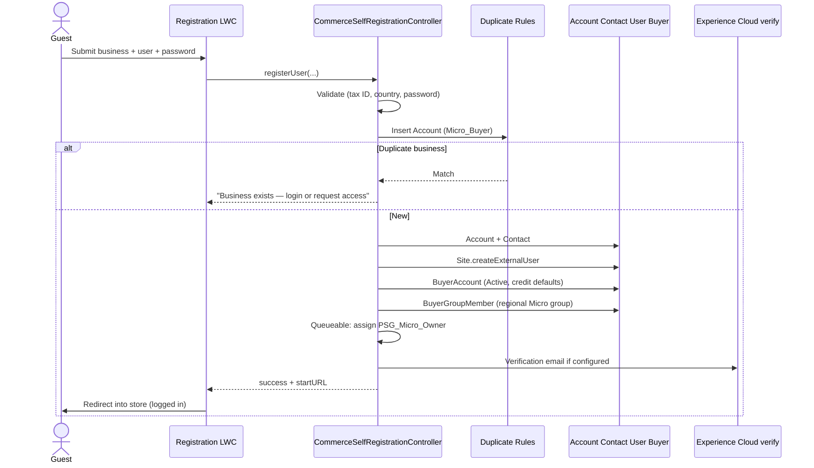
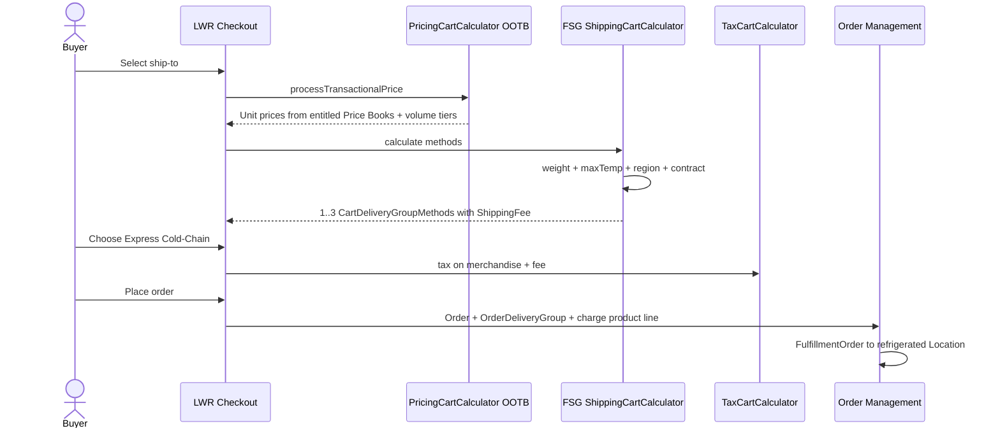
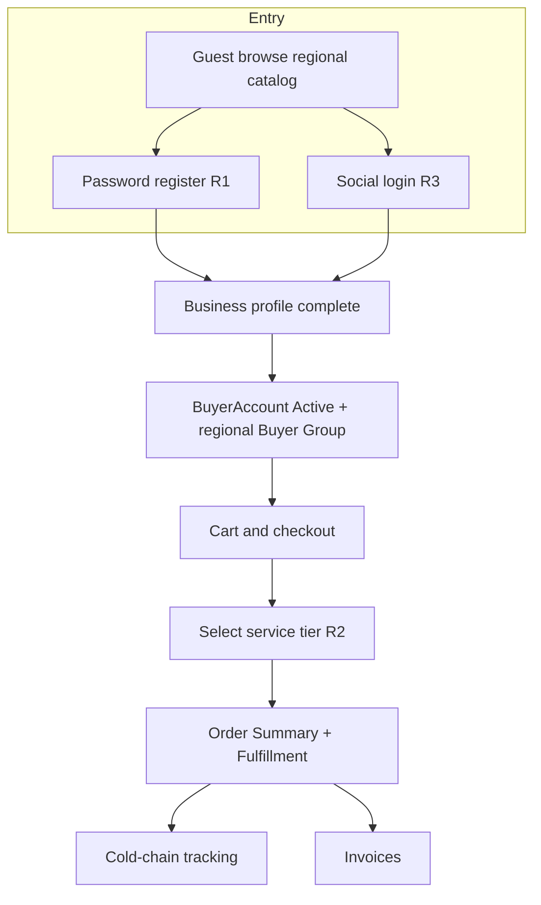

# 02 — Requirement Designs

This document is the end-to-end Salesforce design for the three stated requirements. Personas, objects, licenses, and sharing are defined in [01-foundation.md](./01-foundation.md).

---

## Requirement 1 — Micro-Buyer Registration

> Independent caterers and small business owners register on the platform to browse available regional produce, place wholesale orders, track cold-chain deliveries, and view historical invoices.

### 1.1 Target experience

| Step | Actor | What they do | Salesforce capability |
| --- | --- | --- | --- |
| 1 | Guest | Lands on regional Marketplace, picks region if needed, **browses** entitled produce | OOTB guest browsing + guest Buyer Group + Entitlement Policy |
| 2 | Guest | **Registers** the business (or continues with social — R3) | Custom self-reg LWC + Apex (Salesforce-documented B2B pattern) |
| 3 | New user | Email/phone verify, then session on the store | OOTB Experience Cloud verification / `Site.createExternalUser` |
| 4 | Buyer | Search/PLP/PDP, cart, checkout, pay | OOTB B2B Commerce LWR components |
| 5 | Buyer | **Track** cold-chain delivery | OOTB Order Summary + Shipments APIs + custom tracking panel |
| 6 | Buyer | **Historical invoices** | OOTB OMS `Invoice` related list / Connect API, or Salesforce Connect to ERP |

### 1.2 Why OOTB self-registration is not enough by itself

Experience Cloud **configurable self-registration** (`Auth.ConfigurableSelfRegHandler`) creates a User (and can attach to an Account). B2B Commerce additionally requires:

- A **business Account** (record type `Micro_Buyer`)
- A **Contact**
- A **BuyerAccount** (`Commerce.BuyerAccount` / `BuyerAccount` sObject) so the Account can purchase
- A **BuyerGroupMember** so regional catalog and list prices appear
- The **Buyer** permission set
- Locale / time zone / currency consistent with the store

Salesforce documents this exact gap and the prescribed extension: [Implement Custom Self-Registration for a B2B Store](https://developer.salesforce.com/docs/commerce/salesforce-commerce/guide/b2b-comm-custom-self-registration.html). That is the chosen pattern for R1 (password path). The social path reuses the same provisioning service from R3.

OOTB pieces still used:

- Experience Builder **Self-Registration** page (host the LWC)
- Store setting **Configure Self-Registration for a B2B Store**
- `Site.createExternalUser(user, accountId, password)` ([Site class](https://developer.salesforce.com/docs/atlas.en-us.apexref.meta/apexref/apex_classes_sites.htm))
- Duplicate / matching via **Duplicate Rules** on Account (tax ID + address) and Contact (email)
- Email verification on the site’s Login & Registration settings

### 1.3 Registration data collected

| Field | Stored on | Required | Notes |
| --- | --- | --- | --- |
| Legal business name | Account.Name | Yes | |
| Trading name | Account.Doing_Business_As__c | No | |
| Tax ID (EIN / VAT / RFC) | Account.Tax_Id__c | Yes | Duplicate Rule |
| Street, city, state, postal, country | Account.Billing* and Shipping* | Yes | Drives `Service_Region__c` and Buyer Group |
| Delivery window / default ship-to | Contact-point Address (`ContactPointAddress`) if licensed; else Account Shipping | Yes | Commerce checkout addresses |
| First, last, email, mobile | Contact + User | Yes | Email is username |
| Password | User | If not social | Complexity via site password policy |
| Accept terms | Custom `Terms_Accepted__c` + timestamp | Yes | |

`Service_Region__c` is derived (Flow) from country/state to a controlled list (`NA-West`, `NA-East`, `LATAM-MX`, `EMEA-UK`, …). A **Buyer Group Extension** ([Buyer Group Extension](https://help.salesforce.com/s/articleView?id=commerce.comm_access.htm)) or the registration Apex then assigns `BG_{Region}_Micro`.

### 1.4 Provisioning flow (password registration)



**BuyerAccount defaults (OOTB fields):** `BuyerStatus = Active` after auto-approve, or `Inactive` if FSG requires manual KYC. `Commerce.BuyerAccount` supports credit / order limits; set conservative defaults (for example max order amount) for new micro-buyers; FSG credit team raises them later.

**Auto-approve vs review:**

| Policy | When | Implementation |
| --- | --- | --- |
| Auto-activate | Default for low-risk regions | Registration Apex sets BuyerAccount Active; `Registration_Status__c = Active` |
| Manual KYC | High-risk country or failed tax-ID format | Account stays `Pending_Review`; BuyerAccount inactive; Screen Flow for Credit Ops; buyer sees “pending” LWC state |
| Reject / merge | Duplicate tax ID | Do **not** create a second Account. Offer “request access” Case to the existing owner |

### 1.5 Browse regional produce (guest and authenticated)

**OOTB:**

- Categories for the store’s region; Entitlement Policy on `BG_{Region}_Guest` (guest) and `BG_{Region}_Micro` (registered)
- Search (Commerce Search) with facets: commodity, temperature class, farm, organic
- Guest browsing enabled on the store; guest cannot checkout without login (B2B)

**Custom (small):**

- Region picker LWC on the global vanity domain that sets a cookie and redirects to `FSG_NA` / `FSG_LATAM` / `FSG_EMEA`
- Optional **Buyer Group Extension** Apex so a buyer who moves ship-to country is re-entitled without a data-load

Do **not** build a custom catalog. Product visibility is [Commerce Entitlement Policy](https://developer.salesforce.com/docs/commerce/salesforce-commerce/guide/b2b-b2c-dev-data-model.html).

### 1.6 Place wholesale orders

**OOTB LWR B2B components:** PLP, PDP, cart, mini-cart, checkout, payment (Salesforce Payments or named gateway), reorder from Order Summary ([Add Order to Cart API](https://developer.salesforce.com/docs/commerce/salesforce-commerce/guide/b2b-d2c-comm-order-summaries-apis.html)).

Checkout sequence (platform):

1. Cart calculators: pricing → promotions → inventory → **shipping (R2)** → tax
2. Payment authorization
3. Cart → Order → Order Summary (OMS)
4. Platform Event / Flow: allocate `FulfillmentOrder` to an RDC `Location` that supports the cart’s max temperature class

**Custom:** none on the happy path except the shipping calculator in R2. Inventory availability should call Omnichannel Inventory or WMS via the extensible Inventory service if FSG does not use OCI — do not query 50k-order inventory in a before-insert Apex trigger.

### 1.7 Track cold-chain deliveries

**OOTB (buyer-facing):**

- Experience Cloud **Order Summary** pages
- Connect API `GET /commerce/webstores/{webstoreId}/order-summaries/{id}/shipments` and shipment items ([Order Summary APIs](https://developer.salesforce.com/docs/commerce/salesforce-commerce/guide/b2b-d2c-comm-order-summaries-apis.html))
- `Shipment.TrackingNumber` + `TrackingUrl` for carrier deep-link
- Fulfillment Order status rolled up to Order Summary

**Custom (justified):** perishable **temperature timeline** is not an OMS object. IoT pings must **not** be inserted as Salesforce records at telemetry frequency (LDV).

| Layer | What lands in Salesforce | What stays outside |
| --- | --- | --- |
| OMS Shipment | Status, carrier, PRO number, ETA | — |
| Data Cloud / event lake | Unified shipment + telemetry | High-frequency temperature samples |
| `Cold_Chain_Alert__c` | Only excursions (threshold breach) | — |
| Tracking LWC | Reads OMS shipment + a **Named Credential** callout to a MuleSoft/Data Cloud API for the last-known temperature and sparkline | Raw IoT |

Buyer permission: the LWC is on the Order Summary page; sharing already restricts Order Summary to the same Account. The callout passes `Shipment.Id` and the integration enforces Account ownership server-side.

### 1.8 Historical invoices

**Preferred OOTB:** Salesforce Order Management generates `Invoice` when funds are captured in the fulfillment workflow ([Order Management payment/invoice](https://trailhead.salesforce.com/content/learn/modules/om-salesforce-order-management/om-streamline-order-fulfillment-payment)). Expose Invoice on the portal with a standard related list or a thin LWC using the user’s Sharing Set.

**If ERP is financial SoR (typical at this volume):** keep **90 days** of OMS invoices as hot CRM; older invoices as **Salesforce Connect** external objects (`Invoice__x`) from SAP/Oracle. Customer Community can display external objects; they do not count as the 10 custom-object cap in the same way, and they do not store LDV in Salesforce.

Payment of invoices (account terms vs card) is `BuyerAccount` credit fields + checkout payment method. Micro-buyers default to card; terms after credit review.

### 1.9 R1 object and page map

| Capability | Standard object / API | Portal page |
| --- | --- | --- |
| Register | Account, Contact, User, BuyerAccount, BuyerGroupMember | Self-Registration (custom LWC) |
| Browse | Product2, ProductCategory, Entitlement | Home / PLP / PDP |
| Order | WebCart, Order, OrderSummary | Cart / Checkout / Order Detail |
| Track | Shipment, FulfillmentOrder, Cold_Chain_Alert__c | Order Detail — Tracking tab |
| Invoices | Invoice or Invoice__x | Invoices list + PDF (Files or ERP URL) |

### 1.10 R1 security notes

- Guest Apex: **only** the registration controller.
- Registration controller: CRUD on Account/Contact/User via `without sharing` **only** for inserts it creates; never query other Accounts by name except Duplicate Rules API.
- Tax ID encrypted (Shield Platform Encryption) if FSG’s compliance requires it.
- After create, owner of Account = a regional integration/queue user in the role hierarchy so internal teams can see new micros; portal users still only see their Account via Sharing Set.

---

## Requirement 2 — Pricing and Service Tiers

> FSG offers three fulfillment service tiers: Standard Ground, Express Cold-Chain (Refrigerated), and Priority Ultra-Fresh (Same-Day). Base pricing varies depending on weight, temperature classification, delivery urgency, and corporate contract tier discounts.

### 2.1 Separate two prices that buyers see

| Price component | What it represents | Engine |
| --- | --- | --- |
| **Merchandise (unit) price** | Produce SKU price: list vs contracted, then volume bands | OOTB Price Books + Buyer Groups + `PriceAdjustmentSchedule`; optional Revenue Cloud procedure |
| **Fulfillment (service) price** | The chosen delivery tier, driven by weight, temperature class, urgency, region | OOTB `OrderDeliveryMethod` + **custom** `ShippingCartCalculator` + `Service_Tier_Rate__c` |

Salesforce Commerce already splits these: the [Cart Calculate API](https://developer.salesforce.com/docs/commerce/salesforce-commerce/guide/cart-calculate-api.html) runs `PricingCartCalculator` then, at checkout, `ShippingCartCalculator`. Do not hide service-tier fees inside SKU prices — chefs and micro-buyers must see the tier as a selectable delivery method.

### 2.2 The three tiers as OOTB Order Delivery Methods

Create three `OrderDeliveryMethod` records ([fields](https://help.salesforce.com/s/articleView?id=commerce.om_order_delivery_method_fields.htm)):

| Name | Carrier / class of service | Charge Product | Custom flags |
| --- | --- | --- | --- |
| Standard Ground | FSG Fleet / ground LTL | `CHG_GROUND` | `Requires_Refrigeration__c = false`, `Same_Day__c = false` |
| Express Cold-Chain | Refrigerated carrier | `CHG_COLDCHAIN` | `Requires_Refrigeration__c = true`, `Same_Day__c = false` |
| Priority Ultra-Fresh | Same-day courier | `CHG_ULTRAFRESH` | `Requires_Refrigeration__c = true`, `Same_Day__c = true`, `Cutoff_Local_Time__c` per region |

Each charge Product is a `Product2` of type Charge so OMS can invoice the fee as an Order Product. Storefront checkout shows these as `CartDeliveryGroupMethod` rows with name, transit time, and `ShippingFee`.

**Eligibility rules (calculator, not buyer-editable):**

| Cart condition | Standard Ground | Express Cold-Chain | Priority Ultra-Fresh |
| --- | --- | --- | --- |
| All Ambient, no `Requires_Cold_Chain__c` | Offered | Optional upgrade | If same-day zone |
| Any Chilled or Frozen | **Hidden** | Offered | If same-day zone and SKU `Temperature_Class__c` allows |
| Any Ultra-Fresh / `Shelf_Life_Hours__c` below threshold | Hidden | Hidden unless SLA still viable | Offered if before cutoff and RDC in same-day polygon |
| Enterprise Contract forbids a tier | Hidden | Per `Contract.Eligible_Service_Tiers__c` | Per contract |
| After local cutoff | Offered next day | Offered | Hidden |

Same-day polygon and cutoff are **not** good Apex loop geography. Store `Location.Is_Same_Day_Eligible__c` and a postal-prefix table (`Same_Day_Zone__mdt`) or call TMS; the calculator must stay within governor limits (query rate card once, no per-line SOQL).

### 2.3 Fulfillment fee formula

```text
billedWeight = SUM(CartItem.Quantity * Product.Average_Ship_Weight__c)
maxTemp      = highest Temperature_Class__c in the cart  (Ambient < Chilled < Frozen < UltraFresh)
urgency      = selected OrderDeliveryMethod
region       = Account.Service_Region__c
contractMult = Contract.Fulfillment_Discount_Percent__c  (enterprise only; else 1.0)

ShippingFee  = RateCard[tier, maxTemp, weightBand, region].Amount
               * (1 - contractMult)
```

`Service_Tier_Rate__c` (custom object, internal-only):

| Field | Example |
| --- | --- |
| Service_Tier__c | Express_Cold_Chain |
| Temperature_Class__c | Chilled |
| Weight_Band_Low__c / High__c | 0 / 15 kg |
| Region__c | NA-East |
| Amount__c | 48.00 |
| CurrencyIsoCode | USD |
| Effective_From__c / Effective_To__c | dating |

**Alternative OOTB-leaning option:** model each tier × temp as a Charge Product with `PriceAdjustmentSchedule` by weight quantity. That breaks down once region and contract multipliers matter. FSG’s matrix (tier × temp × weight × region × contract) is why a **ShippingCartCalculator** is the documented extension point ([ShippingCartCalculator](https://developer.salesforce.com/docs/commerce/salesforce-commerce/references/comm-apex-reference/ShippingCartCalculator.html)).

Calculator responsibilities (`CartExtension.ShippingCartCalculator.calculate`):

1. Read cart items (in-memory `CartCalculateCalculatorRequest` — do not re-query the cart).
2. Compute `billedWeight` and `maxTemp`.
3. Determine offered methods (eligibility table above).
4. For each offered method, look up fee from a **platform cache** of `Service_Tier_Rate__c` (or Custom Metadata for coarse cards).
5. Apply enterprise fulfillment discount from the Account’s Contract (cached on Account formula or Buyer Group custom field — avoid Contract SOQL per checkout).
6. `new CartDeliveryGroupMethod(name, shippingFee, chargeProductId)` and set carrier, class of service, transit time.

Register the class as the store’s shipping calculator (Commerce Extensions).

### 2.4 Merchandise pricing: weight, temp, contract, volume

Temperature and weight **also** affect unit price (heavier case, colder SKU). Handle that on the **SKU**, not in shipping:

| Driver | OOTB mechanism | How FSG uses it |
| --- | --- | --- |
| Regional list price | `Pricebook2` `FSG_List_{Region}` + `BuyerGroupPricebook` | Micro-buyers get regional list. |
| Corporate contract tier | Additional price book `FSG_Contract_Gold` / `Silver` / parent-specific book | Enterprise Buyer Group membership. Commerce selects entitled books and applies the applicable price ([Pricing and Promotions APIs](https://developer.salesforce.com/docs/commerce/salesforce-commerce/guide/b2b-d2c-comm-pricing-promotions-apis.html)). |
| Volume (checkout) | `PriceAdjustmentSchedule` type **Volume** on the contracted or list `PricebookEntry`, with `PriceAdjustmentTier` bands ([PriceAdjustmentSchedule](https://developer.salesforce.com/docs/atlas.en-us.object_reference.meta/object_reference/sforce_api_objects_priceadjustmentschedule.htm)) | “Buy 10 cases, unit price drops.” AdjustmentMethod Range or Slab. Max 25 tiers per schedule; max 5 schedules associated, one active. |
| Period-end volume **rebates** | `Contract` terms + ERP or `Rebate_Accrual__c` batch | Not a cart discount. Shown on a rebate dashboard, not as a fake lower unit price. |
| Promotional overlays | Commerce Promotions evaluate APIs | Seasonal farm promotions; optional. |

**Do not** implement merchandise pricing in the shipping calculator. If FSG later needs attribute-based unit price (catch-weight true-up, spoilage markdown), extend `commercestorepricing.PricingService` ([PricingService](https://developer.salesforce.com/docs/commerce/salesforce-commerce/references/comm-apex-reference/PricingService.html)) or adopt **Revenue Cloud** pricing procedures (List Price → Volume Discount → Manual/Contract adjustment). Revenue Cloud is the strategic successor to Salesforce CPQ for new quote-to-cash work; B2B Commerce Advanced can consume Commerce pricing elements. For this requirement, Price Books + schedules meet the stated drivers without CPQ.

**Catch-weight:** checkout prices using `Average_Ship_Weight__c`. After WMS weigh-in, an OMS adjustment + regenerated invoice true-up the merchandise and fulfillment fee. Expose the adjustment on Order Summary (OOTB adjustment objects).

### 2.5 Enterprise contracted catalogs (context for R2)

Enterprise parents do not self-register like micro-buyers. Sales Cloud:

1. `Contract` (Master Agreement) with `Pricing_Tier__c`, `Eligible_Service_Tiers__c`, rebate percent.
2. Flow / CPQ-or-Revenue-Cloud-or-manual: assign branch Accounts to Buyer Group `BG_ENT_{ParentOrTier}_{Region}`.
3. That Buyer Group’s price book is the contracted catalog. Entitlement Policy may hide SKUs not on the agreement.
4. Branch chefs see **only** that catalog and the tiers the contract allows.

Micro-buyers never enter those Buyer Groups.

### 2.6 Pricing sequence at checkout



### 2.7 RDC allocation vs price

Pricing **offers** a tier; OMS **must** fulfill it from a capable `Location`:

- Location custom fields: `Supports_Chilled__c`, `Supports_Frozen__c`, `Supports_Same_Day__c`
- Use OMS routing flows (Connected Commerce Order Routing for B2B) to prefer nearest capable RDC ([distributed OM](https://trailhead.salesforce.com/content/learn/modules/om-salesforce-order-management/om-implement-distributed-order-management))
- If no location can meet Ultra-Fresh, the calculator should already have hidden the method (inventory/capacity check via Inventory service or TMS callout with timeout and fail-closed)

### 2.8 Worked example

Café in Brooklyn, micro-buyer, cart = 8 kg chilled greens + 2 kg ambient dry goods.

- `maxTemp = Chilled` → Standard Ground hidden
- `billedWeight = 10 kg` → Cold-Chain band 0–15 kg, NA-East, amount $48
- No contract multiplier
- Ultra-Fresh offered if postal prefix in `Same_Day_Zone__mdt` and now < cutoff; amount $96
- Merchandise: `FSG_List_NA` price book; volume schedule does not fire (below 10-case band)
- Buyer selects Express Cold-Chain; OMS allocates to NJ refrigerated RDC

Enterprise branch under Gold contract, same cart:

- Unit prices from `FSG_Contract_Gold`
- Fulfillment fee $48 × (1 − 0.15) = $40.80 if `Fulfillment_Discount_Percent__c = 15`
- Volume rebate does **not** change the $40.80 at checkout; it accrues toward the quarterly rebate

---

## Requirement 3 — Customer Authentication (Social Identity)

> Micro-Buyers and small caterers should be able to log into the customer portal using social identity providers (e.g., Google, LinkedIn, Apple ID).

### 3.1 Product choice: Experience Cloud Auth Providers, not B2C SLAS

FSG’s buyer portal is **B2B Commerce on Experience Cloud**. Identity is Salesforce Identity:

- Setup → **Auth. Providers** ([SSO with Salesforce as relying party](https://developer.salesforce.com/docs/platform/mobile-sdk/guide/sso-authentication-providers.html))
- Site Administration → **Login & Registration** → enable the providers ([add provider to Experience Cloud login](https://developer.salesforce.com/docs/platform/mobile-sdk/guide/communities-configure-community-auth.html))
- Apex `Auth.RegistrationHandler` for JIT ([Auth namespace](https://developer.salesforce.com/docs/atlas.en-us.apexref.meta/apexref/apex_namespace_Auth.htm))

**Do not** implement micro-buyer login on B2C Commerce SLAS. SLAS social login ([SLAS identity providers](https://developer.salesforce.com/docs/commerce/b2c-commerce/guide/slas-identity-providers.html)) is the right pattern for a B2C composable storefront, not this wholesale Account/Contact/Buyer Group model.

Enterprise buyers: **username + password** or **corporate SSO** (SAML/OIDC to Okta/Entra). Social buttons are hidden on the enterprise login branded page, or the handler rejects enterprise email domains (section 3.5).

Internal users: Okta SAML to Lightning. No social.

### 3.2 Auth Provider configuration (OOTB)

| Provider | Salesforce provider type | IdP app | Callback |
| --- | --- | --- | --- |
| **Google** | Predefined **Google** | Google Cloud OAuth client (Web) | Auth Provider **Callback URL** (for example `https://login.salesforce.com/services/authcallback/<org>/<suffix>` or My Domain / site equivalent) registered as Authorized redirect URI |
| **LinkedIn** | Predefined **LinkedIn** (or **OpenID Connect** if using LinkedIn OIDC) | LinkedIn Developer app, `openid profile email` | Same callback pattern; [LinkedIn Auth Provider](https://help.salesforce.com/s/articleView?id=xcloud.sso_provider_linkedin.htm) |
| **Apple ID** | Predefined **Apple** if present in the org’s catalog; otherwise **OpenID Connect** to `https://appleid.apple.com` | Apple Services ID + key | Apple requires `response_mode=form_post` on the authorize URL; Return URL = Salesforce callback. Use Sign in with Apple guidelines (email may be a private relay) |

For each provider:

1. Create the Auth Provider in Setup; set Consumer Key/Secret.
2. **Registration Handler:** Apex class `FSG_MicroBuyerRegHandler` (section 3.4). Optionally “Automatically create a registration handler template” then replace the body.
3. **Execute Registration As:** a dedicated integration user with rights to create Accounts/Contacts/Users and Buyer records (not a human Sysadmin).
4. **Portal / Experience Cloud site:** set the Buyer Marketplace site so the handler creates **Experience Cloud** users, not internal Users.
5. Copy Callback URL back to the IdP.
6. On the site, Login & Registration: enable Google, LinkedIn, Apple. Keep username-password enabled so staff can be invited without a social account.
7. Publish the site. Login page shows social buttons via OOTB login component (LWR).

**OpenID Connect** generic setup (Apple fallback and future IdPs): [Configure an Authentication Provider Using OpenID Connect](https://developer.salesforce.com/docs/platform/mobile-sdk/guide/sso-provider-openid-connect.html). Discovery URL, authorize/token/userinfo endpoints, `openid email profile` scopes.

### 3.3 Login and account-linking URLs (OOTB)

From the Auth Provider detail page:

- **Single Sign-On Initialization URL** — send users here from the login page (Experience Cloud does this when the provider is enabled).
- For site context:  
  `https://<my-domain>/services/auth/sso/<suffix>?community=<siteLoginUrl>`
- **Existing User Linking URL** (`/services/auth/link/`) — logged-in password users bind a social IdP without creating a second User ([site auth configuration](https://developer.salesforce.com/docs/platform/mobile-sdk/guide/communities-configure-community-auth.html)).

Expose “Connect Google / Apple / LinkedIn” on the micro-buyer profile page using the linking URL so a user who registered with email in R1 can later use social (R3) **on the same User**. Salesforce stores the bind on `ThirdPartyAccountLink`.

### 3.4 Registration Handler (custom, required)

OOTB template is not production-safe: it can create Standard Users, skip Buyer Account setup, and duplicate Contacts. Implement `Auth.RegistrationHandler`:

```apex
global User createUser(Id portalId, Auth.UserData data)
global void updateUser(Id userId, Id portalId, Auth.UserData data)
```

Optional hardening: also implement `Auth.ConfirmUserRegistrationHandler.confirmUser` so a changed IdP email cannot attach to the wrong User ([ConfirmUserRegistrationHandler](https://developer.salesforce.com/docs/atlas.en-us.apexref.meta/apexref/apex_interface_Auth_ConfirmUserRegistrationHandler.htm)).

**How Salesforce chooses create vs update:** if a `ThirdPartyAccountLink` already exists for this provider + `RemoteIdentifier`, Salesforce calls `updateUser` with that User Id. Otherwise it calls `createUser`. The handler **must** still search for an existing portal User by **verified email** inside `createUser` to avoid duplicates when the same person uses Google after already registering with a password.

#### createUser logic

```text
1. If data.email is blank (Apple hide-my-email first time): send to "Complete profile" page; do not create an Account yet.
2. If email domain is on Enterprise_SSO_Domain__mdt (for example hilton.com): throw Auth.RegistrationHandlerException
   "Use your corporate login". Never JIT a micro Account for a contracted enterprise domain.
3. Find User where Email = data.email and Profile in micro-buyer profiles.
   a. Found: return that User (Salesforce will insert ThirdPartyAccountLink).
   b. Not found: find Contact by email under a Micro_Buyer Account.
      - Contact exists: enable Experience Cloud user on that Contact (same as R1 enablement).
      - Contact does not exist: create Account (Name from data.lastName + " — pending business details"),
        Contact, User (profile FSG Micro-Buyer Owner), BuyerAccount, BuyerGroupMember (region from IP/locale or default,
        then force profile completion).
4. Return the User. Do not insert User yourself if returning a new User instance for portal — follow
   current Registration Handler contract for Experience Cloud (return unsaved User with ContactId set,
   or return existing User). Implement against the org's API version and test both paths.
5. Queueable: assign PSG_Micro_Owner; send "complete your business profile" if Account.Tax_Id__c is null.
```

Social login often has **no tax ID**. JIT therefore creates a **shell Account** (`Registration_Status__c = Pending_Profile`) with purchasing **disabled** (`BuyerAccount` inactive) until the same R1 LWC “Complete business profile” collects legal name, tax ID, and address, then activates BuyerAccount and assigns the regional Buyer Group. This is the only safe way to offer “Register with Google” without creating unbillable duplicate businesses.

#### updateUser logic

- Refresh FirstName, LastName, Email if the IdP email is verified and not colliding.
- Do **not** move the User to another Account.
- Do **not** change Profile from Owner to Staff based on IdP data.

### 3.5 Social login sequence

```mermaid
sequenceDiagram
  actor Buyer
  participant Site as Buyer Marketplace
  participant AP as Auth Provider
  participant IdP as Google LinkedIn Apple
  participant RH as FSG_MicroBuyerRegHandler
  participant TPAL as ThirdPartyAccountLink

  Buyer->>Site: Click Continue with Google
  Site->>AP: SSO init URL + community param
  AP->>IdP: OAuth/OIDC authorize
  Buyer->>IdP: Consent
  IdP->>AP: Callback + authorization code
  AP->>IdP: Token + userinfo
  alt TPAL exists
    AP->>RH: updateUser(userId, portalId, userData)
    RH->>RH: Refresh name/email
  else First time
    AP->>RH: createUser(portalId, userData)
    RH->>RH: Domain allow/deny + match email
    RH->>RH: Reuse User or JIT Account/Contact/User
  end
  AP->>TPAL: Upsert link RemoteIdentifier
  AP->>Site: Session (Experience Cloud user)
  Site->>Buyer: Storefront; prompt complete profile if needed
```

### 3.6 Combining R1 and R3 (one identity)

| First action | Second action | Result |
| --- | --- | --- |
| Password self-reg (R1) | Click “Connect Apple” | Linking URL; one User, two login methods |
| Continue with Google (R3) | Complete tax ID form | Same User; BuyerAccount activated |
| Continue with Google | Later Continue with Apple (different email) | Two Users unless emails match — show merge Case, do not auto-merge |
| Enterprise chef uses Gmail | — | If domain not blocked, risk of micro Account — mitigate with domain denylist + “already have a corporate account?” check |
| Staff invited by Owner | Staff uses LinkedIn with same email | `createUser` matches existing User; LinkedIn TPAL added |

`Site.setPortalUserAsAuthProvider` is available for some portal linking cases ([Site class](https://developer.salesforce.com/docs/atlas.en-us.apexref.meta/apexref/apex_classes_sites.htm)); prefer the OOTB **link** URL plus handler matching.

### 3.7 Session, MFA, and security

| Control | OOTB setting |
| --- | --- |
| Session timeout | Site Session Settings; shorter for shared kitchen iPads |
| MFA | Salesforce MFA / Digital Identity; optional for micro-buyers, **required** for Branch Admins and internal |
| Login IP / time | Usually off for 14 time zones |
| Apple private relay | Store relay email on User.Email; collect a billing email on Account |
| Consent / privacy | Experience Cloud login page legal links; Individual / Consent Management if marketing |
| Event Monitoring | Login and API events for takeovers |
| Handler exception | `Auth.RegistrationHandlerException` with a safe message; log IdP `identifier` |

Profiles used by the handler must be **Customer Community Plus** (Owner) or **Customer Community Login** (if you later add a “join existing business” path). Never the Standard User profile from the Salesforce template.

### 3.8 What not to build

- Custom OAuth dance in LWC (no client secrets in the browser). Use Auth Providers.
- Storing IdP access tokens on Contact unless a real LinkedIn/Google API use case exists. SSO does not require it.
- One Auth Provider for all three brands. Each IdP is a separate Auth Provider record.
- Social login for Q&C officers.

---

## Cross-cutting flows that bind R1–R3



Enterprise branch users skip R1/R3 social JIT. They are provisioned by the **Branch User Admin** (Delegated External User Administration) or by FSG identity operations from the corporate roster, then log in with password or corporate SSO, shop the contracted Buyer Group, and still use the same R2 delivery methods (filtered by contract).
