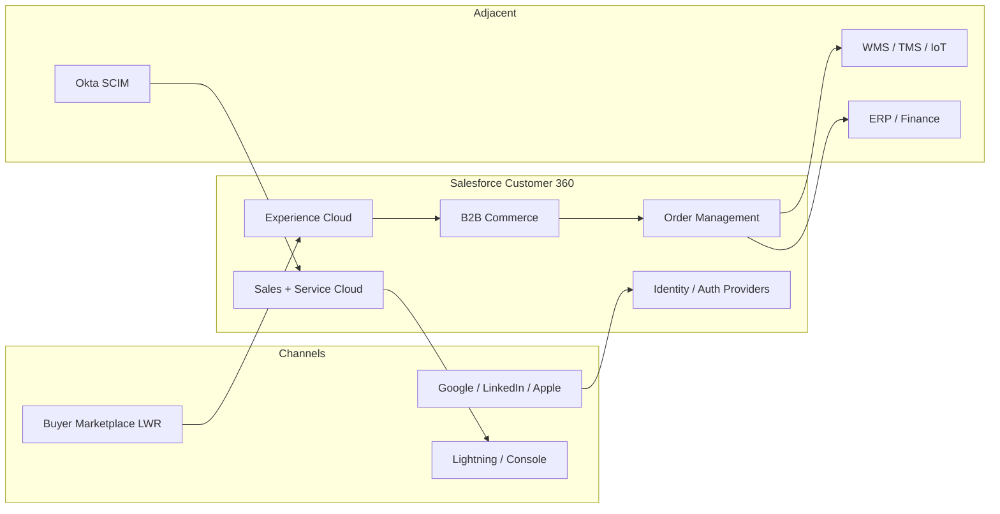

# FreshSource Global — Buyer Experience Architecture

**Scope:** Micro-buyer registration, fulfillment pricing and service tiers, and customer authentication (social identity).  
**Audience:** Salesforce architects, identity/security, commerce merchandising, and delivery leads.  
**Platform stance:** Salesforce is the system of engagement for identity, catalog, cart, checkout, and operational CRM. Prefer out-of-the-box (OOTB) Salesforce products. Customize only where perishability, contracted B2B pricing, or social JIT provisioning cannot be met safely with standard features.

| Document | Contents |
| --- | --- |
| [01 — Foundation](./01-foundation.md) | Personas, licenses, sites, data model, sharing/security |
| [02 — Requirements](./02-requirements.md) | End-to-end design for registration, pricing/tiers, and social login |
| [03 — Traceability](./03-traceability-and-references.md) | OOTB vs custom matrix, scale, risks, Salesforce documentation |

---

## 1. Scenario in one paragraph

FreshSource Global (FSG) is a farm-to-table distributor and cold-chain logistics provider across North America, LATAM, and EMEA (14 time zones, ~50,000 orders/day, ~8,000 supplier farms). It sells to **1,200 enterprise parents** (restaurant chains, hotels, university dining) whose **~150,000 branch chefs** order on contracted catalogs with volume rebates, and to **direct B2B micro-buyers** (cafés, caterers, food trucks) who place one-off wholesale orders. Quality & Compliance officers inspect perishable lots and regional distribution centers (RDCs). This pack designs the buyer-facing Salesforce solution for micro-buyer onboarding, service-tier pricing, and social authentication, in the context of that enterprise model.

---

## 2. Recommended product stack

| Layer | Product (OOTB) | Why this, not that |
| --- | --- | --- |
| Org | Single **Hyperforce** production org, Enterprise/Unlimited | One identity, one catalog, one sharing model. Split-org by region only if residency law requires it. |
| Buyer UX | **Experience Cloud LWR** + **B2B Commerce** (Commerce Cloud B2B Advanced) | Wholesale accounts, buyer groups, entitlement policies, and storefront on the core platform. B2C Commerce / SLAS is the wrong shopper model. |
| Catalog & cart | B2B Commerce `WebStore`, `Product2`, `WebCart` | OOTB storefront objects documented in the [B2B Commerce data model](https://developer.salesforce.com/docs/commerce/salesforce-commerce/guide/b2b-b2c-dev-data-model.html). |
| Pricing | `Pricebook2` + Buyer Groups + `PriceAdjustmentSchedule` + **Commerce Pricing Service** | Contracted and volume prices without cloning catalogs. Extend `PricingService` / `ShippingCartCalculator` only for temperature and urgency. |
| Contracts / rebates | **Sales Cloud Contract** + optional **Revenue Cloud** pricing procedures | Master agreements and period-end rebates live on CRM; checkout uses the contracted price book. |
| Fulfillment | **Salesforce Order Management** | `OrderSummary`, `FulfillmentOrder`, `Shipment`, `Invoice` for tracking and invoice history. |
| Identity | **Salesforce Identity** Auth Providers + Experience Cloud Login & Registration | OOTB Google / LinkedIn / Apple social login. Custom `Auth.RegistrationHandler` for JIT buyer provisioning. |
| Internal staff | Okta (or Entra ID) **SAML 2.0 + SCIM** into Salesforce | Quality officers and FSG employees are not Experience Cloud users. |
| Scale / telemetry | **Data Cloud** + **Salesforce Connect** | Cold-chain pings and historical invoices must not become high-volume custom objects. |

**Not recommended as primary for this use case:** B2C Commerce + SLAS (consumer shopper identity), Person Accounts as the default micro-buyer model (these are businesses), and Apex as the 50k-order/day allocation engine.

---

## 3. Design principles

1. **OOTB first.** Account hierarchy, Buyer Groups, Entitlement Policies, Price Books, Order Delivery Methods, Sharing Sets, Delegated External User Administration, and Auth Providers exist to solve this scenario. Custom objects and Apex are extensions, not replacements.
2. **Two buyer motions, one storefront family.** Enterprise contracted buyers and micro-buyers share catalog and OMS objects, and are separated by Account record type, Buyer Group, license, and sharing — not by a second CRM.
3. **Branch isolation is a sharing problem, not a custom ACL.** A branch admin manages users on **their branch Account only**, using OOTB delegated administration.
4. **Hot vs cold data.** Open orders and 90-day history live on standard Order Management objects. Telemetry and deep invoice history are virtualized or archived.
5. **Identity follows persona.** Social login is for micro-buyers only. Enterprise buyers use corporate email / IdP. Internal users use Okta.

---

## 4. Requirement coverage at a glance

| ID | Requirement | Primary OOTB | Custom (justified) |
| --- | --- | --- | --- |
| R1 | Micro-buyers register, browse regional produce, order, track cold-chain, view invoices | B2B self-registration pattern, guest browse, Buyer Groups, Order Summary / Shipment APIs, Invoice | Registration LWC + Apex to create Account + `BuyerAccount` + Buyer Group; tracking LWC for IoT overlays |
| R2 | Three fulfillment tiers; price by weight, temperature, urgency, contract discounts | `OrderDeliveryMethod`, Price Books, Buyer Groups, `PriceAdjustmentSchedule` | `ShippingCartCalculator` and optional `PricingService` extension |
| R3 | Micro-buyers log in with Google, LinkedIn, Apple ID | Auth Providers + Experience Cloud login page | `Auth.RegistrationHandler` (+ optional `ConfirmUserRegistrationHandler`) |

Read [02 — Requirements](./02-requirements.md) for sequence diagrams, object maps, and implementation steps for each.
