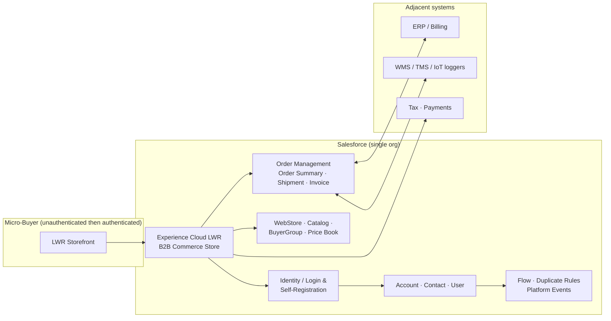
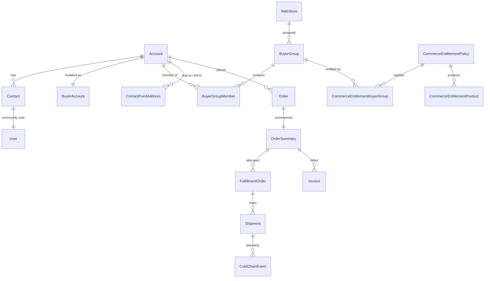
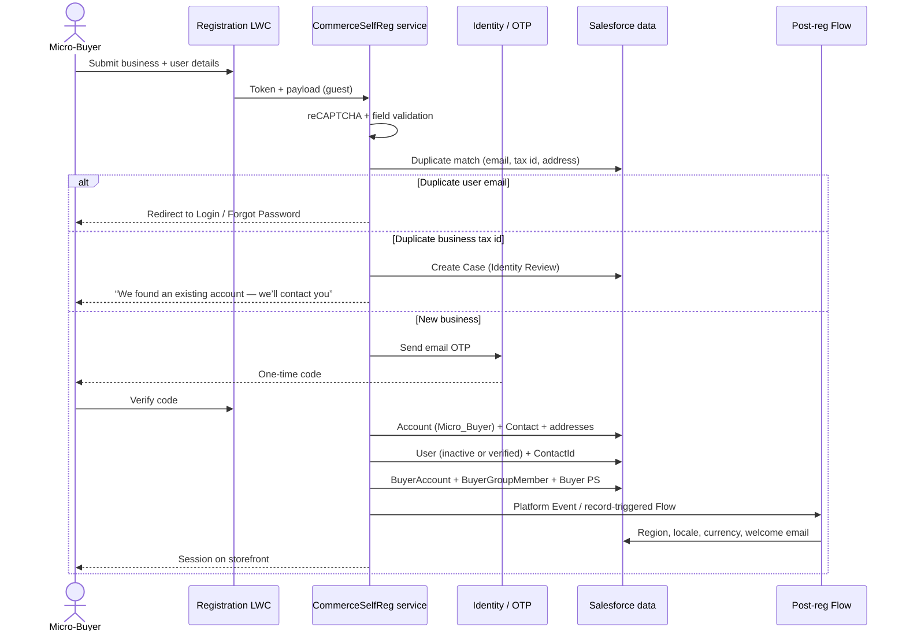
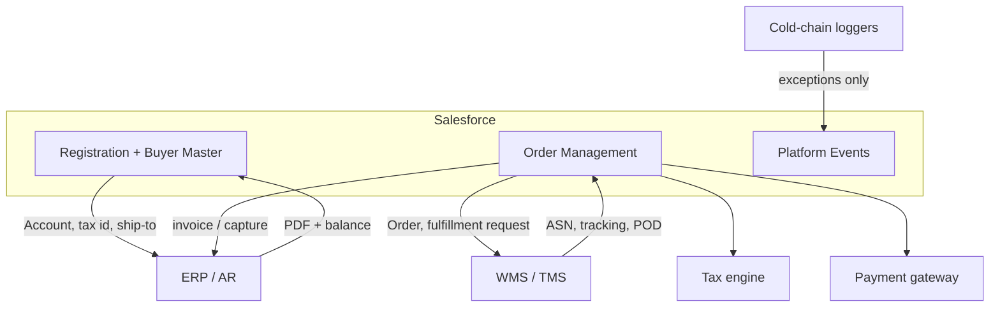

# FreshSource Global — Requirement 1.3  
# Micro-Buyer Registration: End-to-End Salesforce Solution

**Persona:** Salesforce Architect  
**Audience:** FSG solution, security, commerce, and integration stakeholders  
**Scope:** Independent caterers and small-business owners register on the platform to browse regional produce, place wholesale orders, track cold-chain deliveries, and view historical invoices.  
**Guiding principle:** Prefer Salesforce out-of-the-box (OOTB) capabilities; introduce custom code only where B2B Commerce, identity, food-safety, or scale requirements exceed standard configuration.

---

## 1. Executive recommendation

Implement Micro-Buyer Registration as a **self-service B2B Commerce onboarding journey** on an Experience Cloud LWR storefront, not as a generic Customer Portal sign-up.

Each Micro-Buyer becomes its own **Business Account + Contact + Experience Cloud User + Buyer Account**, automatically entitled to a **regional wholesale catalog**. Do **not** attach all self-registered users to a single default Account. That Trailhead-style pattern is valid for simple portals; it breaks B2B Commerce pricing, sharing, invoices, and credit controls.

| Capability after registration | Primary Salesforce product |
| --- | --- |
| Register, verify identity, log in | Experience Cloud + Identity |
| Browse regional produce | B2B Commerce catalog, Markets, Buyer Groups, Entitlement Policies |
| Place wholesale orders | B2B Commerce cart/checkout + Buyer Account limits |
| Track cold-chain deliveries | Salesforce Order Management shipments + controlled custom events |
| View historical invoices | Order Management Invoice (or ERP invoice PDF on the Account) |

**Licensing split vs Enterprise Accounts (intentional):**

- **Micro-Buyers:** Customer Community (or Customer Community Login) + B2B Buyer permission set. High-volume model. Sharing Sets. No delegated user administration.
- **Enterprise branch admins (separate requirement):** Customer Community Plus + Buyer Manager, because one branch user must manage other users **only in that branch**.

This follows Salesforce B2B Commerce license guidance: a Customer Community license is the minimum for a buyer; Customer Community Plus (or higher) is required when a buyer must access other buyers, use role-based sharing, or act as a buyer manager.

---

## 2. Requirement interpretation

### 2.1 Who is registering

| Attribute | Design implication |
| --- | --- |
| Independent caterers, cafés, food trucks | B2B legal entity, not a consumer shopper |
| One-off wholesale orders | Fast onboarding; conservative credit; list/wholesale price books, not contracted enterprise pricing |
| Operate across NA / LATAM / EMEA, 14 time zones | Region, locale, currency, tax, and ship-to captured at registration |
| Distinct from 1,200 enterprise accounts / 150k branch buyers | Separate Account Record Type, profile, buyer groups, and price books |

### 2.2 What “registration” must unlock

Registration is not complete when a User record exists. The journey is complete only when the buyer can:

1. Authenticate on the FSG storefront.
2. See **only** produce entitled to their region and buyer segment.
3. Place a wholesale order against their own Account.
4. See their deliveries (including cold-chain status).
5. See their invoices (current and historical).

### 2.3 Non-goals for 1.3

- Enterprise contracted pricing, volume rebates, and branch user administration.
- Supplier (farm) onboarding.
- Quality & Compliance Officer internal console (they consume Micro-Buyer data; they do not register here).

---

## 3. Target platform architecture

### 3.1 Product choices (Salesforce-recommended)

| Layer | Product | Why this, not an alternative |
| --- | --- | --- |
| Digital experience | Experience Cloud **LWR** B2B store | Salesforce’s current B2B storefront; better performance than Aura for catalog/cart at FSG volume |
| Commerce | **B2B Commerce** (Lightning) | Account-centric wholesale buying, buyer groups, entitlement, credit limits. B2C Commerce (SFCC) is the wrong buyer model. |
| Identity | Experience Cloud Login & Registration + email OTP | Salesforce recommends verifying email/phone **before** creating the user to reduce dummy accounts |
| CRM backbone | **Business Account + Contact + User** | Salesforce identity guidance: User → Contact → Account. Person Accounts are optional for sole proprietors, but a mixed Person/Business model fights the 150k enterprise-buyer org. |
| Fulfillment & invoice system of engagement | **Salesforce Order Management** | Order Summary is the buyer-facing system of record after checkout; shipments and invoices hang off it |
| Integration | MuleSoft / named credentials + Platform Events | ERP invoices, WMS ASNs, logger telemetry |
| Optional later | Data Cloud identity resolution | Merge a Micro-Buyer that later becomes an enterprise location |

### 3.2 Store topology for 14 time zones

Salesforce allows multiple stores for different business areas or regions. A store has one catalog; a catalog may serve multiple stores. Markets control locale, currency, and ship-to country.

**Recommended topology:**

| Store | Serves | Catalog strategy |
| --- | --- | --- |
| FSG North America | US, CA, MX as required | Shared global catalog or NA catalog |
| FSG LATAM | LATAM operating countries | Same Product2 master; regional entitlement |
| FSG EMEA | EMEA operating countries | Same Product2 master; regional entitlement |

Use **one org**. Split stores for tax, currency, legal, and fulfillment boundaries—not for the Micro-Buyer vs Enterprise persona. Both personas shop the same regional store with **different Buyer Groups**.

If FSG later standardizes on Markets inside fewer stores, keep Buyer Groups as the entitlement engine either way. Do not encode region only in custom Apex if Markets + Buyer Groups can express it.

---

## 4. Persona, license, and profile design

### 4.1 External personas touching 1.3

| Persona | License | Profile (cloned, never standard) | Permission sets |
| --- | --- | --- | --- |
| Guest (pre-login) | Site Guest User | FSG Micro-Buyer Store Guest | None beyond registration Apex/Flow |
| Micro-Buyer | Customer Community or CC Login | FSG Micro-Buyer | B2B Buyer (+ store member PS) |
| Enterprise Buyer | Customer Community Plus | FSG Enterprise Buyer | B2B Buyer |
| Enterprise Branch Admin | Customer Community Plus | FSG Enterprise Buyer Manager | B2B Buyer Manager / delegated admin |
| Quality & Compliance Officer | Salesforce Platform / internal | Internal | OM + custom compliance app |

Clone every external profile. Salesforce Trailhead and Help both treat cloned external profiles as a security baseline.

### 4.2 Why Customer Community for Micro-Buyers

Salesforce B2B Commerce documentation:

- Buyer users: Customer Community is the **minimum** license for B2B Commerce features.
- Buyer managers / users who must access other buyers: Customer Community Plus or higher.

Micro-Buyers:

- Typically one (maybe two) users per small business.
- Must see **only their** orders and invoices.
- Must **not** manage other users (that is an Enterprise-only rule).

Sharing Sets match `User.AccountId` → `Account.Id` and related Orders / Order Summaries. That is exactly the high-volume model Salesforce recommends when everyone in the company should see the same Account-scoped records.

Use **Customer Community Login** if many Micro-Buyers are infrequent (true one-off wholesale). Use **member** licenses if a large cohort orders weekly. Confirm SKU mix with Salesforce; do not assume Commerce order volume SKUs include Experience Cloud user licenses.

---

## 5. Canonical data model

### 5.1 Standard objects (OOTB — use these first)

| Object | Role for Micro-Buyers |
| --- | --- |
| `Account` (Record Type **Micro_Buyer**) | Legal buying entity. Segment, region, tax ID, cold-chain receiving flag |
| `Contact` | Named person who registered |
| `User` | Experience Cloud login |
| `BuyerAccount` | Enable as buyer; credit / order limits |
| `BuyerGroup` / `BuyerGroupMember` | Wholesale + regional entitlement |
| `CommerceEntitlementPolicy` | Which SKUs and whether prices are visible |
| `Pricebook2` / `PricebookEntry` | Micro-Buyer wholesale list (not enterprise contract book) |
| `WebStore` | Regional storefront |
| `Product2` / `ProductCatalog` / `ProductCategory` | Produce catalog |
| `ContactPointAddress` | Default ship-to used for region and checkout |
| `WebCart` / `CartItem` | Checkout |
| `Order` / `OrderSummary` | Placed order + lifecycle |
| `FulfillmentOrder` / `Shipment` | Delivery tracking |
| `Invoice` (Order Management) | Invoice header after fulfillment/capture |
| `DuplicateRule` / `MatchingRule` | Prevent duplicate businesses and emails |

### 5.2 Account fields (custom — additive)

Keep custom fields on Account/Contact, not a parallel “MicroBuyer__c” object. Salesforce sharing, commerce, and identity all key off Account.

| API name (illustrative) | Type | Purpose |
| --- | --- | --- |
| `Customer_Segment__c` | Picklist | Micro_Buyer / Enterprise / Supplier |
| `Business_Type__c` | Picklist | Cafe, Caterer, Food Truck, Other |
| `Tax_Identifier__c` | Text (unique external id where legally allowed) | Duplicate match + finance |
| `Registration_Status__c` | Picklist | Email_Verified, Active, Compliance_Hold, Suspended |
| `Service_Region__c` | Picklist / lookup | NA-East, NA-West, LATAM-MX, EMEA-UK, … |
| `Operating_Country__c` | Country | Market / tax / ship-to |
| `Has_Refrigerated_Receiving__c` | Checkbox | Entitlement to certain perishable SKUs |
| `Preferred_Locale__c` | Locale | UI language |
| `Preferred_Currency__c` | Currency | Store/market alignment |

### 5.3 Custom objects (only where OOTB is silent)

| Object | Why custom |
| --- | --- |
| `Cold_Chain_Event__c` | Salesforce has Shipment, not a temperature-event journal. Lookup to `Shipment` / `FulfillmentOrder`. Fields: timestamp, sensor id, temp, unit, zone, exception flag. |
| `Regional_Assortment_Map__c` (optional metadata) | If merchandisers need a maintainable region→buyer-group map without deploying Apex. Prefer Custom Metadata `FSG_Region_Buyer_Group__mdt` if the map is configuration, not transactional data. |

Do **not** custom-build catalog, cart, order, or user objects.

---

## 6. Registration experience — OOTB vs custom

Salesforce documents three registration styles. FSG should combine them, not pick only the Trailhead default.

| Approach | What Salesforce provides | Fit for FSG | Decision |
| --- | --- | --- | --- |
| **A. Standard Login & Registration self-reg** | Enable self-reg, default profile, default Account, limited fields | Too little company/tax/region data; default Account is wrong for B2B | Use only as the **site switch** (Allow self-register = on) |
| **B. Configurable Self-Reg + email/SMS OTP** | Collect identifier, send one-time code, create user only after verify | Required anti-abuse control | **Use** for verification |
| **C. Experience Cloud Flow self-reg** | Screen Flow in system context creates Account/Contact/User | Admin-maintainable, good for extra fields | Use for **post-verify orchestration** if logic stays declarative |
| **D. B2B Commerce custom self-reg (LWC + Apex)** | Official pattern: `CommerceSelfRegistrationController` creates Account, User, BuyerAccount, default Buyer Groups, permission set | Required commerce provisioning | **Use** as the provisioning service |

**Selected design:** D for commerce provisioning, B for identity proofing, C (or the same Apex) for regional assignment and duplicate handling.

### 6.1 Storefront UX (LWR)

Public pages (Guest):

- Home / regional landing (optional guest browse without price, or price hidden).
- Login.
- **Register** (custom LWC on the Self-Registration page).
- Privacy / terms (food wholesale terms, data processing).

Authenticated pages (OOTB B2B template, then extend):

- Catalog / PDP / search.
- Cart / checkout.
- Order history (`Order Summary`).
- Order detail + shipment tracking + cold-chain timeline.
- Invoices.

Salesforce Help: enable self-registration so customers create an account and log in instead of remaining guests; optionally enable guest browsing.

### 6.2 Registration form fields

| Field | Required | Source |
| --- | --- | --- |
| First name, last name | Yes | User + Contact |
| Work email | Yes | Username + verification |
| Password + confirm | Yes | Password auth (SSO not expected for micro-buyers) |
| Mobile (optional) | No | Alternate OTP / delivery SMS |
| Legal business name | Yes | Account.Name |
| Business type | Yes | Custom |
| Tax / VAT / EIN | Conditional by country | Custom + duplicate key |
| Country, postal code, city, street | Yes | Billing + default `ContactPointAddress` (Shipping) |
| Can receive refrigerated deliveries | Yes | Entitlement input |
| Locale / language | Default from geo | User.LocaleSidKey, LanguageLocaleKey |
| Accept terms | Yes | Custom checkbox + timestamp |

CAPTCHA: add Google reCAPTCHA on the LWC and **validate the token in Apex** before DML. Salesforce’s guest-user guidance treats unauthenticated self-reg as a hardening hotspot.

### 6.3 End-to-end sequence

### 6.4 Provisioning steps (mirrors Salesforce `CommerceSelfRegistrationController`)

The official B2B sample controller:

1. Creates the user/account.
2. Reads default Buyer Group IDs from `CommerceConfigRelatedRecord`.
3. Adds the buyer to those groups.
4. Assigns the store permission set group asynchronously.

FSG extends that contract:

| Step | OOTB | FSG extension |
| --- | --- | --- |
| 1. Verify email OTP | Configurable Self-Reg / `UserManagement.verifySelfRegistration` | Mandatory before insert |
| 2. Create Account | Sample controller creates an Account | Record Type `Micro_Buyer`; owner = dedicated integration/owner user (guest must never own records) |
| 3. Create Contact | Yes | Email unique; match existing Contact only if **no** User and **no** conflicting Account |
| 4. Create User | Yes | Profile `FSG Micro-Buyer`; timezone from country mapping; `FederationIdentifier` = email |
| 5. `BuyerAccount` | Enable buyer | Low `CreditLimit` / `CurrentOrderLimit` until finance reviews |
| 6. Buyer Groups | Default groups from store config | Plus regional group from country/postal + refrigerated-receiving group |
| 7. Permission set | Store Buyer PSG | Buyer only — **not** Buyer Manager |
| 8. Addresses | Often omitted in samples | Create default Shipping `ContactPointAddress`; required for checkout and region |
| 9. Welcome | Site “Welcome New Member” email | Plus Flow email with region and “how to order” |

**Owner of records created from guest context:** Salesforce guest-user security policy: the site guest user must never own records. Run creation in system context and assign Account/Contact OwnerId to `FSG_MicroBuyer_Integration` (a real internal user). Enable **Secure guest user record access** (already enforced). Grant the guest profile **only** the registration Apex class / Flow — no unrelated Apex, no broad object CRUD.

### 6.5 Duplicate and identity rules

| Check | Mechanism | Outcome |
| --- | --- | --- |
| Email already a User | SOQL on `User` (username/email) in handler | Block; “Log in or reset password” |
| Email already a Contact under a Micro-Buyer Account with no User | Handler reuse Contact | Create User on existing Contact (account recovery) |
| Tax ID + country match | Matching Rule + Duplicate Rule on Account | Do **not** auto-join. Create Case. Prevents a food truck from attaching itself to another buyer’s invoices. |
| Fuzzy business name + postal | Matching Rule, allow report (not block) | Stewardship queue for Compliance |

Salesforce duplicate rules can block the insert and surface an error the handler catches. Still query explicitly in Apex; do not rely on the user seeing a raw duplicate-rule message.

Enterprise conversion path (later): if a café is acquired by a hotel group, Compliance merges Account or converts Record Type. Data Cloud identity resolution is optional for this.

### 6.6 Approval policy (food wholesale)

Fully manual approval of every café would kill conversion. Fully unconstrained activation would create credit and compliance risk.

**Recommended hybrid (declarative):**

| State | Buyer can | Controls |
| --- | --- | --- |
| `Email_Verified` / `Active` (default) | Browse regional catalog, place orders up to BuyerAccount limits | Default wholesale entitlement |
| `Compliance_Hold` | Browse, no checkout (or checkout blocked in Flow) | Used when tax ID fails format, sanctioned country, or duplicate suspected |
| Restricted SKU set | Always | Entitlement Policy “Requires refrigerated receiving” only if checkbox is true |

Use a record-triggered Flow on Account to open a **Case** (Record Type Compliance) for holds. Quality & Compliance Officers work those Cases internally. Do not put an Approval Process on the guest path.

---

## 7. After login — how registration unlocks the four outcomes

### 7.1 Browse available regional produce

**OOTB**

- `ProductCatalog` associated to the regional `WebStore`.
- `BuyerGroup` ↔ `CommerceEntitlementPolicy` (`CanViewProduct`, `CanViewPrice`).
- Price books on the Buyer Group (Micro-Buyer wholesale), not the enterprise contract book.
- Commerce Search indexes locales assigned to the store/markets.
- Markets: locale, currency, ship-to country. Salesforce Help: if a market is assigned, store defaults for language/ship-to/price book/currency are not used the same way; entitlement policies on the **market** take precedence over buyer-group entitlements in that model. Pick **either** Market-centric **or** Buyer-Group-centric entitlement per store and document it. For FSG perishable assortment, **Buyer Groups remain the primary control** unless merchandising adopts Markets globally.

**Custom (justified)**

- **Buyer Group Extension** (`CommerceBuyGrp.BuyerGroupEvaluationService`): Salesforce OOTB assigns groups by account membership, market, or data segment. FSG needs **shipping country / region / refrigerated receiving** evaluated at storefront request time. Enable Buyer Group Extension on the store’s Buyer Access tab and return regional group IDs (call `super.getBuyerGroupIds` then add regional IDs; respect org buyer-group count limits).
- Persist the same groups as `BuyerGroupMember` at registration so reporting and merchandising stay consistent even if the extension is disabled.

Guest browse: allow category browsing if marketing wants it; **hide prices** (`CanViewPrice = false` for guest policy) and disable cart until login. Salesforce recommends Default External Access **Private** on Product so authenticated users cannot SOQL products across stores.

### 7.2 Place wholesale orders

**OOTB**

- LWR cart and checkout.
- `BuyerAccount` credit and order limits (B2B-specific).
- Tax and payment providers configured on the store.
- Checkout creates `Order` → Order Management creates `OrderSummary`.

**Custom (justified)**

- Checkout extension or Flow: reject ship-to outside the entitled region.
- Minimum order value for wholesale (Custom Field + validation in checkout extension).
- No contracted rebate engine for this segment.

### 7.3 Track cold-chain deliveries

**OOTB**

- Buyer order history via Commerce Order Summary APIs / LWR Order History (authenticated only; guests get 403/404).
- Shipment API: `GET` webstore order shipments and shipment items (authenticated buyers).
- FulfillmentOrder status updates from WMS (ASN → Shipment, status Fulfilled).

**Custom (justified)**

- `Cold_Chain_Event__c` related to Shipment.
- Inbound: Platform Event `Cold_Chain_Telemetry__e` from MuleSoft/IoT; Flow/trigger writes events and sets `Shipment.Cold_Chain_Status__c` (OK / Excursion / Unknown).
- LWR LWC on Order Detail: timeline of temperature samples + exception banner.
- Alert: Flow emails the buyer and creates a Case for Quality & Compliance Officers on excursion.

Do not store high-frequency logger samples in Salesforce if the device emits per-minute data at 50k orders/day. Keep Salesforce as **exceptions + latest status + link to historian**; persist dense telemetry in the WMS/IoT store.

### 7.4 View historical invoices

**OOTB path (preferred)**

- Order Management creates **Invoice** after fulfillment/capture.
- Storefront Order Detail shows paid/invoiced amounts from Order Summary.
- Files: generate invoice PDF (OM or ERP) and attach to Account or Order Summary. Community users with Account access via Sharing Set can see Files on that record.

**If finance remains on ERP**

- MuleSoft upserts invoice PDF + metadata (`Invoice_Number__c`, `Invoice_Date__c`, `Balance__c`) onto the Account or a thin `External_Invoice__c` with Account lookup.
- Sharing Set on that custom object (Account lookup) if Invoice itself is not sharing-set supported for Customer Community.

**Sharing note:** Sharing Sets support Account, Order, OrderSummary, and other listed objects. Confirm Invoice in the org’s sharing-set catalog during build. If Invoice is missing, do not upgrade every Micro-Buyer to CC+ solely for invoice sharing—attach PDFs to Account instead.

Historical backfill: Order Management supports importing historical orders; invoice PDFs for pre-go-live history should load as Files, not as fake live OM invoices, unless finance agrees.

---

## 8. Security, sharing, and guest hardening

Follow Salesforce guest-user and Experience Cloud identity guidance.

### 8.1 Organization-wide defaults (external)

| Object | External OWD | How Micro-Buyers get access |
| --- | --- | --- |
| Account | Private | Sharing Set: User.Account = Account.Id (Read) |
| Contact | Private | Sharing Set / implicit via Account |
| Order | Private | Sharing Set via Account |
| OrderSummary | Private | Sharing Set via Account |
| Product2 | **Private** (Salesforce commerce recommendation) | Entitlement, not sharing |
| BuyerAccount / cart | Per commerce setup | Buyer context |
| Cold_Chain_Event__c | Private | Sharing Set via Account lookup or parent Shipment if supported; else `without sharing` selector in an Apex class **with** CRUD/FLS and Account match |
| Invoice / Files | Private | Parent Account or Order Summary |

Internal users (Compliance, Customer Support): Share Groups for high-volume community-owned records, plus role-based internal sharing. Share Groups apply to high-volume (Customer Community) owners; they are not used for CC+.

### 8.2 Guest profile (must stay near zero)

- Enable **Secure guest user record access** (enforced).
- No guest sharing rules except what public CMS/content requires.
- Apex allowlist: registration controller + reCAPTCHA validator only.
- If using Flow, grant **that Flow only**; run in system context without sharing **only** for the create-user path, with a named owner.
- Disable guest access to unused objects, Aura unauthenticated API if not required, and public list views.
- Site guest user is never record owner.

### 8.3 Authenticated Micro-Buyer profile

- CRUD only on objects required to shop and view their orders.
- FLS: no enterprise rebate, contract, or cost fields.
- No “Manage External Users” / delegated administration.
- Password + email verification; MFA optional at this segment (enable if wholesale fraud is material).
- Session timeout appropriate for kitchen environments (not overly aggressive).

### 8.4 Store membership

Add the Micro-Buyer profile and Buyer permission set to the store community members. Salesforce: only users whose profile or permission set is a store community member can access the store.

---

## 9. Automation catalog

| Automation | Type | When | What |
| --- | --- | --- | --- |
| Registration service | Apex (guest-callable) | Submit + OTP | Validate, de-dupe, provision |
| Assign permission set | `@future` / Queueable | After User insert | Same as Salesforce sample (mixed DML) |
| Regional entitlement | Record-triggered Flow on Account | After insert/update of country/region | Set `Service_Region__c`, create `BuyerGroupMember` |
| Buyer Group Extension | Apex domain extension | Each storefront visit | Overlay regional groups |
| Welcome / password | OOTB site email | New member | Welcome New Member |
| Compliance Case | Flow | Duplicate or hold | Route to Compliance queue (region-based) |
| Credit limit default | Flow | BuyerAccount created | Set conservative limits by country |
| Cold-chain excursion | Platform Event → Flow | Telemetry | Update shipment + Case + optional buyer email |
| Invoice PDF sync | MuleSoft | ERP invoice posted | File on Account/Order Summary |

Keep the registration Apex **bulk-safe** even though the UI sends one payload; Platform Events and future enterprise batch loads will reuse services.

---

## 10. Integration architecture

| Integration | Pattern | Notes |
| --- | --- | --- |
| Tax ID / VAT format | Declarative validation + optional callout | Do not block all countries on one regex |
| Payments | Salesforce Payments / named PSP | Card + invoice-later only if BuyerAccount allows |
| ERP customer | Async after Account Active | Send Account Number; store External Id |
| WMS | After OrderSummary created | FulfillmentOrder by regional DC (`Location` / Location Group) |
| Logger | Event-driven | Salesforce stores status + exceptions |

---

## 11. Scale, localization, and operations

FSG processes 50k+ orders/day across 14 time zones. Registration itself is low volume compared with cart/order, but the **identity model must not create a sharing or duplicate-data problem** that later explodes at order volume.

| Concern | Practice |
| --- | --- |
| Storefront performance | LWR, Commerce Search, CDN, image optimization (Salesforce B2B performance guidance) |
| Time zones | `User.TimeZoneSidKey` from country/postal mapping at registration; all date-times stored UTC |
| Languages | Store/market locales; Experience Cloud translations for registration LWC custom labels |
| Mixed DML | Permission set assignment async (Salesforce sample) |
| Buyer group limits | Stay under org limits; prefer a small set of regional groups over one group per postal code |
| High-volume users | Customer Community + Sharing Sets + Share Groups for internal visibility |
| Logging | No PII in debug logs; store registration errors on a private `Registration_Log__c` if needed |

---

## 12. OOTB vs custom — decision summary

| Requirement slice | OOTB | Custom |
| --- | --- | --- |
| Site, login, self-reg switch, welcome email | Experience Cloud Administration | — |
| Email OTP before user create | Configurable Self-Reg / Identity | — |
| Account + Contact + User + BuyerAccount + default Buyer Groups + Buyer PS | B2B Commerce self-reg controller pattern | Extend controller for FSG fields |
| Captcha, tax ID, region, refrigerated receiving | — | Registration LWC + Apex |
| Duplicate email / tax ID | Matching & Duplicate Rules | Handler branching (block vs Case) |
| Record owner from guest context | Guest cannot own records | Set internal owner in Apex/Flow |
| Regional catalog & price | Buyer Groups, entitlement, price books, optional Markets | Buyer Group Extension by ship-to |
| Browse / cart / checkout | B2B LWR | Min-order / region ship-to checks |
| Order history & shipments | OM + Commerce Order Summary & Shipment APIs | — |
| Cold-chain temperature journal | Shipment status only | `Cold_Chain_Event__c` + Platform Events + LWC |
| Invoices | OM Invoice + Files | ERP PDF sync if OM is not AR system of record |
| User administration of peers | Not enabled for this profile | — (Enterprise uses CC+ later) |
| Guest hardening | Secure guest user record access, cloned profile | Apex allowlist discipline |

---

## 13. Suggested implementation sequence

1. **Org & store foundation** — Regional WebStores, catalog, entitlement policies, Micro-Buyer price book, OWD, cloned profiles, store membership, Sharing Sets, Share Groups.
2. **Identity** — Enable self-reg, OTP, password policies, branded login/register pages.
3. **Provisioning service** — Apex + LWC following Salesforce B2B self-reg; tests for duplicates, guest allowlist, mixed DML.
4. **Regional assignment** — Metadata map + Flow + Buyer Group Extension.
5. **Checkout path** — Guest cannot checkout; authenticated Micro-Buyer can; BuyerAccount limits.
6. **OM + portal** — Order history, shipment LWC, invoice Files.
7. **Cold-chain** — Event object, MuleSoft contract, excursion Flow.
8. **Hardening** — Guest user review (Salesforce guest-user checklist), pentest of register endpoint, duplicate-load test.

---

## 14. Traceability matrix

| Req. statement | Solution element |
| --- | --- |
| Independent caterers and small business owners register | Public LWR Register page; per-business Account, not a shared default Account |
| On the platform | Experience Cloud B2B store (regional WebStore) |
| Browse available regional produce | Entitlement + regional Buyer Groups (+ extension) |
| Place wholesale orders | B2B checkout, Micro-Buyer price book, BuyerAccount limits |
| Track cold-chain deliveries | OM Shipment + `Cold_Chain_Event__c` |
| View historical invoices | OM Invoice and/or ERP PDF on Account |
| Must not manage other branch users | Customer Community + Buyer PS only; no Buyer Manager |
| Distinct from enterprise contracted pricing | Separate Record Type, Buyer Group, price book |

---

## 15. Architecture decision log

| ID | Decision | Alternatives considered | Rationale |
| --- | --- | --- | --- |
| AD-1 | Business Account + Contact, not Person Account | Person Account for sole proprietors | Aligns with Salesforce B2B identity path User → Contact → Account; avoids mixed-model reporting with enterprise accounts |
| AD-2 | Customer Community for Micro-Buyers | CC+ for all external users | Salesforce minimum for B2B buyers; Sharing Sets; cheaper at volume; prevents peer-user management |
| AD-3 | One org, regional stores | One store for the world; one org per region | Tax/currency/legal boundaries without splitting the 360 view of 8,000 suppliers and 50k orders/day |
| AD-4 | Instant access after email verify, with credit limits | Manual approval of every registration | Matches “register to browse and order”; Compliance_Hold only on risk signals |
| AD-5 | Never auto-join on tax-ID match | Silent merge to existing Account | Fraud and invoice leakage risk |
| AD-6 | Custom cold-chain events, not a new OMS | Store every sensor reading in Salesforce | OM covers fulfillment; Salesforce is the exception store, not the time-series database |
| AD-7 | Custom self-reg LWC/Apex rather than standard default-Account self-reg | Trailhead default Account | Required for BuyerAccount, groups, and per-tenant sharing |

---

## 16. Salesforce documentation anchors

Use these as the implementation source of truth:

- [Implement Custom Self-Registration for a B2B Store](https://developer.salesforce.com/docs/commerce/salesforce-commerce/guide/b2b-comm-custom-self-registration.html)
- [Access to a B2B Store](https://help.salesforce.com/s/articleView?id=commerce.comm_access.htm)
- [B2B Commerce Data Model](https://developer.salesforce.com/docs/commerce/salesforce-commerce/guide/b2b-b2c-dev-data-model.html)
- [Experience Cloud User Licenses](https://help.salesforce.com/s/articleView?id=users_license_types_communities.htm)
- [Configure Self-Registration](https://help.salesforce.com/s/articleView?id=sf.external_identity_self_registration_configure.htm) (email/SMS verification before user creation)
- [ConfigurableSelfRegHandler](https://developer.salesforce.com/docs/atlas.en-us.apexref.meta/apexref/apex_interface_Auth_ConfigurableSelfRegHandler.htm)
- [Create a Sharing Set](https://help.salesforce.com/s/articleView?id=sf.networks_setting_light_users.htm)
- [Start with Accounts: Design Identity and Access That Scales](https://salesforce.com/blog/experience-cloud-identity-access-account/)
- [Protecting Your Data: Guest User Access](https://www.salesforce.com/blog/protecting-your-data-essential-actions-to-secure-experience-cloud-guest-user-access/)
- [Dynamically Assign Buyer Groups by Using Apex](https://help.salesforce.com/s/articleView?id=commerce.comm_buyer_groups_using_apex_logics.htm)
- [Considerations for Market and Buyer Group Setup](https://help.salesforce.com/s/articleView?id=commerce.comm_market_considerations.htm)
- [Commerce Order Summary APIs](https://developer.salesforce.com/docs/commerce/salesforce-commerce/guide/b2b-d2c-comm-order-summaries-apis.html)
- Trailhead: Salesforce Order Management (Order Summary, Invoice, Fulfillment, Shipment)
- Trailhead: Self-Registration in a Portal (cloned external profile; Flow access on guest profile)

---

## 17. Risks and open points for FSG business

These are product decisions, not Salesforce platform blockers:

1. **Which countries allow fully automated wholesale enrollment** vs requiring a trade license upload (File on Account + Compliance_Hold).
2. **Whether guest catalog is public** (SEO vs showing assortment to competitors).
3. **Invoice system of record** — Order Management vs ERP. The portal pattern changes only the file source, not the Account-centric sharing model.
4. **Login-based vs member Community licenses** based on order frequency of micro-buyers.

None of these change the core architecture: **verified self-registration that provisions a first-class B2B buyer Account in the correct regional entitlement context.**
