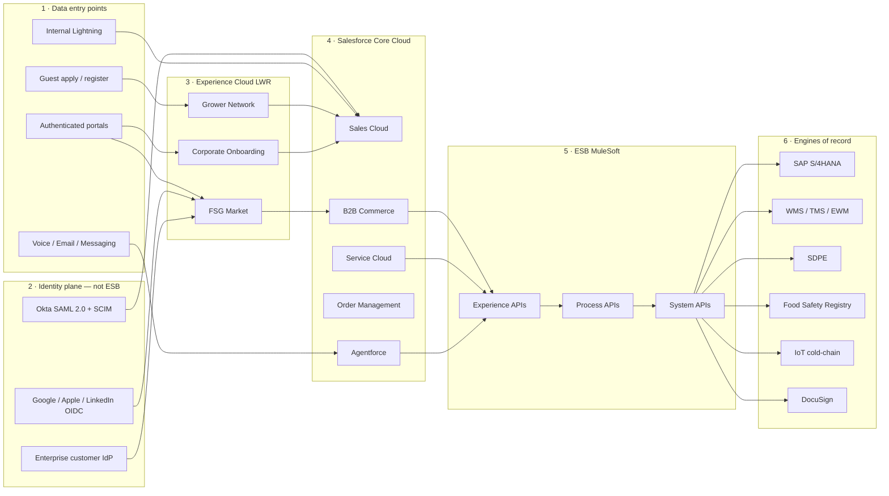
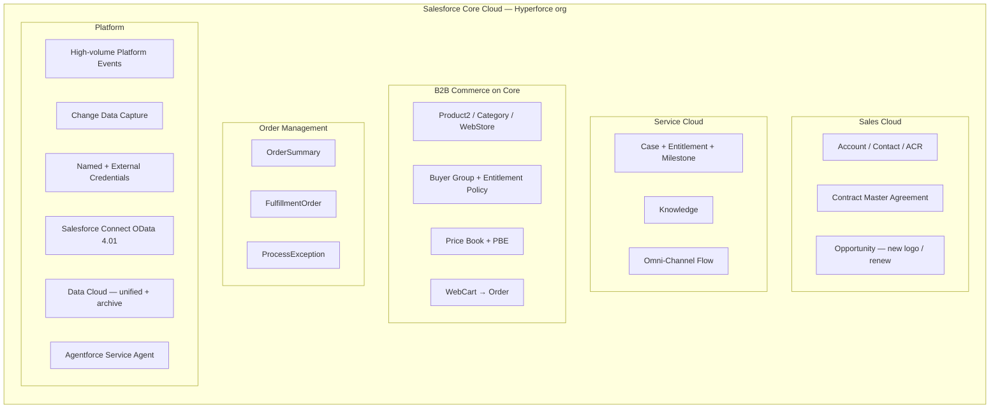
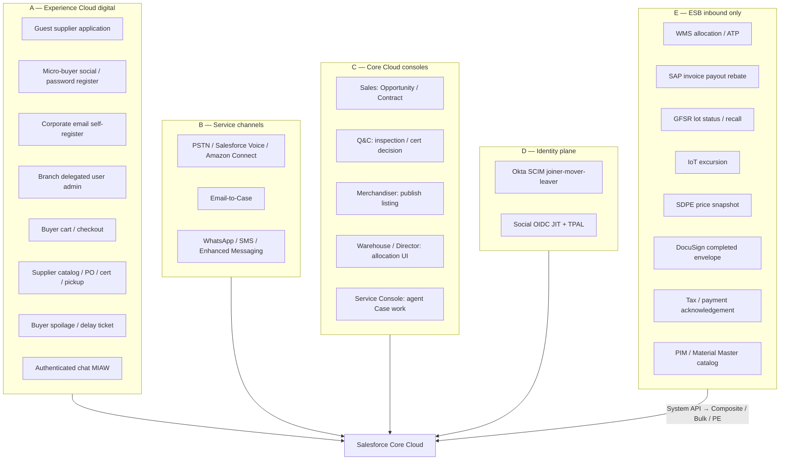
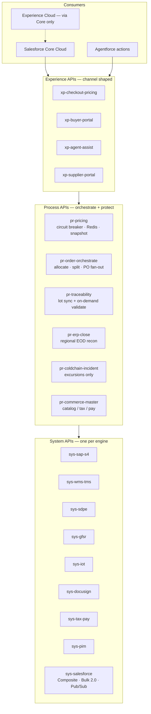
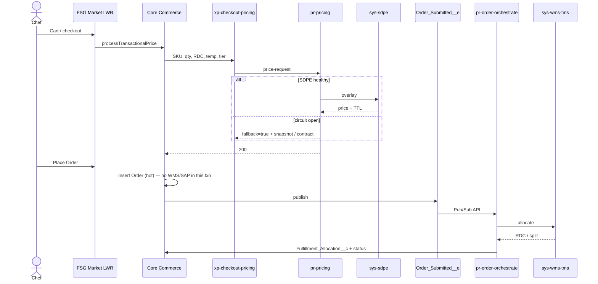
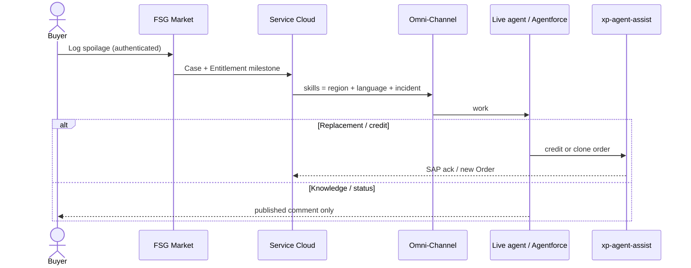

# FreshSource Global — Integration System Landscape

**Audience:** Salesforce architects, integration architects, security / IAM, delivery leadership  
**Org:** Single Salesforce Hyperforce production org  
**ESB:** MuleSoft Anypoint (API-led connectivity: Experience → Process → System)  
**Scale facts this landscape must survive:** 50,000 orders/day, ~150,000 branch buyers, 8,000 farms, 15,000 locations under one master agreement, 14 time zones

This document is the integration landscape for FreshSource Global. It highlights four things only:

1. **Salesforce Core Cloud**
2. **Experience Cloud with social media logins**
3. **Every data entry point**
4. **Every system integration, through ESB layers**

Capability-level object models, sharing, and licenses remain in the source packs listed in [README.md](./README.md).

---

## 1. Landscape at a glance



### What each plane owns

| Plane | Owns | Does not own |
| --- | --- | --- |
| **Identity plane** | Staff SSO/lifecycle (Okta); micro-buyer social OIDC; optional enterprise buyer SAML | Business records |
| **Experience Cloud** | Digital UX, login pages, guest apply, authenticated self-service | GL, inventory bins, raw IoT |
| **Salesforce Core Cloud** | Parties, contracts, catalogs-for-experience, hot orders, cases, SLAs, agent workspace | Financial ledger, bin inventory, telemetry SoR |
| **ESB (MuleSoft)** | Orchestration, transformation, resilience, observability, protocol mediation | Business records |
| **External SoR** | Finance, inventory/capacity, spoilage price, legal lots, telemetry, e-sign, tax/pay | Buyer UX, case SLA |

**Non-negotiable:** avoid point-to-point. Named Credentials in Salesforce target **MuleSoft Experience APIs**, never SAP, SDPE, WMS, or the registry directly.

---

## 2. Salesforce Core Cloud (highlighted)

Core Cloud is the operational hub. Experience Cloud and channels write into it. The ESB is the only path out to (and back from) engines of record.



### Core Cloud capabilities used as integration anchors

| Capability | Landscape role |
| --- | --- |
| **Sales Cloud** | Party master for UX (HQ → Region/Cluster → Branch, Micro-Buyer, Supplier, RDC). Contracts and rebate *summaries*. |
| **Service Cloud** | Case SoR for spoilage, delay, onboarding, fulfillment exceptions. Entitlements (enterprise 2-hour SLA). Omni-Channel skills + capacity. |
| **B2B Commerce** | Regional WebStores, Buyer Groups, cart, checkout. Pricing Service and Inventory Service **extensions** call the ESB, not Apex-to-engine. |
| **Order Management** | Managed `OrderSummary` / `FulfillmentOrder` after Place Order. Splits follow WMS allocation returned through the ESB. |
| **Agentforce + Voice** | Tier-0 on Messaging, Voice, and Email. Actions call Experience APIs with the logged-in user’s context. |
| **CDC + Platform Events** | Outbound to ESB: `Order_Submitted__e`, `Lot_Batch__c` CDC, certified-supplier changes. Never used as the IoT SoR. |
| **Salesforce Connect** | Virtualize SAP invoices, payouts, rebate actuals (`Invoice__x`, `Payout__x`). No ledger copy into CRM. |
| **Data Cloud** | Unified profile, telemetry/archive, Agentforce grounding. Raw cold-chain pings never become `CustomObject__c`. |
| **Named / External Credentials** | OAuth 2.0 client credentials to MuleSoft only. Per-domain **Salesforce Integration** users (Commerce, Service, ERP). No secrets in Apex. |

### What Core Cloud refuses to be

| Anti-pattern | Why it is rejected |
| --- | --- |
| Financial ledger / AP/AR | SAP S/4HANA is SoR; nightly recon + Connect for UX |
| Bin inventory / cold cubic capacity | WMS/EWM is SoR; ATP is a cache on the ESB |
| Raw IoT time series | Exceptions only → Case / `Cold_Chain_Alert__c` |
| Point-to-point Named Credential to SAP or SDPE | Breaks circuit-breaking, bulkhead, and secret hygiene |
| 15,000 branches directly under one HQ Account | Parent-child skew; Core uses HQ → Cluster → Branch |

---

## 3. Experience Cloud with social media logins

Experience Cloud is the **only digital data entry plane** for external people. Internal staff do not use it; they use Lightning on Core Cloud via Okta.

### 3.1 Site topology

| Site | Template | Users | Login methods | What they enter |
| --- | --- | --- | --- | --- |
| **FSG Market** (NA / LATAM / EMEA `WebStore`) | LWR + B2B Commerce | Enterprise chefs + micro-buyers | Password + MFA; **social OIDC (micro-buyers)**; corporate SAML (phase 2) | Registration, cart/checkout, order track, spoilage tickets, chat |
| **FSG Grower Network** | LWR Partner / Partner Central pattern | Farm managers (after vetting) | Password + MFA (no social) | Catalog listings, POs, pickup windows, cert files, payout status |
| **FSG Grower Network (public)** | Same site, guest | Unauthenticated applicants | None (guest) | Supplier application + certification files |
| **Corporate Onboarding** | LWR | Chefs registering with a corporate email | Email + MFA; domain validated | Self-registration onto a **branch** Account |
| **Internal** | Lightning Service Console + Commerce Workspace | FSG staff | **Okta SAML** (not Experience Cloud) | Q&C, merchandising, exceptions, omnichannel inbox |

Three regional stores share the org. That stays under the Commerce storefront cap and avoids one mega-catalog.

### 3.2 Social media logins (micro-buyers)

Social login is an **Experience Cloud Auth Provider** feature, not B2C SLAS and not Okta.

| Provider | Salesforce setup | Protocol | Notes |
| --- | --- | --- | --- |
| **Google** | Predefined Auth Provider | OIDC / OAuth 2.0 | Consumer key from Google Cloud OAuth client |
| **Apple ID** | Predefined Apple or generic OIDC to `appleid.apple.com` | OIDC (`response_mode=form_post`) | Email may be a private relay; collect a billing email on Account |
| **LinkedIn** | Predefined LinkedIn or generic OIDC | OIDC (`openid profile email`) | Staff invited later can link the same verified email |

**Registration Handler** (`Auth.RegistrationHandler`):

1. Match existing portal User by **verified email** before creating a second User.
2. Bind the IdP subject on `ThirdPartyAccountLink`.
3. JIT creates a **shell** Micro-Buyer Account (`Registration_Status__c = Pending_Profile`, BuyerAccount inactive) until tax ID / legal name is collected.
4. **Reject enterprise email domains** so a corporate Google Workspace login cannot spawn a rogue micro Account.
5. Guests never become buyers until KYC/credit completes.

Password login stays enabled so an invited staff user does not need a social account. Logged-in password users bind Google / Apple / LinkedIn via the **Existing User Linking URL**.

**Who does *not* use social login**

| Persona | Login |
| --- | --- |
| FSG employees / Q&C / agents | Okta SAML 2.0 + SCIM lifecycle into Core Cloud |
| Enterprise branch chefs | Password + MFA, or customer IdP SAML (`?community=` site URL) in phase 2 |
| Farm managers | Password + MFA after Q&C enable-as-partner (no guest self-reg to a User) |
| Integration users | No UI login (API Only) |

```mermaid
sequenceDiagram
  actor Buyer as Micro-buyer
  participant Site as FSG Market LWR
  participant AP as Auth Provider
  participant IdP as Google / Apple / LinkedIn
  participant RH as Registration Handler
  participant Core as Salesforce Core Cloud

  Buyer->>Site: Continue with Google / Apple / LinkedIn
  Site->>AP: OIDC authorize
  AP->>IdP: Consent + token
  IdP-->>AP: identity + verified email
  AP->>RH: createUser / updateUser
  alt Existing User by email or ThirdPartyAccountLink
    RH->>Core: Link TPAL; updateUser
  else New micro-buyer
    RH->>Core: Shell Account + Contact + CC Login User
    Core-->>Site: Complete business profile (tax ID)
  else Enterprise email domain
    RH-->>Site: Reject — use corporate registration
  end
```

---

## 4. All data entry points

A **data entry point** is any path that can create or update a Core Cloud record. Every path below is named so there is no side door.

### 4.1 Map



### 4.2 Catalog

| ID | Entry point | Channel | Persona | Lands on Core as | AuthN | Through ESB? |
| --- | --- | --- | --- | --- | --- | --- |
| E1 | Public farm application | Grower Network guest | Unauthenticated applicant | `Supplier_Application__c` + Files + vetting Case | Guest (hardened) | No |
| E2 | Micro-buyer registration | FSG Market | Micro-buyer owner | Account `Micro_Buyer` + Contact + User + BuyerAccount (after KYC) | **Google / Apple / LinkedIn** or password + MFA | No (identity plane) |
| E3 | Corporate chef self-register | Corporate Onboarding / Market | Chef | Contact on **branch** Account + pending User | Email domain + store code + MFA | No |
| E4 | Branch user administration | Market | Branch manager (CC+) | Additional Contact / User on same branch | Delegated External User Admin | No |
| E5 | Catalog / cart / checkout | Market LWR | Chef / micro-buyer | WebCart → Order / OrderItem / OrderSummary | Authenticated Experience user | **Pricing + ATP via ESB**; Place Order is on-core |
| E6 | Supplier self-service | Grower Network | Farm manager | `Supplier_Product__c`, pickup, cert Files, PO confirm | Partner Community | Catalog publish stays on-core; payouts **read** via ESB/Connect |
| E7 | Spoilage / delay ticket | Market Screen Flow | Authenticated buyer | Case `Perishable_Incident` + Entitlement | Experience session | No |
| E8 | In-portal conversation | Enhanced Chat (MIAW) | Authenticated buyer / farm | Messaging Session + Case | Experience session | Bot actions that need engines **yes** |
| E9 | Voice | PSTN / BYOT / Amazon Connect | Caller (Contact match) | VoiceCall + Case | Channel + Contact match | Bot actions that need engines **yes** |
| E10 | Email | Email-to-Case | Buyer / farm mailbox | EmailMessage + Case | Channel | No (unless agent action) |
| E11 | WhatsApp / SMS | Enhanced Messaging | Buyer / farm | Messaging Session + Case | Channel + opt-in | Bot actions that need engines **yes** |
| E12 | Sell Master Agreement | Lightning Sales | Strategic AM | Opportunity → Contract + Buyer Group pointer | Okta SSO | No |
| E13 | Vet farm / cert | Service Console | Q&C officer | Inspection, Certification, enable Partner User | Okta SSO | Registry **validate/register via ESB** |
| E14 | Publish regional SKU | Commerce Workspace | Regional merchandiser | Product2, PBE, `Product_Availability__c` | Okta SSO | Optional PIM inbound **via ESB** |
| E15 | Manual re-allocation | Service Console | Regional Fulfillment Director | `Fulfillment_Allocation__c` / ProcessException | Okta SSO | Confirmed capacity **via ESB** |
| E16 | Human case work | Service Console | Service agent | Case comments, replacement Order, credit | Okta SSO | Credit / invoice **via ESB** |
| E17 | Staff joiner-mover-leaver | Okta | IAM | User + Profile + PSG + Federation Id | Okta OIN REST / SCIM | **No — identity plane** |
| E18 | Social account bind | Auth Provider | Micro-buyer | User + `ThirdPartyAccountLink` | OIDC | **No — identity plane** |
| E19 | Allocation result / ATP | WMS | System | `Fulfillment_Allocation__c`, inventory cache, Order status | mTLS + OAuth | **Yes** |
| E20 | Invoices, payouts, rebate actuals | SAP S/4HANA | System | External objects + nightly recon upserts | JWT / SAP principal | **Yes** |
| E21 | Lot hold / reject / clearance | Food Safety Registry | System | `Lot_Batch__c` upsert; reject-in-transit Case | mTLS + OAuth/JWT | **Yes** |
| E22 | Cold-chain excursion | IoT platform | System | Case / `Cold_Chain_Alert__c` only | mTLS | **Yes** |
| E23 | Last-good price snapshot | SDPE | System | `Price_Snapshot__c` | mTLS | **Yes** |
| E24 | Completed signature | DocuSign | System | Files + onboarding / contract status | OAuth 2.0 | **Yes** |
| E25 | Tax quote / payment ack | Tax & payment rails | System | Cart tax snapshot, payment status | mTLS / OAuth | **Yes** |
| E26 | Sellable product projection | PIM / Material Master | System | Product2 / category (projection only) | mTLS | **Yes** |

**Explicitly not entry points**

- Browser or Experience Cloud guest calling SAP, SDPE, WMS, or the registry.
- Raw IoT pings written as Salesforce rows.
- JIT SAML creation of internal staff (Okta SCIM owns lifecycle; JIT cannot deprovision).
- Guest Case create (unauthenticated incident logging is closed).

---

## 5. ESB layers (MuleSoft API-led)

All **system** integrations traverse three ESB layers. Salesforce holds one hop: **Named Credential → Experience API**.



| Layer | Responsibility | Salesforce sees |
| --- | --- | --- |
| **Experience APIs** | Stable contracts for checkout, portal, agent, supplier. Versioned JSON. | Named Credential URLs |
| **Process APIs** | Saga / orchestration, circuit breaker, cache, bulkhead, idempotency, regional schedulers | Fallback flags, correlation ids |
| **System APIs** | Protocol and identity of each engine (OData, IDoc, gRPC, AS4, mTLS) | Nothing — Core never holds SAP/WMS/SDPE secrets |

**Why an ESB hop is mandatory at FSG volumes**

- A pure Apex callout cannot share a circuit breaker, shed 50k checkout bursts, or keep SAP credentials off the org.
- Pub/Sub API (gRPC) belongs in the ESB worker, not in a CometD client inside Salesforce.
- Regional business-day close (NA / LATAM / EMEA 02:00 local) is three schedulers on the process layer, not three Apex batches calling SAP.

---

## 6. All integrations through the ESB

| ID | Business flow | Source | Experience API | Process API | System API | Pattern | Volume class | Failure mode |
| --- | --- | --- | --- | --- | --- | --- | --- | --- |
| I1 | Spoilage / dynamic price at cart | Core Pricing extension | `xp-checkout-pricing` | `pr-pricing` | `sys-sdpe` | Request-Reply + cache | 50k+ cart/checkout/day | Circuit open → contract / `Price_Snapshot__c`; checkout never blocks |
| I2 | Place-order allocation | `Order_Submitted__e` | (Pub/Sub into ESB) | `pr-order-orchestrate` | `sys-wms-tms` | Fire-and-forget PE then RR to WMS | 50k events/day | Order stays `Pending_Allocation`; Case to Fulfillment Director |
| I3 | ATP for storefront | Commerce Inventory extension | `xp-checkout-pricing` | `pr-order-orchestrate` | `sys-wms-tms` | Cache refresh 1–5 min | Minutes cadence | “Availability updating”; safety stock |
| I4 | Supplier PO fan-out | Order allocated | `xp-supplier-portal` | `pr-order-orchestrate` | `sys-wms-tms` / `sys-sap-s4` | Async after commit | Per allocated line | Farm sees PO when WMS confirms |
| I5 | Intraday order to ERP | CDC Order / OrderItem (status ≥ Allocated) | — | `pr-erp-close` | `sys-sap-s4` | CDC streaming | 50k headers + lines | Idempotent `SAP_Doc_Number__c` |
| I6 | Regional EOD financial close | SAP + Core extract | — | `pr-erp-close` | `sys-sap-s4` + `sys-salesforce` | Batch recon | Three regional nights | Exception queue; replay by External Id |
| I7 | Invoice / payout / rebate UX | SAP | `xp-buyer-portal` / `xp-supplier-portal` | `pr-erp-close` | `sys-sap-s4` | Virtualize OData 4.01 (Connect may sit beside ESB cache) | Query-time | Empty state “finance unavailable” |
| I8 | Register lot / cert | CDC `Lot_Batch__c` / `Certification__c` | — | `pr-traceability` | `sys-gfsr` | Event-driven + data minimization | Lots, not orders | Retry; quarantine on persistent fail |
| I9 | On-demand lot validate | Checkout / Q&C | `xp-checkout-pricing` / `xp-agent-assist` | `pr-traceability` | `sys-gfsr` | Request-Reply, cache 5–15 min | Interactive | Block cross-border pick; do not fail Place Order on cache miss of domestic SKU |
| I10 | Registry hold / recall | GFSR webhook | — | `pr-traceability` | `sys-gfsr` → `sys-salesforce` | Remote call-in | Low/medium | Upsert lot; Case if reject-in-transit |
| I11 | Cold-chain excursion | IoT rule engine | — | `pr-coldchain-incident` | `sys-iot` → `sys-salesforce` | Event filter (exceptions only) | Exceptions, not pings | Case + Omni to Q&C / Logistics |
| I12 | Agent order/invoice actions | Agentforce | `xp-agent-assist` | `pr-erp-close` / `pr-order-orchestrate` | `sys-salesforce` (+ SAP/WMS as needed) | Request-Reply, user context | Conversational | Escalate to Omni-Channel |
| I13 | DocuSign pack | Q&C / Legal | `xp-agent-assist` | — | `sys-docusign` | Request-Reply | Low | Manual Files upload |
| I14 | Tax + payment | Checkout | `xp-checkout-pricing` | `pr-commerce-master` | `sys-tax-pay` | Request-Reply | Per checkout | Fail closed on payment; tax fallback per policy |
| I15 | Catalog master projection | PIM / SAP MM | — | `pr-commerce-master` | `sys-pim` → `sys-salesforce` | Batch / CDC | Catalog-sized | Merchandiser queue on mapping fail |
| I16 | Price snapshot backstop | SDPE / cache writer | — | `pr-pricing` | `sys-sdpe` → `sys-salesforce` | Bulk upsert 1–5 min | Small | Stale-until TTL; banner on storefront |

### 6.1 AuthZ on ESB hops

| Hop | Protocol | Identity |
| --- | --- | --- |
| Salesforce → Experience API | HTTPS JSON, OAuth 2.0 client credentials (External Credential) | Per-domain Integration user |
| Experience → Process → System | Internal mTLS mesh | Anypoint service identity |
| System API → SAP | OData / IDoc, SAP Communication Arrangement | SAP technical user (never in Salesforce) |
| System API → WMS | HTTPS / vendor API, mTLS | WMS technical user |
| System API → SDPE | HTTPS JSON, mTLS + app credentials | SDPE application |
| System API → GFSR | HTTPS or AS4, **mTLS** + OAuth/JWT | Registry profile |
| System API → Salesforce | Composite / Bulk 2.0 / Pub/Sub, JWT bearer | Salesforce Integration user, **no role** |

### 6.2 Paths that must not exist

| Forbidden | Replace with |
| --- | --- |
| Apex `Http` to SAP / SDPE / WMS / GFSR | Named Credential to Experience API |
| Experience Cloud browser callout to any engine | Apex / Commerce extension on Core → ESB |
| CometD subscriber in a Salesforce session for 50k allocations | ESB Pub/Sub API worker |
| IoT platform writing standard objects | IoT → `pr-coldchain-incident` → Case |
| Guest user with API enabled toward the ESB | Authenticated buyer / Integration user only |

---

## 7. Cross-plane sequences

### 7.1 Checkout (Core + ESB, no blocking engines)



### 7.2 Spoilage ticket (Experience entry, Core SoR, ESB only if credit/replacement needs finance)



---

## 8. Controls that the landscape depends on

| Control | Design |
| --- | --- |
| Checkout governor budget | SDPE resolved on cart; Place Order is insert-only; allocation/SAP/registry are after commit |
| Idempotency | `Idempotency-Key` on price; `SAP_Doc_Number__c` / `Supplier_PO__c.SAP_PO_Number__c` External Ids |
| Bulkhead | Pricing worker ≠ SAP batch worker |
| Regional close | NA / LATAM / EMEA 02:00 local — not a single UTC midnight |
| Data minimization | Lots store id/status/expiry/URL; PDFs stay in registry or Files on demand |
| LDV | 90-day hot Order; Connect/Big Object/Data Cloud after that; no 15k children on one HQ |
| Guest hardening | Secure Guest User Record Access; no guest Case create; no guest pricing |
| Secret hygiene | External Credentials + Permission Set mapping; SAP/WMS/SDPE secrets live in Anypoint |

---

## 9. Traceability to source packs

| Landscape claim | Source |
| --- | --- |
| Single Hyperforce org; MuleSoft as system of interaction | Enterprise architecture README + `02-system-landscape-and-integration.md` |
| Core = Sales + Service; LWR sites; OM | `FSG_ENTERPRISE_SOLUTION_ARCHITECTURE.md` §3 |
| API-led Experience / Process / System APIs | `FreshSource_Global_Salesforce_Architecture_Design.md` §4 |
| Google / Apple / LinkedIn Auth Providers + handler rules | `docs/fsg-microbuyer-pricing-auth/02-requirements.md` R3 |
| Okta SAML + provisioning; no JIT for staff | `docs/identity-user-lifecycle-okta-salesforce.md` |
| Guest farm apply → Q&C → Partner user | `docs/architecture/1.1-supplier-onboarding-management.md` |
| Corporate email self-reg; branch delegated admin | `docs/architecture/1.2-corporate-ordering.md` |
| Micro-buyer Account-per-business; social JIT shell | `docs/architecture/1.3-micro-buyer-registration.md` + microbuyer auth pack |
| Pricing extension + fallback | `02-system-landscape` §2.3.1 and SDPE 2.1 |
| WMS allocation via PE | `02-system-landscape` §2.3.4 and dispatch 1.5 |
| Voice / Email / Messaging → Agentforce | `docs/architecture/1.7-scale-support-conversational-cx.md` |
| SAP CDC + regional EOD + Connect | `docs/architecture/2.3-enterprise-erp-synchronization.md` |
| GFSR bi-directional lots | `docs/architecture/2.2-gfsr-food-safety-traceability.md` |

Where a capability pack allowed a **direct** Named Credential to SDPE or GFSR, this landscape **absorbs that hop into a System API**. The Salesforce-visible contract does not change; the ESB becomes the only protocol and secret boundary, which is the enterprise north star (“avoid point-to-point”).
