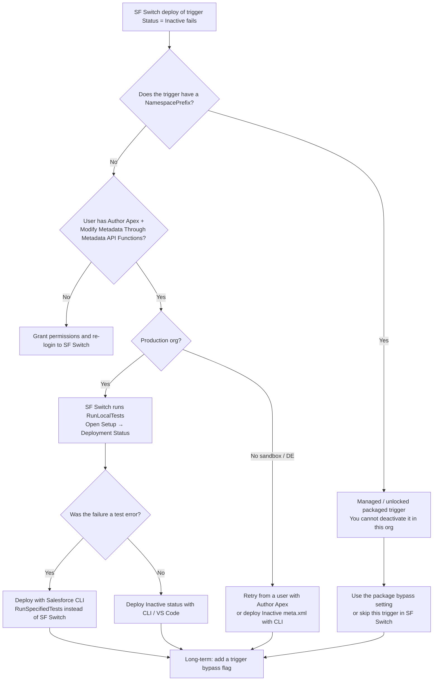

# SF Switch: “insufficient access on cross-reference id” when deactivating an Apex trigger

This is a **Salesforce platform rejection**, not a bug in the SF Switch UI. Salesforce Switch ([sfswitch](https://github.com/benedwards44/sfswitch) / Cloud Toolkit) deactivates Apex triggers by running a real **Metadata API deploy** of the trigger source plus `-meta.xml` with `<status>Inactive</status>`. Salesforce then refuses that write and returns:

`INSUFFICIENT_ACCESS_ON_CROSS_REFERENCE_ENTITY` — *insufficient access rights on cross-reference id*

The wording is generic. It does **not** mean a lookup field on a record is broken. It means the session tried to update Apex that this org/user is not allowed to modify.

Salesforce also documents that **Apex triggers cannot be deactivated through Tooling API**; only Metadata API (or a runtime bypass in your own code) is supported. See [ApexTrigger (Tooling API)](https://developer.salesforce.com/docs/atlas.en-us.api_tooling.meta/api_tooling/tooling_api_objects_apextrigger.htm).



## 1. Diagnose in 2 minutes

In **Developer Console → Query Editor**, enable **Use Tooling API** and run:

```sql
SELECT Id, Name, Status, NamespacePrefix, TableEnumOrId, ManageableState
FROM ApexTrigger
WHERE Name = 'YourTriggerName'
```

Read the result in this order:

| Field | What it tells you |
| --- | --- |
| `NamespacePrefix` is not blank | Packaged trigger. SF Switch **cannot** deactivate it. Stop here and go to [Cause A](#cause-a-managed-or-unlocked-package-trigger). |
| `ManageableState` is `installed` / `released` | Same as packaged. Subscriber org is read-only for that Apex. |
| `NamespacePrefix` is blank and `ManageableState` is `unmanaged` | Local trigger. The failure is permissions, production deploy rules, or test failures. Go to [Cause B](#cause-b-the-sf-switch-user-cannot-deploy-apex) / [Cause C](#cause-c-production-deploy--runlocaltests). |

To list every packaged trigger in the org (these should never be toggled in SF Switch):

```sql
SELECT Name, NamespacePrefix, Status, ManageableState
FROM ApexTrigger
WHERE NamespacePrefix != null
ORDER BY NamespacePrefix, Name
```

Also open **Setup → Deployment Status** and inspect the SF Switch deployment. The app often shows only the first error string. The deployment record shows whether it was a **component error** (cannot write the trigger) or a **test error** (tests ran and one of them threw this message).

## Cause A — Managed or unlocked package trigger

This is the most common reason for this exact error from SF Switch.

Installed package Apex is owned by the publisher. The subscriber org holds a read-only copy. Flipping `Status` to Inactive still submits the trigger body, so Salesforce treats it as an update to a related entity you do not own and returns the cross-reference error.

**What does not work**

- Granting Modify All Data, Author Apex, or System Administrator
- Retrying the same SF Switch deploy
- Switching Tooling API vs Metadata API
- Deleting the packaged trigger

**What to do**

1. In SF Switch, **do not** use Disable All on the Triggers tab. That includes packaged triggers and is a known failure mode ([sfswitch#3](https://github.com/benedwards44/sfswitch/issues/3), [sfswitch#10](https://github.com/benedwards44/sfswitch/issues/10)).
2. After a failed deploy, **start a new SF Switch session**. The failed components stay in that job’s change set and later deploys keep failing.
3. Bypass the package the way the vendor intended:
   - Hierarchy custom setting / “disable triggers” checkbox (often user-level, which is what you want for a data load)
   - Custom permission assigned to the integration user
   - Custom metadata toggles in the package’s admin app
4. If there is no documented bypass, ask the publisher. Do not uninstall the package just to stop a trigger.

## Cause B — The SF Switch user cannot deploy Apex

SF Switch OAuths as **you**. Listing triggers only needs read access. Deactivating them needs Apex deploy rights. A System Administrator profile that had Modify All Data split off, or a delegated admin, often hits this.

On the user who logged into SF Switch, confirm **all** of these:

| Permission | Why it is required |
| --- | --- |
| API Enabled | SF Switch calls Metadata API |
| Author Apex | Required to create/update Apex triggers |
| Modify Metadata Through Metadata API Functions **or** Modify All Data | Required for Metadata API writes. Author Apex enables the first one automatically, but confirm it is still selected. |
| View Setup and Configuration | Required to work with setup metadata |
| Deploy Metadata / Deploy Change Sets | Some orgs gate production deploys behind this |

Then **log out of SF Switch and log in again** so the session picks up the new permissions.

Salesforce’s Metadata API prerequisites: [Retrieve and Deploy Prerequisites](https://developer.salesforce.com/docs/atlas.en-us.api_meta.meta/api_meta/meta_quickstart_retrieve_prereqs.htm) and [Metadata API Edit Access](https://help.salesforce.com/s/articleView?id=platform.meta_modify_metadata_perm.htm).

## Cause C — Production deploy + RunLocalTests

You cannot edit Apex in place in production. SF Switch therefore deploys a zip. In production it sets:

`testLevel = RunLocalTests` (all local tests; managed-package tests excluded)

Sandbox / Developer Edition uses `NoTestRun`.

That has two consequences:

1. **Any failing local test aborts the whole trigger deactivation.** If a test inserts a record whose lookup/record type/pricebook the running context cannot see, that test throws *insufficient access rights on cross-reference id*, and SF Switch surfaces that as the deploy error. The trigger status never changes.
2. Org-wide Apex coverage must remain at least **75%** after the deploy.

**What to do**

1. Open **Setup → Deployment Status** for the failed job. If the errors are under **Test Failures**, this is Cause C, not a missing permission on the trigger itself.
2. Do **not** keep retrying SF Switch for production Apex. Use Salesforce CLI and **RunSpecifiedTests** with one (or a few) tests that currently pass. See [Deactivate with Salesforce CLI](#2-deactivate-a-local-trigger-with-salesforce-cli).
3. If tests fail *because* they depend on this trigger creating related records, you cannot cleanly deactivate it until those tests are updated — or you add a [runtime bypass](#3-recommended-long-term-add-a-bypass-flag) so the trigger metadata stays Active.

## Cause D — Unlocked package / source-tracked packaging

If the trigger lives in an **unlocked package** (2GP) rather than unpackaged local metadata, you must change it by promoting a new package version (or deploying the package source), not by treating it as a loose `ApexTrigger` in SF Switch. Deploying unpackaged metadata over a packaged component produces the same cross-reference error.

Check **Setup → Installed Packages** / **Package Manager** for the trigger’s namespace or package name.

## 2. Deactivate a local trigger with Salesforce CLI

Use this when the trigger is **unpackaged** (`NamespacePrefix` is blank) and SF Switch is blocked by production tests or permissions you have now fixed.

```bash
# 1. Authorize the org
sf org login web --alias prod

# 2. Retrieve only that trigger
sf project retrieve start \
  --metadata ApexTrigger:YourTriggerName \
  --target-org prod

# 3. Edit force-app/main/default/triggers/YourTriggerName.trigger-meta.xml
#    Change <status>Active</status> to <status>Inactive</status>
```

`YourTriggerName.trigger-meta.xml` should look like:

```xml
<?xml version="1.0" encoding="UTF-8"?>
<ApexTrigger xmlns="http://soap.sforce.com/2006/04/metadata">
    <apiVersion>62.0</apiVersion>
    <status>Inactive</status>
</ApexTrigger>
```

Do **not** change the `.trigger` body unless you intend to.

```bash
# 4a. Sandbox / Developer Edition
sf project deploy start \
  --metadata ApexTrigger:YourTriggerName \
  --target-org yourSandbox \
  --test-level NoTestRun

# 4b. Production — do not use NoTestRun
sf project deploy start \
  --metadata ApexTrigger:YourTriggerName \
  --target-org prod \
  --test-level RunSpecifiedTests \
  --tests SomePassingTestClass
```

`RunSpecifiedTests` is the practical production workaround SF Switch does not offer. Each Apex class **and trigger in the deploy package** still needs 75% coverage from the tests you list. Because an **Inactive** trigger does not execute, pick a currently passing test class so the deploy is allowed to complete. Confirm in **Setup → Apex Triggers** that **Is Active** is unchecked.

Workbench alternative: retrieve the trigger zip, set `<status>Inactive</status>`, **Migration → Deploy**, and on production choose **Run specified tests**.

Change sets: deactivate in a sandbox first, upload the trigger, deploy to production. This still runs tests and is usually slower than CLI.

## 3. Recommended long-term: add a bypass flag

Deactivating trigger metadata is the wrong operational switch for data loads, integrations, and incident response. You still need a production Apex deploy, tests, and coverage — and packaged triggers can never be deactivated this way.

Put a flag at the top of **your** trigger (or its handler) instead. Then SF Switch is only needed for validation rules / flows / workflows, which it can update without compiling Apex.

Two complementary flags:

| Mechanism | Use when |
| --- | --- |
| Hierarchy custom setting | Turn triggers off for **one user** (Data Loader / integration user) while everyone else keeps automation |
| Custom metadata type | Org-wide, per-trigger on/off that deploys with the app |

Reference implementation in this repo:

- `force-app/main/default/objects/Automation_Switch__c/` — hierarchy custom setting
- `force-app/main/default/objects/Trigger_Bypass__mdt/` — per-trigger custom metadata
- `force-app/main/default/classes/TriggerBypassService.cls`
- `force-app/main/default/triggers/AccountTriggerBypassExample.trigger`

Usage:

```apex
trigger AccountTriggerBypassExample on Account (before insert, before update) {
    if (TriggerBypassService.isBypassed('AccountTriggerBypassExample')) {
        return;
    }
    // existing logic
}
```

**To pause all local triggers for a data load**

1. Setup → Custom Settings → Automation Switch → Manage
2. New at **User** level for the load user (not org-wide)
3. Check **Bypass All Triggers**
4. Run the load
5. Uncheck / delete the user-level row when finished

**To pause one trigger org-wide**

1. Setup → Custom Metadata Types → Trigger Bypass → Manage Records
2. New record whose **Trigger Bypass Name** equals the trigger’s Apex name
3. Check **Is Disabled**

Custom metadata queries do not count against SOQL governor limits unless a long text area is selected. Keep the bypass check as the first statement in the trigger.

## 4. What not to do

| Attempt | Why it fails |
| --- | --- |
| SOAP/REST `update` on `ApexTrigger.Status` | ApexTrigger does not support CRUD updates. Same cross-reference error. |
| Tooling API PATCH of `ApexTrigger` | Salesforce: triggers cannot be deactivated via Tooling API. |
| Disable All on SF Switch Triggers tab | Includes managed-package triggers and poisons the job. |
| Deactivate in sandbox, then change-set, expecting no tests | Production Apex deploys always run tests. Inactive triggers in the sandbox also stop generating coverage, which can make the change set worse. |
| Uninstalling a managed package to kill its trigger | Removes the package’s data and components. Not a migration-prep step. |

## 5. Verify it actually turned off

After a successful local-trigger deactivation:

```sql
SELECT Name, Status, NamespacePrefix
FROM ApexTrigger
WHERE Name = 'YourTriggerName'
```

`Status` must be `Inactive`. Also check **Setup → Apex Triggers**.

If you used the bypass flag instead, `Status` stays `Active` — that is expected. Confirm with a record update as the bypassed user and debug logs (`USER_DEBUG` / no handler work).
